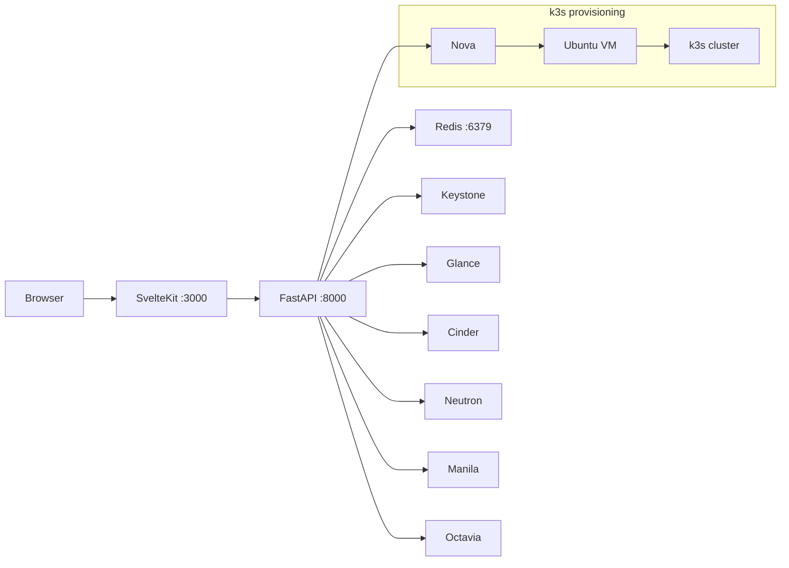

# Afterglow

**Language:** [한국어](README.md) · English

> Next-generation OpenStack dashboard — Horizon's stability and feature completeness combined with Skyline's modern UX

[](https://github.com/jung-geun/openstack-afterglow/actions/workflows/test.yml)
[](https://github.com/jung-geun/openstack-afterglow/actions/workflows/docker-build.yml)
[](LICENSE)

---

## About

**Afterglow** is a new web dashboard for OpenStack cloud environments.

| Existing dashboard | Limitations |
|---|---|
| **Horizon** | Django-based heavy UI, limited scalability, slow rendering |
| **Skyline** | Weak support for newer OpenStack services, hard to customize |

Afterglow takes the strengths of both projects and fixes their weaknesses.

- High-performance SvelteKit frontend (Skyline's modern UX)
- Full OpenStack service coverage (Horizon's feature completeness)
- **k3s-based Kubernetes cluster provisioning** — replaces Magnum by deploying k3s directly onto VMs, providing a ready-to-use Kubernetes environment in the cloud
- OverlayFS + Manila shared library layer (optimized for AI/ML workloads)

> **Current OS**: Ubuntu-based / **Planned**: migration to Fedora CoreOS (immutable infrastructure)

---

## Features

### OpenStack Resource Management
- VM create · start · stop · delete · console access
- Images (Glance) / flavors / networks / floating IPs
- Block storage (Cinder) / shared filesystems (Manila)
- Load balancers (Octavia) / security groups / keypairs

### k3s Cluster Provisioning (Magnum Replacement)
- One-click k3s cluster deployment on OpenStack VMs
- Single-node or multi-node (master + worker) topologies
- Cluster lifecycle management (create · delete history preserved)
- kubeconfig download

### OverlayFS Library Layer (AI/ML Focused)
- Mounts Manila NFS/CephFS shares as OverlayFS lower layers
- Shares pre-built layers for Python, PyTorch, vLLM, Jupyter, etc.
- Storage-efficient read-only library sharing across projects

### Admin Capabilities
- Per-project quota management
- Global image management (substring search)
- Notion sync (multi-database, dedup)
- Time-series metrics dashboard

---

## Architecture



| Component | Stack | Port |
|---|---|---|
| Frontend | SvelteKit + TypeScript + Tailwind CSS v4 | 3000 |
| Backend | FastAPI + openstacksdk (Python) | 8000 |
| Cache / session | Redis 7 (AOF persistence) | 6379 |
| Monitoring | Prometheus + Grafana + OpenSearch | 9090 / 3001 / 9200 |

---

## Quick Start (Docker Compose)

```bash
git clone git@github.com:jung-geun/openstack-afterglow.git
cd openstack-afterglow
cp config.toml.example config.toml
```

Configure OpenStack credentials in `config.toml`:

```toml
[openstack]
auth_url = "https://keystone.example.com:5000/v3"
project_name = "myproject"
region_name  = "RegionOne"
```

```bash
docker compose up -d
# Open http://localhost:3000
```

With the monitoring stack:

```bash
docker compose --profile monitoring up -d
```

---

## Kubernetes Deployment

### Prerequisites

- kubectl 1.28+
- k3s or Kubernetes 1.28+ cluster
- (Optional) ArgoCD — GitOps delivery

### Kustomize Deployment

```bash
# Development
kubectl apply -k deploy/k8s/overlays/dev

# Production
kubectl apply -k deploy/k8s/overlays/prod
```

Create the secrets first:

```bash
kubectl create namespace afterglow

kubectl create secret generic afterglow-secrets \
  --namespace=afterglow \
  --from-literal=OPENSTACK_PASSWORD=<password> \
  --from-literal=SECRET_KEY=$(openssl rand -hex 32)
```

Check deployment status:

```bash
kubectl get all -n afterglow
kubectl get ingress -n afterglow
```

### ArgoCD GitOps Deployment

```bash
# Register AppProject and Applications
kubectl apply -f argocd/appproject.yaml
kubectl apply -f argocd/application.dev.yaml   # development
kubectl apply -f argocd/application.prod.yaml  # production
```

ArgoCD watches the `dev` branch and syncs changes automatically.

See the [Kubernetes deployment guide](docs/en/deployment.md) for details.

---

## k3s Cluster Provisioning

Afterglow deploys k3s directly onto OpenStack VMs — no Magnum required.

```
Dashboard → Containers → Create k3s cluster
  ├── Create master-node VM (Nova)
  ├── Install k3s server via cloud-init
  ├── Create and join worker-node VMs
  └── Download kubeconfig
```

It currently runs on Ubuntu 22.04 / 24.04. A migration to **Fedora CoreOS** is planned (immutable infrastructure, rpm-ostree based updates).

See the [k3s cluster guide](docs/en/k3s.md) for details.

---

## Configuration

Everything is managed through a single `config.toml` file. Main sections:

| Section | Key settings |
|---|---|
| `[openstack]` | auth_url, project_name, region_name, manila_endpoint |
| `[app]` | backend_port, frontend_port, secret_key |
| `[cache]` | redis_url, default_ttl_seconds |
| `[nova]` | default_network_id, boot_volume_size_gb |
| `[session]` | Session-timeout settings |

Full configuration reference: [config.toml.example](config.toml.example)

---

## Project Structure

```
openstack-afterglow/
├── backend/           # FastAPI backend
│   └── app/
│       ├── api/       # REST API routers
│       ├── models/    # Pydantic models
│       ├── services/  # OpenStack service clients
│       └── templates/ # cloud-init Jinja2 templates
├── frontend/          # SvelteKit frontend
│   └── src/
│       ├── routes/    # Page routes
│       └── lib/       # Shared components / stores / API
├── deploy/k8s/        # Kubernetes manifests (Kustomize)
│   ├── base/          # Shared resources
│   └── overlays/      # dev / prod overlays
├── argocd/            # ArgoCD Application definitions
├── monitoring/        # Prometheus + Grafana configuration
├── scripts/           # Utility scripts
├── docs/              # Technical documentation (GitHub Pages)
├── docker-compose.yml
└── config.toml.example
```

---

## Documentation

| Document | Contents |
|---|---|
| [Deployment guide](docs/en/deployment.md) | Docker Compose / Kubernetes / ArgoCD |
| [k3s cluster](docs/en/k3s.md) | k3s provisioning, node topology, CoreOS migration plan |
| [Architecture](docs/architecture.md) _(Korean)_ | System structure, VM-creation flow, OverlayFS |
| [API reference](docs/api-reference.md) _(Korean)_ | Complete REST API endpoints |

---

## Development

```bash
# Backend
cd backend
uv sync
uv run uvicorn app.main:app --reload --port 8000

# Frontend
cd frontend
npm install
npm run dev

# Tests
npm test              # all (backend + frontend)
npm run test:backend  # backend unit tests
npm run test:parallel # parallel execution
```

---

## Roadmap

- [x] Manila NFS share support + OverlayFS integrated mounting
- [x] k3s cluster provisioning (soft-delete history preserved)
- [x] Admin quota management / image substring search
- [x] GitHub Actions CI/CD (multi-platform Docker build)
- [ ] Fedora CoreOS-based k3s nodes
- [ ] OverlayFS state-monitoring agent
- [ ] Manila share-snapshot management
- [ ] Frontend — NFS option UI / library catalog

Full roadmap: [milestone.md](milestone.md) _(Korean)_
