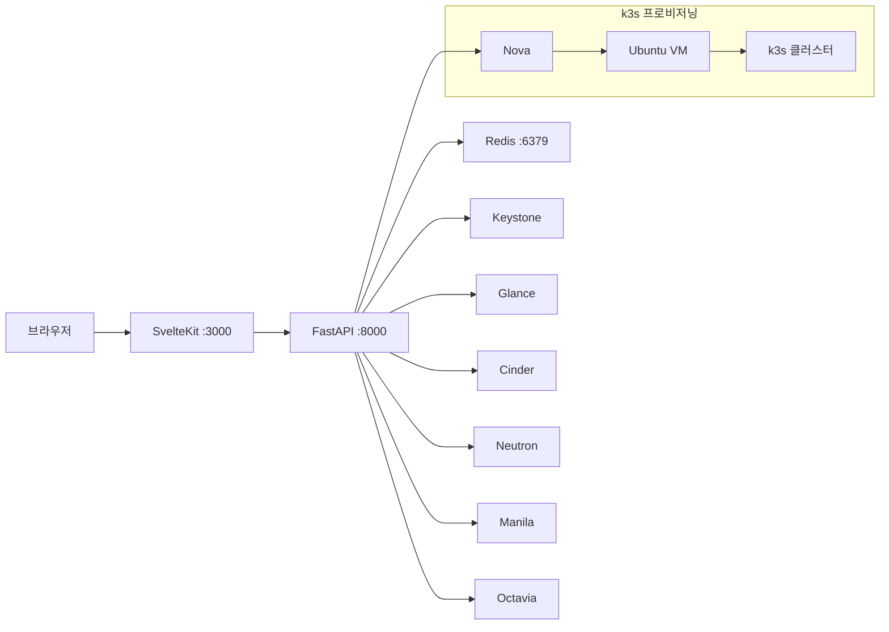

# Afterglow

> Horizon의 안정성과 기능 완성도 + Skyline의 현대적 UX를 결합한 차세대 OpenStack 대시보드

[](https://github.com/jung-geun/openstack-afterglow/actions/workflows/test.yml)
[](https://github.com/jung-geun/openstack-afterglow/actions/workflows/docker-build.yml)
[](LICENSE)

---

## 프로젝트 소개

**Afterglow**는 OpenStack 클라우드 환경을 위한 새로운 웹 대시보드입니다.

| 기존 대시보드 | 한계 |
|---|---|
| **Horizon** | Django 기반의 무거운 UI, 확장성 제한, 느린 렌더링 |
| **Skyline** | 신규 OpenStack 서비스 지원 미흡, 커스터마이징 어려움 |

Afterglow는 두 프로젝트의 장점을 취하고 단점을 보완합니다.

- SvelteKit 기반 고성능 프론트엔드 (Skyline의 현대적 UX)
- OpenStack 전체 서비스 커버리지 (Horizon의 기능 완성도)
- **k3s 기반 Kubernetes 클러스터 프로비저닝** — Magnum을 대체하여 VM에 k3s를 직접 배포, 클라우드에서 즉시 사용 가능한 Kubernetes 환경 제공
- OverlayFS + Manila 기반 공유 라이브러리 레이어 (AI/ML 워크로드 특화)

> **현재 OS**: Ubuntu 기반 / **예정**: Fedora CoreOS 전환 (불변 인프라)

---

## 주요 기능

### OpenStack 리소스 관리
- VM 생성 · 시작 · 정지 · 삭제 · 콘솔 접속
- 이미지(Glance) / 플레이버 / 네트워크 / Floating IP
- 블록 스토리지(Cinder) / 공유 파일시스템(Manila)
- 로드밸런서(Octavia) / 보안 그룹 / 키페어

### k3s 클러스터 프로비저닝 (Magnum 대체)
- OpenStack VM 위에 k3s 클러스터 원클릭 배포
- 단일 노드 / 멀티 노드(Master + Worker) 구성
- 클러스터 생명주기 관리 (생성 · 삭제 이력 보존)
- kubeconfig 다운로드

### OverlayFS 라이브러리 레이어 (AI/ML 특화)
- Manila NFS/CephFS share를 OverlayFS lower layer로 마운트
- Python, PyTorch, vLLM, Jupyter 등 사전 빌드 레이어 공유
- 프로젝트 간 read-only 라이브러리 공유로 스토리지 효율화

### 관리자 기능
- 프로젝트별 쿼터 관리
- 전체 이미지 관리 (substring 검색)
- Notion 동기화 (다중 데이터베이스, dedup)
- 시계열 메트릭 대시보드

---

## 아키텍처



| 구성 요소 | 기술 | 포트 |
|---|---|---|
| 프론트엔드 | SvelteKit + TypeScript + Tailwind CSS v4 | 3000 |
| 백엔드 | FastAPI + openstacksdk (Python) | 8000 |
| 캐시 / 세션 | Redis 7 (AOF 영속화) | 6379 |
| 모니터링 | Prometheus + Grafana + OpenSearch | 9090 / 3001 / 9200 |

---

## 빠른 시작 (Docker Compose)

```bash
git clone git@github.com:jung-geun/openstack-afterglow.git
cd openstack-afterglow
cp config.toml.example config.toml
```

`config.toml`에서 OpenStack 자격증명을 설정합니다:

```toml
[openstack]
auth_url = "https://keystone.example.com:5000/v3"
project_name = "myproject"
region_name  = "RegionOne"
```

```bash
docker compose up -d
# http://localhost:3000 접속
```

모니터링 스택 포함 시:

```bash
docker compose --profile monitoring up -d
```

---

## Kubernetes 배포

### 사전 요구사항

- kubectl 1.28+
- k3s 또는 Kubernetes 1.28+ 클러스터
- (선택) ArgoCD — GitOps 배포

### Kustomize 배포

```bash
# 개발 환경
kubectl apply -k deploy/k8s/overlays/dev

# 프로덕션 환경
kubectl apply -k deploy/k8s/overlays/prod
```

시크릿을 먼저 생성합니다:

```bash
kubectl create namespace afterglow

kubectl create secret generic afterglow-secrets \
  --namespace=afterglow \
  --from-literal=OPENSTACK_PASSWORD=<password> \
  --from-literal=SECRET_KEY=$(openssl rand -hex 32)
```

배포 상태 확인:

```bash
kubectl get all -n afterglow
kubectl get ingress -n afterglow
```

### ArgoCD GitOps 배포

```bash
# AppProject 및 Application 등록
kubectl apply -f argocd/appproject.yaml
kubectl apply -f argocd/application.dev.yaml   # 개발
kubectl apply -f argocd/application.prod.yaml  # 프로덕션
```

ArgoCD가 `dev` 브랜치를 감시하여 변경사항을 자동 동기화합니다.

자세한 내용은 [Kubernetes 배포 가이드](docs/deployment.md)를 참고하세요.

---

## k3s 클러스터 프로비저닝

Afterglow는 Magnum 없이 OpenStack VM에 k3s를 직접 배포합니다.

```
대시보드 → 컨테이너 → k3s 클러스터 생성
  ├── 마스터 노드 VM 생성 (Nova)
  ├── cloud-init으로 k3s 서버 설치
  ├── 워커 노드 VM 생성 및 조인
  └── kubeconfig 다운로드
```

현재 Ubuntu 22.04 / 24.04 기반으로 동작하며, **Fedora CoreOS**로의 전환이 계획되어 있습니다 (불변 인프라, rpm-ostree 기반 업데이트).

자세한 내용은 [k3s 클러스터 가이드](docs/k3s.md)를 참고하세요.

---

## 설정

모든 설정은 `config.toml` 하나로 관리합니다. 주요 섹션:

| 섹션 | 주요 설정 |
|---|---|
| `[openstack]` | auth_url, project_name, region_name, manila_endpoint |
| `[app]` | backend_port, frontend_port, secret_key |
| `[cache]` | redis_url, default_ttl_seconds |
| `[nova]` | default_network_id, boot_volume_size_gb |
| `[session]` | 세션 타임아웃 설정 |

전체 설정 레퍼런스: [config.toml.example](config.toml.example)

---

## 프로젝트 구조

```
openstack-afterglow/
├── backend/           # FastAPI 백엔드
│   └── app/
│       ├── api/       # REST API 라우터
│       ├── models/    # Pydantic 모델
│       ├── services/  # OpenStack 서비스 클라이언트
│       └── templates/ # cloud-init Jinja2 템플릿
├── frontend/          # SvelteKit 프론트엔드
│   └── src/
│       ├── routes/    # 페이지 라우트
│       └── lib/       # 공유 컴포넌트 / 스토어 / API
├── deploy/k8s/        # Kubernetes 매니페스트 (Kustomize)
│   ├── base/          # 공통 리소스
│   └── overlays/      # dev / prod 오버레이
├── argocd/            # ArgoCD Application 설정
├── monitoring/        # Prometheus + Grafana 설정
├── scripts/           # 유틸리티 스크립트
├── docs/              # 기술 문서 (GitHub Pages)
├── docker-compose.yml
└── config.toml.example
```

---

## 문서

| 문서 | 내용 |
|---|---|
| [아키텍처](docs/architecture.md) | 시스템 구조, VM 생성 플로우, OverlayFS |
| [배포 가이드](docs/deployment.md) | Docker Compose / Kubernetes / ArgoCD |
| [k3s 클러스터](docs/k3s.md) | k3s 프로비저닝, 노드 구성, CoreOS 전환 계획 |
| [API 레퍼런스](docs/api-reference.md) | 전체 REST API 엔드포인트 |

---

## 개발 환경

```bash
# 백엔드
cd backend
uv sync
uv run uvicorn app.main:app --reload --port 8000

# 프론트엔드
cd frontend
npm install
npm run dev

# 테스트
npm test              # 전체 (백엔드 + 프론트엔드)
npm run test:backend  # 백엔드 단위 테스트
npm run test:parallel # 병렬 실행
```

---

## 로드맵

- [x] Manila NFS share 지원 + OverlayFS 통합 마운트
- [x] k3s 클러스터 프로비저닝 (soft-delete 이력 보존)
- [x] 관리자 쿼터 관리 / 이미지 substring 검색
- [x] GitHub Actions CI/CD (멀티 플랫폼 Docker 빌드)
- [ ] Fedora CoreOS 기반 k3s 노드 전환
- [ ] OverlayFS 상태 모니터링 에이전트
- [ ] Manila Share Snapshot 관리
- [ ] Frontend — NFS 옵션 UI / 라이브러리 카탈로그

전체 로드맵: [milestone.md](milestone.md)
