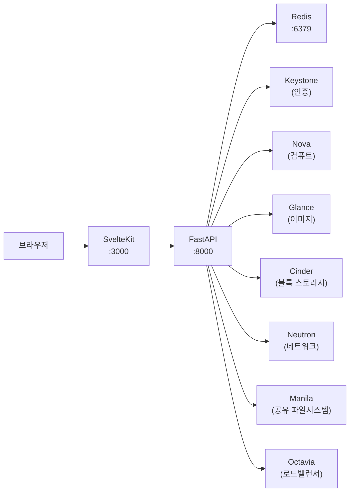

# Union

OpenStack VM + OverlayFS 기반 라이브러리 배포 플랫폼 — Manila CephFS 공유를 OverlayFS로 마운트한 VM을 원클릭으로 프로비저닝합니다.

---

## 아키텍처



---

## 기술 스택

| 구성 요소 | 기술 | 포트 |
|-----------|------|------|
| 프론트엔드 | SvelteKit + TypeScript + Tailwind CSS v4 | 3000 |
| 백엔드 | FastAPI + openstacksdk (Python) | 8000 |
| 캐시 / 세션 | Redis 7 | 6379 |
| 모니터링 (선택) | OpenSearch | 9200 |
| 모니터링 (선택) | OpenSearch Dashboards | 5601 |
| 모니터링 (선택) | Prometheus | 9090 |
| 모니터링 (선택) | Grafana | 3001 |
| 설정 파일 | union.toml | — |

---

## 빠른 시작

```bash
git clone https://github.com/your-org/union.git
cd union
cp union.toml.ecample union.toml
# union.toml에서 OpenStack 자격증명 설정
docker compose up -d
# http://localhost:3000 접속
```

초기 로그인 화면에서 OpenStack 사용자 이름과 비밀번호를 입력하면 Keystone 토큰이 발급됩니다.

---

## 설정

모든 설정은 프로젝트 루트의 `union.toml` 파일 하나로 관리합니다.

### `[openstack]`

| 키 | 설명 |
|----|------|
| `auth_url` | Keystone v3 엔드포인트 URL |
| `project_name` | 기본 프로젝트 이름 |
| `project_domain_name` | 프로젝트 도메인 (기본 `Default`) |
| `user_domain_name` | 사용자 도메인 (기본 `Default`) |
| `region_name` | OpenStack 리전 |
| `manila_endpoint` | Manila 직접 엔드포인트 (서비스 카탈로그 대신 사용할 경우) |
| `manila_share_network_id` | Manila share network UUID |
| `manila_share_type` | Manila share 타입 (예: `cephfstype`) |
| `ceph_monitors` | CephFS 모니터 주소 목록 (콤마 구분, cloud-init 마운트용) |

### `[app]`

| 키 | 설명 |
|----|------|
| `backend_port` | FastAPI 서버 포트 (기본 8000) |
| `frontend_port` | SvelteKit 서버 포트 (기본 3000) |
| `secret_key` | JWT / 서명 키 — **운영 환경에서 반드시 변경** |
| `refresh_interval_ms` | 대시보드 자동 새로고침 간격 ms (권장 3000~30000) |

### `[cache]`

| 키 | 설명 |
|----|------|
| `redis_url` | Redis 연결 URL (기본 `redis://redis:6379/0`) |
| `default_ttl_seconds` | 캐시 기본 TTL 초 (기본 30) |

### `[session]`

세션 타임아웃 및 경고 시간을 제어합니다. 세션 시작 시간은 Redis에 저장되며, `/api/auth/extend-session` 으로 연장할 수 있습니다.

### `[nova]`

| 키 | 설명 |
|----|------|
| `default_network_id` | VM 생성 시 기본 네트워크 UUID |
| `default_availability_zone` | 기본 가용 영역 (기본 `nova`) |
| `boot_volume_size_gb` | 부트 볼륨 기본 크기 GB (기본 20) |
| `upper_volume_size_gb` | OverlayFS upper 볼륨 크기 GB (기본 50) |

---

## 프로젝트 구조

```
union/
├── backend/           # FastAPI 백엔드
│   └── app/
│       ├── api/       # API 라우터 (16개 모듈)
│       ├── models/    # Pydantic 모델
│       ├── services/  # OpenStack 서비스 클라이언트
│       └── templates/ # cloud-init Jinja2 템플릿
├── frontend/          # SvelteKit 프론트엔드
│   └── src/
│       ├── routes/    # 페이지 라우트
│       └── lib/       # 공유 컴포넌트/스토어/API
├── monitoring/        # Prometheus + Grafana 설정
├── k8s/               # Kubernetes 매니페스트
├── docs/              # 상세 문서
├── docker-compose.yml
└── union.toml         # 통합 설정
```

---

## 모니터링

OpenSearch, Prometheus, Grafana를 포함한 전체 모니터링 스택은 Docker Compose 프로필로 분리되어 있습니다.

```bash
docker compose --profile monitoring up -d
```

| 서비스 | URL |
|--------|-----|
| OpenSearch | http://localhost:9200 |
| OpenSearch Dashboards | http://localhost:5601 |
| Prometheus | http://localhost:9090 |
| Grafana | http://localhost:3001 (admin / admin) |

Prometheus 수집 대상 설정은 `monitoring/prometheus.yml`, Grafana 대시보드 프로비저닝은 `monitoring/grafana/provisioning/` 을 참고하세요.

---

## 문서

| 문서 | 내용 |
|------|------|
| [docs/architecture.md](docs/architecture.md) | 시스템 아키텍처, VM 생성 플로우, 인증 흐름, OverlayFS 구조 |
| [docs/api-reference.md](docs/api-reference.md) | 전체 REST API 엔드포인트 레퍼런스 |
| [docs/deployment.md](docs/deployment.md) | Docker Compose / Kubernetes 배포 가이드 및 운영 체크리스트 |
