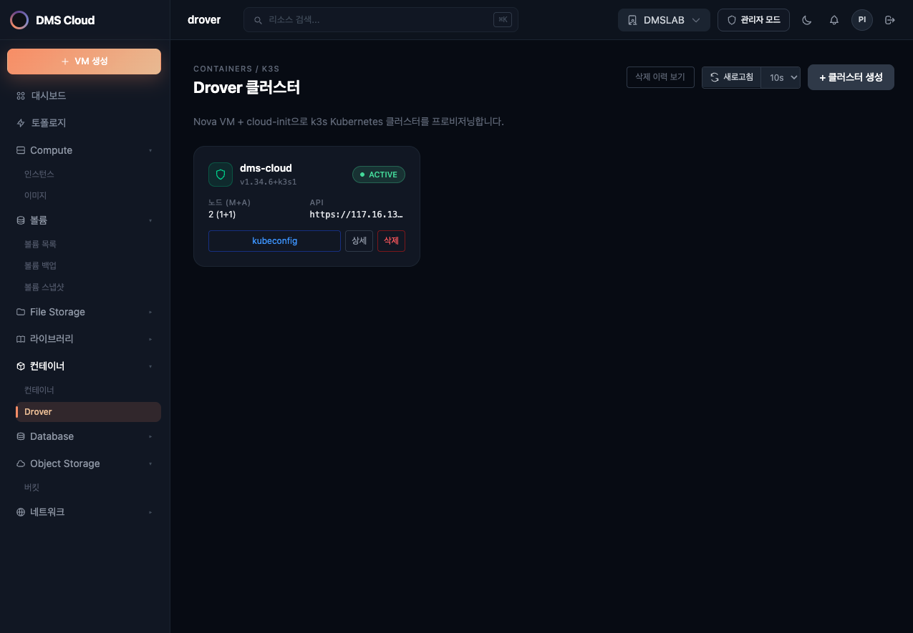

# k3s 프로비저너 API

k3s 프로비저너는 Magnum 없이 OpenStack VM에 k3s(경량 Kubernetes)를 직접 설치하고 관리하는 서브시스템입니다.

> **활성화 조건:** `config.toml [services] k3s = true`  
> 비활성화 상태에서 이 엔드포인트에 접근하면 `404` 또는 라우터 미등록 오류가 반환됩니다.

---

## 기본 정보

| 항목 | 값 |
|------|-----|
| 기본 경로 | `/api/k3s/clusters` |
| 인증 | 모든 엔드포인트에 `X-Auth-Token` + `X-Project-Id` 헤더 필요 |
| Tags | `k3s`, `k3s-health`, `k3s-callback` |

---

## 클러스터 상태 흐름

```
CREATING → ACTIVE → DELETED (soft-delete)
             ↓
           ERROR
```

| 상태 | 설명 |
|------|------|
| `CREATING` | VM 생성 및 k3s 설치 진행 중 |
| `ACTIVE` | 정상 운영 중 |
| `ERROR` | 생성 실패 (status_reason 참고) |
| `DELETED` | 삭제됨. 이력 조회 가능 (soft-delete) |

---

## 엔드포인트

### `GET /api/k3s/clusters`


*k3s 클러스터 목록 — 상태(CREATING/ACTIVE/ERROR)·노드 수·버전·생성일시 표시*

현재 프로젝트의 k3s 클러스터 목록을 반환합니다. `include_deleted=true` 쿼리 파라미터로 삭제된 클러스터 이력을 포함할 수 있습니다.

**응답 `200`** `K3sClusterInfo[]`

```json
[
  {
    "id": "cluster-uuid",
    "name": "my-cluster",
    "status": "ACTIVE",
    "status_reason": null,
    "server_vm_id": "nova-server-uuid",
    "agent_vm_ids": ["agent-vm-uuid-1"],
    "agent_count": 1,
    "api_address": "https://10.0.0.5:6443",
    "server_ip": "10.0.0.5",
    "network_id": "neutron-net-uuid",
    "key_name": "my-keypair",
    "k3s_version": "v1.31.4+k3s1",
    "created_at": "2025-01-01T00:00:00",
    "updated_at": "2025-01-01T00:05:00",
    "deleted_at": null,
    "health_status": "HEALTHY"
  }
]
```

---

### `GET /api/k3s/clusters/{cluster_id}`

단일 클러스터 상세 정보를 반환합니다.

**응답 `200`** `K3sClusterInfo`

**오류**

| 코드 | 설명 |
|------|------|
| `404` | 클러스터를 찾을 수 없음 |

---

### `GET|HEAD /api/k3s/clusters/{cluster_id}/kubeconfig`

클러스터의 kubeconfig 파일을 다운로드합니다 (`GET`) 또는 존재 여부를 확인합니다 (`HEAD`). 파일 내 `server` 주소가 Floating IP로 설정된 경우에만 외부에서 사용 가능합니다.

**응답 `200`** `application/octet-stream` — YAML 형식 kubeconfig (GET)
**응답 `200`** — kubeconfig 존재 확인 (HEAD)

```bash
# 사용 예시
curl -H "X-Auth-Token: $TOKEN" -H "X-Project-Id: $PROJECT" \
     https://afterglow.example.com/api/k3s/clusters/$CLUSTER_ID/kubeconfig \
     -o ~/.kube/afterglow-cluster.yaml

export KUBECONFIG=~/.kube/afterglow-cluster.yaml
kubectl get nodes
```

**오류**

| 코드 | 설명 |
|------|------|
| `404` | 클러스터 없음 또는 kubeconfig 미생성 (CREATING 상태) |

---

### `POST /api/k3s/clusters/async`

SSE(Server-Sent Events) 스트림으로 k3s 클러스터를 비동기 생성합니다.

**요청 본문** `CreateK3sClusterRequest`

```json
{
  "name": "my-cluster",
  "agent_count": 1,
  "agent_flavor_id": "flavor-uuid",
  "network_id": "neutron-net-uuid",
  "key_name": "my-keypair"
}
```

| 필드 | 타입 | 필수 | 설명 |
|------|------|------|------|
| `name` | string | ✓ | 클러스터 이름. 영문/숫자로 시작, 영문·숫자·하이픈·언더스코어 허용 (최대 63자) |
| `agent_count` | int | — | 워커 노드 수. 기본 1, 범위 0~10 |
| `agent_flavor_id` | string | — | 워커 플레이버. 미설정 시 config.toml `k3s.default_agent_flavor_id` 사용 |
| `network_id` | string | — | 네트워크 ID. 미설정 시 config.toml `nova.default_network_id` 사용 |
| `key_name` | string | — | SSH 키페어 이름 |

**응답 `200`** `text/event-stream` — SSE 스트림

각 이벤트는 `data: {JSON}` 형식이며 `K3sProgressMessage` 구조를 따릅니다:

```
data: {"step": "security_group", "progress": 10, "message": "보안 그룹 설정 중"}
data: {"step": "server_volume", "progress": 30, "message": "서버 볼륨 생성 중"}
data: {"step": "server_creating", "progress": 60, "message": "마스터 노드 VM 생성 중", "cluster_id": "uuid"}
data: {"step": "waiting_callback", "progress": 80, "message": "k3s 설치 대기 중"}
data: {"step": "completed", "progress": 100, "message": "클러스터 생성 완료", "cluster_id": "uuid"}
```

오류 발생 시:

```
data: {"step": "failed", "progress": -1, "message": "생성 실패", "error": "오류 메시지"}
```

**SSE 단계 (`K3sProgressStep`)**

| step | 설명 |
|------|------|
| `security_group` | 보안 그룹 생성/설정 |
| `server_volume` | 부트 볼륨 생성 |
| `server_creating` | 마스터 VM 생성 + cloud-init 주입 |
| `waiting_callback` | VM 내부 k3s 설치 완료 콜백 대기 |
| `completed` | 클러스터 생성 완료 |
| `failed` | 실패 (롤백 완료) |

---

### `PATCH /api/k3s/clusters/{cluster_id}/scale`

워커(에이전트) 노드 수를 조정합니다. 현재보다 크면 VM을 추가하고, 작으면 VM을 삭제합니다.

**요청 본문** `ScaleK3sClusterRequest`

```json
{
  "agent_count": 3
}
```

| 필드 | 타입 | 설명 |
|------|------|------|
| `agent_count` | int | 목표 워커 노드 수 (0~10) |

**응답 `200`** `K3sClusterInfo` — 스케일 후 클러스터 정보

**오류**

| 코드 | 설명 |
|------|------|
| `400` | ACTIVE 상태가 아님 |
| `404` | 클러스터 없음 |

---

### `DELETE /api/k3s/clusters/{cluster_id}`

클러스터를 삭제합니다. Nova VM과 보안 그룹을 삭제하며, DB 레코드는 soft-delete로 보존됩니다.

**응답 `204`** No Content

**오류**

| 코드 | 설명 |
|------|------|
| `404` | 클러스터 없음 |

---

## 헬스 체크 엔드포인트

### `GET /api/k3s/clusters/health`

프로젝트 내 ACTIVE 클러스터 전체의 최신 헬스 상태 목록을 반환합니다 (Redis 캐시).

**응답 `200`** `K3sClusterHealth[]`

```json
[
  {
    "cluster_id": "uuid",
    "cluster_name": "my-cluster",
    "status": "HEALTHY",
    "api_server_reachable": true,
    "healthz_ok": true,
    "nodes": [
      {
        "name": "master-01",
        "role": "server",
        "ready": true,
        "conditions": ["Ready"],
        "kubelet_version": "v1.31.4+k3s1"
      }
    ],
    "checked_at": "2025-01-01T00:10:00",
    "reachability": "direct"
  }
]
```

**헬스 상태값**

| 상태 | 설명 |
|------|------|
| `HEALTHY` | 모든 노드 Ready |
| `DEGRADED` | 일부 노드 불량 |
| `UNHEALTHY` | 다수 노드 불량 |
| `UNREACHABLE` | API 서버 접근 불가 |
| `UNKNOWN` | 체크 데이터 없음 |

### `GET /api/k3s/clusters/{cluster_id}/health`

단일 클러스터의 최신 헬스 상태를 반환합니다 (Redis 캐시).

### `POST /api/k3s/clusters/{cluster_id}/health/check`

즉시 헬스 체크를 트리거합니다. **Rate limit: 3회/분**

---

## 스키마 요약

### `K3sClusterInfo`

| 필드 | 타입 | 설명 |
|------|------|------|
| `id` | string | 클러스터 UUID |
| `name` | string | 클러스터 이름 |
| `status` | string | `CREATING` / `ACTIVE` / `ERROR` / `DELETED` |
| `status_reason` | string? | 오류 메시지 |
| `server_vm_id` | string? | 마스터 노드 Nova VM UUID |
| `agent_vm_ids` | string[] | 워커 노드 VM UUID 목록 |
| `agent_count` | int | 현재 워커 노드 수 |
| `api_address` | string? | Kubernetes API 서버 주소 (`https://IP:6443`) |
| `server_ip` | string? | 마스터 노드 IP |
| `network_id` | string? | 연결된 Neutron 네트워크 |
| `key_name` | string? | SSH 키페어 이름 |
| `k3s_version` | string? | 설치된 k3s 버전 |
| `created_at` | string? | ISO 8601 생성 시각 |
| `deleted_at` | string? | ISO 8601 삭제 시각 (soft-delete) |
| `health_status` | string? | 최근 헬스체크 결과 |
| `plugin_status` | object? | 플러그인 배포 상태 (`{"occm": "deployed", ...}`) |

---

## Cloud Provider OpenStack 플러그인

k3s 클러스터는 Cloud Provider OpenStack 플러그인 레지스트리를 통해 다양한 OpenStack 서비스와 통합됩니다. 각 플러그인은 `config.toml [k3s]` 섹션에서 독립적으로 활성화할 수 있습니다.

### 지원 플러그인

| 플러그인 | 설정 키 | 배포 리소스 | 용도 |
|---------|--------|-----------|------|
| **OCCM** | `occm_enabled` | DaemonSet + RBAC | 노드 초기화, Service LB (Octavia) |
| **Cinder CSI** | `cinder_csi_enabled` | StatefulSet + DaemonSet + CSIDriver | PVC → Cinder 블록 스토리지 |
| **Manila CSI** | `manila_csi_enabled` | StatefulSet + DaemonSet + NFS CSI | PVC → Manila NFS (ReadWriteMany) |
| **Octavia Ingress** | `octavia_ingress_enabled` | StatefulSet + IngressClass | Ingress → Octavia LB |
| **Keystone Auth** | `keystone_auth_enabled` | Deployment + Service (8443) | K8s 인증 → Keystone 토큰 |
| **Barbican KMS** | `barbican_kms_enabled` | DaemonSet (컨트롤 플레인) | K8s Secret at-rest 암호화 |

### 플러그인 배포 메커니즘

플러그인 레지스트리는 클러스터 생성 시 다음을 집계합니다:

| 함수 | 결과 |
|------|------|
| `aggregate_cloud_conf()` | `/etc/kubernetes/cloud.conf` (OCCM + Cinder 공유 Secret) |
| `aggregate_manifests()` | `/opt/k3s/{plugin}-manifests.yaml` |
| `aggregate_server_args()` | K3s 설치 인자 (`--kube-apiserver-arg` 등) |

cloud-init의 콜백 스크립트가 플러그인을 순차 배포하며, 결과를 `plugin_status` 필드로 보고합니다:

```json
{
  "plugin_status": {
    "occm": "deployed",
    "cinder_csi": "deployed",
    "manila_csi": "failed"
  }
}
```

### 클러스터 삭제 시 정리

OCCM이 활성화된 클러스터 삭제 시, Kubernetes LoadBalancer 서비스가 생성한 Octavia LB가 orphan되지 않도록 자동 정리됩니다. `kube_service_{cluster_name}_` prefix로 매칭하여 cascade 삭제합니다. 실패 시 warning 로그 후 삭제 계속 진행 (best-effort).

스케일 다운 시에도 VM 삭제 전 K8s 노드 오브젝트를 먼저 삭제하여 OCCM의 `failed to find object` 무한 재시도를 방지합니다.

### config.toml 예시

```toml
[k3s]
occm_enabled = true
cinder_csi_enabled = true
manila_csi_enabled = false
octavia_ingress_enabled = false
keystone_auth_enabled = false
barbican_kms_enabled = false
```
