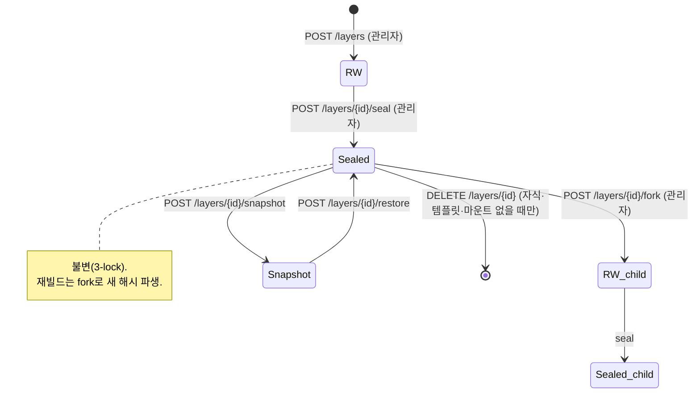

# 유니온 레이어 (Union) API

> 태그: `union`, `admin-libraries`, `squashfs-libraries`
> 기본 경로: `/api/v1/union`, `/api/v1/admin/libraries`, `/api/v1/libraries/squashfs`
> 인증: `Authorization: Bearer <access_token>` · `X-Project-Id`(선택, rescope용)

Afterglow의 플래그십 기능인 **레이어 기반 환경 플랫폼** API입니다. 도커 이미지처럼 패키지·툴체인 단위 레이어를 중앙(CephFS)에 저장하고, VM 부팅 시 base 디스크 위에 OverlayFS로 합성하여 사용합니다. 컨테이너가 아니라 VM 내부에서 직접 마운트하는 방식이며, 저장소 공유는 Manila(CephFS/NFS) share로 이뤄집니다.

이 API는 **경로 접두사가 다른 두 서브시스템**으로 구성됩니다. 두 시스템은 데이터 모델이 다르므로 혼동하지 않도록 주의합니다.

| 서브시스템 | 접두사 | 소스 | 레이어 식별자 | 저장소 | 설명 |
|------------|--------|------|----------------|--------|------|
| **Union 레이어** | `/api/v1/union` | `union/layers.py` | `sha256:<64hex>` (content-addressable) | CephFS + OverlayFS | `union.md` 설계 문서 구현. seal/fork/snapshot, single-parent 상속, 템플릿. |
| **squashfs 라이브러리 (관리자)** | `/api/v1/admin/libraries` | `union/layer_ops.py` | 정수 artifact ID | squashfs NFS share | 빌드/소비 파이프라인. `kind` 계약(uv→python→pip), 프로필, 공개 설정. **전 엔드포인트 관리자 전용.** |
| **공개 squashfs 카탈로그** | `/api/v1/libraries/squashfs` | `union/layer_public.py` | 정수 artifact ID | squashfs NFS share | 봉인·공개된 artifact/프로필을 일반 사용자가 조회·소비. |

> **주의:** `sha256` content-addressable 모델(Union 레이어)과 정수 artifact 모델(squashfs 라이브러리)은 별개입니다. `POST /api/v1/admin/libraries/build`가 만드는 artifact는 sha256 content-addressable 레이어가 아닙니다.

---

## 목차

1. [핵심 개념](#핵심-개념)
2. [엔드포인트 목록](#엔드포인트-목록)
3. [상세 — Union 레이어 (`/api/v1/union`)](#상세--union-레이어-apiv1union)
4. [상세 — squashfs 라이브러리 (`/api/v1/admin/libraries`)](#상세--squashfs-라이브러리-apiv1adminlibraries)
5. [상세 — 공개 squashfs 카탈로그 (`/api/v1/libraries/squashfs`)](#상세--공개-squashfs-카탈로그-apiv1librariessquashfs)

---

## 핵심 개념

> 이 절은 **Union 레이어(`/api/v1/union`)** 서브시스템에 한정된 개념입니다. squashfs 라이브러리는 정수 artifact ID와 `kind` 계약을 사용하며, 아래의 content-addressable/seal/fork 모델을 따르지 않습니다.

- **Content-addressable & immutable.** 레이어 ID는 diff 트리의 sha256 해시(`sha256:<64hex>`)입니다. 같은 내용은 항상 같은 ID를 가지며, 한 번 봉인(seal)되면 영원히 불변입니다.
- **Single-parent 상속.** 각 레이어는 부모를 0개(최상위) 또는 1개(`parent_id`) 가지는 linked list 구조입니다. leaf 레이어를 지정하면 조상 체인이 자동 확정됩니다. (다중 부모 `parent_ids`는 실험적 opt-in.)
- **3중 잠금(3-lock) 불변성.** 봉인 시 (1) 파일 권한(`chmod a-w`), (2) immutable 비트(`chattr +i`), (3) DB `sealed=true`로 쓰기를 애플리케이션 레벨에서 거부합니다.
- **삭제 제약(GC).** 자식 레이어가 있거나, 템플릿이 참조하거나, 활성 마운트가 있으면 삭제할 수 없습니다(leaf에서만 GC 허용).
- **RW → sealed → fork 라이프사이클.** 새 레이어는 RW 상태로 등록되고, 봉인되면 불변이 됩니다. 봉인된 레이어를 기반으로 새 작업을 하려면 fork로 새 RW 레이어를 파생합니다(재빌드는 덮어쓰기가 아니라 새 해시 추가).



### 인가 모델 (Union 레이어)

- **인증:** 대부분의 엔드포인트는 `Authorization: Bearer <access_token>`(+ 선택적 `X-Project-Id`, `get_token_info`)를 요구합니다.
  - **예외:** `POST /mounts`와 `POST /mounts/{id}/unmount`는 사용자 토큰이 아니라 **VM Bearer 토큰**(`Authorization: Bearer <token>`)을 요구합니다. VM health 토큰만 허용하며, 없거나 유효하지 않으면 401입니다.
- **관리자 판별:** 쓰기·파괴적 작업은 핸들러 내부 `_require_admin`(토큰의 `is_system_admin`)으로 검사하며, 관리자가 아니면 403입니다.
- **프로젝트 격리(`_can_access_layer`):**
  - 관리자는 모든 레이어에 접근.
  - `project_id`가 `null`인 **공유 레이어**는 누구나 접근.
  - 그 외에는 토큰의 `project_id`와 일치할 때만 접근하며, 불일치 시 **404**(존재 은닉)를 반환합니다.

---

## 엔드포인트 목록

### Union 레이어 — 사용자 호출 가능 (`/api/v1/union`)

| 메서드 | 경로 | 설명 |
|--------|------|------|
| `GET` | `/api/v1/union/layers` | 레이어 목록 (이름 필터, 페이지네이션, 프로젝트 격리) |
| `GET` | `/api/v1/union/layers/{layer_id}` | 레이어 상세 |
| `GET` | `/api/v1/union/layers/{layer_id}/ancestors` | 조상 체인 (base-first, lowerdir 조립용) |
| `GET` | `/api/v1/union/layers/{layer_id}/dependents` | 직접 자식 레이어 목록 |
| `GET` | `/api/v1/union/templates` | 템플릿 목록 |
| `GET` | `/api/v1/union/templates/{name}/{version}` | 템플릿 상세 (resolved_stack 포함) |
| `GET` | `/api/v1/union/stats/storage` | 스토리지 사용량 통계 |

### Union 레이어 — 관리자 전용 (`/api/v1/union`)

| 메서드 | 경로 | 설명 |
|--------|------|------|
| `POST` | `/api/v1/union/layers` | 새 레이어 등록 |
| `DELETE` | `/api/v1/union/layers/{layer_id}` | 레이어 삭제 (자식/템플릿/마운트 있으면 409) |
| `POST` | `/api/v1/union/layers/{layer_id}/seal` | 레이어 봉인 (불변화) |
| `POST` | `/api/v1/union/layers/{layer_id}/fork` | 봉인 레이어에서 RW 레이어 파생 |
| `POST` | `/api/v1/union/layers/{layer_id}/snapshot` | Manila share 스냅샷 생성 |
| `POST` | `/api/v1/union/layers/{layer_id}/restore` | Manila share 스냅샷 복원 |
| `POST` | `/api/v1/union/templates` | 새 템플릿 생성 |
| `DELETE` | `/api/v1/union/templates/{name}/{version}` | 템플릿 삭제 |
| `POST` | `/api/v1/union/builder/access` | 빌더 VM에 `layer-store-rw` CephX 접근 부여 |
| `DELETE` | `/api/v1/union/builder/access/{access_id}` | 빌더 CephX 접근 회수 |
| `POST` | `/api/v1/union/user/access` | 사용자 VM에 `layer-store-ro` CephX 접근 부여 |
| `DELETE` | `/api/v1/union/user/access/{access_id}` | 사용자 CephX 접근 회수 |

### Union 레이어 — VM Bearer 토큰 전용 (`/api/v1/union`)

| 메서드 | 경로 | 설명 |
|--------|------|------|
| `POST` | `/api/v1/union/mounts` | 마운트 기록 추가 (VM Bearer) |
| `POST` | `/api/v1/union/mounts/{mount_id}/unmount` | 마운트 해제 기록 (본인 마운트만) |

### squashfs 라이브러리 — 관리자 전용 (`/api/v1/admin/libraries`)

> 이 그룹의 **모든** 엔드포인트는 `Depends(require_admin)` — 관리자 전용입니다.

| 메서드 | 경로 | 설명 |
|--------|------|------|
| `GET` | `/api/v1/admin/libraries/base-images` | 빌더/소비 VM 부팅용 Ubuntu Glance 이미지 목록 |
| `POST` | `/api/v1/admin/libraries/imports/dockerfile` | Dockerfile로부터 레이어 임포트 작업 생성 |
| `GET` | `/api/v1/admin/libraries/imports` | 임포트 작업 목록 |
| `GET` | `/api/v1/admin/libraries/imports/{import_id}` | 임포트 작업 상세 |
| `POST` | `/api/v1/admin/libraries/build` | squashfs 레이어 빌드 시작 (백그라운드) |
| `GET` | `/api/v1/admin/libraries/builds` | 빌드 목록 (최대 50) |
| `GET` | `/api/v1/admin/libraries/builds/{build_id}` | 빌드 상세 + 라이브 VM 상태·콘솔 |
| `POST` | `/api/v1/admin/libraries/builds/{build_id}/cancel` | 진행 중 빌드 취소 |
| `POST` | `/api/v1/admin/libraries/consume` | 소비 인스턴스 생성 |
| `GET` | `/api/v1/admin/libraries/consumes` | 소비 인스턴스 목록 |
| `GET` | `/api/v1/admin/libraries/consumes/{consume_id}` | 소비 인스턴스 상세 + 라이브 Nova 상태 |
| `GET` | `/api/v1/admin/libraries/artifacts` | 빌드된 artifact 목록 (lineage/삭제 메타 포함) |
| `GET` | `/api/v1/admin/libraries/artifacts/{artifact_id}/delete-preview` | artifact 삭제 가능 여부/차단 사유 |
| `PATCH` | `/api/v1/admin/libraries/artifacts/{artifact_id}/publication` | artifact 공개/비공개 설정 |
| `DELETE` | `/api/v1/admin/libraries/artifacts/{artifact_id}` | artifact 삭제 (차단 사유 없는 leaf만) |
| `POST` | `/api/v1/admin/libraries/profiles` | 프로필 생성/갱신 (upsert) |
| `GET` | `/api/v1/admin/libraries/profiles` | 프로필 목록 |
| `GET` | `/api/v1/admin/libraries/profiles/{profile_name}` | 프로필 상세 |
| `PATCH` | `/api/v1/admin/libraries/profiles/{profile_name}/publication` | 프로필 공개/비공개 설정 |
| `DELETE` | `/api/v1/admin/libraries/profiles/{profile_name}` | 프로필 삭제 (활성 소비 없을 때만) |

### 공개 squashfs 카탈로그 (`/api/v1/libraries/squashfs`)

| 메서드 | 경로 | 설명 |
|--------|------|------|
| `GET` | `/api/v1/libraries/squashfs/artifacts` | 공개·봉인된 artifact 목록 |
| `GET` | `/api/v1/libraries/squashfs/profiles` | 공개된 프로필 목록 |
| `POST` | `/api/v1/libraries/squashfs/consume` | 공개 artifact/프로필로 VM 소비 인스턴스 생성 |

---

## 상세 — Union 레이어 (`/api/v1/union`)

### GET /api/v1/union/layers

레이어 목록을 반환합니다. 프로젝트 격리가 적용되어, 비관리자는 자신의 프로젝트 레이어와 공유 레이어(`project_id=null`)만 조회합니다.

| 파라미터 | 위치 | 타입 | 필수 | 기본값 | 설명 |
|----------|------|------|------|--------|------|
| `name` | query | string | 아니오 | `null` | 이름 필터 |
| `limit` | query | integer | 아니오 | `50` | 페이지 크기 (`1`~`200`) |
| `offset` | query | integer | 아니오 | `0` | 오프셋 (`≥0`) |

**응답 (200 OK)** — `LayerInfo` 배열

```json
[
  {
    "id": "sha256:abc0123...(64hex)",
    "name": "pytorch",
    "version": "2.4.1",
    "created_at": "2026-04-24T09:00:00Z",
    "created_by": "jung-geun",
    "sealed": true,
    "sealed_at": "2026-04-24T09:05:00Z",
    "parent_id": "sha256:cuda...(64hex)",
    "parent_ids": null,
    "project_id": null,
    "ubuntu_base": "ubuntu-24.04-server-20260401.qcow2",
    "build_recipe": {},
    "installed_packages": {},
    "content_hash": "sha256:abc0123...(64hex)",
    "size_bytes": 2847392000,
    "file_count": 18234,
    "license_type": null,
    "max_concurrent_mounts": null
  }
]
```

### GET /api/v1/union/layers/{layer_id}

레이어 상세를 반환합니다.

| 파라미터 | 위치 | 타입 | 필수 | 설명 |
|----------|------|------|------|------|
| `layer_id` | path | string | 예 | 레이어 ID (`sha256:<64hex>`) |

**제한 사항**
- 프로젝트 격리 적용. 접근 불가·미존재 레이어는 모두 **404**로 응답합니다.

**응답 (200 OK)**: `LayerInfo`

### POST /api/v1/union/layers

새 레이어를 등록합니다. **관리자 전용(require_admin).** `created_by`는 토큰의 사용자명에서, `project_id`는 미지정 시 토큰에서 자동 추출됩니다.

| 파라미터 | 위치 | 타입 | 필수 | 기본값 | 설명 |
|----------|------|------|------|--------|------|
| `name` | body | string | 예 | — | 레이어 이름 (1~128자) |
| `version` | body | string | 예 | — | 버전 (1~64자) |
| `content_hash` | body | string | 예 | — | 레이어 고유 해시. `sha256:<64hex>` 형식 검증 |
| `parent_id` | body | string \| null | 아니오 | `null` | 부모 레이어 ID(`sha256:<64hex>`). `null`이면 최상위 레이어 |
| `parent_ids` | body | array[string] \| null | 아니오 | `null` | 다중 상속(실험). **2개 이상**, 중복 불가 |
| `ubuntu_base` | body | string \| null | 아니오 | `null` | 최상위 레이어의 Ubuntu base 이미지명 (≤255자) |
| `build_recipe` | body | object | 아니오 | `{}` | 재현/재빌드용 레시피 |
| `installed_packages` | body | object | 아니오 | `{}` | 설치 패키지 목록 |
| `size_bytes` | body | integer \| null | 아니오 | `null` | 레이어 크기 |
| `file_count` | body | integer \| null | 아니오 | `null` | 파일 수 |
| `project_id` | body | string \| null | 아니오 | `null` | 명시 지정 시 사용, 미지정 시 토큰에서 추출 |
| `license_type` | body | string \| null | 아니오 | `null` | 라이선스 유형 |
| `max_concurrent_mounts` | body | integer \| null | 아니오 | `null` | 동시 마운트 제한 |

**파라미터 의존성**
- `parent_id`와 `parent_ids`는 **상호 배타적**입니다(동시 지정 시 검증 오류).
- `parent_ids`는 단일 부모에 사용할 수 없습니다(단일 부모는 `parent_id`).

**응답 (201 Created)**: `LayerInfo`

**오류 응답**
- `403 Forbidden` — 관리자 아님
- `422 Unprocessable Entity` — 검증 실패(해시 형식, parent 배타성 위반 등)

### DELETE /api/v1/union/layers/{layer_id}

레이어를 삭제합니다. **관리자 전용(require_admin).**

| 파라미터 | 위치 | 타입 | 필수 | 설명 |
|----------|------|------|------|------|
| `layer_id` | path | string | 예 | 레이어 ID |

**제한 사항 (GC 불변성)**
- 자식 레이어가 있거나, 템플릿이 참조하거나, 활성 마운트가 있으면 삭제할 수 없습니다.

**응답**: `204 No Content`

**오류 응답**
- `403 Forbidden` — 관리자 아님
- `404 Not Found` — 레이어 없음
- `409 Conflict` — 자식/템플릿 참조/활성 마운트 존재

### POST /api/v1/union/layers/{layer_id}/seal

레이어를 봉인합니다. **관리자 전용(require_admin).** 봉인 후 수정 불가하며, 이미 봉인된 레이어를 다시 봉인하면 409입니다.

| 파라미터 | 위치 | 타입 | 필수 | 설명 |
|----------|------|------|------|------|
| `layer_id` | path | string | 예 | 레이어 ID |

**응답 (200 OK)**: `SealLayerResponse`

```json
{ "id": "sha256:abc...(64hex)", "sealed": true, "sealed_at": "2026-04-24T09:05:00Z" }
```

**오류 응답**
- `403 Forbidden` — 관리자 아님
- `404 Not Found` — 레이어 없음
- `409 Conflict` — 이미 봉인됨 등 상태 위반

### POST /api/v1/union/layers/{layer_id}/fork

봉인된 레이어에서 새 RW 레이어를 파생합니다. **관리자 전용(require_admin).**

| 파라미터 | 위치 | 타입 | 필수 | 기본값 | 설명 |
|----------|------|------|------|--------|------|
| `layer_id` | path | string | 예 | — | fork 대상(봉인된) 레이어 ID |
| `content_hash` | body | string | 예 | — | 새 레이어 고유 식별자 (`sha256:<64hex>`) |
| `version` | body | string | 예 | — | 새 레이어 버전 (1~64자) |
| `name` | body | string \| null | 아니오 | `null` | 미지정 시 원본 `name` 상속 (≤128자) |

**제한 사항**
- fork 원본은 **봉인된 레이어**여야 합니다. 상태 전제조건 위반 시 409.

**응답 (201 Created)**: `LayerInfo` (새 RW 레이어)

**오류 응답**
- `403 Forbidden` — 관리자 아님
- `404 Not Found` — 원본 레이어 없음
- `409 Conflict` — 원본이 미봉인 등 상태 위반

### POST /api/v1/union/layers/{layer_id}/snapshot

레이어의 Manila share 스냅샷을 생성합니다. **관리자 전용(require_admin).** OpenStack 연결(`get_os_conn`)을 사용합니다.

| 파라미터 | 위치 | 타입 | 필수 | 기본값 | 설명 |
|----------|------|------|------|--------|------|
| `layer_id` | path | string | 예 | — | 레이어 ID |
| `share_id` | body | string | 예 | — | 백업할 Manila share ID (min 1) |
| `name` | body | string \| null | 아니오 | `null` | 스냅샷 이름 (≤255자) |
| `description` | body | string \| null | 아니오 | `null` | 스냅샷 설명 (≤255자) |

**응답 (201 Created)**: 스냅샷 생성 결과

**오류 응답**
- `403 Forbidden` — 관리자 아님
- `404 Not Found` — 레이어 없음
- `500 Internal Server Error` — 스냅샷 생성 실패

### POST /api/v1/union/layers/{layer_id}/restore

레이어의 Manila share를 스냅샷 시점으로 복원합니다. **관리자 전용(require_admin).**

| 파라미터 | 위치 | 타입 | 필수 | 설명 |
|----------|------|------|------|------|
| `layer_id` | path | string | 예 | 레이어 ID |
| `share_id` | body | string | 예 | 복원 대상 Manila share ID |
| `snapshot_id` | body | string | 예 | 복원에 사용할 스냅샷 ID |

**응답**: `204 No Content`

**오류 응답**
- `403 Forbidden` — 관리자 아님
- `404 Not Found` — 레이어 없음
- `500 Internal Server Error` — 복원 실패

### GET /api/v1/union/layers/{layer_id}/ancestors

조상 체인을 **base-first 순서**로 반환합니다. 사용자 VM에서 overlayfs `lowerdir` 조립에 사용합니다.

| 파라미터 | 위치 | 타입 | 필수 | 설명 |
|----------|------|------|------|------|
| `layer_id` | path | string | 예 | leaf 레이어 ID |

**제한 사항**: 요청 레이어 소유권 검증. 접근 불가·미존재 시 404.

**응답 (200 OK)**: `AncestorChain`

```json
{
  "layers": [
    { "id": "sha256:base...(64hex)", "name": "base-noble", "...": "..." },
    { "id": "sha256:python...(64hex)", "name": "python", "...": "..." },
    { "id": "sha256:cuda...(64hex)", "name": "cuda", "...": "..." },
    { "id": "sha256:pytorch...(64hex)", "name": "pytorch", "...": "..." }
  ]
}
```

### GET /api/v1/union/layers/{layer_id}/dependents

직접 자식 레이어 목록을 반환합니다.

| 파라미터 | 위치 | 타입 | 필수 | 설명 |
|----------|------|------|------|------|
| `layer_id` | path | string | 예 | 부모 레이어 ID |

**제한 사항**: 부모 레이어 소유권을 먼저 검증(불가 시 404). 공유 부모(`project_id=null`)의 자식이 타 프로젝트 소유일 수 있으므로, 접근 가능한 자식만 반환합니다.

**응답 (200 OK)**: `LayerInfo` 배열

### GET /api/v1/union/templates · GET /api/v1/union/templates/{name}/{version}

템플릿 목록/상세를 조회합니다(인증 필요, 비관리자 조회 가능). 상세에는 조상 체인(`resolved_stack`)이 포함됩니다.

| 파라미터 | 위치 | 타입 | 필수 | 설명 |
|----------|------|------|------|------|
| `name` | path | string | 예 | 템플릿 이름 |
| `version` | path | integer | 예 | 템플릿 버전 |

**응답 (200 OK)**: `TemplateInfo` (목록은 배열)

```json
{
  "name": "ml-pytorch",
  "version": 3,
  "created_at": "2026-04-24T09:00:00Z",
  "created_by": "jung-geun",
  "parent_version": 1,
  "ubuntu_base": "ubuntu-24.04-server-20260420.qcow2",
  "leaf_layer_id": "sha256:pytorch...(64hex)",
  "note": "v1 레시피로 최신 apt snapshot 기반 재빌드",
  "resolved_stack": [ { "id": "sha256:base...", "...": "..." } ]
}
```

**오류 응답 (상세)**: `404 Not Found` — 템플릿 없음

### POST /api/v1/union/templates

새 템플릿을 생성합니다. **관리자 전용(require_admin).**

| 파라미터 | 위치 | 타입 | 필수 | 기본값 | 설명 |
|----------|------|------|------|--------|------|
| `name` | body | string | 예 | — | 템플릿 이름 (1~128자) |
| `version` | body | integer | 예 | — | 버전 (`≥1`) |
| `ubuntu_base` | body | string | 예 | — | Ubuntu base 이미지명 (1~255자) |
| `leaf_layer_id` | body | string | 예 | — | leaf 레이어 ID (`sha256:<64hex>`) |
| `parent_version` | body | integer \| null | 아니오 | `null` | 이전 템플릿 버전 (이력) |
| `note` | body | string \| null | 아니오 | `null` | 비고 |

**응답 (201 Created)**: `TemplateInfo`

**오류 응답**
- `403 Forbidden` — 관리자 아님
- `422 Unprocessable Entity` — 검증 실패

### DELETE /api/v1/union/templates/{name}/{version}

템플릿을 삭제합니다. **관리자 전용(require_admin).**

**응답**: `204 No Content` · **오류**: `403`(관리자 아님), `404`(템플릿 없음)

### POST /api/v1/union/mounts

마운트 기록을 추가합니다. **VM Bearer 토큰 전용.** `Authorization: Bearer <token>` 헤더의 VM health 토큰만 허용하며, `user_id`는 `vm:<instance_id>` 형식으로 서버가 결정합니다.

| 파라미터 | 위치 | 타입 | 필수 | 설명 |
|----------|------|------|------|------|
| `Authorization` | header | string | 예 | `Bearer <VM health token>` |
| `vm_hostname` | body | string | 예 | VM 호스트명 (1~255자) |
| `leaf_layer_id` | body | string | 예 | leaf 레이어 ID (`sha256:<64hex>`) |

**응답 (201 Created)**: `MountInfo`

```json
{
  "id": 1,
  "user_id": "vm:6f1c...",
  "vm_hostname": "ml-node-01",
  "leaf_layer_id": "sha256:pytorch...(64hex)",
  "mounted_at": "2026-04-24T09:10:00Z",
  "unmounted_at": null
}
```

**오류 응답**
- `401 Unauthorized` — Bearer 토큰 없음/무효
- `422 Unprocessable Entity` — 검증 실패

### POST /api/v1/union/mounts/{mount_id}/unmount

마운트 해제를 기록합니다. **VM Bearer 토큰 전용.** 본인(같은 `user_id`) 마운트만 해제할 수 있습니다.

| 파라미터 | 위치 | 타입 | 필수 | 설명 |
|----------|------|------|------|------|
| `Authorization` | header | string | 예 | `Bearer <VM health token>` |
| `mount_id` | path | integer | 예 | 마운트 기록 ID |

**응답 (200 OK)**: `MountInfo`

**오류 응답**
- `401 Unauthorized` — Bearer 토큰 없음/무효
- `403 Forbidden` — 타인 마운트 해제 시도
- `404 Not Found` — 마운트 기록 없음
- `409 Conflict` — 이미 해제됨 등 상태 위반

### GET /api/v1/union/stats/storage

레이어 스토리지 사용량을 반환합니다(인증 필요).

**응답 (200 OK)**: `StorageStats`

```json
{ "total_layers": 12, "sealed_layers": 10, "total_size_bytes": 34012938240, "total_file_count": 219840 }
```

### POST /api/v1/union/builder/access · POST /api/v1/union/user/access

빌더 VM(`layer-store-rw`) 또는 사용자 VM(`layer-store-ro`)에 CephX 접근 권한을 부여합니다. **관리자 전용(require_admin).** 대상 share ID(`union_layer_store_rw_share_id` / `union_layer_store_ro_share_id`)가 설정되지 않았으면 503입니다.

| 파라미터 | 위치 | 타입 | 필수 | 기본값 | 설명 |
|----------|------|------|------|--------|------|
| `cephx_user` | body | string | 예 | — | CephX 사용자명 (1~128자, 공백만은 불가) |
| `access_level` | body | string | 아니오 | `rw` | `rw` 또는 `ro` (`^(rw\|ro)$`) |

**파라미터 의존성**: `/user/access`는 요청 값과 무관하게 항상 `ro`로 강제됩니다.

**응답 (201 Created)**: `BuilderAccessInfo`

```json
{ "access_id": "3f2c...", "cephx_user": "builder-vm-rw", "access_level": "rw", "share_id": "share-uuid" }
```

**오류 응답**
- `403 Forbidden` — 관리자 아님
- `503 Service Unavailable` — share ID 미설정
- `502 Bad Gateway` — Manila access rule 생성 실패

### DELETE /api/v1/union/builder/access/{access_id} · DELETE /api/v1/union/user/access/{access_id}

CephX 접근 권한을 회수합니다. **관리자 전용(require_admin).**

| 파라미터 | 위치 | 타입 | 필수 | 설명 |
|----------|------|------|------|------|
| `access_id` | path | string | 예 | Manila access rule ID |

**응답**: `204 No Content` · **오류**: `403`(관리자 아님), `503`(share ID 미설정), `502`(회수 실패)

---

## 상세 — squashfs 라이브러리 (`/api/v1/admin/libraries`)

> **이 그룹의 모든 엔드포인트는 관리자 전용(`Depends(require_admin)`)입니다.** artifact는 정수 ID를 가지며, Union 레이어의 sha256 모델과 다릅니다.

### POST /api/v1/admin/libraries/build

squashfs 레이어 빌드를 시작합니다(백그라운드 태스크). 레이어는 `uv → python → pip` 순서의 계약을 따릅니다.

| 파라미터 | 위치 | 타입 | 필수 | 기본값 | 설명 |
|----------|------|------|------|--------|------|
| `layer_name` | body | string | 예 | — | 레이어 이름. `^[a-z0-9][a-z0-9.+\-]*$` |
| `kind` | body | string | 아니오 | `python` | `uv`·`system`·`nvidia`·`python`·`pip` 중 하나 |
| `python_version` | body | string \| null | 조건부 | `null` | `^\d+\.\d+$` (예: `3.11`) |
| `pip_packages` | body | array[string] | 조건부 | `[]` | pip 스펙 화이트리스트 검증 |
| `apt_packages` | body | array[string] | 조건부 | `[]` | apt 패키지명 화이트리스트 검증 |
| `pip_index_url` | body | string \| null | 아니오 | `null` | http(s) URL, 자격증명·query·fragment 불가 |
| `pip_extra_index_urls` | body | array[string] | 아니오 | `[]` | 위와 동일 검증 |
| `pip_find_links` | body | array[string] | 아니오 | `[]` | 위와 동일 검증 |
| `ubuntu_base` | body | string \| null | 조건부 | `null` | root 빌드에서 정규화됨 |
| `base_image_id` | body | string \| null | 조건부 | `null` | root(`uv`/`system`/`nvidia`) 빌드에 필수 |
| `parent` | body | string \| null | 조건부 | `null` | 부모 레이어 이름(legacy selector) |
| `parent_artifact_id` | body | integer \| null | 조건부 | `null` | 부모 artifact ID (양의 정수) |
| `nvidia_driver_branch` | body | string \| null | 조건부 | `null` | `550`·`570`·`575`·`580` 중 하나 |

**파라미터 의존성 (`kind`별 계약)**

| kind | 필수 | 금지 | 부모 |
|------|------|------|------|
| `uv` | `base_image_id` | parent, python_version, pip_packages, apt_packages, pip 소스, nvidia_driver_branch | 없음(root) |
| `system` | `base_image_id`, `apt_packages`(≥1) | parent, python_version, pip_packages, pip 소스, nvidia_driver_branch | 없음(root) |
| `nvidia` | `base_image_id` | parent, python_version, pip_packages, apt_packages(서버 템플릿 생성), pip 소스 | 없음(root). `nvidia_driver_branch` 기본 `580` |
| `python` | parent(또는 `parent_artifact_id`), `python_version` | `base_image_id`, pip_packages, apt_packages, pip 소스 | 직계 부모 kind는 `uv` |
| `pip` | parent(또는 `parent_artifact_id`), `pip_packages`(≥1) | `base_image_id`, python_version, apt_packages | 부모 lineage에 `python` 포함 필요 |

- `parent`와 `parent_artifact_id`는 동시 사용 불가.
- 자식 빌드는 부모 artifact가 **봉인(sealed)** 상태여야 하며, lineage의 base image가 단일해야 합니다.

**응답 (200 OK)**: `{ "build_id": <int>, ... }`

**오류 응답**
- `400 Bad Request` — kind 계약 위반, base image 불일치, 부모 미봉인 등
- `404 Not Found` — 부모 artifact/레이어 없음

### GET /api/v1/admin/libraries/builds · GET /api/v1/admin/libraries/builds/{build_id}

빌드 목록(최대 50)/상세를 조회합니다. 상세는 진행 중 빌드의 라이브 VM 상태·콘솔 로그를 포함합니다.

| 파라미터 | 위치 | 타입 | 필수 | 기본값 | 설명 |
|----------|------|------|------|--------|------|
| `limit` | query | integer | 아니오 | `50` | 목록 크기 (내부 최대 100) |
| `build_id` | path | integer | 예(상세) | — | 빌드 ID |

**오류 응답 (상세)**: `404 Not Found` — 빌드 없음

### POST /api/v1/admin/libraries/builds/{build_id}/cancel

진행 중인 빌드를 취소합니다.

**응답 (200 OK)**: 취소 결과 · **오류**: `404`(빌드 없음), `409`(터미널 상태 등 취소 불가)

### POST /api/v1/admin/libraries/consume

레이어 소비 인스턴스를 생성합니다. `layer-store-ro` NFS share를 RO 마운트하고 squashfs + OverlayFS를 활성화한 VM을 만듭니다.

| 파라미터 | 위치 | 타입 | 필수 | 기본값 | 설명 |
|----------|------|------|------|--------|------|
| `profile_name` | body | string | 예 | — | 소비할 프로필 이름 (레이어 이름 규칙) |
| `flavor_id` | body | string | 예 | — | Nova 플레이버 (`^[a-zA-Z0-9\-_.]+$`) |
| `server_name` | body | string \| null | 아니오 | `null` | 정규화된 인스턴스 이름 |
| `image_id` | body | string \| null | 아니오 | `null` | base 이미지 UUID |
| `network_id` | body | string \| null | 아니오 | `null` | 네트워크 UUID |
| `key_name` | body | string \| null | 아니오 | `null` | 키페어 이름 (≤255자, 개행·탭 불가) |
| `ssh_public_key` | body | string \| null | 아니오 | `null` | SSH 공개키 (형식 검증) |
| `ssh_username` | body | string \| null | 아니오 | `null` | SSH 사용자명. `root` 금지 |

**파라미터 의존성**: `ssh_username`은 `key_name` 또는 `ssh_public_key`와 함께 지정해야 합니다.

**응답 (200 OK)**: `{ "consume_id": <int>, "server_id": "<uuid>", "status": "active" }`

**오류 응답**: `400 Bad Request` — 키페어 공개키 조회 실패 등

### GET /api/v1/admin/libraries/consumes · GET /api/v1/admin/libraries/consumes/{consume_id}

소비 인스턴스 목록/상세를 조회합니다. 상세는 라이브 Nova 상태(`vm_status`, `vm_ip`)를 포함합니다.

| 파라미터 | 위치 | 타입 | 필수 | 기본값 | 설명 |
|----------|------|------|------|--------|------|
| `limit` | query | integer | 아니오 | `50` | 목록 크기 (내부 최대 100) |
| `consume_id` | path | integer | 예(상세) | — | 소비 인스턴스 ID |

**오류 응답 (상세)**: `404 Not Found` — 소비 인스턴스 없음

### 아티팩트 엔드포인트

| 메서드·경로 | 설명 | 주요 오류 |
|-------------|------|-----------|
| `GET /artifacts?limit=` | artifact 목록. lineage/삭제 미리보기 포함 (내부 최대 200) | — |
| `GET /artifacts/{id}/delete-preview` | 삭제 가능 여부·차단 사유(`can_delete`, `delete_blockers`) | `404` |
| `PATCH /artifacts/{id}/publication` | `{ "is_published": bool }`로 공개/비공개 | `400`(미봉인 공개 시도), `404` |
| `DELETE /artifacts/{id}` | 차단 사유 없는 leaf만 Manila share 삭제 후 DB 제거 | `404`, `409`(차단), `502`(share 삭제 실패) |

**삭제 차단 사유(`delete_blockers`)**: 직접 자식 artifact, 이름 기반 프로필 참조, 활성 consume 참조, 진행 중 빌드 참조.

### 프로필 엔드포인트

| 메서드·경로 | 설명 | 주요 오류 |
|-------------|------|-----------|
| `POST /profiles` | 프로필 upsert. `{ "name", "layers": [..] }`, layers는 ≥1 & 각 레이어가 존재해야 함 | `400`(존재하지 않는 레이어) |
| `GET /profiles` | 프로필 목록 | — |
| `GET /profiles/{profile_name}` | 프로필 상세 | `404` |
| `PATCH /profiles/{profile_name}/publication` | `{ "is_published": bool }`. 공개 시 레이어가 모두 공개·봉인·단일 base여야 함 | `400`, `404`, `409`, `422`(이름 형식) |
| `DELETE /profiles/{profile_name}` | 활성 consume이 없을 때만 삭제 | `404`, `409`(사용 중), `422`(이름 형식) |

**`POST /profiles` 파라미터**

| 파라미터 | 위치 | 타입 | 필수 | 설명 |
|----------|------|------|------|------|
| `name` | body | string | 예 | 프로필 이름 (레이어 이름 규칙) |
| `layers` | body | array[string] | 예 | 순서 있는 레이어 이름 목록(OverlayFS lowerdir 위→아래), ≥1 |

### 기타 (관리자)

| 메서드·경로 | 설명 |
|-------------|------|
| `GET /base-images` | active Ubuntu Glance 이미지 목록 |
| `POST /imports/dockerfile` | `{ github_url, ref?, dockerfile_path, layer_prefix, profile_name?, base_image_id }`로 임포트 작업 생성 |
| `GET /imports` · `GET /imports/{id}` | 임포트 작업 목록/상세 |

---

## 상세 — 공개 squashfs 카탈로그 (`/api/v1/libraries/squashfs`)

일반 사용자(`get_token_info`, 관리자 아님도 가능)가 **공개·봉인된** artifact/프로필을 조회하고 소비 인스턴스를 만듭니다.

### GET /api/v1/libraries/squashfs/artifacts

공개(`is_published`)이면서 봉인(`is_sealed`)된 artifact 목록을 반환합니다. base image가 해석되지 않는 artifact는 제외됩니다.

**응답 (200 OK)**: artifact 배열 (`id`, `name`, `kind`, `python_version`, `pip_packages`, `apt_packages`, `ubuntu_base`, `base_image_*`, `parent_id`, `created_at`)

**오류 응답**: `503 Service Unavailable` — DB 미초기화

### GET /api/v1/libraries/squashfs/profiles

공개된 프로필 목록을 반환합니다. 각 프로필의 레이어가 모두 공개·봉인이고 단일 base로 해석될 때만 포함됩니다.

**응답 (200 OK)**: 프로필 배열 (`id`, `name`, `layers`, `artifacts`, `base_image`, `created_at`, `updated_at`)

### POST /api/v1/libraries/squashfs/consume

공개 artifact 또는 공개 프로필로 소비 인스턴스를 생성합니다. 프로젝트 스코프(`project_id`)가 필요합니다.

| 파라미터 | 위치 | 타입 | 필수 | 기본값 | 설명 |
|----------|------|------|------|--------|------|
| `profile_name` | body | string \| null | 조건부 | `null` | 공개 프로필 이름 |
| `artifact_ids` | body | array[integer] \| null | 조건부 | `null` | 공개 artifact ID 목록 (양수, 중복 제거) |
| `flavor_id` | body | string | 예 | — | Nova 플레이버 |
| `server_name` | body | string \| null | 아니오 | `null` | 정규화된 인스턴스 이름 |
| `image_id` | body | string \| null | 아니오 | `null` | base 이미지 UUID |
| `network_id` | body | string \| null | 아니오 | `null` | 네트워크 UUID |
| `key_name` | body | string \| null | 아니오 | `null` | 키페어 이름 |
| `ssh_public_key` | body | string \| null | 아니오 | `null` | SSH 공개키 |
| `ssh_username` | body | string \| null | 아니오 | `null` | SSH 사용자명. `root` 금지 |

**파라미터 의존성**
- `profile_name`과 `artifact_ids` 중 **정확히 하나**만 지정해야 합니다.
- `artifact_ids` 지정 시 부모 체인을 자동 해석하며, 단일 parent chain·단일 base·모든 조상 공개·봉인이어야 합니다.
- `ssh_username`은 `key_name` 또는 `ssh_public_key`와 함께 지정해야 합니다.

**응답 (200 OK)**: `{ "consume_id": <int>, "server_id": "<uuid>", "status": "active" }`

**오류 응답**
- `401 Unauthorized` — 프로젝트 스코프 없음
- `400 Bad Request` — base image 불일치, lineage 위반, 키페어 조회 실패 등
- `404 Not Found` — 공개 프로필/artifact 없음
- `409 Conflict` — parent chain 사이클, 이름 중복 모호
- `500 Internal Server Error` — 소비 생성 실패
- `503 Service Unavailable` — DB 미초기화
