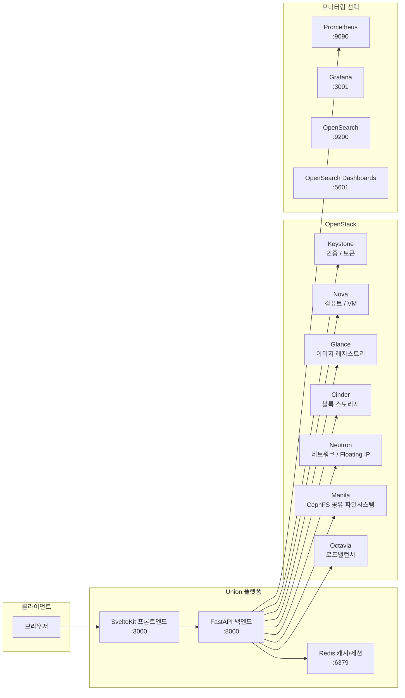
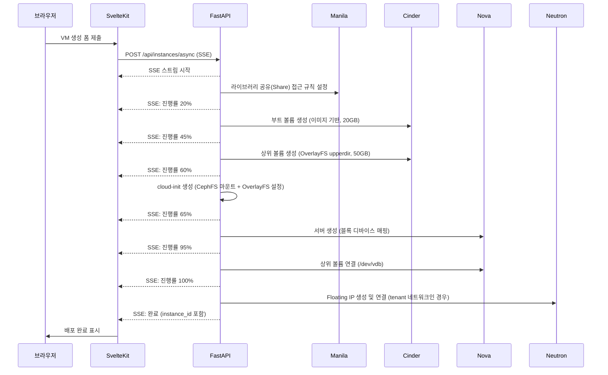
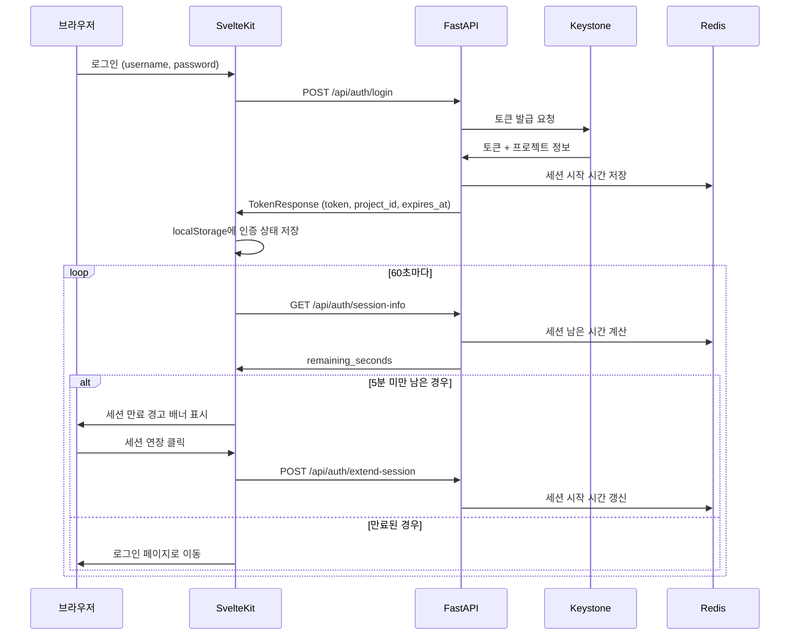

# Union 아키텍처

## 1. 시스템 아키텍처



FastAPI 백엔드는 모든 OpenStack 서비스와 통신하는 단일 게이트웨이 역할을 합니다. 브라우저는 SvelteKit을 통해서만 백엔드와 통신하며, OpenStack API에 직접 접근하지 않습니다. Redis는 OpenStack API 응답을 단기 캐싱하고 세션 시작 시간을 저장합니다.

---

## 2. VM 생성 플로우

Union은 VM 생성 시 SSE(Server-Sent Events) 스트림으로 실시간 진행률을 전달합니다. `POST /api/instances/async` 엔드포인트가 이를 처리합니다.



### 실패 시 롤백

생성 도중 어느 단계에서 오류가 발생해도 이미 생성된 리소스를 역순으로 삭제합니다.

| 순서 | 롤백 대상 |
|------|-----------|
| 1 | Floating IP 삭제 |
| 2 | Nova 서버 삭제 |
| 3 | 부트 볼륨 / upper 볼륨 삭제 |
| 4 | Manila access rule 취소 |
| 5 | 동적(dynamic) share 삭제 |

### 라이브러리 전략

| 전략 | 설명 |
|------|------|
| `prebuilt` | 관리자가 미리 빌드한 read-only CephFS share에 접근 규칙을 추가합니다. 빠르고 스토리지 효율적입니다. |
| `dynamic` | VM 전용 read-write CephFS share를 새로 생성합니다. 격리가 완전하지만 생성 시간이 더 걸립니다. |

---

## 3. 인증 및 세션 관리

Union은 Keystone 토큰을 브라우저 localStorage에 저장하고, Redis에 세션 시작 시간을 기록하여 별도의 앱 수준 세션 타임아웃을 구현합니다.



### 인증 헤더

인증이 필요한 모든 API 요청에는 다음 헤더를 포함해야 합니다.

```
X-Auth-Token: <keystone-token>
X-Project-Id: <project-uuid>
```

### 로그인 후 캐시 프리워밍

로그인 성공 직후 백그라운드 태스크로 대시보드 관련 캐시(서버 목록, 컴퓨트 한도, 스토리지 한도, 플레이버 목록)를 미리 채워 첫 화면 로딩 속도를 개선합니다.

---

## 4. OverlayFS 아키텍처

Union의 핵심 기능은 CephFS 라이브러리 공유를 OverlayFS 읽기 전용 하위 레이어로 사용하는 것입니다.

```
VM 내부 파일시스템 뷰
─────────────────────────────────────────────────────
/workspace           ← OverlayFS 통합 마운트 포인트
  (merged view)
      │
      ├── lowerdir   ← Manila CephFS 공유 (읽기 전용)
      │              │  사전 빌드된 라이브러리, Python 환경,
      │              │  conda 환경, CUDA 런타임 등
      │              │  여러 라이브러리를 스택으로 겹침
      │
      └── upperdir   ← Cinder 볼륨 /dev/vdb (읽기/쓰기)
                     │  사용자 작업 파일, 코드, 결과물
                     │  VM 삭제 후에도 볼륨으로 보존 가능
```

### 레이어 상세

| 레이어 | 스토리지 | 접근 권한 | 내용 |
|--------|---------|-----------|------|
| lowerdir (하위) | Manila CephFS share | 읽기 전용 | Python/conda 환경, 공유 라이브러리, CUDA 런타임 |
| upperdir (상위) | Cinder 볼륨 50GB | 읽기/쓰기 | 사용자 데이터, 작업 파일, pip 추가 패키지 |
| merged (통합) | OverlayFS 가상 레이어 | 읽기/쓰기 | 사용자에게 보이는 통합 뷰 |

### 장점

- **스토리지 절약**: 동일한 라이브러리 share를 여러 VM이 공유합니다. 라이브러리 데이터가 VM 수만큼 복제되지 않습니다.
- **빠른 프로비저닝**: 라이브러리를 VM 내부에 설치하는 과정이 없습니다. cloud-init이 CephFS 마운트와 OverlayFS 설정만 수행합니다.
- **격리**: 각 VM의 쓰기는 전용 Cinder 볼륨(upperdir)에만 기록되어 다른 VM에 영향을 주지 않습니다.
- **데이터 보존**: VM을 삭제해도 upper 볼륨을 별도로 보존하면 사용자 작업 내용을 유지할 수 있습니다.
