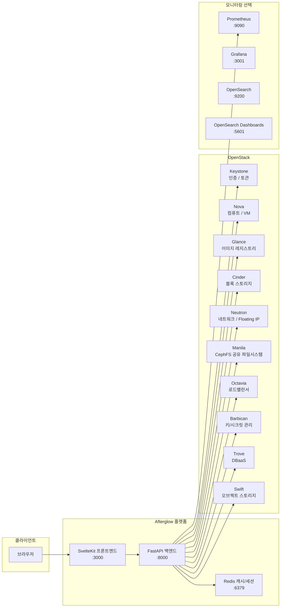
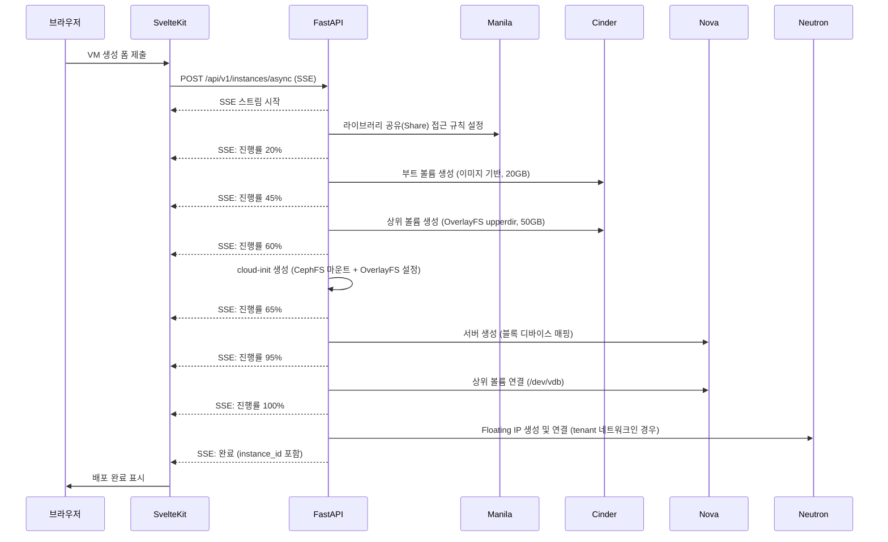
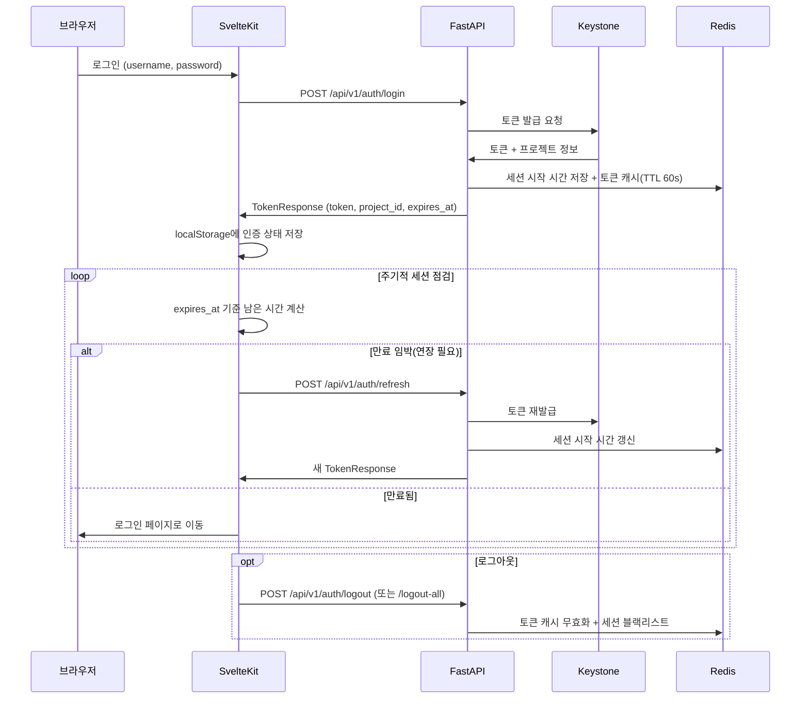
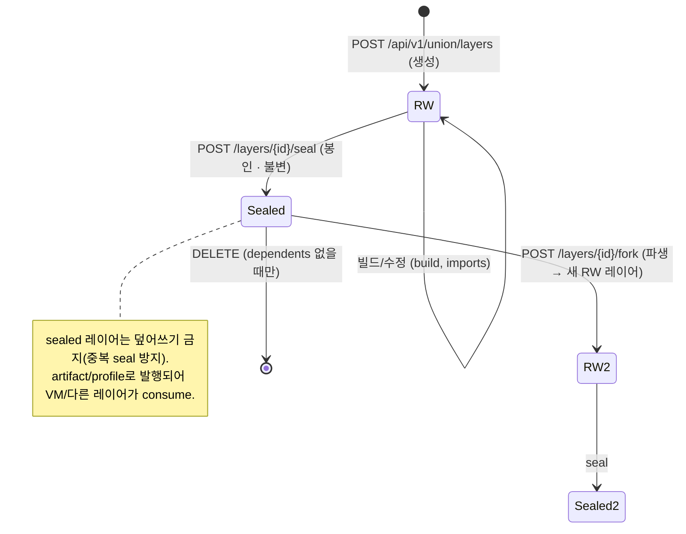
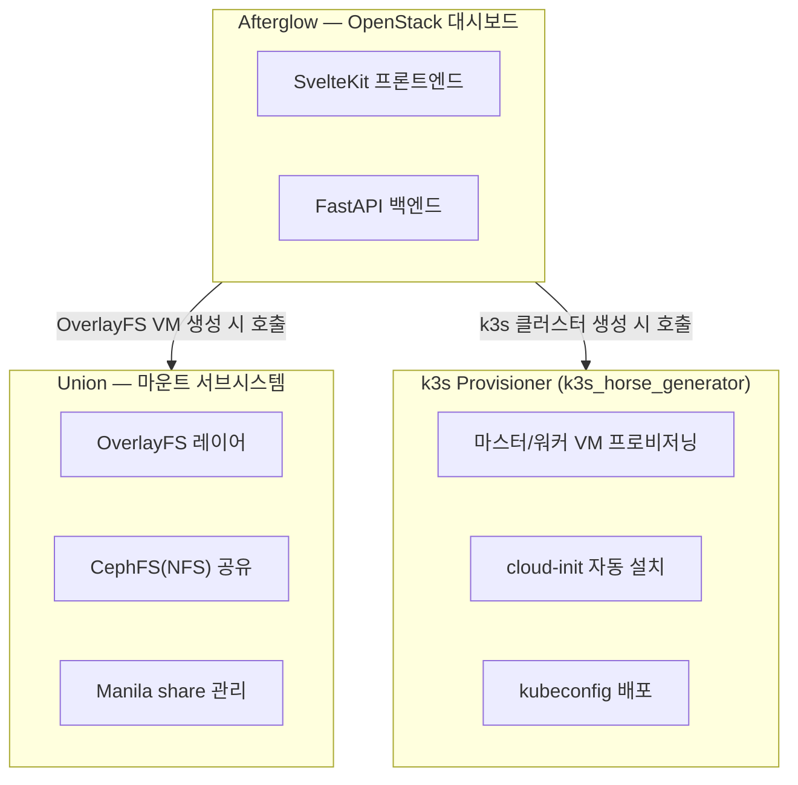
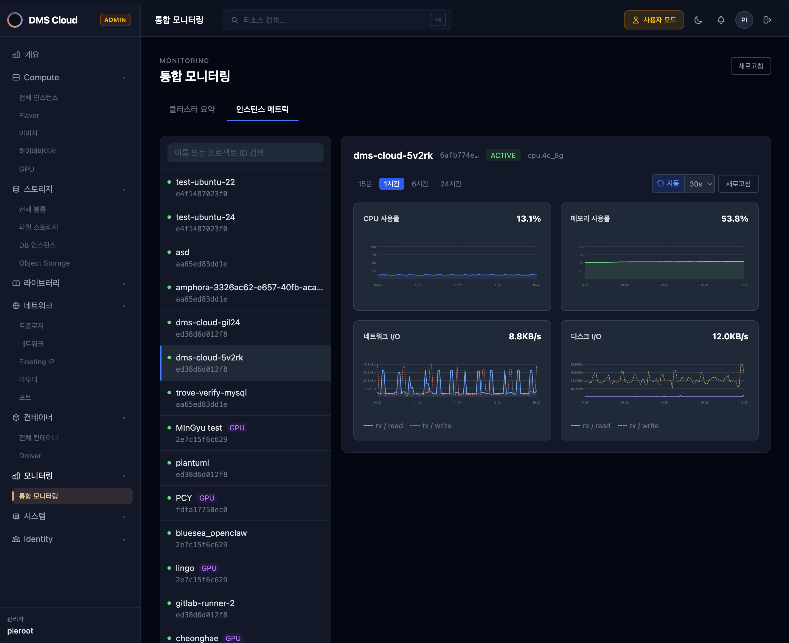

# Afterglow 아키텍처

## 1. 시스템 아키텍처


```mermaid
graph LR
    subgraph 클라이언트
        Browser["브라우저"]
    end

    subgraph Afterglow 플랫폼
        FE["SvelteKit 프론트엔드\n:3000"]
        API["FastAPI 백엔드\n:8000"]
        Redis["Redis 캐시/세션\n:6379"]
    end

    subgraph OpenStack
        KS["Keystone\n인증 / 토큰"]
        Nova["Nova\n컴퓨트 / VM"]
        Glance["Glance\n이미지 레지스트리"]
        Cinder["Cinder\n블록 스토리지"]
        Neutron["Neutron\n네트워크 / Floating IP"]
        Manila["Manila\nCephFS 공유 파일시스템"]
        Octavia["Octavia\n로드밸런서"]
        Barbican["Barbican\n키/시크릿 관리"]
        Trove["Trove\nDBaaS"]
        Swift["Swift\n오브젝트 스토리지"]
    end

    subgraph 모니터링 선택
        Prom["Prometheus\n:9090"]
        Grafana["Grafana\n:3001"]
        OS["OpenSearch\n:9200"]
        OSD["OpenSearch Dashboards\n:5601"]
    end

    Browser --> FE
    FE --> API
    API --> Redis
    API --> KS
    API --> Nova
    API --> Glance
    API --> Cinder
    API --> Neutron
    API --> Manila
    API --> Octavia
    API --> Barbican
    API --> Trove
    API --> Swift
    API --> Prom
```

FastAPI 백엔드는 모든 OpenStack 서비스와 통신하는 단일 게이트웨이 역할을 합니다. 브라우저는 SvelteKit을 통해서만 백엔드와 통신하며, OpenStack API에 직접 접근하지 않습니다. Redis는 OpenStack API 응답을 단기 캐싱하고 세션 시작 시간을 저장합니다.

> **API 버전 규칙 (2026-06-18~)**: 모든 라우터는 `/api/v1` 단독 마운트입니다. 문서의 모든 경로는 `/api/v1/...`
> 기준입니다. 예외로 cloud-init에 baked된 레거시 3종(`POST /api/k3s/callback`,
> `POST /api/instances/{id}/health/report`, `POST /api/instances/{id}/credentials/rotate-cephx`)만
> `/api`·`/api/v1` 양쪽으로 dual-mount됩니다.

> **서브시스템**: OpenStack 코어 서비스 외에, Afterglow는 **Union 레이어 시스템**(OverlayFS+CephFS 공유
> 라이브러리), **k3s 프로비저너**(경량 Kubernetes), **모니터링 통합**(Prometheus/Grafana),
> **키 관리**(Barbican), **VPNaaS**를 내장합니다. 각 API 도메인 상세는 [API 레퍼런스](api-reference.md)를
> 참고하세요.

CI/CD 파이프라인은 GitHub Actions → GHCR(컨테이너 레지스트리) → ArgoCD → Kubernetes 순서로 연결됩니다. `dev` 브랜치 푸시 시 이미지가 자동 빌드·푸시되고, ArgoCD가 kustomization.yaml의 digest 변경을 감지하여 클러스터에 자동 배포합니다.

---

## 2. CI/CD 파이프라인 (ArgoCD GitOps)

`dev` 브랜치 푸시 시 GitHub Actions 워크플로우가 다음 순서로 실행됩니다.

```
push to dev
  → [Docker Build & Push]
      → backend/frontend 이미지 빌드 (linux/amd64 + linux/arm64)
      → GHCR에 :dev 태그로 push
      → 멀티아치 manifest 생성
      → deploy/k8s-template/overlays/dev/kustomization.yaml의
        images[].digest 자동 갱신 ("chore(deploy): update dev image digests [skip ci]")
  → ArgoCD가 kustomization.yaml diff 감지
  → afterglow-dev Application 자동 sync
  → 새 digest로 rolling update
```

`v*` 태그 푸시 시에는 `:vX.Y.Z` + `:latest` 태그로 이미지가 빌드됩니다.

---

## 3. VM 생성 플로우

Afterglow는 VM 생성 시 SSE(Server-Sent Events) 스트림으로 실시간 진행률을 전달합니다. `POST /api/v1/instances/async` 엔드포인트가 이를 처리합니다.


```mermaid
sequenceDiagram
    participant B as 브라우저
    participant F as SvelteKit
    participant API as FastAPI
    participant Manila as Manila
    participant Cinder as Cinder
    participant Nova as Nova
    participant Neutron as Neutron

    B->>F: VM 생성 폼 제출
    F->>API: POST /api/v1/instances/async (SSE)
    API-->>F: SSE 스트림 시작

    API->>Manila: 라이브러리 공유(Share) 접근 규칙 설정
    API-->>F: SSE: 진행률 20%

    API->>Cinder: 부트 볼륨 생성 (이미지 기반, 20GB)
    API-->>F: SSE: 진행률 45%

    API->>Cinder: 상위 볼륨 생성 (OverlayFS upperdir, 50GB)
    API-->>F: SSE: 진행률 60%

    API->>API: cloud-init 생성 (CephFS 마운트 + OverlayFS 설정)
    API-->>F: SSE: 진행률 65%

    API->>Nova: 서버 생성 (블록 디바이스 매핑)
    API-->>F: SSE: 진행률 95%

    API->>Nova: 상위 볼륨 연결 (/dev/vdb)
    API-->>F: SSE: 진행률 100%

    API->>Neutron: Floating IP 생성 및 연결 (tenant 네트워크인 경우)
    API-->>F: SSE: 완료 (instance_id 포함)

    F->>B: 배포 완료 표시
```

### 실패 시 롤백

생성 도중 어느 단계에서 오류가 발생해도 이미 생성된 리소스를 역순으로 삭제합니다.

| 순서 | 롤백 대상 |
|------|-----------|
| 1 | Floating IP 삭제 |
| 2 | Nova 서버 삭제 |
| 3 | 부트 볼륨 / upper 볼륨 삭제 |
| 4 | Manila access rule 취소 |
| 5 | 동적(dynamic) share 삭제 |

### 라이브러리 전략

| 전략 | 설명 |
|------|------|
| `prebuilt` | 관리자가 미리 빌드한 read-only CephFS share에 접근 규칙을 추가합니다. 빠르고 스토리지 효율적입니다. |
| `dynamic` | VM 전용 read-write CephFS share를 새로 생성합니다. 격리가 완전하지만 생성 시간이 더 걸립니다. |

---

## 4. 인증 및 세션 관리

Afterglow는 Keystone 토큰을 브라우저 localStorage에 저장하고, Redis에 세션 시작 시간을 기록하여 별도의 앱 수준 세션 타임아웃을 구현합니다.


```mermaid
sequenceDiagram
    participant B as 브라우저
    participant F as SvelteKit
    participant API as FastAPI
    participant KS as Keystone
    participant Redis as Redis

    B->>F: 로그인 (username, password)
    F->>API: POST /api/v1/auth/login
    API->>KS: 토큰 발급 요청
    KS->>API: 토큰 + 프로젝트 정보
    API->>Redis: 세션 시작 시간 저장 + 토큰 캐시(TTL 60s)
    API->>F: TokenResponse (token, project_id, expires_at)
    F->>F: localStorage에 인증 상태 저장

    loop 주기적 세션 점검
        F->>F: expires_at 기준 남은 시간 계산
        alt 만료 임박(연장 필요)
            F->>API: POST /api/v1/auth/refresh
            API->>KS: 토큰 재발급
            API->>Redis: 세션 시작 시간 갱신
            API->>F: 새 TokenResponse
        else 만료됨
            F->>B: 로그인 페이지로 이동
        end
    end

    opt 로그아웃
        F->>API: POST /api/v1/auth/logout (또는 /logout-all)
        API->>Redis: 토큰 캐시 무효화 + 세션 블랙리스트
    end
```

### 인증 헤더

인증이 필요한 모든 API 요청에는 다음 헤더를 포함해야 합니다. (구 `X-Auth-Token` 방식은 폐기되었습니다.)

```
Authorization: Bearer <access_jwt>
X-Project-Id: <project-uuid>   # 선택 — 생략 시 JWT의 프로젝트로 처리, 다른 값이면 rescope
```

### 로그인 후 캐시 프리워밍

로그인 성공 직후 백그라운드 태스크로 대시보드 관련 캐시(서버 목록, 컴퓨트 한도, 스토리지 한도, 플레이버 목록)를 미리 채워 첫 화면 로딩 속도를 개선합니다.

---

## 5. OverlayFS 아키텍처

Afterglow의 핵심 기능은 CephFS 라이브러리 공유를 OverlayFS 읽기 전용 하위 레이어로 사용하는 것입니다.

```
VM 내부 파일시스템 뷰
─────────────────────────────────────────────────────
/workspace           ← OverlayFS 통합 마운트 포인트
  (merged view)
      │
      ├── lowerdir   ← Manila CephFS 공유 (읽기 전용)
      │              │  사전 빌드된 라이브러리, Python 환경,
      │              │  conda 환경, CUDA 런타임 등
      │              │  여러 라이브러리를 스택으로 겹침
      │
      └── upperdir   ← Cinder 볼륨 /dev/vdb (읽기/쓰기)
                     │  사용자 작업 파일, 코드, 결과물
                     │  VM 삭제 후에도 볼륨으로 보존 가능
```

### 레이어 상세

| 레이어 | 스토리지 | 접근 권한 | 내용 |
|--------|---------|-----------|------|
| lowerdir (하위) | Manila CephFS share | 읽기 전용 | Python/conda 환경, 공유 라이브러리, CUDA 런타임 |
| upperdir (상위) | Cinder 볼륨 50GB | 읽기/쓰기 | 사용자 데이터, 작업 파일, pip 추가 패키지 |
| merged (통합) | OverlayFS 가상 레이어 | 읽기/쓰기 | 사용자에게 보이는 통합 뷰 |

### 장점

- **스토리지 절약**: 동일한 라이브러리 share를 여러 VM이 공유합니다. 라이브러리 데이터가 VM 수만큼 복제되지 않습니다.
- **빠른 프로비저닝**: 라이브러리를 VM 내부에 설치하는 과정이 없습니다. cloud-init이 CephFS 마운트와 OverlayFS 설정만 수행합니다.
- **격리**: 각 VM의 쓰기는 전용 Cinder 볼륨(upperdir)에만 기록되어 다른 VM에 영향을 주지 않습니다.
- **데이터 보존**: VM을 삭제해도 upper 볼륨을 별도로 보존하면 사용자 작업 내용을 유지할 수 있습니다.

### Union 레이어 라이프사이클 (seal / fork / build)

Union 레이어 시스템은 **content-addressable**·**single-parent 상속**·**seal 불변성(3-lock)** 원칙을
따릅니다. 레이어는 RW(쓰기 가능) 상태로 시작해 **seal(봉인)** 되면 불변이 되고, sealed 레이어에서만
**fork(파생)** 하여 새 RW 레이어를 만들 수 있습니다. 상세 API는 [Union 레이어 API](api/union.md)를 참고하세요.


```mermaid
stateDiagram-v2
    [*] --> RW: POST /api/v1/union/layers (생성)
    RW --> RW: 빌드/수정 (build, imports)
    RW --> Sealed: POST /layers/{id}/seal (봉인 · 불변)
    Sealed --> RW2: POST /layers/{id}/fork (파생 → 새 RW 레이어)
    RW2 --> Sealed2: seal
    Sealed --> [*]: DELETE (dependents 없을 때만)
    note right of Sealed
        sealed 레이어는 덮어쓰기 금지(중복 seal 방지).
        artifact/profile로 발행되어 VM/다른 레이어가 consume.
    end note
```

seal된 레이어의 아티팩트는 관리자가 **profile**로 발행하고, 사용자는 `POST /api/v1/union/consume`으로 소비하여
VM 생성 시 라이브러리 lowerdir로 마운트합니다. snapshot/restore는 Manila 스냅샷과 연동됩니다.

---

## 6. 멀티 서브프로젝트 구조

이 저장소는 세 개의 서브프로젝트가 하나의 모노레포에 모여 있습니다.


```mermaid
graph TD
    subgraph Afterglow["Afterglow — OpenStack 대시보드"]
        FE2["SvelteKit 프론트엔드"]
        API2["FastAPI 백엔드"]
    end

    subgraph Union["Union — 마운트 서브시스템"]
        OFS["OverlayFS 레이어"]
        CephFS["CephFS(NFS) 공유"]
        Manila2["Manila share 관리"]
    end

    subgraph K3sProv["k3s Provisioner (k3s_horse_generator)"]
        K3sCtrl["마스터/워커 VM 프로비저닝"]
        CloudInit["cloud-init 자동 설치"]
        Kube["kubeconfig 배포"]
    end

    Afterglow -->|"OverlayFS VM 생성 시 호출"| Union
    Afterglow -->|"k3s 클러스터 생성 시 호출"| K3sProv
```

| 서브프로젝트 | 이름 | 역할 |
|---|---|---|
| 대시보드 | **Afterglow** | OpenStack 리소스 관리 UI 및 API 게이트웨이 |
| 마운트 서브시스템 | **Union** | OverlayFS + CephFS(NFS) + Manila 기반 공유 라이브러리 VM 환경. 이 이름은 해당 기능의 실제 명칭이며 변경되지 않습니다. |
| k3s 프로비저너 | **k3s_horse_generator** (가칭) | Magnum 없이 VM에 k3s를 직접 설치하는 경량 Kubernetes 프로비저닝. 정식 이름 미확정. |

### 코드 내 구분

각 서브프로젝트의 식별자는 서로 겹치지 않도록 독립적인 네임스페이스를 사용합니다.

| 서브프로젝트 | 내부 식별자 예시 |
|---|---|
| Afterglow | `conn._afterglow_token`, `AFTERGLOW_TEST_*` env vars |
| Union | `union_type`, `union_library`, `union-upper-*` 리소스 prefix |
| k3s Provisioner | `k3s_horse_generator_role`, `k3s_horse_generator_cluster_id` Nova 메타데이터 |

---

## 7. 모니터링 아키텍처


*통합 모니터링 페이지 — 전체 인스턴스 목록에서 선택한 VM의 실시간 CPU·메모리·네트워크·디스크 I/O를 1시간/6시간/24시간 구간별로 조회*

### Grafana 임베드

`GET /api/v1/grafana/dashboards` 엔드포인트가 Grafana 기본 URL(`grafana_url`)과 대시보드 UID 매핑(node,
libvirt, openstack, ceph, instance-cpu/gpu 등)을 반환합니다. 프론트엔드는 이 정보를 조합해 Grafana 대시보드를
`<iframe>`으로 임베드합니다. `grafana_url`이 미설정이면 빈 문자열을 반환하며, 프론트엔드가 이를 빈 상태로 처리합니다.

### Prometheus HTTP SD

`GET /api/v1/sd/prometheus/targets` 엔드포인트는 Prometheus http_sd_config 포맷으로 VM 타깃을 반환합니다.
(`GET /api/v1/sd/prometheus/libvirt-targets`는 libvirt exporter 타깃을 반환합니다.)

```json
[
  {
    "targets": ["10.0.0.5:9100"],
    "labels": {
      "instance": "my-vm",
      "project_id": "abc123",
      "flavor": "m1.small",
      "gpu": "false"
    }
  }
]
```

- GPU VM에는 `:9400` (dcgm_exporter) 타깃이 추가됩니다.
- 인증은 `Authorization: Bearer <monitoring_sd_token>` 헤더만 허용합니다.

### Monitoring SG 자동화

신규 프로젝트 생성 시 `ensure_monitoring_ingress_sg()` 가 해당 프로젝트에 모니터링 전용 보안 그룹을 자동 생성하고, 이후 VM 생성 시 자동으로 해당 SG를 연결합니다.

---

## 8. K3s 클러스터 프로비저닝

Afterglow의 k3s 프로비저너는 OpenStack VM 위에 k3s를 배포하여 Kubernetes 클러스터를 제공합니다. Magnum 없이 Nova + cloud-init만으로 동작합니다.

### 클러스터 생성 플로우

```
클라이언트 → POST /api/v1/k3s/clusters/async (SSE)
  → 보안그룹 생성
  → 부트 볼륨 생성 (Cinder)
  → 플러그인 레지스트리 집계 (cloud.conf + 매니페스트 + 서버 인자)
  → 서버 VM 생성 (cloud-init: k3s 설치 + kubectl apply)
  → 서버 VM이 /api/k3s/callback 으로 kubeconfig + node_token 전송
      (baked 레거시 경로 — /api·/api/v1 양쪽 dual-mount, 인증 대신 일회성 callback token 소비)
  → 에이전트 VM 생성 (cloud-init: k3s-agent join)
  → 클러스터 ACTIVE
```

### Cloud Provider OpenStack 플러그인

`backend/app/services/k3s_plugins/` 패키지가 플러그인 레지스트리를 관리합니다. 각 플러그인은 `afterglow.conf [k3s]` 섹션에서 독립적으로 활성화됩니다.

| 플러그인 | 설정 키 | 배포 리소스 | 용도 |
|---------|--------|-----------|------|
| **OCCM** | `occm_enabled` | DaemonSet + RBAC | 노드 초기화, Service LB (Octavia) |
| **Cinder CSI** | `cinder_csi_enabled` | StatefulSet + DaemonSet + CSIDriver | PVC → Cinder 블록 스토리지 |
| **Manila CSI** | `manila_csi_enabled` | StatefulSet + DaemonSet + NFS CSI | PVC → Manila NFS (ReadWriteMany) |
| **Octavia Ingress** | `octavia_ingress_enabled` | StatefulSet + IngressClass | Ingress → Octavia LB |
| **Keystone Auth** | `keystone_auth_enabled` | Deployment + Service (8443) | K8s 인증 → Keystone 토큰 |
| **Barbican KMS** | `barbican_kms_enabled` | DaemonSet (컨트롤 플레인) | K8s Secret at-rest 암호화 |

#### 플러그인 배포 메커니즘

```
레지스트리.aggregate_cloud_conf()  →  /etc/kubernetes/cloud.conf  (OCCM + Cinder 공유 Secret)
레지스트리.aggregate_manifests()   →  /opt/k3s/{plugin}-manifests.yaml
레지스트리.aggregate_server_args() →  K3s 설치 인자 (--kube-apiserver-arg 등)

callback.sh 내 플러그인 배포 루프:
  kubectl create secret ... cloud-config  # cloud.conf 있을 때 1회
  for plugin in active_plugins:
    kubectl apply -f /opt/k3s/{plugin}-manifests.yaml
  → /api/k3s/callback에 plugin_status: {plugin: "deployed"|"failed"} 보고
```

#### K3s 노드 이름 규칙

| VM 역할 | K8s 노드 이름 |
|--------|-------------|
| 서버 (control plane) | `{cluster_name}-server` |
| 에이전트 #1 | `{cluster_name}-agent-1` |
| 에이전트 #2 | `{cluster_name}-agent-2` |

스케일 다운 또는 클러스터 삭제 시 `k3s_kube.delete_k8s_nodes()`로 VM 삭제 전에 K8s 노드 오브젝트를 먼저 제거하여 OCCM의 `failed to find object` 무한 재시도를 방지합니다.

---

## 보안 모델 요약

전체 보안 모델은 [docs/security.md](security.md) 를, 버전별 변경은 [CHANGELOG](../CHANGELOG.md) / [docs/releases/](releases/) 를 참고하세요.

### 인증 흐름

```
[브라우저] ──Authorization: Bearer <jwt> (+X-Project-Id)──▶ [FastAPI]
                                              │
                                              ├─ Redis 토큰 캐시 (TTL 60s, logout 시 invalidate)
                                              │   └ 미스 → Keystone 재검증
                                              │
                                              ├─ project-scoped Connection 생성
                                              │   conn._afterglow_project_id 저장
                                              │
                                              ├─ assert_resource_owner (defense-in-depth)
                                              │   - admin 토큰 우회
                                              │   - 외부/공유 자원 면제
                                              │   - mismatch 시 404 (enumeration 방지)
                                              │
                                              └─ activity_recorder.rec(...)
                                                  audit_log row + source_ip
```

### 핵심 가드레일 (1.14.0)

| 영역 | 가드 |
|---|---|
| Cross-tenant 접근 | `assert_resource_owner` 가 Network/LB/Trove/Cinder/Manila/Compute 의 mutation·detail 에 일관 적용. OpenStack policy 가 광범위해도 백엔드에서 차단 |
| K3s 비밀 | HKDF-SHA256 sub-key 도메인 분리 (kubeconfig / node_token / manager_password / notion). 단일 마스터키 leak 시에도 도메인 간 cross-decrypt 불가 |
| Kubeconfig 다운로드 | 매 GET 마다 audit_log + source IP. 토큰 탈취 forensic 가능 |
| K3s callback | `_get_real_ip` (trusted_proxies 검증) 로 source IP 추출 + body.server_ip 와 불일치 시 warning |
| Health Bearer 토큰 | 7일 절대 만료 (sliding TTL 제거). VM userdata 노출 시에도 7일 후 cephx rotate 권한 무효화 |
| Cloud-init 템플릿 | Jinja2 `autoescape=False` 명시 + 모든 사용자 입력에 `shlex_quote` 적용 |
| Production 부팅 | `AFTERGLOW_ENV=production` + `AFTERGLOW_ALLOW_INSECURE=1` 또는 default secret_key → ValueError |
| Rate limiting | `_get_real_ip` 가 `trusted_proxies` CIDR 검증 — 외부 직접 요청의 X-Forwarded-For 무시 |

### 면제 (intentional)

- **외부 네트워크** (`is_router_external=True`) / **공유 네트워크** (`is_shared=True`) — cross-project 노출이 정상
- **공개 share** (`is_public=True`) — Manila share 도 동일
- **Object-storage** — Swift account 모델이 1차 방어선이라 backend 검증 없음 (신규 컨테이너에 owner metadata 부착만, 운영 도구 토대)
- **admin 토큰** (`token_info.is_system_admin=True`) — 모든 owner check 우회
