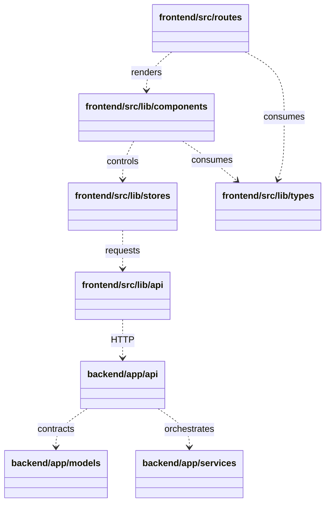

# 클래스 다이어그램 인덱스

## 아키텍처 개요

Backend는 FastAPI API 라우터가 Pydantic·SQLAlchemy 모델과 OpenStack·worker·K3s service 구현을 조합하는 구조다.

Frontend는 SvelteKit route가 Svelte component와 Svelte 5 store/controller를 사용하고, shared TypeScript type과 API client를 통해 backend 계약에 연결되는 구조다.

이 문서는 운영 경로의 이름 있는 타입만 포함하며 tests, generated/dependency/assets/templates, 함수 전용·타입 0개 경로, 익명 inline Props는 제외한다.

## 상위 레이어 관계

## 상위 모듈 및 workflow

- [backend 상위 모듈 관계](./backend/MODULES.md)
- [frontend 상위 모듈 관계](./frontend/MODULES.md)
- [frontend resource workflows](./frontend/workflows/README.md)

## 다이어그램 링크

- [backend/app](./backend/app/README.md)
- [backend/app/api](./backend/app/api/README.md)
- [backend/app/api/common](./backend/app/api/common/README.md)
- [backend/app/api/compute](./backend/app/api/compute/README.md)
- [backend/app/api/identity](./backend/app/api/identity/README.md)
- [backend/app/api/network](./backend/app/api/network/README.md)
- [backend/app/api/object_storage](./backend/app/api/object_storage/README.md)
- [backend/app/api/storage](./backend/app/api/storage/README.md)
- [backend/app/api/union](./backend/app/api/union/README.md)
- [backend/app/models](./backend/app/models/README.md)
- [backend/app/services](./backend/app/services/README.md)
- [backend/app/services/k3s_plugins](./backend/app/services/k3s_plugins/README.md)
- [frontend/src](./frontend/src/README.md)
- [frontend/src/lib/api](./frontend/src/lib/api/README.md)
- [frontend/src/lib/config](./frontend/src/lib/config/README.md)
- [frontend/src/lib/design](./frontend/src/lib/design/README.md)
- [frontend/src/lib/mockup](./frontend/src/lib/mockup/README.md)
- [frontend/src/lib/stores](./frontend/src/lib/stores/README.md)
- [frontend/src/lib/types](./frontend/src/lib/types/README.md)
- [frontend/src/lib/utils](./frontend/src/lib/utils/README.md)
- [frontend/src/lib/components](./frontend/src/lib/components/README.md)
- [frontend/src/lib/components/account](./frontend/src/lib/components/account/README.md)
- [frontend/src/lib/components/admin](./frontend/src/lib/components/admin/README.md)
- [frontend/src/lib/components/admin/flavors](./frontend/src/lib/components/admin/flavors/README.md)
- [frontend/src/lib/components/admin/groups](./frontend/src/lib/components/admin/groups/README.md)
- [frontend/src/lib/components/admin/instances](./frontend/src/lib/components/admin/instances/README.md)
- [frontend/src/lib/components/admin/monitoring](./frontend/src/lib/components/admin/monitoring/README.md)
- [frontend/src/lib/components/admin/projects](./frontend/src/lib/components/admin/projects/README.md)
- [frontend/src/lib/components/admin/services](./frontend/src/lib/components/admin/services/README.md)
- [frontend/src/lib/components/admin/system-admins](./frontend/src/lib/components/admin/system-admins/README.md)
- [frontend/src/lib/components/admin/volumes](./frontend/src/lib/components/admin/volumes/README.md)
- [frontend/src/lib/components/dashboard](./frontend/src/lib/components/dashboard/README.md)
- [frontend/src/lib/components/dashboard/containers/instances](./frontend/src/lib/components/dashboard/containers/instances/README.md)
- [frontend/src/lib/components/dashboard/containers/instances/id](./frontend/src/lib/components/dashboard/containers/instances/id/README.md)
- [frontend/src/lib/components/dashboard/library/id](./frontend/src/lib/components/dashboard/library/id/README.md)
- [frontend/src/lib/components/dashboard/my-resources](./frontend/src/lib/components/dashboard/my-resources/README.md)
- [frontend/src/lib/components/dashboard/security-groups](./frontend/src/lib/components/dashboard/security-groups/README.md)
- [frontend/src/lib/components/database](./frontend/src/lib/components/database/README.md)
- [frontend/src/lib/components/instance](./frontend/src/lib/components/instance/README.md)
- [frontend/src/lib/components/k3s](./frontend/src/lib/components/k3s/README.md)
- [frontend/src/lib/components/landing](./frontend/src/lib/components/landing/README.md)
- [frontend/src/lib/components/loadbalancer](./frontend/src/lib/components/loadbalancer/README.md)
- [frontend/src/lib/components/object-storage](./frontend/src/lib/components/object-storage/README.md)
- [frontend/src/lib/components/topology](./frontend/src/lib/components/topology/README.md)
- [frontend/src/lib/components/ui](./frontend/src/lib/components/ui/README.md)
- [frontend/src/lib/components/volume](./frontend/src/lib/components/volume/README.md)
- [frontend/src/lib/components/wizard](./frontend/src/lib/components/wizard/README.md)
- [frontend/src/routes/admin](./frontend/src/routes/admin/README.md)
- [frontend/src/routes/admin/libraries](./frontend/src/routes/admin/libraries/README.md)
- [frontend/src/routes/dashboard](./frontend/src/routes/dashboard/README.md)
- [frontend/src/routes/dashboard/activity](./frontend/src/routes/dashboard/activity/README.md)
- [frontend/src/routes/dashboard/usage](./frontend/src/routes/dashboard/usage/README.md)
