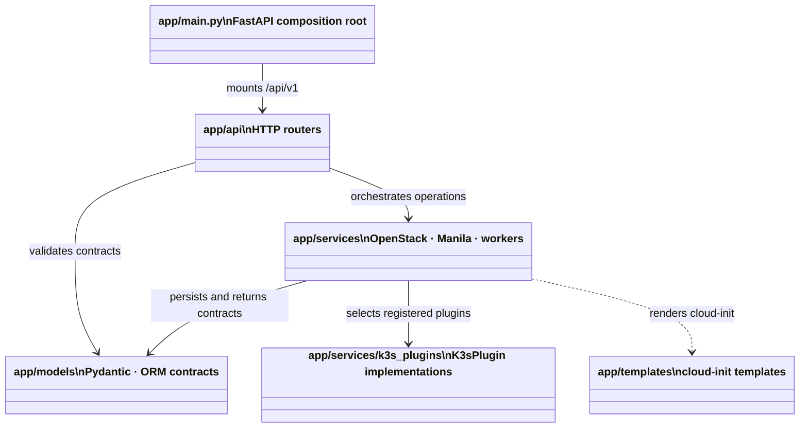
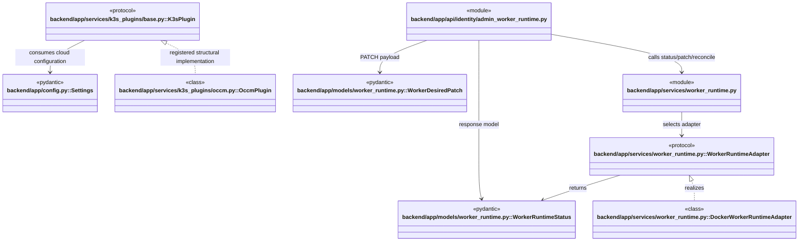

# `backend` 상위 모듈 관계

`backend/app`은 HTTP 경계, 도메인 계약, OpenStack·Manila·worker 구현을 분리한다. 이 문서는 하위 경로의 클래스 다이어그램을 읽기 전에 의존 방향을 설명한다.

## 모듈 관계

## 대표 child module 타입 관계

대표 관계의 전체 field/method와 evidence는 [models](./app/models/README.md), [services](./app/services/README.md), [K3s plugins](./app/services/k3s_plugins/README.md)를 따른다.

## 읽는 순서

1. [API routers](./app/api/README.md)에서 HTTP 리소스와 인증 경계를 확인한다.
2. [models](./app/models/README.md)에서 요청·응답 DTO와 ORM 관계를 확인한다.
3. [services](./app/services/README.md)에서 OpenStack, Manila, worker 호출의 구현을 확인한다.
4. [K3s plugins](./app/services/k3s_plugins/README.md)에서 cloud-provider-openstack 부가 구성의 structural 관계를 확인한다.

## 경계 규칙

- API router는 `/api/v1` 경로만 소유하고, 개별 router 파일은 mount prefix를 갖지 않는다.
- models는 transport·persistence 계약을 표현하고 외부 OpenStack 호출을 직접 수행하지 않는다.
- services는 외부 시스템 호출과 cloud-init/worker orchestration을 소유한다.
