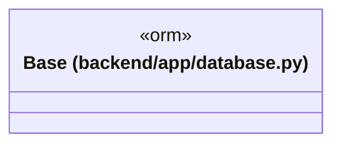
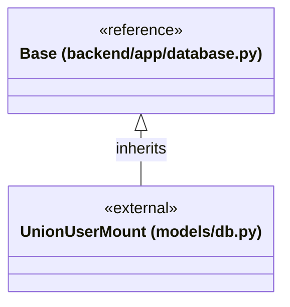
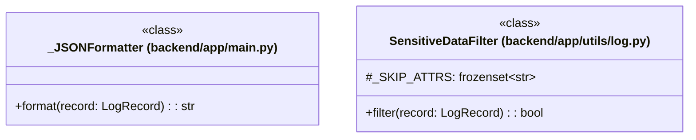

# `backend/app` 클래스 다이어그램

**대상 경로:** `backend/app`

## 책임
`backend/app`의 책임은 <<class>>, <<orm>>, <<pydantic>>으로 표현되는 운영 타입 계약을 정의하는 것이다.
이 문서는 4개 source type과 32개 정적 관계를 5개 Mermaid class diagram으로 나누어 보여준다.

## 포함 파일
- `backend/app/config.py`
- `backend/app/database.py`
- `backend/app/main.py`
- `backend/app/utils/log.py`

## 다이어그램 1 — `backend/app/config.py::Settings` … `backend/app/services/k3s_plugins/octavia_ingress.py::OctaviaIngressPlugin`

```mermaid
classDiagram
%% source-type: backend/app/config.py::Settings
class T_backend_app_config_py_Settings_1ecff491c4c2["Settings (backend/app/config.py)"] {
  <<pydantic>>
  +os_service_project_id: str
  +os_manila_share_network_id: str
  +k3s_server_flavor_id: str
  +k3s_default_agent_flavor_id: str
  +k3s_server_image_id: str
  +k3s_occm_floating_network_id: str
  +k3s_octavia_ingress_subnet_id: str
  +k3s_octavia_ingress_floating_network_id: str
  +k3s_barbican_kms_kek_id: str
  +k3s_lb_subnet_id: str
  +k3s_api_lb_vip_network_id: str
  +k3s_api_lb_floating_network_id: str
  +validate_worker_runtime_counts(v: int): int
  +validate_binding_mode(v: str): str
  +ssl_verify(): bool | str
  +ceph_monitor_list(): list~str~
  +cors_origin_list(): list~str~
  +warn_insecure_defaults(): Settings
}
%% external-type: backend/app/services/k3s_plugins/barbican_kms.py::BarbicanKmsPlugin
class T_backend_app_services_k3s_plugins_barbican_kms_py_BarbicanKmsPlugin_f51a86341be4["BarbicanKmsPlugin (services/k3s_plugins/barbican_kms.py)"] {
  <<external>>
}
%% external-type: backend/app/services/k3s_plugins/base.py::K3sPlugin
class T_backend_app_services_k3s_plugins_base_py_K3sPlugin_e4d3da00af68["K3sPlugin (services/k3s_plugins/base.py)"] {
  <<external>>
}
%% external-type: backend/app/services/k3s_plugins/cinder_csi.py::CinderCsiPlugin
class T_backend_app_services_k3s_plugins_cinder_csi_py_CinderCsiPlugin_b65241dc9961["CinderCsiPlugin (services/k3s_plugins/cinder_csi.py)"] {
  <<external>>
}
%% external-type: backend/app/services/k3s_plugins/keystone_auth.py::KeystoneAuthPlugin
class T_backend_app_services_k3s_plugins_keystone_auth_py_KeystoneAuthPlugin_1106b49dbf7e["KeystoneAuthPlugin (services/k3s_plugins/keystone_auth.py)"] {
  <<external>>
}
%% external-type: backend/app/services/k3s_plugins/manila_csi.py::ManilaCsiPlugin
class T_backend_app_services_k3s_plugins_manila_csi_py_ManilaCsiPlugin_57960ac9a946["ManilaCsiPlugin (services/k3s_plugins/manila_csi.py)"] {
  <<external>>
}
%% external-type: backend/app/services/k3s_plugins/occm.py::OccmPlugin
class T_backend_app_services_k3s_plugins_occm_py_OccmPlugin_8eec56040068["OccmPlugin (services/k3s_plugins/occm.py)"] {
  <<external>>
}
%% external-type: backend/app/services/k3s_plugins/octavia_ingress.py::OctaviaIngressPlugin
class T_backend_app_services_k3s_plugins_octavia_ingress_py_OctaviaIngressPlugin_d5bc0d702223["OctaviaIngressPlugin (services/k3s_plugins/octavia_ingress.py)"] {
  <<external>>
}
T_backend_app_services_k3s_plugins_barbican_kms_py_BarbicanKmsPlugin_f51a86341be4 --> T_backend_app_config_py_Settings_1ecff491c4c2 : associates
T_backend_app_services_k3s_plugins_base_py_K3sPlugin_e4d3da00af68 --> T_backend_app_config_py_Settings_1ecff491c4c2 : associates
T_backend_app_services_k3s_plugins_cinder_csi_py_CinderCsiPlugin_b65241dc9961 --> T_backend_app_config_py_Settings_1ecff491c4c2 : associates
T_backend_app_services_k3s_plugins_keystone_auth_py_KeystoneAuthPlugin_1106b49dbf7e --> T_backend_app_config_py_Settings_1ecff491c4c2 : associates
T_backend_app_services_k3s_plugins_manila_csi_py_ManilaCsiPlugin_57960ac9a946 --> T_backend_app_config_py_Settings_1ecff491c4c2 : associates
T_backend_app_services_k3s_plugins_occm_py_OccmPlugin_8eec56040068 --> T_backend_app_config_py_Settings_1ecff491c4c2 : associates
T_backend_app_services_k3s_plugins_octavia_ingress_py_OctaviaIngressPlugin_d5bc0d702223 --> T_backend_app_config_py_Settings_1ecff491c4c2 : associates
```

### 관계 설명
- `backend/app/services/k3s_plugins/barbican_kms.py::BarbicanKmsPlugin --> backend/app/config.py::Settings` — 근거: `backend/app/services/k3s_plugins/barbican_kms.py::BarbicanKmsPlugin.agent_install_args`, `backend/app/services/k3s_plugins/barbican_kms.py::BarbicanKmsPlugin.cloud_conf_sections`, `backend/app/services/k3s_plugins/barbican_kms.py::BarbicanKmsPlugin.extra_write_files`, `backend/app/services/k3s_plugins/barbican_kms.py::BarbicanKmsPlugin.generate_manifests`, `backend/app/services/k3s_plugins/barbican_kms.py::BarbicanKmsPlugin.needs_external_cloud_provider`, `backend/app/services/k3s_plugins/barbican_kms.py::BarbicanKmsPlugin.server_install_args`, `backend/app/services/k3s_plugins/barbican_kms.py::BarbicanKmsPlugin.should_deploy`; 관계: `associates`.
- `backend/app/services/k3s_plugins/base.py::K3sPlugin --> backend/app/config.py::Settings` — 근거: `backend/app/services/k3s_plugins/base.py::K3sPlugin.agent_install_args`, `backend/app/services/k3s_plugins/base.py::K3sPlugin.cloud_conf_sections`, `backend/app/services/k3s_plugins/base.py::K3sPlugin.extra_write_files`, `backend/app/services/k3s_plugins/base.py::K3sPlugin.generate_manifests`, `backend/app/services/k3s_plugins/base.py::K3sPlugin.needs_external_cloud_provider`, `backend/app/services/k3s_plugins/base.py::K3sPlugin.server_install_args`, `backend/app/services/k3s_plugins/base.py::K3sPlugin.should_deploy`; 관계: `associates`.
- `backend/app/services/k3s_plugins/cinder_csi.py::CinderCsiPlugin --> backend/app/config.py::Settings` — 근거: `backend/app/services/k3s_plugins/cinder_csi.py::CinderCsiPlugin.agent_install_args`, `backend/app/services/k3s_plugins/cinder_csi.py::CinderCsiPlugin.cloud_conf_sections`, `backend/app/services/k3s_plugins/cinder_csi.py::CinderCsiPlugin.extra_write_files`, `backend/app/services/k3s_plugins/cinder_csi.py::CinderCsiPlugin.generate_manifests`, `backend/app/services/k3s_plugins/cinder_csi.py::CinderCsiPlugin.needs_external_cloud_provider`, `backend/app/services/k3s_plugins/cinder_csi.py::CinderCsiPlugin.server_install_args`, `backend/app/services/k3s_plugins/cinder_csi.py::CinderCsiPlugin.should_deploy`; 관계: `associates`.
- `backend/app/services/k3s_plugins/keystone_auth.py::KeystoneAuthPlugin --> backend/app/config.py::Settings` — 근거: `backend/app/services/k3s_plugins/keystone_auth.py::KeystoneAuthPlugin.agent_install_args`, `backend/app/services/k3s_plugins/keystone_auth.py::KeystoneAuthPlugin.cloud_conf_sections`, `backend/app/services/k3s_plugins/keystone_auth.py::KeystoneAuthPlugin.extra_write_files`, `backend/app/services/k3s_plugins/keystone_auth.py::KeystoneAuthPlugin.generate_manifests`, `backend/app/services/k3s_plugins/keystone_auth.py::KeystoneAuthPlugin.needs_external_cloud_provider`, `backend/app/services/k3s_plugins/keystone_auth.py::KeystoneAuthPlugin.server_install_args`, `backend/app/services/k3s_plugins/keystone_auth.py::KeystoneAuthPlugin.should_deploy`; 관계: `associates`.
- `backend/app/services/k3s_plugins/manila_csi.py::ManilaCsiPlugin --> backend/app/config.py::Settings` — 근거: `backend/app/services/k3s_plugins/manila_csi.py::ManilaCsiPlugin.agent_install_args`, `backend/app/services/k3s_plugins/manila_csi.py::ManilaCsiPlugin.cloud_conf_sections`, `backend/app/services/k3s_plugins/manila_csi.py::ManilaCsiPlugin.extra_write_files`, `backend/app/services/k3s_plugins/manila_csi.py::ManilaCsiPlugin.generate_manifests`, `backend/app/services/k3s_plugins/manila_csi.py::ManilaCsiPlugin.needs_external_cloud_provider`, `backend/app/services/k3s_plugins/manila_csi.py::ManilaCsiPlugin.server_install_args`, `backend/app/services/k3s_plugins/manila_csi.py::ManilaCsiPlugin.should_deploy`; 관계: `associates`.
- `backend/app/services/k3s_plugins/occm.py::OccmPlugin --> backend/app/config.py::Settings` — 근거: `backend/app/services/k3s_plugins/occm.py::OccmPlugin.agent_install_args`, `backend/app/services/k3s_plugins/occm.py::OccmPlugin.cloud_conf_sections`, `backend/app/services/k3s_plugins/occm.py::OccmPlugin.extra_write_files`, `backend/app/services/k3s_plugins/occm.py::OccmPlugin.generate_manifests`, `backend/app/services/k3s_plugins/occm.py::OccmPlugin.needs_external_cloud_provider`, `backend/app/services/k3s_plugins/occm.py::OccmPlugin.server_install_args`, `backend/app/services/k3s_plugins/occm.py::OccmPlugin.should_deploy`; 관계: `associates`.
- `backend/app/services/k3s_plugins/octavia_ingress.py::OctaviaIngressPlugin --> backend/app/config.py::Settings` — 근거: `backend/app/services/k3s_plugins/octavia_ingress.py::OctaviaIngressPlugin.agent_install_args`, `backend/app/services/k3s_plugins/octavia_ingress.py::OctaviaIngressPlugin.cloud_conf_sections`, `backend/app/services/k3s_plugins/octavia_ingress.py::OctaviaIngressPlugin.extra_write_files`, `backend/app/services/k3s_plugins/octavia_ingress.py::OctaviaIngressPlugin.generate_manifests`, `backend/app/services/k3s_plugins/octavia_ingress.py::OctaviaIngressPlugin.needs_external_cloud_provider`, `backend/app/services/k3s_plugins/octavia_ingress.py::OctaviaIngressPlugin.server_install_args`, `backend/app/services/k3s_plugins/octavia_ingress.py::OctaviaIngressPlugin.should_deploy`; 관계: `associates`.

## 다이어그램 2 — `backend/app/database.py::Base` … `backend/app/database.py::Base`

### 관계 설명
- 없음

## 다이어그램 3 — `backend/app/database.py::Base` … `backend/app/models/db.py::UnionTemplate`

```mermaid
classDiagram
%% reference-type: backend/app/database.py::Base
class T_backend_app_database_py_Base_fbe8cc2ba130["Base (backend/app/database.py)"] {
  <<reference>>
}
%% external-type: backend/app/models/activity.py::ActivityLog
class T_backend_app_models_activity_py_ActivityLog_5d9b7c1caed3["ActivityLog (models/activity.py)"] {
  <<external>>
}
%% external-type: backend/app/models/db.py::GpuDeviceCatalog
class T_backend_app_models_db_py_GpuDeviceCatalog_6db9f82cb571["GpuDeviceCatalog (models/db.py)"] {
  <<external>>
}
%% external-type: backend/app/models/db.py::GpuQuota
class T_backend_app_models_db_py_GpuQuota_9103a19c3e2a["GpuQuota (models/db.py)"] {
  <<external>>
}
%% external-type: backend/app/models/db.py::K3sAgentVM
class T_backend_app_models_db_py_K3sAgentVM_8f0a5c826a92["K3sAgentVM (models/db.py)"] {
  <<external>>
}
%% external-type: backend/app/models/db.py::K3sCluster
class T_backend_app_models_db_py_K3sCluster_02250f0cf16d["K3sCluster (models/db.py)"] {
  <<external>>
}
%% external-type: backend/app/models/db.py::K3sClusterTemplate
class T_backend_app_models_db_py_K3sClusterTemplate_4bec3650dc09["K3sClusterTemplate (models/db.py)"] {
  <<external>>
}
%% external-type: backend/app/models/db.py::K3sNodegroup
class T_backend_app_models_db_py_K3sNodegroup_960f16cb73e4["K3sNodegroup (models/db.py)"] {
  <<external>>
}
%% external-type: backend/app/models/db.py::K3sNodegroupVM
class T_backend_app_models_db_py_K3sNodegroupVM_9b7f4381c6aa["K3sNodegroupVM (models/db.py)"] {
  <<external>>
}
%% external-type: backend/app/models/db.py::LayerArtifact
class T_backend_app_models_db_py_LayerArtifact_64ffcaf89dba["LayerArtifact (models/db.py)"] {
  <<external>>
}
%% external-type: backend/app/models/db.py::LayerBuild
class T_backend_app_models_db_py_LayerBuild_c23df5d897ed["LayerBuild (models/db.py)"] {
  <<external>>
}
%% external-type: backend/app/models/db.py::LayerConsume
class T_backend_app_models_db_py_LayerConsume_a5e358d0d3a4["LayerConsume (models/db.py)"] {
  <<external>>
}
%% external-type: backend/app/models/db.py::LayerImportJob
class T_backend_app_models_db_py_LayerImportJob_47fe1c5be7d5["LayerImportJob (models/db.py)"] {
  <<external>>
}
%% external-type: backend/app/models/db.py::LayerProfile
class T_backend_app_models_db_py_LayerProfile_68a1af3d6a25["LayerProfile (models/db.py)"] {
  <<external>>
}
%% external-type: backend/app/models/db.py::LibraryBuild
class T_backend_app_models_db_py_LibraryBuild_0a73e50b2818["LibraryBuild (models/db.py)"] {
  <<external>>
}
%% external-type: backend/app/models/db.py::LibraryCatalog
class T_backend_app_models_db_py_LibraryCatalog_e24b8d22a66b["LibraryCatalog (models/db.py)"] {
  <<external>>
}
%% external-type: backend/app/models/db.py::LibraryRecipe
class T_backend_app_models_db_py_LibraryRecipe_7f4f748a44bf["LibraryRecipe (models/db.py)"] {
  <<external>>
}
%% external-type: backend/app/models/db.py::NotionConfig
class T_backend_app_models_db_py_NotionConfig_bc719a5a5ee0["NotionConfig (models/db.py)"] {
  <<external>>
}
%% external-type: backend/app/models/db.py::NotionTarget
class T_backend_app_models_db_py_NotionTarget_4bcbf3a8e76d["NotionTarget (models/db.py)"] {
  <<external>>
}
%% external-type: backend/app/models/db.py::ProjectDefaultNetwork
class T_backend_app_models_db_py_ProjectDefaultNetwork_f219f1a2735f["ProjectDefaultNetwork (models/db.py)"] {
  <<external>>
}
%% external-type: backend/app/models/db.py::ProjectInvitation
class T_backend_app_models_db_py_ProjectInvitation_a9bf77356f03["ProjectInvitation (models/db.py)"] {
  <<external>>
}
%% external-type: backend/app/models/db.py::ProjectRole
class T_backend_app_models_db_py_ProjectRole_dbc1c170648a["ProjectRole (models/db.py)"] {
  <<external>>
}
%% external-type: backend/app/models/db.py::SiteBrandingAsset
class T_backend_app_models_db_py_SiteBrandingAsset_d33f6e70229b["SiteBrandingAsset (models/db.py)"] {
  <<external>>
}
%% external-type: backend/app/models/db.py::UnionLayer
class T_backend_app_models_db_py_UnionLayer_919aed90b8c2["UnionLayer (models/db.py)"] {
  <<external>>
}
%% external-type: backend/app/models/db.py::UnionTemplate
class T_backend_app_models_db_py_UnionTemplate_30e3b25fc8b3["UnionTemplate (models/db.py)"] {
  <<external>>
}
T_backend_app_database_py_Base_fbe8cc2ba130 <|-- T_backend_app_models_activity_py_ActivityLog_5d9b7c1caed3 : inherits
T_backend_app_database_py_Base_fbe8cc2ba130 <|-- T_backend_app_models_db_py_GpuDeviceCatalog_6db9f82cb571 : inherits
T_backend_app_database_py_Base_fbe8cc2ba130 <|-- T_backend_app_models_db_py_GpuQuota_9103a19c3e2a : inherits
T_backend_app_database_py_Base_fbe8cc2ba130 <|-- T_backend_app_models_db_py_K3sAgentVM_8f0a5c826a92 : inherits
T_backend_app_database_py_Base_fbe8cc2ba130 <|-- T_backend_app_models_db_py_K3sCluster_02250f0cf16d : inherits
T_backend_app_database_py_Base_fbe8cc2ba130 <|-- T_backend_app_models_db_py_K3sClusterTemplate_4bec3650dc09 : inherits
T_backend_app_database_py_Base_fbe8cc2ba130 <|-- T_backend_app_models_db_py_K3sNodegroup_960f16cb73e4 : inherits
T_backend_app_database_py_Base_fbe8cc2ba130 <|-- T_backend_app_models_db_py_K3sNodegroupVM_9b7f4381c6aa : inherits
T_backend_app_database_py_Base_fbe8cc2ba130 <|-- T_backend_app_models_db_py_LayerArtifact_64ffcaf89dba : inherits
T_backend_app_database_py_Base_fbe8cc2ba130 <|-- T_backend_app_models_db_py_LayerBuild_c23df5d897ed : inherits
T_backend_app_database_py_Base_fbe8cc2ba130 <|-- T_backend_app_models_db_py_LayerConsume_a5e358d0d3a4 : inherits
T_backend_app_database_py_Base_fbe8cc2ba130 <|-- T_backend_app_models_db_py_LayerImportJob_47fe1c5be7d5 : inherits
T_backend_app_database_py_Base_fbe8cc2ba130 <|-- T_backend_app_models_db_py_LayerProfile_68a1af3d6a25 : inherits
T_backend_app_database_py_Base_fbe8cc2ba130 <|-- T_backend_app_models_db_py_LibraryBuild_0a73e50b2818 : inherits
T_backend_app_database_py_Base_fbe8cc2ba130 <|-- T_backend_app_models_db_py_LibraryCatalog_e24b8d22a66b : inherits
T_backend_app_database_py_Base_fbe8cc2ba130 <|-- T_backend_app_models_db_py_LibraryRecipe_7f4f748a44bf : inherits
T_backend_app_database_py_Base_fbe8cc2ba130 <|-- T_backend_app_models_db_py_NotionConfig_bc719a5a5ee0 : inherits
T_backend_app_database_py_Base_fbe8cc2ba130 <|-- T_backend_app_models_db_py_NotionTarget_4bcbf3a8e76d : inherits
T_backend_app_database_py_Base_fbe8cc2ba130 <|-- T_backend_app_models_db_py_ProjectDefaultNetwork_f219f1a2735f : inherits
T_backend_app_database_py_Base_fbe8cc2ba130 <|-- T_backend_app_models_db_py_ProjectInvitation_a9bf77356f03 : inherits
T_backend_app_database_py_Base_fbe8cc2ba130 <|-- T_backend_app_models_db_py_ProjectRole_dbc1c170648a : inherits
T_backend_app_database_py_Base_fbe8cc2ba130 <|-- T_backend_app_models_db_py_SiteBrandingAsset_d33f6e70229b : inherits
T_backend_app_database_py_Base_fbe8cc2ba130 <|-- T_backend_app_models_db_py_UnionLayer_919aed90b8c2 : inherits
T_backend_app_database_py_Base_fbe8cc2ba130 <|-- T_backend_app_models_db_py_UnionTemplate_30e3b25fc8b3 : inherits
```

### 관계 설명
- `backend/app/database.py::Base <|-- backend/app/models/activity.py::ActivityLog` — 근거: `backend/app/models/activity.py::ActivityLog.__bases__`; 관계: `inherits`.
- `backend/app/database.py::Base <|-- backend/app/models/db.py::GpuDeviceCatalog` — 근거: `backend/app/models/db.py::GpuDeviceCatalog.__bases__`; 관계: `inherits`.
- `backend/app/database.py::Base <|-- backend/app/models/db.py::GpuQuota` — 근거: `backend/app/models/db.py::GpuQuota.__bases__`; 관계: `inherits`.
- `backend/app/database.py::Base <|-- backend/app/models/db.py::K3sAgentVM` — 근거: `backend/app/models/db.py::K3sAgentVM.__bases__`; 관계: `inherits`.
- `backend/app/database.py::Base <|-- backend/app/models/db.py::K3sCluster` — 근거: `backend/app/models/db.py::K3sCluster.__bases__`; 관계: `inherits`.
- `backend/app/database.py::Base <|-- backend/app/models/db.py::K3sClusterTemplate` — 근거: `backend/app/models/db.py::K3sClusterTemplate.__bases__`; 관계: `inherits`.
- `backend/app/database.py::Base <|-- backend/app/models/db.py::K3sNodegroup` — 근거: `backend/app/models/db.py::K3sNodegroup.__bases__`; 관계: `inherits`.
- `backend/app/database.py::Base <|-- backend/app/models/db.py::K3sNodegroupVM` — 근거: `backend/app/models/db.py::K3sNodegroupVM.__bases__`; 관계: `inherits`.
- `backend/app/database.py::Base <|-- backend/app/models/db.py::LayerArtifact` — 근거: `backend/app/models/db.py::LayerArtifact.__bases__`; 관계: `inherits`.
- `backend/app/database.py::Base <|-- backend/app/models/db.py::LayerBuild` — 근거: `backend/app/models/db.py::LayerBuild.__bases__`; 관계: `inherits`.
- `backend/app/database.py::Base <|-- backend/app/models/db.py::LayerConsume` — 근거: `backend/app/models/db.py::LayerConsume.__bases__`; 관계: `inherits`.
- `backend/app/database.py::Base <|-- backend/app/models/db.py::LayerImportJob` — 근거: `backend/app/models/db.py::LayerImportJob.__bases__`; 관계: `inherits`.
- `backend/app/database.py::Base <|-- backend/app/models/db.py::LayerProfile` — 근거: `backend/app/models/db.py::LayerProfile.__bases__`; 관계: `inherits`.
- `backend/app/database.py::Base <|-- backend/app/models/db.py::LibraryBuild` — 근거: `backend/app/models/db.py::LibraryBuild.__bases__`; 관계: `inherits`.
- `backend/app/database.py::Base <|-- backend/app/models/db.py::LibraryCatalog` — 근거: `backend/app/models/db.py::LibraryCatalog.__bases__`; 관계: `inherits`.
- `backend/app/database.py::Base <|-- backend/app/models/db.py::LibraryRecipe` — 근거: `backend/app/models/db.py::LibraryRecipe.__bases__`; 관계: `inherits`.
- `backend/app/database.py::Base <|-- backend/app/models/db.py::NotionConfig` — 근거: `backend/app/models/db.py::NotionConfig.__bases__`; 관계: `inherits`.
- `backend/app/database.py::Base <|-- backend/app/models/db.py::NotionTarget` — 근거: `backend/app/models/db.py::NotionTarget.__bases__`; 관계: `inherits`.
- `backend/app/database.py::Base <|-- backend/app/models/db.py::ProjectDefaultNetwork` — 근거: `backend/app/models/db.py::ProjectDefaultNetwork.__bases__`; 관계: `inherits`.
- `backend/app/database.py::Base <|-- backend/app/models/db.py::ProjectInvitation` — 근거: `backend/app/models/db.py::ProjectInvitation.__bases__`; 관계: `inherits`.
- `backend/app/database.py::Base <|-- backend/app/models/db.py::ProjectRole` — 근거: `backend/app/models/db.py::ProjectRole.__bases__`; 관계: `inherits`.
- `backend/app/database.py::Base <|-- backend/app/models/db.py::SiteBrandingAsset` — 근거: `backend/app/models/db.py::SiteBrandingAsset.__bases__`; 관계: `inherits`.
- `backend/app/database.py::Base <|-- backend/app/models/db.py::UnionLayer` — 근거: `backend/app/models/db.py::UnionLayer.__bases__`; 관계: `inherits`.
- `backend/app/database.py::Base <|-- backend/app/models/db.py::UnionTemplate` — 근거: `backend/app/models/db.py::UnionTemplate.__bases__`; 관계: `inherits`.

## 다이어그램 4 — `backend/app/database.py::Base` … `backend/app/models/db.py::UnionUserMount`

### 관계 설명
- `backend/app/database.py::Base <|-- backend/app/models/db.py::UnionUserMount` — 근거: `backend/app/models/db.py::UnionUserMount.__bases__`; 관계: `inherits`.

## 다이어그램 5 — `backend/app/main.py::_JSONFormatter` … `backend/app/utils/log.py::SensitiveDataFilter`

### 관계 설명
- 없음
