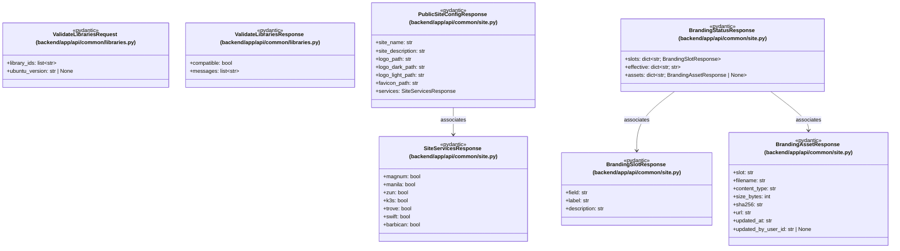

# `backend/app/api/common` 클래스 다이어그램

**대상 경로:** `backend/app/api/common`

## 책임
`backend/app/api/common`의 책임은 <<pydantic>>으로 표현되는 운영 타입 계약을 정의하는 것이다.
이 문서는 7개 source type과 3개 정적 관계를 1개 Mermaid class diagram으로 나누어 보여준다.

## 포함 파일
- `backend/app/api/common/libraries.py`
- `backend/app/api/common/site.py`

## 다이어그램 1 — `backend/app/api/common/libraries.py::ValidateLibrariesRequest` … `backend/app/api/common/site.py::BrandingStatusResponse`

### 관계 설명
- `backend/app/api/common/site.py::PublicSiteConfigResponse --> backend/app/api/common/site.py::SiteServicesResponse` — 근거: `backend/app/api/common/site.py::PublicSiteConfigResponse.services`; 관계: `associates`.
- `backend/app/api/common/site.py::BrandingStatusResponse --> backend/app/api/common/site.py::BrandingSlotResponse` — 근거: `backend/app/api/common/site.py::BrandingStatusResponse.slots`; 관계: `associates`.
- `backend/app/api/common/site.py::BrandingStatusResponse --> backend/app/api/common/site.py::BrandingAssetResponse` — 근거: `backend/app/api/common/site.py::BrandingStatusResponse.assets`; 관계: `associates`.
