# `backend/app/api/compute` 클래스 다이어그램

**대상 경로:** `backend/app/api/compute`

## 책임
`backend/app/api/compute`의 책임은 <<pydantic>>으로 표현되는 운영 타입 계약을 정의하는 것이다.
이 문서는 5개 source type과 0개 정적 관계를 1개 Mermaid class diagram으로 나누어 보여준다.

## 포함 파일
- `backend/app/api/compute/images.py`
- `backend/app/api/compute/instances.py`
- `backend/app/api/compute/keypairs.py`

## 다이어그램 1 — `backend/app/api/compute/images.py::UpdateImageRequest` … `backend/app/api/compute/keypairs.py::CreateKeypairRequest`

```mermaid
classDiagram
%% source-type: backend/app/api/compute/images.py::UpdateImageRequest
class T_backend_app_api_compute_images_py_UpdateImageRequest_4a1889284f89["UpdateImageRequest (backend/app/api/compute/images.py)"] {
  <<pydantic>>
  +name: str | None
  +os_distro: str | None
  +os_type: str | None
  +min_disk: int | None
  +min_ram: int | None
  +visibility: str | None
}
%% source-type: backend/app/api/compute/images.py::UpdatePropertiesRequest
class T_backend_app_api_compute_images_py_UpdatePropertiesRequest_4e793145dea0["UpdatePropertiesRequest (backend/app/api/compute/images.py)"] {
  <<pydantic>>
  +set: dict~str; str~ | None
  +remove: list~str~ | None
}
%% source-type: backend/app/api/compute/images.py::AddMemberRequest
class T_backend_app_api_compute_images_py_AddMemberRequest_165979084488["AddMemberRequest (backend/app/api/compute/images.py)"] {
  <<pydantic>>
  +member: str
}
%% source-type: backend/app/api/compute/instances.py::BulkActionRequest
class T_backend_app_api_compute_instances_py_BulkActionRequest_b4733ee25f10["BulkActionRequest (backend/app/api/compute/instances.py)"] {
  <<pydantic>>
  +action: Literal~'start'; 'stop'; 'delete'; 'reboot'~
  +instance_ids: list~str~
  +validate_count(v: list~str~): list~str~
}
%% source-type: backend/app/api/compute/keypairs.py::CreateKeypairRequest
class T_backend_app_api_compute_keypairs_py_CreateKeypairRequest_043b2923efae["CreateKeypairRequest (backend/app/api/compute/keypairs.py)"] {
  <<pydantic>>
  +name: str
  +public_key: str | None
  +key_type: str
}
```

### 관계 설명
- 없음
