# `backend/app/api/identity` 클래스 다이어그램

**대상 경로:** `backend/app/api/identity`

## 책임
`backend/app/api/identity`의 책임은 <<class>>, <<pydantic>>으로 표현되는 운영 타입 계약을 정의하는 것이다.
이 문서는 46개 source type과 1개 정적 관계를 2개 Mermaid class diagram으로 나누어 보여준다.

## 포함 파일
- `backend/app/api/identity/admin.py`
- `backend/app/api/identity/admin_dashboard.py`
- `backend/app/api/identity/admin_flavors.py`
- `backend/app/api/identity/admin_gpu.py`
- `backend/app/api/identity/admin_identity.py`
- `backend/app/api/identity/admin_images.py`
- `backend/app/api/identity/admin_instances.py`
- `backend/app/api/identity/admin_notion.py`
- `backend/app/api/identity/auth.py`
- `backend/app/api/identity/profile.py`
- `backend/app/api/identity/projects.py`

## 다이어그램 1 — `backend/app/api/identity/admin.py::CreatePortRequest` … `backend/app/api/identity/admin_identity.py::UnlockAccountRequest`

### 관계 설명
- 없음

## 다이어그램 2 — `backend/app/api/identity/admin_identity.py::CreateProjectRequest` … `backend/app/models/compute.py::CreateInstanceRequest`

```mermaid
classDiagram
%% source-type: backend/app/api/identity/admin_identity.py::CreateProjectRequest
class T_backend_app_api_identity_admin_identity_py_CreateProjectRequest_45c1a938c96f["CreateProjectRequest (backend/app/api/identity/admin_identity.py)"] {
  <<pydantic>>
  +name: str
  +description: str | None
  +domain_id: str | None
  +enabled: bool
}
%% source-type: backend/app/api/identity/admin_identity.py::UpdateProjectRequest
class T_backend_app_api_identity_admin_identity_py_UpdateProjectRequest_660c4fc7d00b["UpdateProjectRequest (backend/app/api/identity/admin_identity.py)"] {
  <<pydantic>>
  +name: str | None
  +description: str | None
  +enabled: bool | None
}
%% source-type: backend/app/api/identity/admin_identity.py::QuotaUpdateRequest
class T_backend_app_api_identity_admin_identity_py_QuotaUpdateRequest_7b221283715e["QuotaUpdateRequest (backend/app/api/identity/admin_identity.py)"] {
  <<pydantic>>
  +instances: int | None
  +cores: int | None
  +ram: int | None
  +volumes: int | None
  +gigabytes: int | None
}
%% source-type: backend/app/api/identity/admin_identity.py::CreateGroupRequest
class T_backend_app_api_identity_admin_identity_py_CreateGroupRequest_0ed778864d74["CreateGroupRequest (backend/app/api/identity/admin_identity.py)"] {
  <<pydantic>>
  +name: str
  +description: str | None
  +domain_id: str | None
}
%% source-type: backend/app/api/identity/admin_identity.py::UpdateGroupRequest
class T_backend_app_api_identity_admin_identity_py_UpdateGroupRequest_ed2d12f3de42["UpdateGroupRequest (backend/app/api/identity/admin_identity.py)"] {
  <<pydantic>>
  +name: str | None
  +description: str | None
}
%% source-type: backend/app/api/identity/admin_identity.py::AssignRoleRequest
class T_backend_app_api_identity_admin_identity_py_AssignRoleRequest_0ef7ea192ccf["AssignRoleRequest (backend/app/api/identity/admin_identity.py)"] {
  <<pydantic>>
  +user_id: str
  +project_id: str
  +role_id: str
}
%% source-type: backend/app/api/identity/admin_identity.py::AssignGroupRoleRequest
class T_backend_app_api_identity_admin_identity_py_AssignGroupRoleRequest_83c2a10d3a1b["AssignGroupRoleRequest (backend/app/api/identity/admin_identity.py)"] {
  <<pydantic>>
  +group_id: str
  +project_id: str
  +role_id: str
}
%% source-type: backend/app/api/identity/admin_identity.py::SystemRoleRequest
class T_backend_app_api_identity_admin_identity_py_SystemRoleRequest_722726c57791["SystemRoleRequest (backend/app/api/identity/admin_identity.py)"] {
  <<pydantic>>
  +user_id: str
}
%% source-type: backend/app/api/identity/admin_images.py::AdminUpdateImageRequest
class T_backend_app_api_identity_admin_images_py_AdminUpdateImageRequest_4a8220eb3e8d["AdminUpdateImageRequest (backend/app/api/identity/admin_images.py)"] {
  <<pydantic>>
  +name: str | None
  +os_distro: str | None
  +os_type: str | None
  +min_disk: int | None
  +min_ram: int | None
  +visibility: str | None
}
%% source-type: backend/app/api/identity/admin_images.py::AdminUpdatePropertiesRequest
class T_backend_app_api_identity_admin_images_py_AdminUpdatePropertiesRequest_8bffec43dbd8["AdminUpdatePropertiesRequest (backend/app/api/identity/admin_images.py)"] {
  <<pydantic>>
  +set: dict~str; str~ | None
  +remove: list~str~ | None
}
%% source-type: backend/app/api/identity/admin_instances.py::AdminCreateInstanceRequest
class T_backend_app_api_identity_admin_instances_py_AdminCreateInstanceRequest_088fc9eb3796["AdminCreateInstanceRequest (backend/app/api/identity/admin_instances.py)"] {
  <<class>>
  +project_id: str
}
%% source-type: backend/app/api/identity/admin_notion.py::NotionConfigRequest
class T_backend_app_api_identity_admin_notion_py_NotionConfigRequest_d33110533a04["NotionConfigRequest (backend/app/api/identity/admin_notion.py)"] {
  <<pydantic>>
  +api_key: str
  +database_id: str
  +enabled: bool
  +interval_minutes: int
  +users_database_id: str
  +hypervisors_database_id: str
  +gpu_spec_database_id: str
}
%% source-type: backend/app/api/identity/admin_notion.py::NotionTargetCreateRequest
class T_backend_app_api_identity_admin_notion_py_NotionTargetCreateRequest_8d7109b1d773["NotionTargetCreateRequest (backend/app/api/identity/admin_notion.py)"] {
  <<pydantic>>
  +label: str
  +api_key: str
  +database_id: str
  +enabled: bool
  +interval_minutes: int
  +users_database_id: str
  +hypervisors_database_id: str
  +gpu_spec_database_id: str
}
%% source-type: backend/app/api/identity/admin_notion.py::NotionTargetUpdateRequest
class T_backend_app_api_identity_admin_notion_py_NotionTargetUpdateRequest_4dc0e343ece3["NotionTargetUpdateRequest (backend/app/api/identity/admin_notion.py)"] {
  <<pydantic>>
  +label: str | None
  +api_key: str | None
  +database_id: str | None
  +enabled: bool | None
  +interval_minutes: int | None
  +users_database_id: str | None
  +hypervisors_database_id: str | None
  +gpu_spec_database_id: str | None
}
%% source-type: backend/app/api/identity/auth.py::GroupInfo
class T_backend_app_api_identity_auth_py_GroupInfo_98361f882a44["GroupInfo (backend/app/api/identity/auth.py)"] {
  <<pydantic>>
  +id: str
  +name: str
  +description: str | None
  +domain_id: str | None
}
%% source-type: backend/app/api/identity/auth.py::RefreshRequest
class T_backend_app_api_identity_auth_py_RefreshRequest_a75b76a94363["RefreshRequest (backend/app/api/identity/auth.py)"] {
  <<pydantic>>
  +refresh_token: str
}
%% source-type: backend/app/api/identity/auth.py::ProjectScopeRequest
class T_backend_app_api_identity_auth_py_ProjectScopeRequest_aea2b173f056["ProjectScopeRequest (backend/app/api/identity/auth.py)"] {
  <<pydantic>>
  +project_id: str
}
%% source-type: backend/app/api/identity/profile.py::UpdateProfileRequest
class T_backend_app_api_identity_profile_py_UpdateProfileRequest_f761d31e95b2["UpdateProfileRequest (backend/app/api/identity/profile.py)"] {
  <<pydantic>>
  +name: str | None
  +email: str | None
  +description: str | None
  +default_project_id: str | None
}
%% source-type: backend/app/api/identity/profile.py::ChangePasswordRequest
class T_backend_app_api_identity_profile_py_ChangePasswordRequest_4012c7f6b176["ChangePasswordRequest (backend/app/api/identity/profile.py)"] {
  <<pydantic>>
  +current_password: str
  +new_password: str
}
%% source-type: backend/app/api/identity/projects.py::CreateProjectRequest
class T_backend_app_api_identity_projects_py_CreateProjectRequest_f7e85b2f6183["CreateProjectRequest (backend/app/api/identity/projects.py)"] {
  <<pydantic>>
  +name: str
  +description: str
}
%% source-type: backend/app/api/identity/projects.py::CreateInvitationRequest
class T_backend_app_api_identity_projects_py_CreateInvitationRequest_665c68d6a848["CreateInvitationRequest (backend/app/api/identity/projects.py)"] {
  <<pydantic>>
  +email: str
  +keystone_role: str
}
%% external-type: backend/app/models/compute.py::CreateInstanceRequest
class T_backend_app_models_compute_py_CreateInstanceRequest_4fa280f73382["CreateInstanceRequest (../../models/compute.py)"] {
  <<external>>
}
T_backend_app_models_compute_py_CreateInstanceRequest_4fa280f73382 <|-- T_backend_app_api_identity_admin_instances_py_AdminCreateInstanceRequest_088fc9eb3796 : inherits
```

### 관계 설명
- `backend/app/models/compute.py::CreateInstanceRequest <|-- backend/app/api/identity/admin_instances.py::AdminCreateInstanceRequest` — 근거: `backend/app/api/identity/admin_instances.py::AdminCreateInstanceRequest.__bases__`; 관계: `inherits`.
