# `backend/app/api/network` 클래스 다이어그램

**대상 경로:** `backend/app/api/network`

## 책임
`backend/app/api/network`의 책임은 <<pydantic>>으로 표현되는 운영 타입 계약을 정의하는 것이다.
이 문서는 8개 source type과 0개 정적 관계를 1개 Mermaid class diagram으로 나누어 보여준다.

## 포함 파일
- `backend/app/api/network/loadbalancers.py`
- `backend/app/api/network/networks.py`
- `backend/app/api/network/security_groups.py`

## 다이어그램 1 — `backend/app/api/network/loadbalancers.py::CreateLbRequest` … `backend/app/api/network/security_groups.py::CreateSecurityGroupRuleRequest`

```mermaid
classDiagram
%% source-type: backend/app/api/network/loadbalancers.py::CreateLbRequest
class T_backend_app_api_network_loadbalancers_py_CreateLbRequest_5116ed47a81d["CreateLbRequest (backend/app/api/network/loadbalancers.py)"] {
  <<pydantic>>
  +name: str
  +vip_subnet_id: str
  +description: str
}
%% source-type: backend/app/api/network/loadbalancers.py::CreateListenerRequest
class T_backend_app_api_network_loadbalancers_py_CreateListenerRequest_930d71c9dafc["CreateListenerRequest (backend/app/api/network/loadbalancers.py)"] {
  <<pydantic>>
  +protocol: str
  +protocol_port: int
  +name: str
  +default_pool_id: str | None
}
%% source-type: backend/app/api/network/loadbalancers.py::CreatePoolRequest
class T_backend_app_api_network_loadbalancers_py_CreatePoolRequest_9d0e0c627c09["CreatePoolRequest (backend/app/api/network/loadbalancers.py)"] {
  <<pydantic>>
  +protocol: str
  +lb_algorithm: str
  +name: str
  +listener_id: str | None
}
%% source-type: backend/app/api/network/loadbalancers.py::AddMemberRequest
class T_backend_app_api_network_loadbalancers_py_AddMemberRequest_63ed418fa093["AddMemberRequest (backend/app/api/network/loadbalancers.py)"] {
  <<pydantic>>
  +address: str
  +protocol_port: int
  +subnet_id: str | None
  +name: str
  +weight: int
}
%% source-type: backend/app/api/network/loadbalancers.py::CreateHealthMonitorRequest
class T_backend_app_api_network_loadbalancers_py_CreateHealthMonitorRequest_61f827253f78["CreateHealthMonitorRequest (backend/app/api/network/loadbalancers.py)"] {
  <<pydantic>>
  +type: str
  +delay: int
  +timeout: int
  +max_retries: int
  +name: str
}
%% source-type: backend/app/api/network/networks.py::SetDefaultNetworkRequest
class T_backend_app_api_network_networks_py_SetDefaultNetworkRequest_2a6700a6268f["SetDefaultNetworkRequest (backend/app/api/network/networks.py)"] {
  <<pydantic>>
  +network_id: str
}
%% source-type: backend/app/api/network/security_groups.py::CreateSecurityGroupRequest
class T_backend_app_api_network_security_groups_py_CreateSecurityGroupRequest_2149cb860c6b["CreateSecurityGroupRequest (backend/app/api/network/security_groups.py)"] {
  <<pydantic>>
  +name: str
  +description: str
}
%% source-type: backend/app/api/network/security_groups.py::CreateSecurityGroupRuleRequest
class T_backend_app_api_network_security_groups_py_CreateSecurityGroupRuleRequest_300f0d5115cd["CreateSecurityGroupRuleRequest (backend/app/api/network/security_groups.py)"] {
  <<pydantic>>
  +direction: str
  +protocol: str | None
  +port_range_min: int | None
  +port_range_max: int | None
  +remote_ip_prefix: str | None
  +ethertype: str
}
```

### 관계 설명
- 없음
