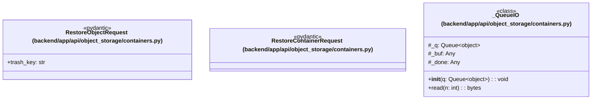

# `backend/app/api/object_storage` 클래스 다이어그램

**대상 경로:** `backend/app/api/object_storage`

## 책임
`backend/app/api/object_storage`의 책임은 <<class>>, <<pydantic>>으로 표현되는 운영 타입 계약을 정의하는 것이다.
이 문서는 3개 source type과 0개 정적 관계를 1개 Mermaid class diagram으로 나누어 보여준다.

## 포함 파일
- `backend/app/api/object_storage/containers.py`

## 다이어그램 1 — `backend/app/api/object_storage/containers.py::RestoreObjectRequest` … `backend/app/api/object_storage/containers.py::_QueueIO`

### 관계 설명
- 없음
