# `backend/app/api/storage` 클래스 다이어그램

**대상 경로:** `backend/app/api/storage`

## 책임
`backend/app/api/storage`의 책임은 <<pydantic>>으로 표현되는 운영 타입 계약을 정의하는 것이다.
이 문서는 6개 source type과 0개 정적 관계를 1개 Mermaid class diagram으로 나누어 보여준다.

## 포함 파일
- `backend/app/api/storage/volume_backups.py`
- `backend/app/api/storage/volume_snapshots.py`
- `backend/app/api/storage/volumes.py`

## 다이어그램 1 — `backend/app/api/storage/volume_backups.py::CreateBackupRequest` … `backend/app/api/storage/volumes.py::AcceptVolumeTransferRequest`

```mermaid
classDiagram
%% source-type: backend/app/api/storage/volume_backups.py::CreateBackupRequest
class T_backend_app_api_storage_volume_backups_py_CreateBackupRequest_c9e51a2c4f9c["CreateBackupRequest (backend/app/api/storage/volume_backups.py)"] {
  <<pydantic>>
  +volume_id: str
  +name: str
  +description: str | None
  +incremental: bool
}
%% source-type: backend/app/api/storage/volume_backups.py::RestoreBackupRequest
class T_backend_app_api_storage_volume_backups_py_RestoreBackupRequest_4a597ca5006a["RestoreBackupRequest (backend/app/api/storage/volume_backups.py)"] {
  <<pydantic>>
  +volume_id: str | None
}
%% source-type: backend/app/api/storage/volume_backups.py::AutoBackupRequest
class T_backend_app_api_storage_volume_backups_py_AutoBackupRequest_6d2538f91e0a["AutoBackupRequest (backend/app/api/storage/volume_backups.py)"] {
  <<pydantic>>
  +max_daily: int
  +max_weekly: int
  +max_monthly: int
}
%% source-type: backend/app/api/storage/volume_snapshots.py::CreateSnapshotRequest
class T_backend_app_api_storage_volume_snapshots_py_CreateSnapshotRequest_c7546f32ef8a["CreateSnapshotRequest (backend/app/api/storage/volume_snapshots.py)"] {
  <<pydantic>>
  +volume_id: str
  +name: str
  +description: str | None
  +force: bool
}
%% source-type: backend/app/api/storage/volumes.py::CreateVolumeTransferRequest
class T_backend_app_api_storage_volumes_py_CreateVolumeTransferRequest_c002aaf398a5["CreateVolumeTransferRequest (backend/app/api/storage/volumes.py)"] {
  <<pydantic>>
  +name: str | None
}
%% source-type: backend/app/api/storage/volumes.py::AcceptVolumeTransferRequest
class T_backend_app_api_storage_volumes_py_AcceptVolumeTransferRequest_3ce118b85ea1["AcceptVolumeTransferRequest (backend/app/api/storage/volumes.py)"] {
  <<pydantic>>
  +auth_key: str
}
```

### 관계 설명
- 없음
