# `backend/app/api/union` 클래스 다이어그램

**대상 경로:** `backend/app/api/union`

## 책임
`backend/app/api/union`의 책임은 <<pydantic>>으로 표현되는 운영 타입 계약을 정의하는 것이다.
이 문서는 6개 source type과 0개 정적 관계를 1개 Mermaid class diagram으로 나누어 보여준다.

## 포함 파일
- `backend/app/api/union/layer_ops.py`
- `backend/app/api/union/layer_public.py`

## 다이어그램 1 — `backend/app/api/union/layer_ops.py::LayerBuildRequest` … `backend/app/api/union/layer_public.py::PublicLayerConsumeRequest`

```mermaid
classDiagram
%% source-type: backend/app/api/union/layer_ops.py::LayerBuildRequest
class T_backend_app_api_union_layer_ops_py_LayerBuildRequest_288608e89475["LayerBuildRequest (backend/app/api/union/layer_ops.py)"] {
  <<pydantic>>
  +layer_name: str
  +kind: str
  +python_version: str | None
  +pip_packages: list~str~
  +apt_packages: list~str~
  +pip_index_url: str | None
  +pip_extra_index_urls: list~str~
  +ubuntu_base: str | None
  +base_image_id: str | None
  +parent: str | None
  +parent_artifact_id: int | None
  +nvidia_driver_branch: str | None
  +validate_name(v: str): str
  +validate_kind(v: str): str
  +validate_ubuntu_base(v: str | None): str | None
  +validate_base_image_id_field(v: str | None): str | None
  +validate_parent(v: str | None): str | None
  +validate_parent_artifact_id(v: int | None): int | None
  +validate_python_version(v: str | None): str | None
  +validate_pip_packages(v: list): list
}
%% source-type: backend/app/api/union/layer_ops.py::LayerConsumeRequest
class T_backend_app_api_union_layer_ops_py_LayerConsumeRequest_665c7318b280["LayerConsumeRequest (backend/app/api/union/layer_ops.py)"] {
  <<pydantic>>
  +profile_name: str
  +server_name: str | None
  +flavor_id: str
  +image_id: str | None
  +network_id: str | None
  +key_name: str | None
  +ssh_public_key: str | None
  +ssh_username: str | None
  +validate_profile(v: str): str
  +validate_server_name(v: str | None): str | None
  +validate_flavor_id(v: str): str
  +validate_key_name(v: str | None): str | None
  +validate_ssh_public_key(v: str | None): str | None
  +validate_ssh_username(v: str | None): str | None
  +validate_ssh_options(): LayerConsumeRequest
}
%% source-type: backend/app/api/union/layer_ops.py::LayerProfileRequest
class T_backend_app_api_union_layer_ops_py_LayerProfileRequest_29cd248ed2d9["LayerProfileRequest (backend/app/api/union/layer_ops.py)"] {
  <<pydantic>>
  +name: str
  +layers: list~str~
  +validate_name(v: str): str
  +validate_layers(v: list): list
}
%% source-type: backend/app/api/union/layer_ops.py::DockerfileImportRequest
class T_backend_app_api_union_layer_ops_py_DockerfileImportRequest_e3a140798af1["DockerfileImportRequest (backend/app/api/union/layer_ops.py)"] {
  <<pydantic>>
  +github_url: str
  +ref: str | None
  +dockerfile_path: str
  +layer_prefix: str
  +profile_name: str | None
  +base_image_id: str
  +validate_import_base_image_id(v: str): str
}
%% source-type: backend/app/api/union/layer_ops.py::PublicationRequest
class T_backend_app_api_union_layer_ops_py_PublicationRequest_64ae91bdca07["PublicationRequest (backend/app/api/union/layer_ops.py)"] {
  <<pydantic>>
  +is_published: bool
}
%% source-type: backend/app/api/union/layer_public.py::PublicLayerConsumeRequest
class T_backend_app_api_union_layer_public_py_PublicLayerConsumeRequest_a516dbc746c6["PublicLayerConsumeRequest (backend/app/api/union/layer_public.py)"] {
  <<pydantic>>
  +profile_name: str | None
  +artifact_ids: list~int~ | None
  +server_name: str | None
  +flavor_id: str
  +image_id: str | None
  +network_id: str | None
  +key_name: str | None
  +ssh_public_key: str | None
  +ssh_username: str | None
  +validate_profile_name(v: str | None): str | None
  +validate_artifact_ids(v: list~int~ | None): list~int~ | None
  +validate_server_name(v: str | None): str | None
  +validate_flavor_id(v: str): str
  +validate_key_name(v: str | None): str | None
  +validate_ssh_public_key(v: str | None): str | None
  +validate_ssh_username(v: str | None): str | None
  +validate_source(): PublicLayerConsumeRequest
}
```

### 관계 설명
- 없음
