# `backend/app/services/k3s_plugins` 클래스 다이어그램

**대상 경로:** `backend/app/services/k3s_plugins`

## 책임
`backend/app/services/k3s_plugins`의 책임은 <<class>>, <<protocol>>으로 표현되는 운영 타입 계약을 정의하는 것이다.
이 문서는 7개 source type과 6개 정적 관계를 1개 Mermaid class diagram으로 나누어 보여준다.

## 포함 파일
- `backend/app/services/k3s_plugins/barbican_kms.py`
- `backend/app/services/k3s_plugins/base.py`
- `backend/app/services/k3s_plugins/cinder_csi.py`
- `backend/app/services/k3s_plugins/keystone_auth.py`
- `backend/app/services/k3s_plugins/manila_csi.py`
- `backend/app/services/k3s_plugins/occm.py`
- `backend/app/services/k3s_plugins/octavia_ingress.py`

## 다이어그램 1 — `backend/app/services/k3s_plugins/barbican_kms.py::BarbicanKmsPlugin` … `backend/app/services/k3s_plugins/octavia_ingress.py::OctaviaIngressPlugin`

```mermaid
classDiagram
%% source-type: backend/app/services/k3s_plugins/barbican_kms.py::BarbicanKmsPlugin
class T_backend_app_services_k3s_plugins_barbican_kms_py_BarbicanKmsPlugin_f51a86341be4["BarbicanKmsPlugin (backend/app/services/k3s_plugins/barbican_kms.py)"] {
  <<class>>
  +should_deploy(settings: Settings): bool
  +cloud_conf_sections(project_id: str, settings: Settings): str
  +generate_manifests(cluster_name: str, project_id: str, settings: Settings, **kwargs: Any): str
  +extra_write_files(project_id: str, cluster_name: str, settings: Settings, app_credential: dict | None, kek_id: str | None): list~dict~
  +server_install_args(settings: Settings): list~str~
  +agent_install_args(settings: Settings): list~str~
  +needs_external_cloud_provider(settings: Settings): bool
}
%% source-type: backend/app/services/k3s_plugins/base.py::K3sPlugin
class T_backend_app_services_k3s_plugins_base_py_K3sPlugin_e4d3da00af68["K3sPlugin (backend/app/services/k3s_plugins/base.py)"] {
  <<protocol>>
  +name: str
  +should_deploy(settings: Settings): bool
  +cloud_conf_sections(project_id: str, settings: Settings): str
  +generate_manifests(cluster_name: str, project_id: str, settings: Settings, **kwargs: Any): str
  +extra_write_files(project_id: str, cluster_name: str, settings: Settings): list~dict~
  +server_install_args(settings: Settings): list~str~
  +agent_install_args(settings: Settings): list~str~
  +needs_external_cloud_provider(settings: Settings): bool
}
%% source-type: backend/app/services/k3s_plugins/cinder_csi.py::CinderCsiPlugin
class T_backend_app_services_k3s_plugins_cinder_csi_py_CinderCsiPlugin_b65241dc9961["CinderCsiPlugin (backend/app/services/k3s_plugins/cinder_csi.py)"] {
  <<class>>
  +should_deploy(settings: Settings): bool
  +cloud_conf_sections(project_id: str, settings: Settings): str
  +generate_manifests(cluster_name: str, project_id: str, settings: Settings, **kwargs: Any): str
  +extra_write_files(project_id: str, cluster_name: str, settings: Settings): list~dict~
  +server_install_args(settings: Settings): list~str~
  +agent_install_args(settings: Settings): list~str~
  +needs_external_cloud_provider(settings: Settings): bool
}
%% source-type: backend/app/services/k3s_plugins/keystone_auth.py::KeystoneAuthPlugin
class T_backend_app_services_k3s_plugins_keystone_auth_py_KeystoneAuthPlugin_1106b49dbf7e["KeystoneAuthPlugin (backend/app/services/k3s_plugins/keystone_auth.py)"] {
  <<class>>
  #_cert_cache: dict~str; tuple~bytes; bytes~~
  +should_deploy(settings: Settings): bool
  +cloud_conf_sections(project_id: str, settings: Settings): str
  +generate_manifests(cluster_name: str, project_id: str, settings: Settings, **kwargs: Any): str
  +extra_write_files(project_id: str, cluster_name: str, settings: Settings): list~dict~
  +server_install_args(settings: Settings): list~str~
  +agent_install_args(settings: Settings): list~str~
  +needs_external_cloud_provider(settings: Settings): bool
}
%% source-type: backend/app/services/k3s_plugins/manila_csi.py::ManilaCsiPlugin
class T_backend_app_services_k3s_plugins_manila_csi_py_ManilaCsiPlugin_57960ac9a946["ManilaCsiPlugin (backend/app/services/k3s_plugins/manila_csi.py)"] {
  <<class>>
  +should_deploy(settings: Settings): bool
  +cloud_conf_sections(project_id: str, settings: Settings): str
  +generate_manifests(cluster_name: str, project_id: str, settings: Settings, **kwargs: Any): str
  +extra_write_files(project_id: str, cluster_name: str, settings: Settings): list~dict~
  +server_install_args(settings: Settings): list~str~
  +agent_install_args(settings: Settings): list~str~
  +needs_external_cloud_provider(settings: Settings): bool
}
%% source-type: backend/app/services/k3s_plugins/occm.py::OccmPlugin
class T_backend_app_services_k3s_plugins_occm_py_OccmPlugin_8eec56040068["OccmPlugin (backend/app/services/k3s_plugins/occm.py)"] {
  <<class>>
  +should_deploy(settings: Settings): bool
  +cloud_conf_sections(project_id: str, settings: Settings, internal_network_name: str): str
  +generate_manifests(cluster_name: str, project_id: str, settings: Settings, **kwargs: Any): str
  +extra_write_files(project_id: str, cluster_name: str, settings: Settings): list~dict~
  +server_install_args(settings: Settings): list~str~
  +agent_install_args(settings: Settings): list~str~
  +needs_external_cloud_provider(settings: Settings): bool
}
%% source-type: backend/app/services/k3s_plugins/octavia_ingress.py::OctaviaIngressPlugin
class T_backend_app_services_k3s_plugins_octavia_ingress_py_OctaviaIngressPlugin_d5bc0d702223["OctaviaIngressPlugin (backend/app/services/k3s_plugins/octavia_ingress.py)"] {
  <<class>>
  +should_deploy(settings: Settings): bool
  +cloud_conf_sections(project_id: str, settings: Settings): str
  +generate_manifests(cluster_name: str, project_id: str, settings: Settings, subnet_id: str, app_credential: dict, floating_network_id: str | None, **_: Any): str
  +extra_write_files(project_id: str, cluster_name: str, settings: Settings): list~dict~
  +server_install_args(settings: Settings): list~str~
  +agent_install_args(settings: Settings): list~str~
  +needs_external_cloud_provider(settings: Settings): bool
}
T_backend_app_services_k3s_plugins_base_py_K3sPlugin_e4d3da00af68 <|.. T_backend_app_services_k3s_plugins_barbican_kms_py_BarbicanKmsPlugin_f51a86341be4 : structural
T_backend_app_services_k3s_plugins_base_py_K3sPlugin_e4d3da00af68 <|.. T_backend_app_services_k3s_plugins_cinder_csi_py_CinderCsiPlugin_b65241dc9961 : structural
T_backend_app_services_k3s_plugins_base_py_K3sPlugin_e4d3da00af68 <|.. T_backend_app_services_k3s_plugins_keystone_auth_py_KeystoneAuthPlugin_1106b49dbf7e : structural
T_backend_app_services_k3s_plugins_base_py_K3sPlugin_e4d3da00af68 <|.. T_backend_app_services_k3s_plugins_manila_csi_py_ManilaCsiPlugin_57960ac9a946 : structural
T_backend_app_services_k3s_plugins_base_py_K3sPlugin_e4d3da00af68 <|.. T_backend_app_services_k3s_plugins_occm_py_OccmPlugin_8eec56040068 : structural
T_backend_app_services_k3s_plugins_base_py_K3sPlugin_e4d3da00af68 <|.. T_backend_app_services_k3s_plugins_octavia_ingress_py_OctaviaIngressPlugin_d5bc0d702223 : structural
```

### 관계 설명
- `backend/app/services/k3s_plugins/base.py::K3sPlugin <|.. backend/app/services/k3s_plugins/barbican_kms.py::BarbicanKmsPlugin` — 근거: `backend/app/services/k3s_plugins/__init__.py::ALL_PLUGINS`; 관계: `structural`.
- `backend/app/services/k3s_plugins/base.py::K3sPlugin <|.. backend/app/services/k3s_plugins/cinder_csi.py::CinderCsiPlugin` — 근거: `backend/app/services/k3s_plugins/__init__.py::ALL_PLUGINS`; 관계: `structural`.
- `backend/app/services/k3s_plugins/base.py::K3sPlugin <|.. backend/app/services/k3s_plugins/keystone_auth.py::KeystoneAuthPlugin` — 근거: `backend/app/services/k3s_plugins/__init__.py::ALL_PLUGINS`; 관계: `structural`.
- `backend/app/services/k3s_plugins/base.py::K3sPlugin <|.. backend/app/services/k3s_plugins/manila_csi.py::ManilaCsiPlugin` — 근거: `backend/app/services/k3s_plugins/__init__.py::ALL_PLUGINS`; 관계: `structural`.
- `backend/app/services/k3s_plugins/base.py::K3sPlugin <|.. backend/app/services/k3s_plugins/occm.py::OccmPlugin` — 근거: `backend/app/services/k3s_plugins/__init__.py::ALL_PLUGINS`; 관계: `structural`.
- `backend/app/services/k3s_plugins/base.py::K3sPlugin <|.. backend/app/services/k3s_plugins/octavia_ingress.py::OctaviaIngressPlugin` — 근거: `backend/app/services/k3s_plugins/__init__.py::ALL_PLUGINS`; 관계: `structural`.
