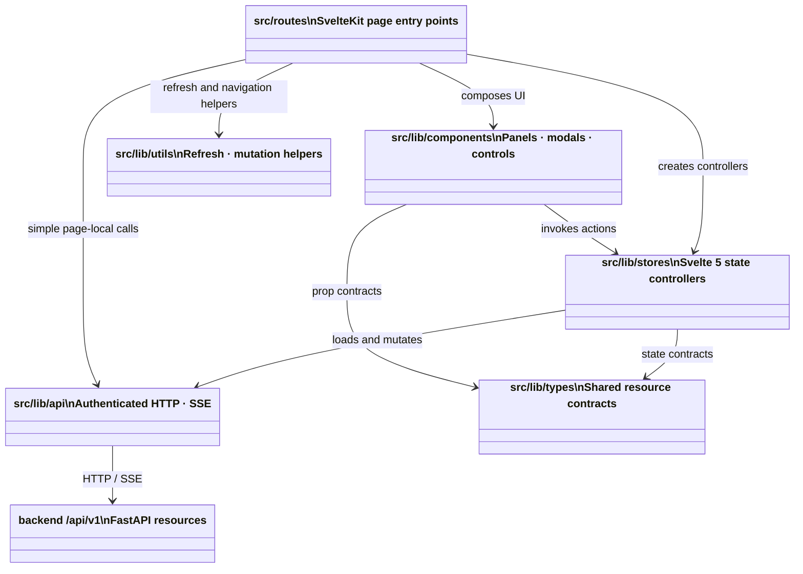
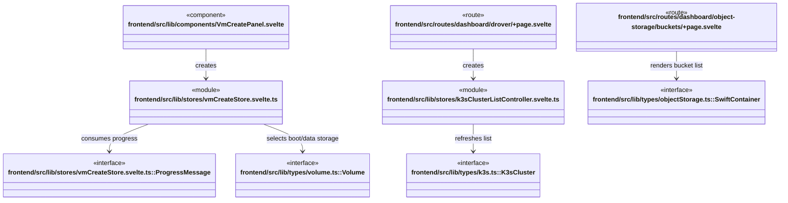

# `frontend` 상위 모듈 관계

`frontend/src`는 SvelteKit route를 사용자 작업의 진입점으로 두고, component·store/controller·API client·shared type을 조합한다. 이 문서는 하위 경로별 클래스 다이어그램과 workflow 문서를 연결한다.

## 모듈 관계

## 대표 child module 타입 관계

각 resource workflow의 route/module과 payload 관계는 [workflow index](./workflows/README.md)에서 확인한다.

## 탐색 경로

- [route class diagrams](./src/routes/dashboard/README.md)과 [admin routes](./src/routes/admin/README.md)는 페이지에 선언된 named type을 보여준다.
- [stores](./src/lib/stores/README.md)는 reusable controller/state type을 보여준다.
- [types](./src/lib/types/README.md)는 API payload와 resource contract를 보여준다.
- [workflow diagrams](./workflows/README.md)은 실제 사용자 작업의 순서와 해당 시나리오의 핵심 클래스를 보여준다.

## 상태 소유 규칙

- route는 인증된 project context를 받아 UI와 controller를 조합한다.
- store/controller는 loading, mutation, refresh, toast/progress 상태를 소유한다.
- API client는 bearer token과 project header를 전달하며 `/api/v1` 호출을 수행한다.
- named `types`는 route, component, store 사이에서 공유되는 resource contract다.
