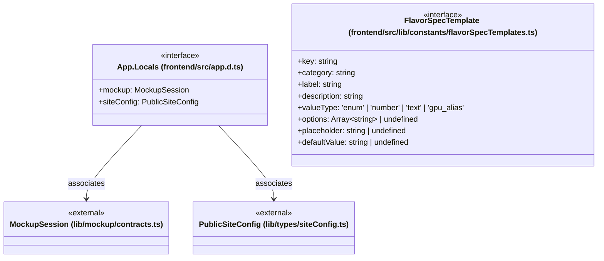

# `frontend/src` 클래스 다이어그램

**대상 경로:** `frontend/src`

## 책임
`frontend/src`의 책임은 <<interface>>으로 표현되는 운영 타입 계약을 정의하는 것이다.
이 문서는 2개 source type과 2개 정적 관계를 1개 Mermaid class diagram으로 나누어 보여준다.

## 포함 파일
- `frontend/src/app.d.ts`
- `frontend/src/lib/constants/flavorSpecTemplates.ts`

## 다이어그램 1 — `frontend/src/app.d.ts::App.Locals` … `frontend/src/lib/types/siteConfig.ts::PublicSiteConfig`

### 관계 설명
- `frontend/src/app.d.ts::App.Locals --> frontend/src/lib/mockup/contracts.ts::MockupSession` — 근거: `frontend/src/app.d.ts::App.Locals.mockup`; 관계: `associates`.
- `frontend/src/app.d.ts::App.Locals --> frontend/src/lib/types/siteConfig.ts::PublicSiteConfig` — 근거: `frontend/src/app.d.ts::App.Locals.siteConfig`; 관계: `associates`.

### 타입 표기 정규화
| Mermaid 표기 | 소스 표기 |
|---|---|
| `Array~string~` | `string[]` |
