# `frontend/src/lib/api` 클래스 다이어그램

**대상 경로:** `frontend/src/lib/api`

## 책임
`frontend/src/lib/api`의 책임은 <<class>>, <<interface>>으로 표현되는 운영 타입 계약을 정의하는 것이다.
이 문서는 7개 source type과 0개 정적 관계를 1개 Mermaid class diagram으로 나누어 보여준다.

## 포함 파일
- `frontend/src/lib/api/errors.ts`
- `frontend/src/lib/api/k3sSseStream.ts`
- `frontend/src/lib/api/mutations.ts`
- `frontend/src/lib/api/secrets.ts`

## 다이어그램 1 — `frontend/src/lib/api/errors.ts::ApiError` … `frontend/src/lib/api/secrets.ts::SecretInfo`

```mermaid
classDiagram
%% source-type: frontend/src/lib/api/errors.ts::ApiError
class T_frontend_src_lib_api_errors_ts_ApiError_91bed870cf66["ApiError (frontend/src/lib/api/errors.ts)"] {
  <<class>>
  +status: number
  +constructor(status: number, message: string): void
}
%% source-type: frontend/src/lib/api/k3sSseStream.ts::K3sSseProgressMessage
class T_frontend_src_lib_api_k3sSseStream_ts_K3sSseProgressMessage_4425cd340b78["K3sSseProgressMessage (frontend/src/lib/api/k3sSseStream.ts)"] {
  <<interface>>
  +step: string
  +progress: number
  +message: string
  +cluster_id: string | undefined
  +error: string | undefined
  +elapsed_seconds: number | undefined
}
%% source-type: frontend/src/lib/api/mutations.ts::ApiMutOpts
class T_frontend_src_lib_api_mutations_ts_ApiMutOpts_dedb56874b83["ApiMutOpts (frontend/src/lib/api/mutations.ts)"] {
  <<interface>>
  +successMessage: string | null | undefined
  +errorPrefix: string | undefined
  +progress: boolean | undefined
  +rethrow: boolean | undefined
}
%% source-type: frontend/src/lib/api/secrets.ts::ContainerInfo
class T_frontend_src_lib_api_secrets_ts_ContainerInfo_678acf36000e["ContainerInfo (frontend/src/lib/api/secrets.ts)"] {
  <<interface>>
  +id: string
  +name: string | null
  +type: string
  +status: string | null
  +created: string | null
  +secret_refs: Array~object~
}
%% source-type: frontend/src/lib/api/secrets.ts::OrderInfo
class T_frontend_src_lib_api_secrets_ts_OrderInfo_d3a7b26db9f9["OrderInfo (frontend/src/lib/api/secrets.ts)"] {
  <<interface>>
  +id: string
  +type: string
  +status: string | null
  +created: string | null
  +secret_ref: string | null
  +container_ref: string | null
  +meta: Record~string; unknown~
  +error_reason: string | null
}
%% source-type: frontend/src/lib/api/secrets.ts::QuotaInfo
class T_frontend_src_lib_api_secrets_ts_QuotaInfo_ab0a68423d4c["QuotaInfo (frontend/src/lib/api/secrets.ts)"] {
  <<interface>>
  +secrets: number
  +orders: number
  +containers: number
  +consumers: number
  +cas: number
}
%% source-type: frontend/src/lib/api/secrets.ts::SecretInfo
class T_frontend_src_lib_api_secrets_ts_SecretInfo_c749534bf24e["SecretInfo (frontend/src/lib/api/secrets.ts)"] {
  <<interface>>
  +id: string
  +name: string | null
  +secret_type: string
  +status: string | null
  +algorithm: string | null
  +bit_length: number | null
  +mode: string | null
  +created: string | null
  +expires: string | null
  +content_types: Record~string; string~ | null
  +system_managed: boolean
}
```

### 관계 설명
- 없음

### 타입 표기 정규화
| Mermaid 표기 | 소스 표기 |
|---|---|
| `Array~object~` | `{ name: string; secret_ref: string }[]` |
| `Record~string; unknown~` | `Record<string, unknown>` |
| `Record~string; string~ | null` | `Record<string, string> | null` |
