# `frontend/src/lib/components` 클래스 다이어그램

**대상 경로:** `frontend/src/lib/components`

## 책임
`frontend/src/lib/components`의 책임은 <<interface>>, <<type alias>>으로 표현되는 운영 타입 계약을 정의하는 것이다.
이 문서는 56개 source type과 21개 정적 관계를 3개 Mermaid class diagram으로 나누어 보여준다.

## 포함 파일
- `frontend/src/lib/components/AdminSidebar.svelte`
- `frontend/src/lib/components/AdminVolumeDetailPanel.svelte`
- `frontend/src/lib/components/AutoRefreshControl.svelte`
- `frontend/src/lib/components/CmdPalette.svelte`
- `frontend/src/lib/components/ContainerDetailPanel.svelte`
- `frontend/src/lib/components/FileStorageDetailPanel.svelte`
- `frontend/src/lib/components/ImageDetailPanel.svelte`
- `frontend/src/lib/components/ImageUploadModal.svelte`
- `frontend/src/lib/components/InstanceDetailPanel.svelte`
- `frontend/src/lib/components/K3sClusterDetailPanel.svelte`
- `frontend/src/lib/components/LibraryUsageChart.svelte`
- `frontend/src/lib/components/LoadBalancerDetailPanel.svelte`
- `frontend/src/lib/components/LoadingSkeleton.svelte`
- `frontend/src/lib/components/LoadingSpinner.svelte`
- `frontend/src/lib/components/NetworkDetailPanel.svelte`
- `frontend/src/lib/components/ObjectBrowser.svelte`
- `frontend/src/lib/components/ProgressBar.svelte`
- `frontend/src/lib/components/ProjectQuotaPanel.svelte`
- `frontend/src/lib/components/ProjectSelector.svelte`
- `frontend/src/lib/components/QuotaDonut.poc.svelte`
- `frontend/src/lib/components/QuotaDonut.svelte`
- `frontend/src/lib/components/RouterDetailPanel.svelte`
- `frontend/src/lib/components/Sidebar.svelte`
- `frontend/src/lib/components/SlidePanel.svelte`
- `frontend/src/lib/components/TimeSeriesChart.poc.svelte`
- `frontend/src/lib/components/TimeSeriesChart.svelte`
- `frontend/src/lib/components/TopologyMini.svelte`
- `frontend/src/lib/components/UploadModal.svelte`
- `frontend/src/lib/components/VmCreatePanel.svelte`
- `frontend/src/lib/components/VolumeDetailPanel.svelte`
- `frontend/src/lib/components/admin-volume/AdminVolumeDetailHeader.svelte`
- `frontend/src/lib/components/container/ContainerDetailHeader.svelte`
- `frontend/src/lib/components/file-storage/FileStorageDetailHeader.svelte`
- `frontend/src/lib/components/image/ImageDetailHeader.svelte`
- `frontend/src/lib/components/library/LayerCatalogTable.svelte`
- `frontend/src/lib/components/monitoring/GrafanaEmbed.svelte`
- `frontend/src/lib/components/network/FloatingIpAllocateModal.svelte`
- `frontend/src/lib/components/network/NetworkDetailHeader.svelte`
- `frontend/src/lib/components/router/RouterDetailHeader.svelte`

## 다이어그램 1 — `frontend/src/lib/components/AdminSidebar.svelte::BetaFeatureKey` … `frontend/src/lib/stores/k3sClusterDetailController.svelte.ts::ActiveTab`

```mermaid
classDiagram
%% source-type: frontend/src/lib/components/AdminSidebar.svelte::BetaFeatureKey
class T_frontend_src_lib_components_AdminSidebar_svelte_BetaFeatureKey_a2865730068d["BetaFeatureKey (frontend/src/lib/components/AdminSidebar.svelte)"] {
  <<type alias>>
  +value: keyof BetaFeatures
}
%% source-type: frontend/src/lib/components/AdminVolumeDetailPanel.svelte::Props
class T_frontend_src_lib_components_AdminVolumeDetailPanel_svelte_Props_51b10b4fde94["Props (frontend/src/lib/components/AdminVolumeDetailPanel.svelte)"] {
  <<interface>>
  +volumeId: string
  +onClose: Callable~; returns void~ | undefined
  +onRefresh: Callable~; returns void~ | undefined
  +token: string | undefined
  +projectId: string | undefined
}
%% source-type: frontend/src/lib/components/AutoRefreshControl.svelte::Props
class T_frontend_src_lib_components_AutoRefreshControl_svelte_Props_b35c7cc1d495["Props (frontend/src/lib/components/AutoRefreshControl.svelte)"] {
  <<interface>>
  +active: boolean
  +intervalSeconds: number
  +intervalOptions: Array~number~ | undefined
  +refreshing: boolean | undefined
  +onManualRefresh: Callable~; returns void~
}
%% source-type: frontend/src/lib/components/CmdPalette.svelte::PaletteItem
class T_frontend_src_lib_components_CmdPalette_svelte_PaletteItem_5a3118213780["PaletteItem (frontend/src/lib/components/CmdPalette.svelte)"] {
  <<interface>>
  +id: string
  +label: string
  +sublabel: string | undefined
  +type: 'route' | 'instance' | 'volume' | 'image' | 'network' | 'router'
  +href: string
  +icon: string | undefined
}
%% source-type: frontend/src/lib/components/ContainerDetailPanel.svelte::Props
class T_frontend_src_lib_components_ContainerDetailPanel_svelte_Props_7b227ce142f5["Props (frontend/src/lib/components/ContainerDetailPanel.svelte)"] {
  <<interface>>
  +containerId: string
  +onClose: Callable~; returns void~ | undefined
  +adminMode: boolean | undefined
  +onRefresh: Callable~; returns void~ | undefined
}
%% source-type: frontend/src/lib/components/FileStorageDetailPanel.svelte::Props
class T_frontend_src_lib_components_FileStorageDetailPanel_svelte_Props_069873214c6f["Props (frontend/src/lib/components/FileStorageDetailPanel.svelte)"] {
  <<interface>>
  +fileStorageId: string
  +onClose: Callable~; returns void~ | undefined
  +onDeleted: Callable~; returns void~ | undefined
}
%% source-type: frontend/src/lib/components/ImageDetailPanel.svelte::Props
class T_frontend_src_lib_components_ImageDetailPanel_svelte_Props_c82e3b7cc541["Props (frontend/src/lib/components/ImageDetailPanel.svelte)"] {
  <<interface>>
  +imageId: string
  +isAdmin: boolean | undefined
  +onClose: Callable~; returns void~ | undefined
  +onDelete: Callable~id: string; returns void~ | undefined
}
%% source-type: frontend/src/lib/components/ImageUploadModal.svelte::Props
class T_frontend_src_lib_components_ImageUploadModal_svelte_Props_32b06ec73564["Props (frontend/src/lib/components/ImageUploadModal.svelte)"] {
  <<interface>>
  +open: boolean
  +token: string | undefined
  +projectId: string | undefined
  +initialFile: File | null | undefined
  +onUploaded: Callable~; returns void~ | undefined
  +onClose: Callable~; returns void~ | undefined
}
%% source-type: frontend/src/lib/components/InstanceDetailPanel.svelte::FlavorSnippet
class T_frontend_src_lib_components_InstanceDetailPanel_svelte_FlavorSnippet_0794093b2e39["FlavorSnippet (frontend/src/lib/components/InstanceDetailPanel.svelte)"] {
  <<interface>>
  +id: string
  +name: string
  +vcpus: number
  +ram: number
  +disk: number
}
%% source-type: frontend/src/lib/components/InstanceDetailPanel.svelte::Props
class T_frontend_src_lib_components_InstanceDetailPanel_svelte_Props_5b10a5098c0e["Props (frontend/src/lib/components/InstanceDetailPanel.svelte)"] {
  <<interface>>
  +instanceId: string
  +onClose: Callable~; returns void~ | undefined
  +adminProjectId: string | null | undefined
}
%% source-type: frontend/src/lib/components/InstanceDetailPanel.svelte::SummaryRec
class T_frontend_src_lib_components_InstanceDetailPanel_svelte_SummaryRec_b1d21ec5488b["SummaryRec (frontend/src/lib/components/InstanceDetailPanel.svelte)"] {
  <<interface>>
  +underutilized: boolean
  +reason: string | null
  +current_flavor: FlavorSnippet | null
  +suggested_flavor: FlavorSnippet | null
}
%% source-type: frontend/src/lib/components/K3sClusterDetailPanel.svelte::Props
class T_frontend_src_lib_components_K3sClusterDetailPanel_svelte_Props_27b647363131["Props (frontend/src/lib/components/K3sClusterDetailPanel.svelte)"] {
  <<interface>>
  +clusterId: string
  +onClose: Callable~; returns void~ | undefined
  +adminMode: boolean | undefined
  +initialTab: ActiveTab | undefined
  +onTabChange: Callable~tab: ActiveTab; returns void~ | undefined
}
%% source-type: frontend/src/lib/components/LibraryUsageChart.svelte::Props
class T_frontend_src_lib_components_LibraryUsageChart_svelte_Props_aeb87068022a["Props (frontend/src/lib/components/LibraryUsageChart.svelte)"] {
  <<interface>>
  +data: Array~TsPoint~
  +title: string | undefined
  +currentRange: string | undefined
  +onRangeChange: Callable~range: string; returns void~ | undefined
}
%% source-type: frontend/src/lib/components/LibraryUsageChart.svelte::TsPoint
class T_frontend_src_lib_components_LibraryUsageChart_svelte_TsPoint_0c6d9fa76386["TsPoint (frontend/src/lib/components/LibraryUsageChart.svelte)"] {
  <<interface>>
  +ts: number
}
%% source-type: frontend/src/lib/components/LoadBalancerDetailPanel.svelte::Props
class T_frontend_src_lib_components_LoadBalancerDetailPanel_svelte_Props_f31551a64472["Props (frontend/src/lib/components/LoadBalancerDetailPanel.svelte)"] {
  <<interface>>
  +lbId: string
  +onClose: Callable~; returns void~ | undefined
  +onDeleted: Callable~; returns void~ | undefined
}
%% source-type: frontend/src/lib/components/LoadingSkeleton.svelte::Props
class T_frontend_src_lib_components_LoadingSkeleton_svelte_Props_07ca3278667b["Props (frontend/src/lib/components/LoadingSkeleton.svelte)"] {
  <<interface>>
  +rows: number | undefined
  +variant: 'table' | 'card' | 'list' | 'detail' | undefined
}
%% source-type: frontend/src/lib/components/LoadingSpinner.svelte::Props
class T_frontend_src_lib_components_LoadingSpinner_svelte_Props_50a3f1cfccf4["Props (frontend/src/lib/components/LoadingSpinner.svelte)"] {
  <<interface>>
  +size: 'sm' | 'md' | 'lg' | undefined
  +color: 'white' | 'blue' | 'gray' | undefined
  +children: Snippet | undefined
}
%% source-type: frontend/src/lib/components/NetworkDetailPanel.svelte::Props
class T_frontend_src_lib_components_NetworkDetailPanel_svelte_Props_e1a141f3f6c0["Props (frontend/src/lib/components/NetworkDetailPanel.svelte)"] {
  <<interface>>
  +networkId: string
  +apiBase: string | undefined
  +onClose: Callable~; returns void~ | undefined
  +token: string | undefined
  +projectId: string | undefined
}
%% source-type: frontend/src/lib/components/ObjectBrowser.svelte::Props
class T_frontend_src_lib_components_ObjectBrowser_svelte_Props_0d76f059fe41["Props (frontend/src/lib/components/ObjectBrowser.svelte)"] {
  <<interface>>
  +mode: 'user' | 'admin'
  +containerName: string
  +token: string | undefined
  +projectId: string | undefined
}
%% source-type: frontend/src/lib/components/ProgressBar.svelte::Props
class T_frontend_src_lib_components_ProgressBar_svelte_Props_46ff94e5af9c["Props (frontend/src/lib/components/ProgressBar.svelte)"] {
  <<interface>>
  +steps: Array~Step~
  +currentStep: string
  +progress: number
  +error: string | undefined
}
%% source-type: frontend/src/lib/components/ProgressBar.svelte::Step
class T_frontend_src_lib_components_ProgressBar_svelte_Step_51db650f07fb["Step (frontend/src/lib/components/ProgressBar.svelte)"] {
  <<interface>>
  +id: string
  +label: string
  +description: string | undefined
}
%% source-type: frontend/src/lib/components/ProjectQuotaPanel.svelte::ProjectQuota
class T_frontend_src_lib_components_ProjectQuotaPanel_svelte_ProjectQuota_a6b288e8a7e3["ProjectQuota (frontend/src/lib/components/ProjectQuotaPanel.svelte)"] {
  <<interface>>
  +compute: object
  +volume: object
}
%% reference-type: frontend/src/lib/components/ProjectQuotaPanel.svelte::QuotaItem
class T_frontend_src_lib_components_ProjectQuotaPanel_svelte_QuotaItem_25ebf5d123f7["QuotaItem (frontend/src/lib/components/ProjectQuotaPanel.svelte)"] {
  <<reference>>
}
%% external-type: frontend/src/lib/stores/betaFeatures.ts::BetaFeatures
class T_frontend_src_lib_stores_betaFeatures_ts_BetaFeatures_c71436438d77["BetaFeatures (../stores/betaFeatures.ts)"] {
  <<external>>
}
%% external-type: frontend/src/lib/stores/k3sClusterDetailController.svelte.ts::ActiveTab
class T_frontend_src_lib_stores_k3sClusterDetailController_svelte_ts_ActiveTab_e68bead0b985["ActiveTab (../stores/k3sClusterDetailController.svelte.ts)"] {
  <<external>>
}
T_frontend_src_lib_components_AdminSidebar_svelte_BetaFeatureKey_a2865730068d --> T_frontend_src_lib_stores_betaFeatures_ts_BetaFeatures_c71436438d77 : associates
T_frontend_src_lib_components_InstanceDetailPanel_svelte_SummaryRec_b1d21ec5488b --> T_frontend_src_lib_components_InstanceDetailPanel_svelte_FlavorSnippet_0794093b2e39 : associates
T_frontend_src_lib_components_K3sClusterDetailPanel_svelte_Props_27b647363131 --> T_frontend_src_lib_stores_k3sClusterDetailController_svelte_ts_ActiveTab_e68bead0b985 : associates
T_frontend_src_lib_components_LibraryUsageChart_svelte_Props_aeb87068022a --> T_frontend_src_lib_components_LibraryUsageChart_svelte_TsPoint_0c6d9fa76386 : associates
T_frontend_src_lib_components_ProgressBar_svelte_Props_46ff94e5af9c --> T_frontend_src_lib_components_ProgressBar_svelte_Step_51db650f07fb : associates
T_frontend_src_lib_components_ProjectQuotaPanel_svelte_ProjectQuota_a6b288e8a7e3 --> T_frontend_src_lib_components_ProjectQuotaPanel_svelte_QuotaItem_25ebf5d123f7 : associates
```

### 관계 설명
- `frontend/src/lib/components/AdminSidebar.svelte::BetaFeatureKey --> frontend/src/lib/stores/betaFeatures.ts::BetaFeatures` — 근거: `frontend/src/lib/components/AdminSidebar.svelte::BetaFeatureKey.value`; 관계: `associates`.
- `frontend/src/lib/components/InstanceDetailPanel.svelte::SummaryRec --> frontend/src/lib/components/InstanceDetailPanel.svelte::FlavorSnippet` — 근거: `frontend/src/lib/components/InstanceDetailPanel.svelte::SummaryRec.current_flavor`, `frontend/src/lib/components/InstanceDetailPanel.svelte::SummaryRec.suggested_flavor`; 관계: `associates`.
- `frontend/src/lib/components/K3sClusterDetailPanel.svelte::Props --> frontend/src/lib/stores/k3sClusterDetailController.svelte.ts::ActiveTab` — 근거: `frontend/src/lib/components/K3sClusterDetailPanel.svelte::Props.initialTab`, `frontend/src/lib/components/K3sClusterDetailPanel.svelte::Props.onTabChange`; 관계: `associates`.
- `frontend/src/lib/components/LibraryUsageChart.svelte::Props --> frontend/src/lib/components/LibraryUsageChart.svelte::TsPoint` — 근거: `frontend/src/lib/components/LibraryUsageChart.svelte::Props.data`; 관계: `associates`.
- `frontend/src/lib/components/ProgressBar.svelte::Props --> frontend/src/lib/components/ProgressBar.svelte::Step` — 근거: `frontend/src/lib/components/ProgressBar.svelte::Props.steps`; 관계: `associates`.
- `frontend/src/lib/components/ProjectQuotaPanel.svelte::ProjectQuota --> frontend/src/lib/components/ProjectQuotaPanel.svelte::QuotaItem` — 근거: `frontend/src/lib/components/ProjectQuotaPanel.svelte::ProjectQuota.compute`, `frontend/src/lib/components/ProjectQuotaPanel.svelte::ProjectQuota.volume`; 관계: `associates`.

### 타입 표기 정규화
| Mermaid 표기 | 소스 표기 |
|---|---|
| `Callable~; returns void~` | `() => void` |
| `Array~number~` | `number[]` |
| `Callable~id: string; returns void~` | `(id: string) => void` |
| `Callable~tab: ActiveTab; returns void~` | `(tab: ActiveTab) => void` |
| `Array~TsPoint~` | `TsPoint[]` |
| `Callable~range: string; returns void~` | `(range: string) => void` |
| `Array~Step~` | `Step[]` |
| `object` | `{ instances?: QuotaItem; cores?: QuotaItem; ram?: QuotaItem; }` |
| `object` | `{ volumes?: QuotaItem; gigabytes?: QuotaItem; }` |

## 다이어그램 2 — `frontend/src/lib/components/ProjectQuotaPanel.svelte::Props` … `frontend/src/lib/types/networks.ts::FloatingIpInfo`

### 관계 설명
- `frontend/src/lib/components/Sidebar.svelte::BetaFeatureKey --> frontend/src/lib/stores/betaFeatures.ts::BetaFeatures` — 근거: `frontend/src/lib/components/Sidebar.svelte::BetaFeatureKey.value`; 관계: `associates`.
- `frontend/src/lib/components/TimeSeriesChart.poc.svelte::Props --> frontend/src/lib/components/TimeSeriesChart.poc.svelte::DataPoint` — 근거: `frontend/src/lib/components/TimeSeriesChart.poc.svelte::Props.data`; 관계: `associates`.
- `frontend/src/lib/components/TimeSeriesChart.svelte::Props --> frontend/src/lib/components/TimeSeriesChart.svelte::DataPoint` — 근거: `frontend/src/lib/components/TimeSeriesChart.svelte::Props.data`; 관계: `associates`.
- `frontend/src/lib/components/TopologyMini.svelte::TopologyNetwork --> frontend/src/lib/components/TopologyMini.svelte::SubnetDetail` — 근거: `frontend/src/lib/components/TopologyMini.svelte::TopologyNetwork.subnet_details`; 관계: `associates`.
- `frontend/src/lib/components/TopologyMini.svelte::TopologyData --> frontend/src/lib/components/TopologyMini.svelte::TopologyInstance` — 근거: `frontend/src/lib/components/TopologyMini.svelte::TopologyData.instances`; 관계: `associates`.
- `frontend/src/lib/components/TopologyMini.svelte::TopologyData --> frontend/src/lib/components/TopologyMini.svelte::TopologyLoadBalancer` — 근거: `frontend/src/lib/components/TopologyMini.svelte::TopologyData.load_balancers`; 관계: `associates`.
- `frontend/src/lib/components/TopologyMini.svelte::TopologyData --> frontend/src/lib/components/TopologyMini.svelte::TopologyNetwork` — 근거: `frontend/src/lib/components/TopologyMini.svelte::TopologyData.networks`; 관계: `associates`.
- `frontend/src/lib/components/TopologyMini.svelte::TopologyData --> frontend/src/lib/components/TopologyMini.svelte::TopologyRouter` — 근거: `frontend/src/lib/components/TopologyMini.svelte::TopologyData.routers`; 관계: `associates`.
- `frontend/src/lib/components/TopologyMini.svelte::TopologyData --> frontend/src/lib/types/networks.ts::FloatingIpInfo` — 근거: `frontend/src/lib/components/TopologyMini.svelte::TopologyData.floating_ips`; 관계: `associates`.
- `frontend/src/lib/components/TopologyMini.svelte::TopologyLoadBalancer --> frontend/src/lib/components/TopologyMini.svelte::TopologyLBListener` — 근거: `frontend/src/lib/components/TopologyMini.svelte::TopologyLoadBalancer.listeners`; 관계: `associates`.
- `frontend/src/lib/components/TopologyMini.svelte::TopologyLoadBalancer --> frontend/src/lib/components/TopologyMini.svelte::TopologyLBMember` — 근거: `frontend/src/lib/components/TopologyMini.svelte::TopologyLoadBalancer.members`; 관계: `associates`.

### 타입 표기 정규화
| Mermaid 표기 | 소스 표기 |
|---|---|
| `Callable~; returns void~` | `() => void` |
| `Array~DataPoint~` | `DataPoint[]` |
| `Array~string~` | `string[]` |
| `Callable~range: string; returns void~` | `(range: string) => void` |
| `Array~TopologyNetwork~` | `TopologyNetwork[]` |
| `Array~TopologyRouter~` | `TopologyRouter[]` |
| `Array~TopologyInstance~` | `TopologyInstance[]` |
| `Array~FloatingIpInfo~` | `FloatingIpInfo[]` |
| `Array~TopologyLoadBalancer~` | `TopologyLoadBalancer[]` |
| `Array~object~` | `{ addr: string; type: string; network_name: string; network_id?: string | null }[]` |
| `Array~TopologyLBListener~` | `TopologyLBListener[]` |
| `Array~TopologyLBMember~` | `TopologyLBMember[]` |
| `Array~SubnetDetail~` | `SubnetDetail[]` |
| `Array~object~` | `{ ip_address: string; subnet_id: string }[]` |

## 다이어그램 3 — `frontend/src/lib/components/VolumeDetailPanel.svelte::Props` … `frontend/src/lib/types/networks.ts::Network`

```mermaid
classDiagram
%% source-type: frontend/src/lib/components/VolumeDetailPanel.svelte::Props
class T_frontend_src_lib_components_VolumeDetailPanel_svelte_Props_53abcab1b132["Props (frontend/src/lib/components/VolumeDetailPanel.svelte)"] {
  <<interface>>
  +volumeId: string
  +onClose: Callable~; returns void~ | undefined
  +onDeleted: Callable~; returns void~ | undefined
}
%% source-type: frontend/src/lib/components/admin-volume/AdminVolumeDetailHeader.svelte::Props
class T_frontend_src_lib_components_admin_volume_AdminVolumeDetailHeader_svelte_Props_b8c19c70bc0a["Props (frontend/src/lib/components/admin-volume/AdminVolumeDetailHeader.svelte)"] {
  <<interface>>
  +onClose: Callable~; returns void~ | undefined
}
%% source-type: frontend/src/lib/components/container/ContainerDetailHeader.svelte::Props
class T_frontend_src_lib_components_container_ContainerDetailHeader_svelte_Props_b1996b945ce4["Props (frontend/src/lib/components/container/ContainerDetailHeader.svelte)"] {
  <<interface>>
  +containerId: string
  +onClose: Callable~; returns void~ | undefined
  +ar: object
}
%% source-type: frontend/src/lib/components/file-storage/FileStorageDetailHeader.svelte::Props
class T_frontend_src_lib_components_file_storage_FileStorageDetailHeader_svelte_Props_e08db05fd54d["Props (frontend/src/lib/components/file-storage/FileStorageDetailHeader.svelte)"] {
  <<interface>>
  +onClose: Callable~; returns void~ | undefined
  +ar: object
}
%% source-type: frontend/src/lib/components/image/ImageDetailHeader.svelte::Props
class T_frontend_src_lib_components_image_ImageDetailHeader_svelte_Props_c2f2ab13a86f["Props (frontend/src/lib/components/image/ImageDetailHeader.svelte)"] {
  <<interface>>
  +onClose: Callable~; returns void~ | undefined
}
%% source-type: frontend/src/lib/components/library/LayerCatalogTable.svelte::TreeNode
class T_frontend_src_lib_components_library_LayerCatalogTable_svelte_TreeNode_b92c21fac393["TreeNode (frontend/src/lib/components/library/LayerCatalogTable.svelte)"] {
  <<type alias>>
  +layer: LayerInfo
  +depth: number
}
%% source-type: frontend/src/lib/components/monitoring/GrafanaEmbed.svelte::GrafanaCtx
class T_frontend_src_lib_components_monitoring_GrafanaEmbed_svelte_GrafanaCtx_afb851c599a1["GrafanaCtx (frontend/src/lib/components/monitoring/GrafanaEmbed.svelte)"] {
  <<type alias>>
  +grafanaUrl: string
  +dashboards: Record~GrafanaDashboardKey; string~
}
%% source-type: frontend/src/lib/components/monitoring/GrafanaEmbed.svelte::Props
class T_frontend_src_lib_components_monitoring_GrafanaEmbed_svelte_Props_cf2437b141b3["Props (frontend/src/lib/components/monitoring/GrafanaEmbed.svelte)"] {
  <<interface>>
  +dashboardKey: GrafanaDashboardKey
  +panelId: number | undefined
  +vars: Record~string; string~ | undefined
  +range: string | undefined
  +height: number | undefined
  +desktopHeight: number | undefined
  +title: string | undefined
  +fill: boolean | undefined
}
%% source-type: frontend/src/lib/components/network/FloatingIpAllocateModal.svelte::Props
class T_frontend_src_lib_components_network_FloatingIpAllocateModal_svelte_Props_2f28c6073df3["Props (frontend/src/lib/components/network/FloatingIpAllocateModal.svelte)"] {
  <<interface>>
  +open: boolean
  +networks: Array~Network~
  +token: string | undefined
  +projectId: string | undefined
  +onAllocated: Callable~; returns void~ | undefined
  +onClose: Callable~; returns void~ | undefined
}
%% source-type: frontend/src/lib/components/network/NetworkDetailHeader.svelte::Props
class T_frontend_src_lib_components_network_NetworkDetailHeader_svelte_Props_7a2d47b7ce21["Props (frontend/src/lib/components/network/NetworkDetailHeader.svelte)"] {
  <<interface>>
  +onClose: Callable~; returns void~ | undefined
  +ar: object
}
%% source-type: frontend/src/lib/components/router/RouterDetailHeader.svelte::Props
class T_frontend_src_lib_components_router_RouterDetailHeader_svelte_Props_cd74923a80c7["Props (frontend/src/lib/components/router/RouterDetailHeader.svelte)"] {
  <<interface>>
  +onClose: Callable~; returns void~ | undefined
  +routerId: string
  +ar: object
}
%% external-type: frontend/src/lib/stores/grafana.ts::GrafanaDashboardKey
class T_frontend_src_lib_stores_grafana_ts_GrafanaDashboardKey_ab257e82431d["GrafanaDashboardKey (../stores/grafana.ts)"] {
  <<external>>
}
%% external-type: frontend/src/lib/types/layer.ts::LayerInfo
class T_frontend_src_lib_types_layer_ts_LayerInfo_27f0109d870a["LayerInfo (../types/layer.ts)"] {
  <<external>>
}
%% external-type: frontend/src/lib/types/networks.ts::Network
class T_frontend_src_lib_types_networks_ts_Network_a79c50c79139["Network (../types/networks.ts)"] {
  <<external>>
}
T_frontend_src_lib_components_library_LayerCatalogTable_svelte_TreeNode_b92c21fac393 --> T_frontend_src_lib_types_layer_ts_LayerInfo_27f0109d870a : associates
T_frontend_src_lib_components_monitoring_GrafanaEmbed_svelte_GrafanaCtx_afb851c599a1 --> T_frontend_src_lib_stores_grafana_ts_GrafanaDashboardKey_ab257e82431d : associates
T_frontend_src_lib_components_monitoring_GrafanaEmbed_svelte_Props_cf2437b141b3 --> T_frontend_src_lib_stores_grafana_ts_GrafanaDashboardKey_ab257e82431d : associates
T_frontend_src_lib_components_network_FloatingIpAllocateModal_svelte_Props_2f28c6073df3 --> T_frontend_src_lib_types_networks_ts_Network_a79c50c79139 : associates
```

### 관계 설명
- `frontend/src/lib/components/library/LayerCatalogTable.svelte::TreeNode --> frontend/src/lib/types/layer.ts::LayerInfo` — 근거: `frontend/src/lib/components/library/LayerCatalogTable.svelte::TreeNode.layer`; 관계: `associates`.
- `frontend/src/lib/components/monitoring/GrafanaEmbed.svelte::GrafanaCtx --> frontend/src/lib/stores/grafana.ts::GrafanaDashboardKey` — 근거: `frontend/src/lib/components/monitoring/GrafanaEmbed.svelte::GrafanaCtx.dashboards`; 관계: `associates`.
- `frontend/src/lib/components/monitoring/GrafanaEmbed.svelte::Props --> frontend/src/lib/stores/grafana.ts::GrafanaDashboardKey` — 근거: `frontend/src/lib/components/monitoring/GrafanaEmbed.svelte::Props.dashboardKey`; 관계: `associates`.
- `frontend/src/lib/components/network/FloatingIpAllocateModal.svelte::Props --> frontend/src/lib/types/networks.ts::Network` — 근거: `frontend/src/lib/components/network/FloatingIpAllocateModal.svelte::Props.networks`; 관계: `associates`.

### 타입 표기 정규화
| Mermaid 표기 | 소스 표기 |
|---|---|
| `Callable~; returns void~` | `() => void` |
| `object` | `{ active: boolean; intervalSeconds: number; intervalOptions: number[] }` |
| `Record~GrafanaDashboardKey; string~` | `Record<GrafanaDashboardKey, string>` |
| `Record~string; string~` | `Record<string, string>` |
| `Array~Network~` | `Network[]` |
