# `frontend/src/lib/components/account` 클래스 다이어그램

**대상 경로:** `frontend/src/lib/components/account`

## 책임
`frontend/src/lib/components/account`의 책임은 <<interface>>, <<type alias>>으로 표현되는 운영 타입 계약을 정의하는 것이다.
이 문서는 6개 source type과 0개 정적 관계를 1개 Mermaid class diagram으로 나누어 보여준다.

## 포함 파일
- `frontend/src/lib/components/account/GroupsSection.svelte`
- `frontend/src/lib/components/account/KeypairsSection.svelte`
- `frontend/src/lib/components/account/ProfileSection.svelte`
- `frontend/src/lib/components/account/ProjectSettingsSection.svelte`
- `frontend/src/lib/components/account/ProjectsSection.svelte`
- `frontend/src/lib/components/account/SecuritySection.svelte`

## 다이어그램 1 — `frontend/src/lib/components/account/GroupsSection.svelte::Group` … `frontend/src/lib/components/account/SecuritySection.svelte::Session`

```mermaid
classDiagram
%% source-type: frontend/src/lib/components/account/GroupsSection.svelte::Group
class T_frontend_src_lib_components_account_GroupsSection_svelte_Group_796bf65b922e["Group (frontend/src/lib/components/account/GroupsSection.svelte)"] {
  <<interface>>
  +id: string
  +name: string
  +description: string | null
  +domain_id: string | null
}
%% source-type: frontend/src/lib/components/account/KeypairsSection.svelte::Keypair
class T_frontend_src_lib_components_account_KeypairsSection_svelte_Keypair_7d4104398da3["Keypair (frontend/src/lib/components/account/KeypairsSection.svelte)"] {
  <<interface>>
  +name: string
  +fingerprint: string
  +type: string
  +public_key: string | undefined
  +private_key: string | undefined
}
%% source-type: frontend/src/lib/components/account/ProfileSection.svelte::Profile
class T_frontend_src_lib_components_account_ProfileSection_svelte_Profile_8eb2a82f56e3["Profile (frontend/src/lib/components/account/ProfileSection.svelte)"] {
  <<interface>>
  +id: string
  +name: string
  +email: string
  +description: string
}
%% source-type: frontend/src/lib/components/account/ProjectSettingsSection.svelte::Tab
class T_frontend_src_lib_components_account_ProjectSettingsSection_svelte_Tab_be13467910bd["Tab (frontend/src/lib/components/account/ProjectSettingsSection.svelte)"] {
  <<type alias>>
  +value: 'members' | 'invitations'
}
%% source-type: frontend/src/lib/components/account/ProjectsSection.svelte::Project
class T_frontend_src_lib_components_account_ProjectsSection_svelte_Project_073f177b2418["Project (frontend/src/lib/components/account/ProjectsSection.svelte)"] {
  <<interface>>
  +id: string
  +name: string
  +description: string | undefined
  +enabled: boolean | undefined
}
%% source-type: frontend/src/lib/components/account/SecuritySection.svelte::Session
class T_frontend_src_lib_components_account_SecuritySection_svelte_Session_3fcd9a53e166["Session (frontend/src/lib/components/account/SecuritySection.svelte)"] {
  <<interface>>
  +jti: string
  +project_id: string
  +auth_method: string
  +origin_ip: string
  +origin_fp: string
  +last_ip: string
  +last_fp: string
  +last_seen: number
  +blacklisted: boolean
  +exp: number
  +device_type: string
  +os: string
}
```

### 관계 설명
- 없음
