# `frontend/src/lib/components/admin` 클래스 다이어그램

**대상 경로:** `frontend/src/lib/components/admin`

## 책임
`frontend/src/lib/components/admin`의 책임은 <<interface>>, <<type alias>>으로 표현되는 운영 타입 계약을 정의하는 것이다.
이 문서는 13개 source type과 5개 정적 관계를 1개 Mermaid class diagram으로 나누어 보여준다.

## 포함 파일
- `frontend/src/lib/components/admin/ActivityLogTable.svelte`
- `frontend/src/lib/components/admin/AdminLoginBrandingPanel.svelte`
- `frontend/src/lib/components/admin/hypervisors/HypervisorDetailPanel.svelte`
- `frontend/src/lib/components/admin/hypervisors/HypervisorTable.svelte`
- `frontend/src/lib/components/admin/notion/NotionTargetCard.svelte`
- `frontend/src/lib/components/admin/notion/NotionTargetFormFields.svelte`
- `frontend/src/lib/components/admin/orphans/OrphanCleanupModal.svelte`
- `frontend/src/lib/components/admin/users/AdminUserEditModal.svelte`

## 다이어그램 1 — `frontend/src/lib/components/admin/ActivityLogTable.svelte::ActivityLog` … `frontend/src/lib/types/orphan.ts::OrphanKind`

```mermaid
classDiagram
%% source-type: frontend/src/lib/components/admin/ActivityLogTable.svelte::ActivityLog
class T_frontend_src_lib_components_admin_ActivityLogTable_svelte_ActivityLog_70c862a4766d["ActivityLog (frontend/src/lib/components/admin/ActivityLogTable.svelte)"] {
  <<interface>>
  +id: number
  +created_at: string
  +project_id: string
  +user_id: string
  +username: string
  +resource_type: string
  +resource_id: string | null
  +resource_name: string | null
  +action: string
  +status: 'success' | 'failed' | 'started'
  +error_message: string | null
  +extra: Record~string; unknown~ | null
}
%% source-type: frontend/src/lib/components/admin/ActivityLogTable.svelte::Props
class T_frontend_src_lib_components_admin_ActivityLogTable_svelte_Props_24a48fb2523d["Props (frontend/src/lib/components/admin/ActivityLogTable.svelte)"] {
  <<interface>>
  +endpoint: string
  +storageKey: string
  +showUser: boolean | undefined
}
%% source-type: frontend/src/lib/components/admin/AdminLoginBrandingPanel.svelte::BrandingAsset
class T_frontend_src_lib_components_admin_AdminLoginBrandingPanel_svelte_BrandingAsset_e78e5243a127["BrandingAsset (frontend/src/lib/components/admin/AdminLoginBrandingPanel.svelte)"] {
  <<interface>>
  +slot: BrandingSlot
  +filename: string
  +content_type: string
  +size_bytes: number
  +sha256: string
  +url: string
  +updated_at: string
  +updated_by_user_id: string | null
}
%% source-type: frontend/src/lib/components/admin/AdminLoginBrandingPanel.svelte::BrandingSlot
class T_frontend_src_lib_components_admin_AdminLoginBrandingPanel_svelte_BrandingSlot_54a5b82c948d["BrandingSlot (frontend/src/lib/components/admin/AdminLoginBrandingPanel.svelte)"] {
  <<type alias>>
  +value: 'logo_light' | 'logo_dark'
}
%% source-type: frontend/src/lib/components/admin/AdminLoginBrandingPanel.svelte::BrandingStatus
class T_frontend_src_lib_components_admin_AdminLoginBrandingPanel_svelte_BrandingStatus_7b634ce361d7["BrandingStatus (frontend/src/lib/components/admin/AdminLoginBrandingPanel.svelte)"] {
  <<interface>>
  +effective: Record~'logo_path' | LogoField; string~
  +assets: Record~BrandingSlot; BrandingAsset | null~
}
%% source-type: frontend/src/lib/components/admin/AdminLoginBrandingPanel.svelte::LogoField
class T_frontend_src_lib_components_admin_AdminLoginBrandingPanel_svelte_LogoField_cf0cb9e69bdb["LogoField (frontend/src/lib/components/admin/AdminLoginBrandingPanel.svelte)"] {
  <<type alias>>
  +value: 'logo_light_path' | 'logo_dark_path'
}
%% source-type: frontend/src/lib/components/admin/AdminLoginBrandingPanel.svelte::Props
class T_frontend_src_lib_components_admin_AdminLoginBrandingPanel_svelte_Props_a18f2e146582["Props (frontend/src/lib/components/admin/AdminLoginBrandingPanel.svelte)"] {
  <<interface>>
  +token: string | undefined
  +projectId: string | undefined
}
%% source-type: frontend/src/lib/components/admin/hypervisors/HypervisorDetailPanel.svelte::HypervisorDetail
class T_frontend_src_lib_components_admin_hypervisors_HypervisorDetailPanel_svelte_HypervisorDetail_af808731341f["HypervisorDetail (frontend/src/lib/components/admin/hypervisors/HypervisorDetailPanel.svelte)"] {
  <<interface>>
  +id: string
  +hypervisor_hostname: string
  +state: string
  +status: string
  +hypervisor_type: string
  +hypervisor_version: number
  +host_ip: string
  +host_time: string
  +uptime: string
  +service_host: string
  +vcpus: number
  +vcpus_used: number
}
%% source-type: frontend/src/lib/components/admin/hypervisors/HypervisorTable.svelte::HypervisorRow
class T_frontend_src_lib_components_admin_hypervisors_HypervisorTable_svelte_HypervisorRow_975f1426045b["HypervisorRow (frontend/src/lib/components/admin/hypervisors/HypervisorTable.svelte)"] {
  <<interface>>
  +id: string
  +name: string
  +state: string
  +status: string
  +vcpus: number
  +vcpus_used: number
  +vcpus_allowed: number
  +memory_size_mb: number
  +memory_used_mb: number
  +memory_allowed_mb: number
  +local_disk_gb: number
  +local_disk_used_gb: number
}
%% source-type: frontend/src/lib/components/admin/notion/NotionTargetCard.svelte::NotionTarget
class T_frontend_src_lib_components_admin_notion_NotionTargetCard_svelte_NotionTarget_61a978c8dcea["NotionTarget (frontend/src/lib/components/admin/notion/NotionTargetCard.svelte)"] {
  <<interface>>
  +id: number
  +label: string
  +api_key: string
  +database_id: string
  +users_database_id: string
  +hypervisors_database_id: string
  +gpu_spec_database_id: string
  +enabled: boolean
  +interval_minutes: number
  +last_sync: string | null
  +hypervisors_last_sync: string | null
  +gpu_spec_last_sync: string | null
}
%% source-type: frontend/src/lib/components/admin/notion/NotionTargetFormFields.svelte::NotionTargetForm
class T_frontend_src_lib_components_admin_notion_NotionTargetFormFields_svelte_NotionTargetForm_5256ad5e6a8f["NotionTargetForm (frontend/src/lib/components/admin/notion/NotionTargetFormFields.svelte)"] {
  <<interface>>
  +label: string
  +apiKey: string
  +databaseId: string
  +enabled: boolean
  +intervalMinutes: number
  +usersDatabaseId: string
  +hypervisorsDatabaseId: string
  +gpuSpecDatabaseId: string
}
%% source-type: frontend/src/lib/components/admin/orphans/OrphanCleanupModal.svelte::Kind
class T_frontend_src_lib_components_admin_orphans_OrphanCleanupModal_svelte_Kind_7a1c93a5749a["Kind (frontend/src/lib/components/admin/orphans/OrphanCleanupModal.svelte)"] {
  <<type alias>>
  +value: OrphanKind
}
%% source-type: frontend/src/lib/components/admin/users/AdminUserEditModal.svelte::AdminSession
class T_frontend_src_lib_components_admin_users_AdminUserEditModal_svelte_AdminSession_ba46a2d97359["AdminSession (frontend/src/lib/components/admin/users/AdminUserEditModal.svelte)"] {
  <<interface>>
  +jti: string
  +origin_ip: string
  +last_ip: string
  +last_seen: number
  +blacklisted: boolean
  +device_type: string
  +os: string
  +auth_method: string
  +exp: number
}
%% external-type: frontend/src/lib/types/orphan.ts::OrphanKind
class T_frontend_src_lib_types_orphan_ts_OrphanKind_b80f1784800f["OrphanKind (../../types/orphan.ts)"] {
  <<external>>
}
T_frontend_src_lib_components_admin_AdminLoginBrandingPanel_svelte_BrandingAsset_e78e5243a127 --> T_frontend_src_lib_components_admin_AdminLoginBrandingPanel_svelte_BrandingSlot_54a5b82c948d : associates
T_frontend_src_lib_components_admin_AdminLoginBrandingPanel_svelte_BrandingStatus_7b634ce361d7 --> T_frontend_src_lib_components_admin_AdminLoginBrandingPanel_svelte_BrandingAsset_e78e5243a127 : associates
T_frontend_src_lib_components_admin_AdminLoginBrandingPanel_svelte_BrandingStatus_7b634ce361d7 --> T_frontend_src_lib_components_admin_AdminLoginBrandingPanel_svelte_BrandingSlot_54a5b82c948d : associates
T_frontend_src_lib_components_admin_AdminLoginBrandingPanel_svelte_BrandingStatus_7b634ce361d7 --> T_frontend_src_lib_components_admin_AdminLoginBrandingPanel_svelte_LogoField_cf0cb9e69bdb : associates
T_frontend_src_lib_components_admin_orphans_OrphanCleanupModal_svelte_Kind_7a1c93a5749a --> T_frontend_src_lib_types_orphan_ts_OrphanKind_b80f1784800f : associates
```

### 관계 설명
- `frontend/src/lib/components/admin/AdminLoginBrandingPanel.svelte::BrandingAsset --> frontend/src/lib/components/admin/AdminLoginBrandingPanel.svelte::BrandingSlot` — 근거: `frontend/src/lib/components/admin/AdminLoginBrandingPanel.svelte::BrandingAsset.slot`; 관계: `associates`.
- `frontend/src/lib/components/admin/AdminLoginBrandingPanel.svelte::BrandingStatus --> frontend/src/lib/components/admin/AdminLoginBrandingPanel.svelte::BrandingAsset` — 근거: `frontend/src/lib/components/admin/AdminLoginBrandingPanel.svelte::BrandingStatus.assets`; 관계: `associates`.
- `frontend/src/lib/components/admin/AdminLoginBrandingPanel.svelte::BrandingStatus --> frontend/src/lib/components/admin/AdminLoginBrandingPanel.svelte::BrandingSlot` — 근거: `frontend/src/lib/components/admin/AdminLoginBrandingPanel.svelte::BrandingStatus.assets`; 관계: `associates`.
- `frontend/src/lib/components/admin/AdminLoginBrandingPanel.svelte::BrandingStatus --> frontend/src/lib/components/admin/AdminLoginBrandingPanel.svelte::LogoField` — 근거: `frontend/src/lib/components/admin/AdminLoginBrandingPanel.svelte::BrandingStatus.effective`; 관계: `associates`.
- `frontend/src/lib/components/admin/orphans/OrphanCleanupModal.svelte::Kind --> frontend/src/lib/types/orphan.ts::OrphanKind` — 근거: `frontend/src/lib/components/admin/orphans/OrphanCleanupModal.svelte::Kind.value`; 관계: `associates`.

### 타입 표기 정규화
| Mermaid 표기 | 소스 표기 |
|---|---|
| `Record~string; unknown~ | null` | `Record<string, unknown> | null` |
| `Record~'logo_path' | LogoField; string~` | `Record<'logo_path' | LogoField, string>` |
| `Record~BrandingSlot; BrandingAsset | null~` | `Record<BrandingSlot, BrandingAsset | null>` |
| `Array~object~` | `{ id: string; name: string; status: string; project_id: string; flavor: string }[]` |
