# `frontend/src/lib/components/admin/flavors` 클래스 다이어그램

**대상 경로:** `frontend/src/lib/components/admin/flavors`

## 책임
`frontend/src/lib/components/admin/flavors`의 책임은 <<interface>>, <<type alias>>으로 표현되는 운영 타입 계약을 정의하는 것이다.
이 문서는 6개 source type과 1개 정적 관계를 1개 Mermaid class diagram으로 나누어 보여준다.

## 포함 파일
- `frontend/src/lib/components/admin/flavors/FlavorAccessTab.svelte`
- `frontend/src/lib/components/admin/flavors/FlavorExtraSpecsTab.svelte`
- `frontend/src/lib/components/admin/flavors/FlavorManagePanel.svelte`
- `frontend/src/lib/components/admin/flavors/flavorGpuFilters.ts`

## 다이어그램 1 — `frontend/src/lib/components/admin/flavors/FlavorAccessTab.svelte::Flavor` … `frontend/src/lib/components/admin/flavors/flavorGpuFilters.ts::GpuFilterValue`

```mermaid
classDiagram
%% source-type: frontend/src/lib/components/admin/flavors/FlavorAccessTab.svelte::Flavor
class T_frontend_src_lib_components_admin_flavors_FlavorAccessTab_svelte_Flavor_3081c4496987["Flavor (frontend/src/lib/components/admin/flavors/FlavorAccessTab.svelte)"] {
  <<interface>>
  +id: string
  +name: string
  +vcpus: number
  +ram: number
  +disk: number
  +is_public: boolean
  +description: string | null
  +extra_specs: Record~string; string~
  +is_gpu: boolean
  +gpu_count: number
}
%% source-type: frontend/src/lib/components/admin/flavors/FlavorAccessTab.svelte::FlavorAccess
class T_frontend_src_lib_components_admin_flavors_FlavorAccessTab_svelte_FlavorAccess_6adb2960d74e["FlavorAccess (frontend/src/lib/components/admin/flavors/FlavorAccessTab.svelte)"] {
  <<interface>>
  +flavor_id: string
  +project_id: string
  +project_name: string
}
%% source-type: frontend/src/lib/components/admin/flavors/FlavorExtraSpecsTab.svelte::Flavor
class T_frontend_src_lib_components_admin_flavors_FlavorExtraSpecsTab_svelte_Flavor_08de7f87bf59["Flavor (frontend/src/lib/components/admin/flavors/FlavorExtraSpecsTab.svelte)"] {
  <<interface>>
  +id: string
  +name: string
  +vcpus: number
  +ram: number
  +disk: number
  +is_public: boolean
  +description: string | null
  +extra_specs: Record~string; string~
  +is_gpu: boolean
  +gpu_count: number
}
%% source-type: frontend/src/lib/components/admin/flavors/FlavorManagePanel.svelte::Flavor
class T_frontend_src_lib_components_admin_flavors_FlavorManagePanel_svelte_Flavor_ecdcd1a6520f["Flavor (frontend/src/lib/components/admin/flavors/FlavorManagePanel.svelte)"] {
  <<interface>>
  +id: string
  +name: string
  +vcpus: number
  +ram: number
  +disk: number
  +is_public: boolean
  +description: string | null
  +extra_specs: Record~string; string~
  +is_gpu: boolean
  +gpu_count: number
}
%% source-type: frontend/src/lib/components/admin/flavors/flavorGpuFilters.ts::GpuFilterOption
class T_frontend_src_lib_components_admin_flavors_flavorGpuFilters_ts_GpuFilterOption_a6f457e0b09e["GpuFilterOption (frontend/src/lib/components/admin/flavors/flavorGpuFilters.ts)"] {
  <<interface>>
  +value: GpuFilterValue
  +label: string
}
%% source-type: frontend/src/lib/components/admin/flavors/flavorGpuFilters.ts::GpuFilterValue
class T_frontend_src_lib_components_admin_flavors_flavorGpuFilters_ts_GpuFilterValue_b0de5ac570f7["GpuFilterValue (frontend/src/lib/components/admin/flavors/flavorGpuFilters.ts)"] {
  <<type alias>>
  +value: string
}
T_frontend_src_lib_components_admin_flavors_flavorGpuFilters_ts_GpuFilterOption_a6f457e0b09e --> T_frontend_src_lib_components_admin_flavors_flavorGpuFilters_ts_GpuFilterValue_b0de5ac570f7 : associates
```

### 관계 설명
- `frontend/src/lib/components/admin/flavors/flavorGpuFilters.ts::GpuFilterOption --> frontend/src/lib/components/admin/flavors/flavorGpuFilters.ts::GpuFilterValue` — 근거: `frontend/src/lib/components/admin/flavors/flavorGpuFilters.ts::GpuFilterOption.value`; 관계: `associates`.

### 타입 표기 정규화
| Mermaid 표기 | 소스 표기 |
|---|---|
| `Record~string; string~` | `Record<string, string>` |
