# `frontend/src/lib/components/admin/groups` 클래스 다이어그램

**대상 경로:** `frontend/src/lib/components/admin/groups`

## 책임
`frontend/src/lib/components/admin/groups`의 책임은 <<interface>>으로 표현되는 운영 타입 계약을 정의하는 것이다.
이 문서는 4개 source type과 5개 정적 관계를 1개 Mermaid class diagram으로 나누어 보여준다.

## 포함 파일
- `frontend/src/lib/components/admin/groups/GroupCard.svelte`
- `frontend/src/lib/components/admin/groups/GroupCreateModal.svelte`
- `frontend/src/lib/components/admin/groups/GroupDeleteConfirmModal.svelte`
- `frontend/src/lib/components/admin/groups/GroupEditModal.svelte`

## 다이어그램 1 — `frontend/src/lib/components/admin/groups/GroupCard.svelte::Props` … `frontend/src/lib/types/adminGroup.ts::User`

```mermaid
classDiagram
%% source-type: frontend/src/lib/components/admin/groups/GroupCard.svelte::Props
class T_frontend_src_lib_components_admin_groups_GroupCard_svelte_Props_3ccf636a7d30["Props (frontend/src/lib/components/admin/groups/GroupCard.svelte)"] {
  <<interface>>
  +group: Group
  +expanded: boolean
  +members: Array~GroupMember~
  +membersLoading: boolean
  +allUsers: Array~User~
  +addError: string
  +addSaving: boolean
  +onToggleMembers: Callable~; returns void~
  +onEdit: Callable~; returns void~
  +onDelete: Callable~; returns void~
  +onAddMember: Callable~userId: string; returns Promise~boolean~~
  +onRemoveMember: Callable~userId: string; returns Promise~void~~
}
%% source-type: frontend/src/lib/components/admin/groups/GroupCreateModal.svelte::Props
class T_frontend_src_lib_components_admin_groups_GroupCreateModal_svelte_Props_e1a52713dfd7["Props (frontend/src/lib/components/admin/groups/GroupCreateModal.svelte)"] {
  <<interface>>
  +open: boolean
  +creating: boolean
  +error: string
  +onCreate: Callable~name: string; description: string; returns Promise~boolean~~
}
%% source-type: frontend/src/lib/components/admin/groups/GroupDeleteConfirmModal.svelte::Props
class T_frontend_src_lib_components_admin_groups_GroupDeleteConfirmModal_svelte_Props_994ccaa10cfe["Props (frontend/src/lib/components/admin/groups/GroupDeleteConfirmModal.svelte)"] {
  <<interface>>
  +target: Group | null
  +deleting: boolean
  +error: string
  +onConfirm: Callable~; returns Promise~void~~
}
%% source-type: frontend/src/lib/components/admin/groups/GroupEditModal.svelte::Props
class T_frontend_src_lib_components_admin_groups_GroupEditModal_svelte_Props_6eb262449af8["Props (frontend/src/lib/components/admin/groups/GroupEditModal.svelte)"] {
  <<interface>>
  +target: Group | null
  +updating: boolean
  +error: string
  +onSave: Callable~form: object; returns Promise~boolean~~
}
%% external-type: frontend/src/lib/types/adminGroup.ts::Group
class T_frontend_src_lib_types_adminGroup_ts_Group_bb7db675b62d["Group (../../../types/adminGroup.ts)"] {
  <<external>>
}
%% external-type: frontend/src/lib/types/adminGroup.ts::GroupMember
class T_frontend_src_lib_types_adminGroup_ts_GroupMember_d6fa2a591058["GroupMember (../../../types/adminGroup.ts)"] {
  <<external>>
}
%% external-type: frontend/src/lib/types/adminGroup.ts::User
class T_frontend_src_lib_types_adminGroup_ts_User_470e06d2a055["User (../../../types/adminGroup.ts)"] {
  <<external>>
}
T_frontend_src_lib_components_admin_groups_GroupCard_svelte_Props_3ccf636a7d30 --> T_frontend_src_lib_types_adminGroup_ts_Group_bb7db675b62d : associates
T_frontend_src_lib_components_admin_groups_GroupCard_svelte_Props_3ccf636a7d30 --> T_frontend_src_lib_types_adminGroup_ts_GroupMember_d6fa2a591058 : associates
T_frontend_src_lib_components_admin_groups_GroupCard_svelte_Props_3ccf636a7d30 --> T_frontend_src_lib_types_adminGroup_ts_User_470e06d2a055 : associates
T_frontend_src_lib_components_admin_groups_GroupDeleteConfirmModal_svelte_Props_994ccaa10cfe --> T_frontend_src_lib_types_adminGroup_ts_Group_bb7db675b62d : associates
T_frontend_src_lib_components_admin_groups_GroupEditModal_svelte_Props_6eb262449af8 --> T_frontend_src_lib_types_adminGroup_ts_Group_bb7db675b62d : associates
```

### 관계 설명
- `frontend/src/lib/components/admin/groups/GroupCard.svelte::Props --> frontend/src/lib/types/adminGroup.ts::Group` — 근거: `frontend/src/lib/components/admin/groups/GroupCard.svelte::Props.group`; 관계: `associates`.
- `frontend/src/lib/components/admin/groups/GroupCard.svelte::Props --> frontend/src/lib/types/adminGroup.ts::GroupMember` — 근거: `frontend/src/lib/components/admin/groups/GroupCard.svelte::Props.members`; 관계: `associates`.
- `frontend/src/lib/components/admin/groups/GroupCard.svelte::Props --> frontend/src/lib/types/adminGroup.ts::User` — 근거: `frontend/src/lib/components/admin/groups/GroupCard.svelte::Props.allUsers`; 관계: `associates`.
- `frontend/src/lib/components/admin/groups/GroupDeleteConfirmModal.svelte::Props --> frontend/src/lib/types/adminGroup.ts::Group` — 근거: `frontend/src/lib/components/admin/groups/GroupDeleteConfirmModal.svelte::Props.target`; 관계: `associates`.
- `frontend/src/lib/components/admin/groups/GroupEditModal.svelte::Props --> frontend/src/lib/types/adminGroup.ts::Group` — 근거: `frontend/src/lib/components/admin/groups/GroupEditModal.svelte::Props.target`; 관계: `associates`.

### 타입 표기 정규화
| Mermaid 표기 | 소스 표기 |
|---|---|
| `Array~GroupMember~` | `GroupMember[]` |
| `Array~User~` | `User[]` |
| `Callable~; returns void~` | `() => void` |
| `Callable~userId: string; returns Promise~boolean~~` | `(userId: string) => Promise<boolean>` |
| `Callable~userId: string; returns Promise~void~~` | `(userId: string) => Promise<void>` |
| `Callable~name: string; description: string; returns Promise~boolean~~` | `(name: string, description: string) => Promise<boolean>` |
| `Callable~; returns Promise~void~~` | `() => Promise<void>` |
| `Callable~form: object; returns Promise~boolean~~` | `(form: { name: string; description: string }) => Promise<boolean>` |
