# `frontend/src/lib/components/admin/instances` 클래스 다이어그램

**대상 경로:** `frontend/src/lib/components/admin/instances`

## 책임
`frontend/src/lib/components/admin/instances`의 책임은 <<interface>>, <<type alias>>으로 표현되는 운영 타입 계약을 정의하는 것이다.
이 문서는 4개 source type과 0개 정적 관계를 1개 Mermaid class diagram으로 나누어 보여준다.

## 포함 파일
- `frontend/src/lib/components/admin/instances/EvacuateModal.svelte`
- `frontend/src/lib/components/admin/instances/RecoveryModal.svelte`

## 다이어그램 1 — `frontend/src/lib/components/admin/instances/EvacuateModal.svelte::Phase` … `frontend/src/lib/components/admin/instances/RecoveryModal.svelte::Props`

```mermaid
classDiagram
%% source-type: frontend/src/lib/components/admin/instances/EvacuateModal.svelte::Phase
class T_frontend_src_lib_components_admin_instances_EvacuateModal_svelte_Phase_1859ddc03df5["Phase (frontend/src/lib/components/admin/instances/EvacuateModal.svelte)"] {
  <<type alias>>
  +value: 'idle' | 'executing' | 'done' | 'error'
}
%% source-type: frontend/src/lib/components/admin/instances/EvacuateModal.svelte::Props
class T_frontend_src_lib_components_admin_instances_EvacuateModal_svelte_Props_e6c8da7d46ca["Props (frontend/src/lib/components/admin/instances/EvacuateModal.svelte)"] {
  <<interface>>
  +serverId: string
  +serverName: string
  +currentHost: string | null | undefined
  +onClose: Callable~; returns void~
  +onEvacuated: Callable~; returns void~ | undefined
}
%% source-type: frontend/src/lib/components/admin/instances/RecoveryModal.svelte::Phase
class T_frontend_src_lib_components_admin_instances_RecoveryModal_svelte_Phase_efca78b6b57d["Phase (frontend/src/lib/components/admin/instances/RecoveryModal.svelte)"] {
  <<type alias>>
  +value: 'loading' | 'analyzed' | 'executing' | 'done' | 'error'
}
%% source-type: frontend/src/lib/components/admin/instances/RecoveryModal.svelte::Props
class T_frontend_src_lib_components_admin_instances_RecoveryModal_svelte_Props_8de5efab1e7d["Props (frontend/src/lib/components/admin/instances/RecoveryModal.svelte)"] {
  <<interface>>
  +serverId: string
  +serverName: string
  +onClose: Callable~; returns void~
  +onRecovered: Callable~; returns void~ | undefined
}
```

### 관계 설명
- 없음

### 타입 표기 정규화
| Mermaid 표기 | 소스 표기 |
|---|---|
| `Callable~; returns void~` | `() => void` |
