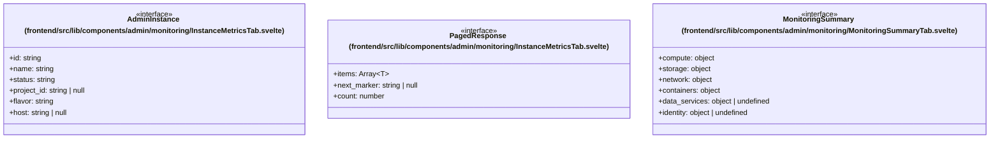

# `frontend/src/lib/components/admin/monitoring` 클래스 다이어그램

**대상 경로:** `frontend/src/lib/components/admin/monitoring`

## 책임
`frontend/src/lib/components/admin/monitoring`의 책임은 <<interface>>으로 표현되는 운영 타입 계약을 정의하는 것이다.
이 문서는 3개 source type과 0개 정적 관계를 1개 Mermaid class diagram으로 나누어 보여준다.

## 포함 파일
- `frontend/src/lib/components/admin/monitoring/InstanceMetricsTab.svelte`
- `frontend/src/lib/components/admin/monitoring/MonitoringSummaryTab.svelte`

## 다이어그램 1 — `frontend/src/lib/components/admin/monitoring/InstanceMetricsTab.svelte::AdminInstance` … `frontend/src/lib/components/admin/monitoring/MonitoringSummaryTab.svelte::MonitoringSummary`

### 관계 설명
- 없음

### 타입 표기 정규화
| Mermaid 표기 | 소스 표기 |
|---|---|
| `Array~T~` | `T[]` |
| `object` | `{ hypervisors_total: number; hypervisors_up: number; vcpus_used: number; vcpus_total: number; memory_used_mb: number; memory_total_mb: number; running_vms: number; gpu_instances: number; instance_stats: { total: number; active: number; shutoff: number; error: number; other: number }; }` |
| `object` | `{ volume_count: number; volume_by_status: Record<string, number>; total_gb: number; file_storage_count: number; volume_snapshot_count?: number; volume_backup_count?: number; share_snapshot_count?: number; image_count?: number; }` |
| `object` | `{ network_count: number; router_count: number; router_active: number; floatingip_count: number; floatingip_active: number; port_count: number; subnet_count?: number; security_group_count?: number; load_balancer_count?: number; load_balancer_active?: number; }` |
| `object` | `{ zun_count: number; k3s_count: number; k3s_active?: number; }` |
| `object` | `{ database_instance_count: number; }` |
| `object` | `{ user_count: number; project_count: number; }` |
