# `frontend/src/lib/components/admin/projects` 클래스 다이어그램

**대상 경로:** `frontend/src/lib/components/admin/projects`

## 책임
`frontend/src/lib/components/admin/projects`의 책임은 <<interface>>으로 표현되는 운영 타입 계약을 정의하는 것이다.
이 문서는 8개 source type과 0개 정적 관계를 1개 Mermaid class diagram으로 나누어 보여준다.

## 포함 파일
- `frontend/src/lib/components/admin/projects/AdminProjectAccessModal.svelte`
- `frontend/src/lib/components/admin/projects/AdminProjectDeleteModal.svelte`
- `frontend/src/lib/components/admin/projects/AdminProjectEditModal.svelte`
- `frontend/src/lib/components/admin/projects/AdminProjectTable.svelte`

## 다이어그램 1 — `frontend/src/lib/components/admin/projects/AdminProjectAccessModal.svelte::Group` … `frontend/src/lib/components/admin/projects/AdminProjectTable.svelte::Project`

```mermaid
classDiagram
%% source-type: frontend/src/lib/components/admin/projects/AdminProjectAccessModal.svelte::Group
class T_frontend_src_lib_components_admin_projects_AdminProjectAccessModal_svelte_Group_d9ff79d1222b["Group (frontend/src/lib/components/admin/projects/AdminProjectAccessModal.svelte)"] {
  <<interface>>
  +id: string
  +name: string
  +description: string
}
%% source-type: frontend/src/lib/components/admin/projects/AdminProjectAccessModal.svelte::Member
class T_frontend_src_lib_components_admin_projects_AdminProjectAccessModal_svelte_Member_89dce4b62bc5["Member (frontend/src/lib/components/admin/projects/AdminProjectAccessModal.svelte)"] {
  <<interface>>
  +user_id: string
  +user_name: string
  +role_id: string
  +role_name: string
  +type: 'user' | 'group' | undefined
  +group_id: string | undefined
}
%% source-type: frontend/src/lib/components/admin/projects/AdminProjectAccessModal.svelte::Project
class T_frontend_src_lib_components_admin_projects_AdminProjectAccessModal_svelte_Project_fce25bb43144["Project (frontend/src/lib/components/admin/projects/AdminProjectAccessModal.svelte)"] {
  <<interface>>
  +id: string
  +name: string
  +description: string
  +enabled: boolean
  +domain_id: string | null
  +created_at: string | null
}
%% source-type: frontend/src/lib/components/admin/projects/AdminProjectAccessModal.svelte::Role
class T_frontend_src_lib_components_admin_projects_AdminProjectAccessModal_svelte_Role_7c08cadccd6f["Role (frontend/src/lib/components/admin/projects/AdminProjectAccessModal.svelte)"] {
  <<interface>>
  +id: string
  +name: string
}
%% source-type: frontend/src/lib/components/admin/projects/AdminProjectAccessModal.svelte::User
class T_frontend_src_lib_components_admin_projects_AdminProjectAccessModal_svelte_User_21599b8a7c6e["User (frontend/src/lib/components/admin/projects/AdminProjectAccessModal.svelte)"] {
  <<interface>>
  +id: string
  +name: string
}
%% source-type: frontend/src/lib/components/admin/projects/AdminProjectDeleteModal.svelte::Project
class T_frontend_src_lib_components_admin_projects_AdminProjectDeleteModal_svelte_Project_49fd2206379f["Project (frontend/src/lib/components/admin/projects/AdminProjectDeleteModal.svelte)"] {
  <<interface>>
  +id: string
  +name: string
  +description: string
  +enabled: boolean
  +domain_id: string | null
  +created_at: string | null
}
%% source-type: frontend/src/lib/components/admin/projects/AdminProjectEditModal.svelte::Project
class T_frontend_src_lib_components_admin_projects_AdminProjectEditModal_svelte_Project_e23e95d7c84e["Project (frontend/src/lib/components/admin/projects/AdminProjectEditModal.svelte)"] {
  <<interface>>
  +id: string
  +name: string
  +description: string
  +enabled: boolean
  +domain_id: string | null
  +created_at: string | null
}
%% source-type: frontend/src/lib/components/admin/projects/AdminProjectTable.svelte::Project
class T_frontend_src_lib_components_admin_projects_AdminProjectTable_svelte_Project_2b0acd9e6d96["Project (frontend/src/lib/components/admin/projects/AdminProjectTable.svelte)"] {
  <<interface>>
  +id: string
  +name: string
  +description: string
  +enabled: boolean
  +domain_id: string | null
  +created_at: string | null
}
```

### 관계 설명
- 없음
