# `frontend/src/lib/components/admin/services` 클래스 다이어그램

**대상 경로:** `frontend/src/lib/components/admin/services`

## 책임
`frontend/src/lib/components/admin/services`의 책임은 <<interface>>, <<type alias>>으로 표현되는 운영 타입 계약을 정의하는 것이다.
이 문서는 6개 source type과 0개 정적 관계를 1개 Mermaid class diagram으로 나누어 보여준다.

## 포함 파일
- `frontend/src/lib/components/admin/services/EndpointsTable.svelte`
- `frontend/src/lib/components/admin/services/NetworkAgentTable.svelte`
- `frontend/src/lib/components/admin/services/ServiceTable.svelte`
- `frontend/src/lib/components/admin/services/ServiceTabs.svelte`
- `frontend/src/lib/components/admin/services/StoragePoolsList.svelte`
- `frontend/src/lib/components/admin/services/serviceColumns.ts`

## 다이어그램 1 — `frontend/src/lib/components/admin/services/EndpointsTable.svelte::EndpointGroup` … `frontend/src/lib/components/admin/services/serviceColumns.ts::ServiceColumn`

```mermaid
classDiagram
%% source-type: frontend/src/lib/components/admin/services/EndpointsTable.svelte::EndpointGroup
class T_frontend_src_lib_components_admin_services_EndpointsTable_svelte_EndpointGroup_2c63a35ed4b2["EndpointGroup (frontend/src/lib/components/admin/services/EndpointsTable.svelte)"] {
  <<interface>>
  +service_id: string
  +name: string
  +service: string
  +region: string
  +endpoints: Record~string; string~
}
%% source-type: frontend/src/lib/components/admin/services/NetworkAgentTable.svelte::NetworkAgent
class T_frontend_src_lib_components_admin_services_NetworkAgentTable_svelte_NetworkAgent_e25d91daf598["NetworkAgent (frontend/src/lib/components/admin/services/NetworkAgentTable.svelte)"] {
  <<interface>>
  +id: string
  +binary: string
  +host: string
  +agent_type: string
  +availability_zone: string | null
  +alive: boolean | null
  +admin_state_up: boolean
  +updated_at: string | null
}
%% source-type: frontend/src/lib/components/admin/services/ServiceTable.svelte::Service
class T_frontend_src_lib_components_admin_services_ServiceTable_svelte_Service_e6139379f63f["Service (frontend/src/lib/components/admin/services/ServiceTable.svelte)"] {
  <<interface>>
  +id: string
  +binary: string
  +host: string
  +status: string
  +state: string
  +zone: string
  +updated_at: string | null
  +disabled_reason: string | null
}
%% source-type: frontend/src/lib/components/admin/services/ServiceTabs.svelte::TabKey
class T_frontend_src_lib_components_admin_services_ServiceTabs_svelte_TabKey_7aca3c2680ba["TabKey (frontend/src/lib/components/admin/services/ServiceTabs.svelte)"] {
  <<type alias>>
  +value: 'compute' | 'network' | 'block_storage' | 'shared_file_system' | 'orchestration' | 'container' | 'container_infra' | 'endpoints' | 'storage_pools'
}
%% source-type: frontend/src/lib/components/admin/services/StoragePoolsList.svelte::StoragePool
class T_frontend_src_lib_components_admin_services_StoragePoolsList_svelte_StoragePool_de813f457e0a["StoragePool (frontend/src/lib/components/admin/services/StoragePoolsList.svelte)"] {
  <<interface>>
  +name: string
  +volume_backend_name: string
  +driver_version: string
  +storage_protocol: string
  +vendor_name: string
  +total_capacity_gb: number
  +free_capacity_gb: number
  +allocated_capacity_gb: number
}
%% source-type: frontend/src/lib/components/admin/services/serviceColumns.ts::ServiceColumn
class T_frontend_src_lib_components_admin_services_serviceColumns_ts_ServiceColumn_a8f5026e1171["ServiceColumn (frontend/src/lib/components/admin/services/serviceColumns.ts)"] {
  <<type alias>>
  +value: object | object | object | object | object | object | object
}
```

### 관계 설명
- 없음

### 타입 표기 정규화
| Mermaid 표기 | 소스 표기 |
|---|---|
| `Record~string; string~` | `Record<string, string>` |
| `object | object | object | object | object | object | object` | `| { type: 'binary'; label: string } | { type: 'host'; label: string } | { type: 'zone'; label: string } | { type: 'status'; label: string; mode: 'strict' | 'loose' } | { type: 'state'; label: string } | { type: 'disabledReason'; label: string } | { type: 'updated'; label: string }` |
