# `frontend/src/lib/components/admin/system-admins` 클래스 다이어그램

**대상 경로:** `frontend/src/lib/components/admin/system-admins`

## 책임
`frontend/src/lib/components/admin/system-admins`의 책임은 <<interface>>으로 표현되는 운영 타입 계약을 정의하는 것이다.
이 문서는 4개 source type과 0개 정적 관계를 1개 Mermaid class diagram으로 나누어 보여준다.

## 포함 파일
- `frontend/src/lib/components/admin/system-admins/MigrateModal.svelte`
- `frontend/src/lib/components/admin/system-admins/SecurityPolicyBanner.svelte`
- `frontend/src/lib/components/admin/system-admins/SystemAdminGrantModal.svelte`
- `frontend/src/lib/components/admin/system-admins/SystemAdminTable.svelte`

## 다이어그램 1 — `frontend/src/lib/components/admin/system-admins/MigrateModal.svelte::MigrateResult` … `frontend/src/lib/components/admin/system-admins/SystemAdminTable.svelte::SystemAdmin`

```mermaid
classDiagram
%% source-type: frontend/src/lib/components/admin/system-admins/MigrateModal.svelte::MigrateResult
class T_frontend_src_lib_components_admin_system_admins_MigrateModal_svelte_MigrateResult_b610417c64f6["MigrateResult (frontend/src/lib/components/admin/system-admins/MigrateModal.svelte)"] {
  <<interface>>
  +migrated: number
  +skipped: number
  +errors: Array~object~
}
%% source-type: frontend/src/lib/components/admin/system-admins/SecurityPolicyBanner.svelte::SecurityPolicy
class T_frontend_src_lib_components_admin_system_admins_SecurityPolicyBanner_svelte_SecurityPolicy_52980f365798["SecurityPolicy (frontend/src/lib/components/admin/system-admins/SecurityPolicyBanner.svelte)"] {
  <<interface>>
  +legacy_compat: boolean
  +system_admin_count: number
  +admin_project_member_count: number
}
%% source-type: frontend/src/lib/components/admin/system-admins/SystemAdminGrantModal.svelte::User
class T_frontend_src_lib_components_admin_system_admins_SystemAdminGrantModal_svelte_User_51afe1086adc["User (frontend/src/lib/components/admin/system-admins/SystemAdminGrantModal.svelte)"] {
  <<interface>>
  +id: string
  +name: string
  +email: string
  +enabled: boolean
}
%% source-type: frontend/src/lib/components/admin/system-admins/SystemAdminTable.svelte::SystemAdmin
class T_frontend_src_lib_components_admin_system_admins_SystemAdminTable_svelte_SystemAdmin_819903c18787["SystemAdmin (frontend/src/lib/components/admin/system-admins/SystemAdminTable.svelte)"] {
  <<interface>>
  +user_id: string
  +name: string
  +email: string
  +enabled: boolean
}
```

### 관계 설명
- 없음

### 타입 표기 정규화
| Mermaid 표기 | 소스 표기 |
|---|---|
| `Array~object~` | `{ user_id: string; reason: string }[]` |
