# `frontend/src/lib/components/admin/volumes` 클래스 다이어그램

**대상 경로:** `frontend/src/lib/components/admin/volumes`

## 책임
`frontend/src/lib/components/admin/volumes`의 책임은 <<interface>>으로 표현되는 운영 타입 계약을 정의하는 것이다.
이 문서는 8개 source type과 1개 정적 관계를 1개 Mermaid class diagram으로 나누어 보여준다.

## 포함 파일
- `frontend/src/lib/components/admin/volumes/AdminVolumeDeleteModal.svelte`
- `frontend/src/lib/components/admin/volumes/AdminVolumeEditModal.svelte`
- `frontend/src/lib/components/admin/volumes/AdminVolumeExtendModal.svelte`
- `frontend/src/lib/components/admin/volumes/AdminVolumeForceDeleteModal.svelte`
- `frontend/src/lib/components/admin/volumes/AdminVolumeResetStatusModal.svelte`
- `frontend/src/lib/components/admin/volumes/AdminVolumeStatusSummary.svelte`
- `frontend/src/lib/components/admin/volumes/AdminVolumeTable.svelte`
- `frontend/src/lib/components/admin/volumes/AdminVolumeTransferModal.svelte`

## 다이어그램 1 — `frontend/src/lib/components/admin/volumes/AdminVolumeDeleteModal.svelte::AdminVolume` … `frontend/src/lib/types/volume.ts::AdminVolumeStatusSummary`

```mermaid
classDiagram
%% source-type: frontend/src/lib/components/admin/volumes/AdminVolumeDeleteModal.svelte::AdminVolume
class T_frontend_src_lib_components_admin_volumes_AdminVolumeDeleteModal_svelte_AdminVolume_501cc51e2b5d["AdminVolume (frontend/src/lib/components/admin/volumes/AdminVolumeDeleteModal.svelte)"] {
  <<interface>>
  +id: string
  +name: string
  +status: string
  +size: number
  +project_id: string | null
  +created_at: string | null
  +bootable: boolean | undefined
}
%% source-type: frontend/src/lib/components/admin/volumes/AdminVolumeEditModal.svelte::AdminVolume
class T_frontend_src_lib_components_admin_volumes_AdminVolumeEditModal_svelte_AdminVolume_438a133ea153["AdminVolume (frontend/src/lib/components/admin/volumes/AdminVolumeEditModal.svelte)"] {
  <<interface>>
  +id: string
  +name: string
  +status: string
  +size: number
  +project_id: string | null
  +created_at: string | null
  +bootable: boolean | undefined
}
%% source-type: frontend/src/lib/components/admin/volumes/AdminVolumeExtendModal.svelte::AdminVolume
class T_frontend_src_lib_components_admin_volumes_AdminVolumeExtendModal_svelte_AdminVolume_b6b1f89557d0["AdminVolume (frontend/src/lib/components/admin/volumes/AdminVolumeExtendModal.svelte)"] {
  <<interface>>
  +id: string
  +name: string
  +status: string
  +size: number
  +project_id: string | null
  +created_at: string | null
  +bootable: boolean | undefined
}
%% source-type: frontend/src/lib/components/admin/volumes/AdminVolumeForceDeleteModal.svelte::AdminVolume
class T_frontend_src_lib_components_admin_volumes_AdminVolumeForceDeleteModal_svelte_AdminVolume_ee6c1d2bed91["AdminVolume (frontend/src/lib/components/admin/volumes/AdminVolumeForceDeleteModal.svelte)"] {
  <<interface>>
  +id: string
  +name: string
  +status: string
  +size: number
  +project_id: string | null
  +created_at: string | null
  +bootable: boolean | undefined
}
%% source-type: frontend/src/lib/components/admin/volumes/AdminVolumeResetStatusModal.svelte::AdminVolume
class T_frontend_src_lib_components_admin_volumes_AdminVolumeResetStatusModal_svelte_AdminVolume_7bd2a5615e04["AdminVolume (frontend/src/lib/components/admin/volumes/AdminVolumeResetStatusModal.svelte)"] {
  <<interface>>
  +id: string
  +name: string
  +status: string
  +size: number
  +project_id: string | null
  +created_at: string | null
  +bootable: boolean | undefined
}
%% source-type: frontend/src/lib/components/admin/volumes/AdminVolumeStatusSummary.svelte::Props
class T_frontend_src_lib_components_admin_volumes_AdminVolumeStatusSummary_svelte_Props_10409174174b["Props (frontend/src/lib/components/admin/volumes/AdminVolumeStatusSummary.svelte)"] {
  <<interface>>
  +summary: Summary | null
  +activeStatus: string
  +onSelect: Callable~status: string; returns void~
  +loading: boolean | undefined
}
%% source-type: frontend/src/lib/components/admin/volumes/AdminVolumeTable.svelte::AdminVolume
class T_frontend_src_lib_components_admin_volumes_AdminVolumeTable_svelte_AdminVolume_530d183efafd["AdminVolume (frontend/src/lib/components/admin/volumes/AdminVolumeTable.svelte)"] {
  <<interface>>
  +id: string
  +name: string
  +status: string
  +size: number
  +project_id: string | null
  +created_at: string | null
  +bootable: boolean | undefined
}
%% source-type: frontend/src/lib/components/admin/volumes/AdminVolumeTransferModal.svelte::AdminVolume
class T_frontend_src_lib_components_admin_volumes_AdminVolumeTransferModal_svelte_AdminVolume_c4e34f69f606["AdminVolume (frontend/src/lib/components/admin/volumes/AdminVolumeTransferModal.svelte)"] {
  <<interface>>
  +id: string
  +name: string
  +status: string
  +size: number
  +project_id: string | null
  +created_at: string | null
  +bootable: boolean | undefined
}
%% external-type: frontend/src/lib/types/volume.ts::AdminVolumeStatusSummary
class T_frontend_src_lib_types_volume_ts_AdminVolumeStatusSummary_2cc91b3a0779["AdminVolumeStatusSummary (../../../types/volume.ts)"] {
  <<external>>
}
T_frontend_src_lib_components_admin_volumes_AdminVolumeStatusSummary_svelte_Props_10409174174b --> T_frontend_src_lib_types_volume_ts_AdminVolumeStatusSummary_2cc91b3a0779 : associates
```

### 관계 설명
- `frontend/src/lib/components/admin/volumes/AdminVolumeStatusSummary.svelte::Props --> frontend/src/lib/types/volume.ts::AdminVolumeStatusSummary` — 근거: `frontend/src/lib/components/admin/volumes/AdminVolumeStatusSummary.svelte::Props.summary`; 관계: `associates`.

### 타입 표기 정규화
| Mermaid 표기 | 소스 표기 |
|---|---|
| `Callable~status: string; returns void~` | `(status: string) => void` |
