# `frontend/src/lib/components/dashboard` 클래스 다이어그램

**대상 경로:** `frontend/src/lib/components/dashboard`

## 책임
`frontend/src/lib/components/dashboard`의 책임은 <<interface>>, <<type alias>>으로 표현되는 운영 타입 계약을 정의하는 것이다.
이 문서는 10개 source type과 9개 정적 관계를 1개 Mermaid class diagram으로 나누어 보여준다.

## 포함 파일
- `frontend/src/lib/components/dashboard/TopologyCard.svelte`
- `frontend/src/lib/components/dashboard/overview/RangeToggle.svelte`

## 다이어그램 1 — `frontend/src/lib/components/dashboard/TopologyCard.svelte::SubnetDetail` … `frontend/src/lib/types/networks.ts::FloatingIpInfo`

```mermaid
classDiagram
%% source-type: frontend/src/lib/components/dashboard/TopologyCard.svelte::SubnetDetail
class T_frontend_src_lib_components_dashboard_TopologyCard_svelte_SubnetDetail_94214feee811["SubnetDetail (frontend/src/lib/components/dashboard/TopologyCard.svelte)"] {
  <<interface>>
  +id: string
  +name: string
  +cidr: string
  +gateway_ip: string | null
  +dhcp_enabled: boolean
}
%% source-type: frontend/src/lib/components/dashboard/TopologyCard.svelte::TopologyData
class T_frontend_src_lib_components_dashboard_TopologyCard_svelte_TopologyData_e71bc1ecef1b["TopologyData (frontend/src/lib/components/dashboard/TopologyCard.svelte)"] {
  <<interface>>
  +networks: Array~TopologyNetwork~
  +routers: Array~TopologyRouter~
  +instances: Array~TopologyInstance~
  +floating_ips: Array~FloatingIpInfo~
  +load_balancers: Array~TopologyLoadBalancer~ | undefined
}
%% source-type: frontend/src/lib/components/dashboard/TopologyCard.svelte::TopologyInstance
class T_frontend_src_lib_components_dashboard_TopologyCard_svelte_TopologyInstance_22a01d5829fb["TopologyInstance (frontend/src/lib/components/dashboard/TopologyCard.svelte)"] {
  <<interface>>
  +id: string
  +name: string
  +status: string
  +project_id: string | null | undefined
  +network_names: Array~string~
  +ip_addresses: Array~object~
}
%% source-type: frontend/src/lib/components/dashboard/TopologyCard.svelte::TopologyLBListener
class T_frontend_src_lib_components_dashboard_TopologyCard_svelte_TopologyLBListener_ffb4aadc30ec["TopologyLBListener (frontend/src/lib/components/dashboard/TopologyCard.svelte)"] {
  <<interface>>
  +id: string
  +name: string
  +protocol: string
  +protocol_port: number
  +default_pool_id: string | null
}
%% source-type: frontend/src/lib/components/dashboard/TopologyCard.svelte::TopologyLBMember
class T_frontend_src_lib_components_dashboard_TopologyCard_svelte_TopologyLBMember_99dd29869e4e["TopologyLBMember (frontend/src/lib/components/dashboard/TopologyCard.svelte)"] {
  <<interface>>
  +id: string
  +address: string
  +protocol_port: number
  +status: string
  +subnet_id: string | null
  +pool_id: string
  +server_id: string | null
}
%% source-type: frontend/src/lib/components/dashboard/TopologyCard.svelte::TopologyLoadBalancer
class T_frontend_src_lib_components_dashboard_TopologyCard_svelte_TopologyLoadBalancer_fa6bf5cae4e2["TopologyLoadBalancer (frontend/src/lib/components/dashboard/TopologyCard.svelte)"] {
  <<interface>>
  +id: string
  +name: string
  +vip_address: string | null
  +vip_port_id: string | null
  +vip_subnet_id: string | null
  +vip_network_id: string | null
  +provisioning_status: string
  +operating_status: string
  +project_id: string | null
  +listeners: Array~TopologyLBListener~
  +members: Array~TopologyLBMember~
}
%% source-type: frontend/src/lib/components/dashboard/TopologyCard.svelte::TopologyNetwork
class T_frontend_src_lib_components_dashboard_TopologyCard_svelte_TopologyNetwork_83702e2c600a["TopologyNetwork (frontend/src/lib/components/dashboard/TopologyCard.svelte)"] {
  <<interface>>
  +id: string
  +name: string
  +status: string
  +is_external: boolean
  +is_shared: boolean
  +project_id: string | null
  +subnet_details: Array~SubnetDetail~
}
%% source-type: frontend/src/lib/components/dashboard/TopologyCard.svelte::TopologyRouter
class T_frontend_src_lib_components_dashboard_TopologyCard_svelte_TopologyRouter_5bef05a7b0bc["TopologyRouter (frontend/src/lib/components/dashboard/TopologyCard.svelte)"] {
  <<interface>>
  +id: string
  +name: string
  +status: string
  +external_gateway_network_id: string | null
  +external_gateway_ips: Array~string~
  +interface_ips: Array~object~
  +is_distributed: boolean
  +is_ha: boolean
  +connected_subnet_ids: Array~string~
  +dvr_subnet_ids: Array~string~
  +project_id: string | null
}
%% source-type: frontend/src/lib/components/dashboard/overview/RangeToggle.svelte::Props
class T_frontend_src_lib_components_dashboard_overview_RangeToggle_svelte_Props_c4391bde51d3["Props (frontend/src/lib/components/dashboard/overview/RangeToggle.svelte)"] {
  <<interface>>
  +value: Range
  +onchange: Callable~range: Range; returns void~
}
%% source-type: frontend/src/lib/components/dashboard/overview/RangeToggle.svelte::Range
class T_frontend_src_lib_components_dashboard_overview_RangeToggle_svelte_Range_686a98103f25["Range (frontend/src/lib/components/dashboard/overview/RangeToggle.svelte)"] {
  <<type alias>>
  +value: '24h' | '7d' | '14d'
}
%% external-type: frontend/src/lib/types/networks.ts::FloatingIpInfo
class T_frontend_src_lib_types_networks_ts_FloatingIpInfo_4774747a8dd3["FloatingIpInfo (../../types/networks.ts)"] {
  <<external>>
}
T_frontend_src_lib_components_dashboard_TopologyCard_svelte_TopologyNetwork_83702e2c600a --> T_frontend_src_lib_components_dashboard_TopologyCard_svelte_SubnetDetail_94214feee811 : associates
T_frontend_src_lib_components_dashboard_TopologyCard_svelte_TopologyData_e71bc1ecef1b --> T_frontend_src_lib_components_dashboard_TopologyCard_svelte_TopologyInstance_22a01d5829fb : associates
T_frontend_src_lib_components_dashboard_TopologyCard_svelte_TopologyData_e71bc1ecef1b --> T_frontend_src_lib_components_dashboard_TopologyCard_svelte_TopologyLoadBalancer_fa6bf5cae4e2 : associates
T_frontend_src_lib_components_dashboard_TopologyCard_svelte_TopologyData_e71bc1ecef1b --> T_frontend_src_lib_components_dashboard_TopologyCard_svelte_TopologyNetwork_83702e2c600a : associates
T_frontend_src_lib_components_dashboard_TopologyCard_svelte_TopologyData_e71bc1ecef1b --> T_frontend_src_lib_components_dashboard_TopologyCard_svelte_TopologyRouter_5bef05a7b0bc : associates
T_frontend_src_lib_components_dashboard_TopologyCard_svelte_TopologyData_e71bc1ecef1b --> T_frontend_src_lib_types_networks_ts_FloatingIpInfo_4774747a8dd3 : associates
T_frontend_src_lib_components_dashboard_TopologyCard_svelte_TopologyLoadBalancer_fa6bf5cae4e2 --> T_frontend_src_lib_components_dashboard_TopologyCard_svelte_TopologyLBListener_ffb4aadc30ec : associates
T_frontend_src_lib_components_dashboard_TopologyCard_svelte_TopologyLoadBalancer_fa6bf5cae4e2 --> T_frontend_src_lib_components_dashboard_TopologyCard_svelte_TopologyLBMember_99dd29869e4e : associates
T_frontend_src_lib_components_dashboard_overview_RangeToggle_svelte_Props_c4391bde51d3 --> T_frontend_src_lib_components_dashboard_overview_RangeToggle_svelte_Range_686a98103f25 : associates
```

### 관계 설명
- `frontend/src/lib/components/dashboard/TopologyCard.svelte::TopologyNetwork --> frontend/src/lib/components/dashboard/TopologyCard.svelte::SubnetDetail` — 근거: `frontend/src/lib/components/dashboard/TopologyCard.svelte::TopologyNetwork.subnet_details`; 관계: `associates`.
- `frontend/src/lib/components/dashboard/TopologyCard.svelte::TopologyData --> frontend/src/lib/components/dashboard/TopologyCard.svelte::TopologyInstance` — 근거: `frontend/src/lib/components/dashboard/TopologyCard.svelte::TopologyData.instances`; 관계: `associates`.
- `frontend/src/lib/components/dashboard/TopologyCard.svelte::TopologyData --> frontend/src/lib/components/dashboard/TopologyCard.svelte::TopologyLoadBalancer` — 근거: `frontend/src/lib/components/dashboard/TopologyCard.svelte::TopologyData.load_balancers`; 관계: `associates`.
- `frontend/src/lib/components/dashboard/TopologyCard.svelte::TopologyData --> frontend/src/lib/components/dashboard/TopologyCard.svelte::TopologyNetwork` — 근거: `frontend/src/lib/components/dashboard/TopologyCard.svelte::TopologyData.networks`; 관계: `associates`.
- `frontend/src/lib/components/dashboard/TopologyCard.svelte::TopologyData --> frontend/src/lib/components/dashboard/TopologyCard.svelte::TopologyRouter` — 근거: `frontend/src/lib/components/dashboard/TopologyCard.svelte::TopologyData.routers`; 관계: `associates`.
- `frontend/src/lib/components/dashboard/TopologyCard.svelte::TopologyData --> frontend/src/lib/types/networks.ts::FloatingIpInfo` — 근거: `frontend/src/lib/components/dashboard/TopologyCard.svelte::TopologyData.floating_ips`; 관계: `associates`.
- `frontend/src/lib/components/dashboard/TopologyCard.svelte::TopologyLoadBalancer --> frontend/src/lib/components/dashboard/TopologyCard.svelte::TopologyLBListener` — 근거: `frontend/src/lib/components/dashboard/TopologyCard.svelte::TopologyLoadBalancer.listeners`; 관계: `associates`.
- `frontend/src/lib/components/dashboard/TopologyCard.svelte::TopologyLoadBalancer --> frontend/src/lib/components/dashboard/TopologyCard.svelte::TopologyLBMember` — 근거: `frontend/src/lib/components/dashboard/TopologyCard.svelte::TopologyLoadBalancer.members`; 관계: `associates`.
- `frontend/src/lib/components/dashboard/overview/RangeToggle.svelte::Props --> frontend/src/lib/components/dashboard/overview/RangeToggle.svelte::Range` — 근거: `frontend/src/lib/components/dashboard/overview/RangeToggle.svelte::Props.onchange`, `frontend/src/lib/components/dashboard/overview/RangeToggle.svelte::Props.value`; 관계: `associates`.

### 타입 표기 정규화
| Mermaid 표기 | 소스 표기 |
|---|---|
| `Array~TopologyNetwork~` | `TopologyNetwork[]` |
| `Array~TopologyRouter~` | `TopologyRouter[]` |
| `Array~TopologyInstance~` | `TopologyInstance[]` |
| `Array~FloatingIpInfo~` | `FloatingIpInfo[]` |
| `Array~TopologyLoadBalancer~` | `TopologyLoadBalancer[]` |
| `Array~string~` | `string[]` |
| `Array~object~` | `{ addr: string; type: string; network_name: string; network_id?: string | null }[]` |
| `Array~TopologyLBListener~` | `TopologyLBListener[]` |
| `Array~TopologyLBMember~` | `TopologyLBMember[]` |
| `Array~SubnetDetail~` | `SubnetDetail[]` |
| `Array~object~` | `{ ip_address: string; subnet_id: string }[]` |
| `Callable~range: Range; returns void~` | `(range: Range) => void` |
