# `frontend/src/lib/components/dashboard/containers/instances` 클래스 다이어그램

**대상 경로:** `frontend/src/lib/components/dashboard/containers/instances`

## 책임
`frontend/src/lib/components/dashboard/containers/instances`의 책임은 <<interface>>으로 표현되는 운영 타입 계약을 정의하는 것이다.
이 문서는 4개 source type과 4개 정적 관계를 1개 Mermaid class diagram으로 나누어 보여준다.

## 포함 파일
- `frontend/src/lib/components/dashboard/containers/instances/ContainerCreateModal.svelte`
- `frontend/src/lib/components/dashboard/containers/instances/ContainersTable.svelte`
- `frontend/src/lib/components/dashboard/containers/instances/ZunServiceBanner.svelte`

## 다이어그램 1 — `frontend/src/lib/components/dashboard/containers/instances/ContainerCreateModal.svelte::CreatePayload` … `frontend/src/lib/types/zunContainer.ts::ZunContainer`

```mermaid
classDiagram
%% source-type: frontend/src/lib/components/dashboard/containers/instances/ContainerCreateModal.svelte::CreatePayload
class T_frontend_src_lib_components_dashboard_containers_instances_ContainerCreateModal_svelte_CreatePayload_e10e3a68499f["CreatePayload (frontend/src/lib/components/dashboard/containers/instances/ContainerCreateModal.svelte)"] {
  <<interface>>
  +name: string
  +image: string
  +command: string
  +cpu: number
  +memory: string
  +environment: Array~EnvVar~
  +ports: Array~PortMapping~
}
%% source-type: frontend/src/lib/components/dashboard/containers/instances/ContainerCreateModal.svelte::Props
class T_frontend_src_lib_components_dashboard_containers_instances_ContainerCreateModal_svelte_Props_b63e112f5afd["Props (frontend/src/lib/components/dashboard/containers/instances/ContainerCreateModal.svelte)"] {
  <<interface>>
  +open: boolean
  +creating: boolean
  +error: string
  +onCreate: Callable~payload: CreatePayload; returns Promise~boolean~~
}
%% source-type: frontend/src/lib/components/dashboard/containers/instances/ContainersTable.svelte::Props
class T_frontend_src_lib_components_dashboard_containers_instances_ContainersTable_svelte_Props_efb0f7345c84["Props (frontend/src/lib/components/dashboard/containers/instances/ContainersTable.svelte)"] {
  <<interface>>
  +containers: Array~ZunContainer~
  +actionTarget: string | null
  +onStart: Callable~id: string; returns Promise~void~~
  +onStop: Callable~id: string; returns Promise~void~~
  +onDelete: Callable~id: string; name: string; returns Promise~void~~
}
%% source-type: frontend/src/lib/components/dashboard/containers/instances/ZunServiceBanner.svelte::Props
class T_frontend_src_lib_components_dashboard_containers_instances_ZunServiceBanner_svelte_Props_066899145b7a["Props (frontend/src/lib/components/dashboard/containers/instances/ZunServiceBanner.svelte)"] {
  <<interface>>
  +available: boolean
  +message: string | null
}
%% external-type: frontend/src/lib/types/zunContainer.ts::EnvVar
class T_frontend_src_lib_types_zunContainer_ts_EnvVar_a79b877b02b5["EnvVar (../../../../types/zunContainer.ts)"] {
  <<external>>
}
%% external-type: frontend/src/lib/types/zunContainer.ts::PortMapping
class T_frontend_src_lib_types_zunContainer_ts_PortMapping_3b34db1e1d91["PortMapping (../../../../types/zunContainer.ts)"] {
  <<external>>
}
%% external-type: frontend/src/lib/types/zunContainer.ts::ZunContainer
class T_frontend_src_lib_types_zunContainer_ts_ZunContainer_63b6e745e5a9["ZunContainer (../../../../types/zunContainer.ts)"] {
  <<external>>
}
T_frontend_src_lib_components_dashboard_containers_instances_ContainerCreateModal_svelte_CreatePayload_e10e3a68499f --> T_frontend_src_lib_types_zunContainer_ts_EnvVar_a79b877b02b5 : associates
T_frontend_src_lib_components_dashboard_containers_instances_ContainerCreateModal_svelte_CreatePayload_e10e3a68499f --> T_frontend_src_lib_types_zunContainer_ts_PortMapping_3b34db1e1d91 : associates
T_frontend_src_lib_components_dashboard_containers_instances_ContainerCreateModal_svelte_Props_b63e112f5afd --> T_frontend_src_lib_components_dashboard_containers_instances_ContainerCreateModal_svelte_CreatePayload_e10e3a68499f : associates
T_frontend_src_lib_components_dashboard_containers_instances_ContainersTable_svelte_Props_efb0f7345c84 --> T_frontend_src_lib_types_zunContainer_ts_ZunContainer_63b6e745e5a9 : associates
```

### 관계 설명
- `frontend/src/lib/components/dashboard/containers/instances/ContainerCreateModal.svelte::CreatePayload --> frontend/src/lib/types/zunContainer.ts::EnvVar` — 근거: `frontend/src/lib/components/dashboard/containers/instances/ContainerCreateModal.svelte::CreatePayload.environment`; 관계: `associates`.
- `frontend/src/lib/components/dashboard/containers/instances/ContainerCreateModal.svelte::CreatePayload --> frontend/src/lib/types/zunContainer.ts::PortMapping` — 근거: `frontend/src/lib/components/dashboard/containers/instances/ContainerCreateModal.svelte::CreatePayload.ports`; 관계: `associates`.
- `frontend/src/lib/components/dashboard/containers/instances/ContainerCreateModal.svelte::Props --> frontend/src/lib/components/dashboard/containers/instances/ContainerCreateModal.svelte::CreatePayload` — 근거: `frontend/src/lib/components/dashboard/containers/instances/ContainerCreateModal.svelte::Props.onCreate`; 관계: `associates`.
- `frontend/src/lib/components/dashboard/containers/instances/ContainersTable.svelte::Props --> frontend/src/lib/types/zunContainer.ts::ZunContainer` — 근거: `frontend/src/lib/components/dashboard/containers/instances/ContainersTable.svelte::Props.containers`; 관계: `associates`.

### 타입 표기 정규화
| Mermaid 표기 | 소스 표기 |
|---|---|
| `Array~EnvVar~` | `EnvVar[]` |
| `Array~PortMapping~` | `PortMapping[]` |
| `Callable~payload: CreatePayload; returns Promise~boolean~~` | `(payload: CreatePayload) => Promise<boolean>` |
| `Array~ZunContainer~` | `ZunContainer[]` |
| `Callable~id: string; returns Promise~void~~` | `(id: string) => Promise<void>` |
| `Callable~id: string; name: string; returns Promise~void~~` | `(id: string, name: string) => Promise<void>` |
