# `frontend/src/lib/components/dashboard/containers/instances/id` 클래스 다이어그램

**대상 경로:** `frontend/src/lib/components/dashboard/containers/instances/id`

## 책임
`frontend/src/lib/components/dashboard/containers/instances/id`의 책임은 <<interface>>으로 표현되는 운영 타입 계약을 정의하는 것이다.
이 문서는 4개 source type과 2개 정적 관계를 1개 Mermaid class diagram으로 나누어 보여준다.

## 포함 파일
- `frontend/src/lib/components/dashboard/containers/instances/id/ContainerDetailGrid.svelte`
- `frontend/src/lib/components/dashboard/containers/instances/id/ContainerDetailHeader.svelte`
- `frontend/src/lib/components/dashboard/containers/instances/id/ContainerLogsPanel.svelte`
- `frontend/src/lib/components/dashboard/containers/instances/id/ContainerTerminalPanel.svelte`

## 다이어그램 1 — `frontend/src/lib/components/dashboard/containers/instances/id/ContainerDetailGrid.svelte::Props` … `frontend/src/lib/types/zunContainer.ts::ZunContainerDetail`

```mermaid
classDiagram
%% source-type: frontend/src/lib/components/dashboard/containers/instances/id/ContainerDetailGrid.svelte::Props
class T_frontend_src_lib_components_dashboard_containers_instances_id_ContainerDetailGrid_svelte_Props_433a3e007555["Props (frontend/src/lib/components/dashboard/containers/instances/id/ContainerDetailGrid.svelte)"] {
  <<interface>>
  +container: ZunContainerDetail
}
%% source-type: frontend/src/lib/components/dashboard/containers/instances/id/ContainerDetailHeader.svelte::Props
class T_frontend_src_lib_components_dashboard_containers_instances_id_ContainerDetailHeader_svelte_Props_578a523dba74["Props (frontend/src/lib/components/dashboard/containers/instances/id/ContainerDetailHeader.svelte)"] {
  <<interface>>
  +container: ZunContainerDetail
  +actioning: boolean
  +terminalOpen: boolean
  +onOpenTerminal: Callable~; returns void~
  +onStart: Callable~; returns Promise~void~~
  +onStop: Callable~; returns Promise~void~~
  +onDelete: Callable~; returns Promise~void~~
  +onBack: Callable~; returns void~
}
%% source-type: frontend/src/lib/components/dashboard/containers/instances/id/ContainerLogsPanel.svelte::Props
class T_frontend_src_lib_components_dashboard_containers_instances_id_ContainerLogsPanel_svelte_Props_c75fc43b6555["Props (frontend/src/lib/components/dashboard/containers/instances/id/ContainerLogsPanel.svelte)"] {
  <<interface>>
  +logs: string
  +logsLoading: boolean
  +ar: ReturnType~typeof createAutoRefresh~
  +onManualRefresh: Callable~; returns void~
}
%% source-type: frontend/src/lib/components/dashboard/containers/instances/id/ContainerTerminalPanel.svelte::Props
class T_frontend_src_lib_components_dashboard_containers_instances_id_ContainerTerminalPanel_svelte_Props_9da8a67d19d2["Props (frontend/src/lib/components/dashboard/containers/instances/id/ContainerTerminalPanel.svelte)"] {
  <<interface>>
  +open: boolean
  +containerId: string
  +token: string | undefined
  +projectId: string | undefined
}
%% external-type: frontend/src/lib/types/zunContainer.ts::ZunContainerDetail
class T_frontend_src_lib_types_zunContainer_ts_ZunContainerDetail_6efa30794c49["ZunContainerDetail (../../../../../types/zunContainer.ts)"] {
  <<external>>
}
T_frontend_src_lib_components_dashboard_containers_instances_id_ContainerDetailGrid_svelte_Props_433a3e007555 --> T_frontend_src_lib_types_zunContainer_ts_ZunContainerDetail_6efa30794c49 : associates
T_frontend_src_lib_components_dashboard_containers_instances_id_ContainerDetailHeader_svelte_Props_578a523dba74 --> T_frontend_src_lib_types_zunContainer_ts_ZunContainerDetail_6efa30794c49 : associates
```

### 관계 설명
- `frontend/src/lib/components/dashboard/containers/instances/id/ContainerDetailGrid.svelte::Props --> frontend/src/lib/types/zunContainer.ts::ZunContainerDetail` — 근거: `frontend/src/lib/components/dashboard/containers/instances/id/ContainerDetailGrid.svelte::Props.container`; 관계: `associates`.
- `frontend/src/lib/components/dashboard/containers/instances/id/ContainerDetailHeader.svelte::Props --> frontend/src/lib/types/zunContainer.ts::ZunContainerDetail` — 근거: `frontend/src/lib/components/dashboard/containers/instances/id/ContainerDetailHeader.svelte::Props.container`; 관계: `associates`.

### 타입 표기 정규화
| Mermaid 표기 | 소스 표기 |
|---|---|
| `Callable~; returns void~` | `() => void` |
| `Callable~; returns Promise~void~~` | `() => Promise<void>` |
| `ReturnType~typeof createAutoRefresh~` | `ReturnType<typeof createAutoRefresh>` |
