# `frontend/src/lib/components/dashboard/library/id` 클래스 다이어그램

**대상 경로:** `frontend/src/lib/components/dashboard/library/id`

## 책임
`frontend/src/lib/components/dashboard/library/id`의 책임은 <<interface>>으로 표현되는 운영 타입 계약을 정의하는 것이다.
이 문서는 5개 source type과 3개 정적 관계를 1개 Mermaid class diagram으로 나누어 보여준다.

## 포함 파일
- `frontend/src/lib/components/dashboard/library/id/LayerAncestorChain.svelte`
- `frontend/src/lib/components/dashboard/library/id/LayerDependents.svelte`
- `frontend/src/lib/components/dashboard/library/id/LayerInfoCard.svelte`
- `frontend/src/lib/components/dashboard/library/id/LayerPackagesAccordion.svelte`
- `frontend/src/lib/components/dashboard/library/id/LayerRecipeAccordion.svelte`

## 다이어그램 1 — `frontend/src/lib/components/dashboard/library/id/LayerAncestorChain.svelte::Props` … `frontend/src/lib/types/layer.ts::LayerInfo`

```mermaid
classDiagram
%% source-type: frontend/src/lib/components/dashboard/library/id/LayerAncestorChain.svelte::Props
class T_frontend_src_lib_components_dashboard_library_id_LayerAncestorChain_svelte_Props_fee09ec8d93d["Props (frontend/src/lib/components/dashboard/library/id/LayerAncestorChain.svelte)"] {
  <<interface>>
  +ancestors: Array~LayerInfo~
  +currentLayerId: string
}
%% source-type: frontend/src/lib/components/dashboard/library/id/LayerDependents.svelte::Props
class T_frontend_src_lib_components_dashboard_library_id_LayerDependents_svelte_Props_6fa403853c52["Props (frontend/src/lib/components/dashboard/library/id/LayerDependents.svelte)"] {
  <<interface>>
  +dependents: Array~LayerInfo~
}
%% source-type: frontend/src/lib/components/dashboard/library/id/LayerInfoCard.svelte::Props
class T_frontend_src_lib_components_dashboard_library_id_LayerInfoCard_svelte_Props_76fbb5b6863c["Props (frontend/src/lib/components/dashboard/library/id/LayerInfoCard.svelte)"] {
  <<interface>>
  +layer: LayerInfo
  +isAdmin: boolean
  +sealing: boolean
  +deleting: boolean
  +onSeal: Callable~; returns Promise~void~~
  +onDelete: Callable~; returns Promise~void~~
}
%% source-type: frontend/src/lib/components/dashboard/library/id/LayerPackagesAccordion.svelte::Props
class T_frontend_src_lib_components_dashboard_library_id_LayerPackagesAccordion_svelte_Props_c04f66a4b98d["Props (frontend/src/lib/components/dashboard/library/id/LayerPackagesAccordion.svelte)"] {
  <<interface>>
  +packages: Record~string; unknown~
}
%% source-type: frontend/src/lib/components/dashboard/library/id/LayerRecipeAccordion.svelte::Props
class T_frontend_src_lib_components_dashboard_library_id_LayerRecipeAccordion_svelte_Props_cb58555efe84["Props (frontend/src/lib/components/dashboard/library/id/LayerRecipeAccordion.svelte)"] {
  <<interface>>
  +recipe: Record~string; unknown~
}
%% external-type: frontend/src/lib/types/layer.ts::LayerInfo
class T_frontend_src_lib_types_layer_ts_LayerInfo_27f0109d870a["LayerInfo (../../../../types/layer.ts)"] {
  <<external>>
}
T_frontend_src_lib_components_dashboard_library_id_LayerAncestorChain_svelte_Props_fee09ec8d93d --> T_frontend_src_lib_types_layer_ts_LayerInfo_27f0109d870a : associates
T_frontend_src_lib_components_dashboard_library_id_LayerDependents_svelte_Props_6fa403853c52 --> T_frontend_src_lib_types_layer_ts_LayerInfo_27f0109d870a : associates
T_frontend_src_lib_components_dashboard_library_id_LayerInfoCard_svelte_Props_76fbb5b6863c --> T_frontend_src_lib_types_layer_ts_LayerInfo_27f0109d870a : associates
```

### 관계 설명
- `frontend/src/lib/components/dashboard/library/id/LayerAncestorChain.svelte::Props --> frontend/src/lib/types/layer.ts::LayerInfo` — 근거: `frontend/src/lib/components/dashboard/library/id/LayerAncestorChain.svelte::Props.ancestors`; 관계: `associates`.
- `frontend/src/lib/components/dashboard/library/id/LayerDependents.svelte::Props --> frontend/src/lib/types/layer.ts::LayerInfo` — 근거: `frontend/src/lib/components/dashboard/library/id/LayerDependents.svelte::Props.dependents`; 관계: `associates`.
- `frontend/src/lib/components/dashboard/library/id/LayerInfoCard.svelte::Props --> frontend/src/lib/types/layer.ts::LayerInfo` — 근거: `frontend/src/lib/components/dashboard/library/id/LayerInfoCard.svelte::Props.layer`; 관계: `associates`.

### 타입 표기 정규화
| Mermaid 표기 | 소스 표기 |
|---|---|
| `Array~LayerInfo~` | `LayerInfo[]` |
| `Callable~; returns Promise~void~~` | `() => Promise<void>` |
| `Record~string; unknown~` | `Record<string, unknown>` |
