# `frontend/src/lib/components/dashboard/my-resources` 클래스 다이어그램

**대상 경로:** `frontend/src/lib/components/dashboard/my-resources`

## 책임
`frontend/src/lib/components/dashboard/my-resources`의 책임은 <<interface>>으로 표현되는 운영 타입 계약을 정의하는 것이다.
이 문서는 4개 source type과 4개 정적 관계를 1개 Mermaid class diagram으로 나누어 보여준다.

## 포함 파일
- `frontend/src/lib/components/dashboard/my-resources/InstancesPreviewCard.svelte`
- `frontend/src/lib/components/dashboard/my-resources/MyResourcesSummary.svelte`
- `frontend/src/lib/components/dashboard/my-resources/ProjectUsageTable.svelte`
- `frontend/src/lib/components/dashboard/my-resources/VolumesPreviewCard.svelte`

## 다이어그램 1 — `frontend/src/lib/components/dashboard/my-resources/InstancesPreviewCard.svelte::Props` … `frontend/src/lib/types/userDashboard.ts::VolumeItem`

```mermaid
classDiagram
%% source-type: frontend/src/lib/components/dashboard/my-resources/InstancesPreviewCard.svelte::Props
class T_frontend_src_lib_components_dashboard_my_resources_InstancesPreviewCard_svelte_Props_b6eb944ff729["Props (frontend/src/lib/components/dashboard/my-resources/InstancesPreviewCard.svelte)"] {
  <<interface>>
  +instances: Array~InstanceItem & object~
}
%% source-type: frontend/src/lib/components/dashboard/my-resources/MyResourcesSummary.svelte::Props
class T_frontend_src_lib_components_dashboard_my_resources_MyResourcesSummary_svelte_Props_f801759d37bd["Props (frontend/src/lib/components/dashboard/my-resources/MyResourcesSummary.svelte)"] {
  <<interface>>
  +totals: UserDashboardSummary 'totals'
}
%% source-type: frontend/src/lib/components/dashboard/my-resources/ProjectUsageTable.svelte::Props
class T_frontend_src_lib_components_dashboard_my_resources_ProjectUsageTable_svelte_Props_037b6dc02b62["Props (frontend/src/lib/components/dashboard/my-resources/ProjectUsageTable.svelte)"] {
  <<interface>>
  +projects: Array~ProjectData~
}
%% source-type: frontend/src/lib/components/dashboard/my-resources/VolumesPreviewCard.svelte::Props
class T_frontend_src_lib_components_dashboard_my_resources_VolumesPreviewCard_svelte_Props_afb291544de0["Props (frontend/src/lib/components/dashboard/my-resources/VolumesPreviewCard.svelte)"] {
  <<interface>>
  +volumes: Array~VolumeItem & object~
}
%% external-type: frontend/src/lib/types/userDashboard.ts::InstanceItem
class T_frontend_src_lib_types_userDashboard_ts_InstanceItem_a0d817f498af["InstanceItem (../../../types/userDashboard.ts)"] {
  <<external>>
}
%% external-type: frontend/src/lib/types/userDashboard.ts::ProjectData
class T_frontend_src_lib_types_userDashboard_ts_ProjectData_7c5be7628586["ProjectData (../../../types/userDashboard.ts)"] {
  <<external>>
}
%% external-type: frontend/src/lib/types/userDashboard.ts::UserDashboardSummary
class T_frontend_src_lib_types_userDashboard_ts_UserDashboardSummary_356411919e69["UserDashboardSummary (../../../types/userDashboard.ts)"] {
  <<external>>
}
%% external-type: frontend/src/lib/types/userDashboard.ts::VolumeItem
class T_frontend_src_lib_types_userDashboard_ts_VolumeItem_800132eddeb5["VolumeItem (../../../types/userDashboard.ts)"] {
  <<external>>
}
T_frontend_src_lib_components_dashboard_my_resources_InstancesPreviewCard_svelte_Props_b6eb944ff729 --> T_frontend_src_lib_types_userDashboard_ts_InstanceItem_a0d817f498af : associates
T_frontend_src_lib_components_dashboard_my_resources_MyResourcesSummary_svelte_Props_f801759d37bd --> T_frontend_src_lib_types_userDashboard_ts_UserDashboardSummary_356411919e69 : associates
T_frontend_src_lib_components_dashboard_my_resources_ProjectUsageTable_svelte_Props_037b6dc02b62 --> T_frontend_src_lib_types_userDashboard_ts_ProjectData_7c5be7628586 : associates
T_frontend_src_lib_components_dashboard_my_resources_VolumesPreviewCard_svelte_Props_afb291544de0 --> T_frontend_src_lib_types_userDashboard_ts_VolumeItem_800132eddeb5 : associates
```

### 관계 설명
- `frontend/src/lib/components/dashboard/my-resources/InstancesPreviewCard.svelte::Props --> frontend/src/lib/types/userDashboard.ts::InstanceItem` — 근거: `frontend/src/lib/components/dashboard/my-resources/InstancesPreviewCard.svelte::Props.instances`; 관계: `associates`.
- `frontend/src/lib/components/dashboard/my-resources/MyResourcesSummary.svelte::Props --> frontend/src/lib/types/userDashboard.ts::UserDashboardSummary` — 근거: `frontend/src/lib/components/dashboard/my-resources/MyResourcesSummary.svelte::Props.totals`; 관계: `associates`.
- `frontend/src/lib/components/dashboard/my-resources/ProjectUsageTable.svelte::Props --> frontend/src/lib/types/userDashboard.ts::ProjectData` — 근거: `frontend/src/lib/components/dashboard/my-resources/ProjectUsageTable.svelte::Props.projects`; 관계: `associates`.
- `frontend/src/lib/components/dashboard/my-resources/VolumesPreviewCard.svelte::Props --> frontend/src/lib/types/userDashboard.ts::VolumeItem` — 근거: `frontend/src/lib/components/dashboard/my-resources/VolumesPreviewCard.svelte::Props.volumes`; 관계: `associates`.

### 타입 표기 정규화
| Mermaid 표기 | 소스 표기 |
|---|---|
| `Array~InstanceItem & object~` | `(InstanceItem & { project: string })[]` |
| `UserDashboardSummary 'totals'` | `UserDashboardSummary['totals']` |
| `Array~ProjectData~` | `ProjectData[]` |
| `Array~VolumeItem & object~` | `(VolumeItem & { project: string })[]` |
