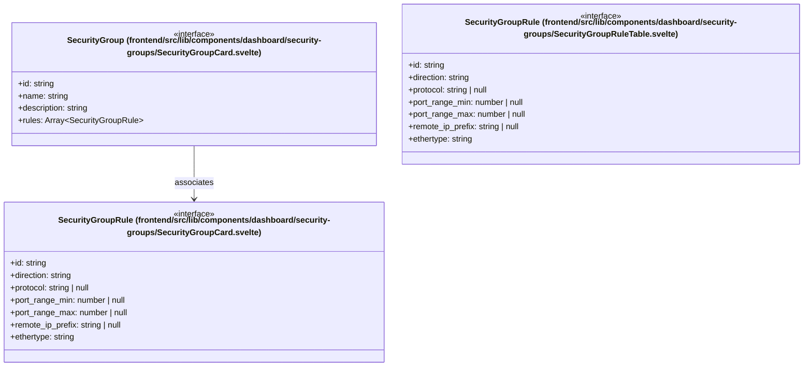

# `frontend/src/lib/components/dashboard/security-groups` 클래스 다이어그램

**대상 경로:** `frontend/src/lib/components/dashboard/security-groups`

## 책임
`frontend/src/lib/components/dashboard/security-groups`의 책임은 <<interface>>으로 표현되는 운영 타입 계약을 정의하는 것이다.
이 문서는 3개 source type과 1개 정적 관계를 1개 Mermaid class diagram으로 나누어 보여준다.

## 포함 파일
- `frontend/src/lib/components/dashboard/security-groups/SecurityGroupCard.svelte`
- `frontend/src/lib/components/dashboard/security-groups/SecurityGroupRuleTable.svelte`

## 다이어그램 1 — `frontend/src/lib/components/dashboard/security-groups/SecurityGroupCard.svelte::SecurityGroup` … `frontend/src/lib/components/dashboard/security-groups/SecurityGroupRuleTable.svelte::SecurityGroupRule`

### 관계 설명
- `frontend/src/lib/components/dashboard/security-groups/SecurityGroupCard.svelte::SecurityGroup --> frontend/src/lib/components/dashboard/security-groups/SecurityGroupCard.svelte::SecurityGroupRule` — 근거: `frontend/src/lib/components/dashboard/security-groups/SecurityGroupCard.svelte::SecurityGroup.rules`; 관계: `associates`.

### 타입 표기 정규화
| Mermaid 표기 | 소스 표기 |
|---|---|
| `Array~SecurityGroupRule~` | `SecurityGroupRule[]` |
