# `frontend/src/lib/components/database` 클래스 다이어그램

**대상 경로:** `frontend/src/lib/components/database`

## 책임
`frontend/src/lib/components/database`의 책임은 <<interface>>, <<type alias>>으로 표현되는 운영 타입 계약을 정의하는 것이다.
이 문서는 4개 source type과 2개 정적 관계를 1개 Mermaid class diagram으로 나누어 보여준다.

## 포함 파일
- `frontend/src/lib/components/database/DbBackupsSection.svelte`
- `frontend/src/lib/components/database/DbInstanceDetailPanel.svelte`
- `frontend/src/lib/components/database/DbInstanceHeader.svelte`
- `frontend/src/lib/components/database/DbRestoreModal.svelte`

## 다이어그램 1 — `frontend/src/lib/components/database/DbBackupsSection.svelte::Frequency` … `frontend/src/lib/types/database.ts::DbFlavor`

```mermaid
classDiagram
%% source-type: frontend/src/lib/components/database/DbBackupsSection.svelte::Frequency
class T_frontend_src_lib_components_database_DbBackupsSection_svelte_Frequency_d871d1ade6e9["Frequency (frontend/src/lib/components/database/DbBackupsSection.svelte)"] {
  <<type alias>>
  +value: 'daily' | 'weekly' | 'monthly'
}
%% source-type: frontend/src/lib/components/database/DbInstanceDetailPanel.svelte::Props
class T_frontend_src_lib_components_database_DbInstanceDetailPanel_svelte_Props_a9a118792107["Props (frontend/src/lib/components/database/DbInstanceDetailPanel.svelte)"] {
  <<interface>>
  +instanceId: string
  +token: string | undefined
  +projectId: string | undefined
  +onClose: Callable~; returns void~ | undefined
  +onDeleted: Callable~; returns void~ | undefined
}
%% source-type: frontend/src/lib/components/database/DbInstanceHeader.svelte::Props
class T_frontend_src_lib_components_database_DbInstanceHeader_svelte_Props_948c8f61ef05["Props (frontend/src/lib/components/database/DbInstanceHeader.svelte)"] {
  <<interface>>
  +onClose: Callable~; returns void~ | undefined
}
%% source-type: frontend/src/lib/components/database/DbRestoreModal.svelte::Props
class T_frontend_src_lib_components_database_DbRestoreModal_svelte_Props_722f00f0ed29["Props (frontend/src/lib/components/database/DbRestoreModal.svelte)"] {
  <<interface>>
  +open: boolean
  +backup: DbBackup | null
  +flavors: Array~DbFlavor~ | undefined
  +onRestore: Callable~backupId: string; name: string; flavorId: string; volumeSize: number; returns Promise~void~~
  +onClose: Callable~; returns void~
}
%% external-type: frontend/src/lib/types/database.ts::DbBackup
class T_frontend_src_lib_types_database_ts_DbBackup_534ca3c4c833["DbBackup (../../types/database.ts)"] {
  <<external>>
}
%% external-type: frontend/src/lib/types/database.ts::DbFlavor
class T_frontend_src_lib_types_database_ts_DbFlavor_3a80d7fe7e0d["DbFlavor (../../types/database.ts)"] {
  <<external>>
}
T_frontend_src_lib_components_database_DbRestoreModal_svelte_Props_722f00f0ed29 --> T_frontend_src_lib_types_database_ts_DbBackup_534ca3c4c833 : associates
T_frontend_src_lib_components_database_DbRestoreModal_svelte_Props_722f00f0ed29 --> T_frontend_src_lib_types_database_ts_DbFlavor_3a80d7fe7e0d : associates
```

### 관계 설명
- `frontend/src/lib/components/database/DbRestoreModal.svelte::Props --> frontend/src/lib/types/database.ts::DbBackup` — 근거: `frontend/src/lib/components/database/DbRestoreModal.svelte::Props.backup`; 관계: `associates`.
- `frontend/src/lib/components/database/DbRestoreModal.svelte::Props --> frontend/src/lib/types/database.ts::DbFlavor` — 근거: `frontend/src/lib/components/database/DbRestoreModal.svelte::Props.flavors`; 관계: `associates`.

### 타입 표기 정규화
| Mermaid 표기 | 소스 표기 |
|---|---|
| `Callable~; returns void~` | `() => void` |
| `Array~DbFlavor~` | `DbFlavor[]` |
| `Callable~backupId: string; name: string; flavorId: string; volumeSize: number; returns Promise~void~~` | `(backupId: string, name: string, flavorId: string, volumeSize: number) => Promise<void>` |
