# `frontend/src/lib/components/instance` 클래스 다이어그램

**대상 경로:** `frontend/src/lib/components/instance`

## 책임
`frontend/src/lib/components/instance`의 책임은 <<interface>>, <<type alias>>으로 표현되는 운영 타입 계약을 정의하는 것이다.
이 문서는 14개 source type과 2개 정적 관계를 1개 Mermaid class diagram으로 나누어 보여준다.

## 포함 파일
- `frontend/src/lib/components/instance/InstanceHeader.svelte`
- `frontend/src/lib/components/instance/MetricsPanel.svelte`
- `frontend/src/lib/components/instance/MigrateModal.svelte`
- `frontend/src/lib/components/instance/PasswordModal.svelte`
- `frontend/src/lib/components/instance/ResizeModal.svelte`
- `frontend/src/lib/components/instance/StorageAttachmentsSection.svelte`

## 다이어그램 1 — `frontend/src/lib/components/instance/InstanceHeader.svelte::Props` … `frontend/src/lib/components/instance/StorageAttachmentsSection.svelte::StorageAttachment`

```mermaid
classDiagram
%% source-type: frontend/src/lib/components/instance/InstanceHeader.svelte::Props
class T_frontend_src_lib_components_instance_InstanceHeader_svelte_Props_6237022f2dda["Props (frontend/src/lib/components/instance/InstanceHeader.svelte)"] {
  <<interface>>
  +adminProjectId: string | null
  +onOpenMigrateModal: Callable~type: 'live' | 'cold'; returns void~
  +onOpenPasswordModal: Callable~; returns void~
  +onOpenResizeModal: Callable~; returns void~
  +onOpenEvacuateModal: Callable~; returns void~
}
%% source-type: frontend/src/lib/components/instance/MetricsPanel.svelte::ChartSpec
class T_frontend_src_lib_components_instance_MetricsPanel_svelte_ChartSpec_b01a01807fd6["ChartSpec (frontend/src/lib/components/instance/MetricsPanel.svelte)"] {
  <<interface>>
  +key: MetricKey
  +title: string
  +color: string
  +unit: string
  +yMax: number | undefined
  +extraKey: MetricKey | undefined
  +extraColor: string | undefined
  +formatY: Callable~v: number; returns string~ | undefined
}
%% source-type: frontend/src/lib/components/instance/MetricsPanel.svelte::MetricKey
class T_frontend_src_lib_components_instance_MetricsPanel_svelte_MetricKey_ff5e83bc93f1["MetricKey (frontend/src/lib/components/instance/MetricsPanel.svelte)"] {
  <<type alias>>
  +value: 'cpu' | 'memory' | 'network_rx' | 'network_tx' | 'disk_read' | 'disk_write' | 'gpu_util' | 'gpu_mem'
}
%% source-type: frontend/src/lib/components/instance/MetricsPanel.svelte::MetricState
class T_frontend_src_lib_components_instance_MetricsPanel_svelte_MetricState_09ef583c9db5["MetricState (frontend/src/lib/components/instance/MetricsPanel.svelte)"] {
  <<type alias>>
  +data: Array~Series~ | null
  +error: string | null
}
%% source-type: frontend/src/lib/components/instance/MetricsPanel.svelte::Props
class T_frontend_src_lib_components_instance_MetricsPanel_svelte_Props_a841c5b72362["Props (frontend/src/lib/components/instance/MetricsPanel.svelte)"] {
  <<interface>>
  +instanceId: string
  +isGpu: boolean | undefined
}
%% source-type: frontend/src/lib/components/instance/MetricsPanel.svelte::RangeKey
class T_frontend_src_lib_components_instance_MetricsPanel_svelte_RangeKey_33ac38870e6d["RangeKey (frontend/src/lib/components/instance/MetricsPanel.svelte)"] {
  <<type alias>>
  +value: '15m' | '1h' | '6h' | '24h' | '7d'
}
%% source-type: frontend/src/lib/components/instance/MetricsPanel.svelte::Series
class T_frontend_src_lib_components_instance_MetricsPanel_svelte_Series_cded5445fdf2["Series (frontend/src/lib/components/instance/MetricsPanel.svelte)"] {
  <<interface>>
  +ts: number
  +value: number
}
%% source-type: frontend/src/lib/components/instance/MetricsPanel.svelte::StatInfo
class T_frontend_src_lib_components_instance_MetricsPanel_svelte_StatInfo_53b1eceaee36["StatInfo (frontend/src/lib/components/instance/MetricsPanel.svelte)"] {
  <<type alias>>
  +min: number | null
  +avg: number | null
  +max: number | null
}
%% source-type: frontend/src/lib/components/instance/MetricsPanel.svelte::TabKey
class T_frontend_src_lib_components_instance_MetricsPanel_svelte_TabKey_824d0242f85e["TabKey (frontend/src/lib/components/instance/MetricsPanel.svelte)"] {
  <<type alias>>
  +value: 'chart' | 'grafana'
}
%% source-type: frontend/src/lib/components/instance/MigrateModal.svelte::Props
class T_frontend_src_lib_components_instance_MigrateModal_svelte_Props_b9a0ada43458["Props (frontend/src/lib/components/instance/MigrateModal.svelte)"] {
  <<interface>>
  +type: 'live' | 'cold'
  +onClose: Callable~; returns void~
}
%% source-type: frontend/src/lib/components/instance/PasswordModal.svelte::Props
class T_frontend_src_lib_components_instance_PasswordModal_svelte_Props_1d1b1c11a069["Props (frontend/src/lib/components/instance/PasswordModal.svelte)"] {
  <<interface>>
  +onClose: Callable~; returns void~
}
%% source-type: frontend/src/lib/components/instance/ResizeModal.svelte::Props
class T_frontend_src_lib_components_instance_ResizeModal_svelte_Props_f7816476b9bc["Props (frontend/src/lib/components/instance/ResizeModal.svelte)"] {
  <<interface>>
  +onClose: Callable~; returns void~
  +preselectFlavorId: string | undefined
}
%% source-type: frontend/src/lib/components/instance/StorageAttachmentsSection.svelte::FileStorage
class T_frontend_src_lib_components_instance_StorageAttachmentsSection_svelte_FileStorage_adc6871943e0["FileStorage (frontend/src/lib/components/instance/StorageAttachmentsSection.svelte)"] {
  <<interface>>
  +id: string
  +name: string
  +status: string
  +share_proto: string
}
%% source-type: frontend/src/lib/components/instance/StorageAttachmentsSection.svelte::StorageAttachment
class T_frontend_src_lib_components_instance_StorageAttachmentsSection_svelte_StorageAttachment_a5547f936d0b["StorageAttachment (frontend/src/lib/components/instance/StorageAttachmentsSection.svelte)"] {
  <<interface>>
  +file_storage_id: string
  +name: string | null
  +share_proto: string | null
  +status: string
}
T_frontend_src_lib_components_instance_MetricsPanel_svelte_ChartSpec_b01a01807fd6 --> T_frontend_src_lib_components_instance_MetricsPanel_svelte_MetricKey_ff5e83bc93f1 : associates
T_frontend_src_lib_components_instance_MetricsPanel_svelte_MetricState_09ef583c9db5 --> T_frontend_src_lib_components_instance_MetricsPanel_svelte_Series_cded5445fdf2 : associates
```

### 관계 설명
- `frontend/src/lib/components/instance/MetricsPanel.svelte::ChartSpec --> frontend/src/lib/components/instance/MetricsPanel.svelte::MetricKey` — 근거: `frontend/src/lib/components/instance/MetricsPanel.svelte::ChartSpec.extraKey`, `frontend/src/lib/components/instance/MetricsPanel.svelte::ChartSpec.key`; 관계: `associates`.
- `frontend/src/lib/components/instance/MetricsPanel.svelte::MetricState --> frontend/src/lib/components/instance/MetricsPanel.svelte::Series` — 근거: `frontend/src/lib/components/instance/MetricsPanel.svelte::MetricState.data`; 관계: `associates`.

### 타입 표기 정규화
| Mermaid 표기 | 소스 표기 |
|---|---|
| `Callable~type: 'live' | 'cold'; returns void~` | `(type: 'live' | 'cold') => void` |
| `Callable~; returns void~` | `() => void` |
| `Callable~v: number; returns string~` | `(v: number) => string` |
| `Array~Series~ | null` | `Series[] | null` |
