# `frontend/src/lib/components/k3s` 클래스 다이어그램

**대상 경로:** `frontend/src/lib/components/k3s`

## 책임
`frontend/src/lib/components/k3s`의 책임은 <<interface>>, <<type alias>>으로 표현되는 운영 타입 계약을 정의하는 것이다.
이 문서는 9개 source type과 2개 정적 관계를 1개 Mermaid class diagram으로 나누어 보여준다.

## 포함 파일
- `frontend/src/lib/components/k3s/K3sCertificateExpiryModal.svelte`
- `frontend/src/lib/components/k3s/K3sPodLogOverlay.svelte`
- `frontend/src/lib/components/k3s/K3sResourceEditor.svelte`
- `frontend/src/lib/components/k3s/K3sRotateProgressModal.svelte`
- `frontend/src/lib/components/k3s/K3sScaleModal.svelte`
- `frontend/src/lib/components/k3s/K3sStampedeTab.svelte`
- `frontend/src/lib/components/k3s/K3sYamlView.svelte`

## 다이어그램 1 — `frontend/src/lib/components/k3s/K3sCertificateExpiryModal.svelte::Props` … `frontend/src/lib/utils/k8sYaml.ts::MaskedKey`

```mermaid
classDiagram
%% source-type: frontend/src/lib/components/k3s/K3sCertificateExpiryModal.svelte::Props
class T_frontend_src_lib_components_k3s_K3sCertificateExpiryModal_svelte_Props_09bf02df8e22["Props (frontend/src/lib/components/k3s/K3sCertificateExpiryModal.svelte)"] {
  <<interface>>
  +clusterId: string
  +clusterName: string
  +masterCount: number | undefined
  +token: string | undefined
  +projectId: string | undefined
  +onclose: Callable~; returns void~
}
%% source-type: frontend/src/lib/components/k3s/K3sPodLogOverlay.svelte::Props
class T_frontend_src_lib_components_k3s_K3sPodLogOverlay_svelte_Props_15fe466a7933["Props (frontend/src/lib/components/k3s/K3sPodLogOverlay.svelte)"] {
  <<interface>>
  +pod: PodInfo
  +onClose: Callable~; returns void~
}
%% source-type: frontend/src/lib/components/k3s/K3sResourceEditor.svelte::Props
class T_frontend_src_lib_components_k3s_K3sResourceEditor_svelte_Props_261569e321b9["Props (frontend/src/lib/components/k3s/K3sResourceEditor.svelte)"] {
  <<interface>>
  +title: string
  +mode: 'configmap' | 'secret' | undefined
  +resourceName: string | undefined
  +namespace: string | undefined
  +secretType: string | undefined
  +initialData: Record~string; string~ | undefined
  +onSave: Callable~data: Record~string; string~; returns Promise~void~~
  +onClose: Callable~; returns void~
  +saving: boolean | undefined
}
%% source-type: frontend/src/lib/components/k3s/K3sRotateProgressModal.svelte::ProgressMsg
class T_frontend_src_lib_components_k3s_K3sRotateProgressModal_svelte_ProgressMsg_b40b215e7fa1["ProgressMsg (frontend/src/lib/components/k3s/K3sRotateProgressModal.svelte)"] {
  <<interface>>
  +step: string
  +progress: number
  +message: string
  +cluster_id: string | undefined
  +error: string | undefined
  +elapsed_seconds: number | undefined
}
%% source-type: frontend/src/lib/components/k3s/K3sRotateProgressModal.svelte::Props
class T_frontend_src_lib_components_k3s_K3sRotateProgressModal_svelte_Props_c5d1d20b028f["Props (frontend/src/lib/components/k3s/K3sRotateProgressModal.svelte)"] {
  <<interface>>
  +clusterId: string
  +clusterName: string
  +token: string | undefined
  +projectId: string | undefined
  +onclose: Callable~; returns void~
}
%% source-type: frontend/src/lib/components/k3s/K3sScaleModal.svelte::Props
class T_frontend_src_lib_components_k3s_K3sScaleModal_svelte_Props_252b06f7012c["Props (frontend/src/lib/components/k3s/K3sScaleModal.svelte)"] {
  <<interface>>
  +deploymentName: string
  +currentReplicas: number
  +onClose: Callable~; returns void~
  +onApply: Callable~replicas: number; returns Promise~void~~
}
%% source-type: frontend/src/lib/components/k3s/K3sStampedeTab.svelte::StampedeEvent
class T_frontend_src_lib_components_k3s_K3sStampedeTab_svelte_StampedeEvent_9dadf8c383cb["StampedeEvent (frontend/src/lib/components/k3s/K3sStampedeTab.svelte)"] {
  <<interface>>
  +id: number
  +created_at: string | null
  +action: string
  +status: string
  +nodegroup_id: string | null
  +extra: Record~string; unknown~
}
%% source-type: frontend/src/lib/components/k3s/K3sYamlView.svelte::ParsedLine
class T_frontend_src_lib_components_k3s_K3sYamlView_svelte_ParsedLine_507e591066c9["ParsedLine (frontend/src/lib/components/k3s/K3sYamlView.svelte)"] {
  <<type alias>>
  +value: object | object
}
%% source-type: frontend/src/lib/components/k3s/K3sYamlView.svelte::Props
class T_frontend_src_lib_components_k3s_K3sYamlView_svelte_Props_14b38db7c5d8["Props (frontend/src/lib/components/k3s/K3sYamlView.svelte)"] {
  <<interface>>
  +text: string
  +maskedKeys: Array~MaskedKey~ | undefined
}
%% external-type: frontend/src/lib/types/k3s.ts::PodInfo
class T_frontend_src_lib_types_k3s_ts_PodInfo_9ad89b62ff13["PodInfo (../../types/k3s.ts)"] {
  <<external>>
}
%% external-type: frontend/src/lib/utils/k8sYaml.ts::MaskedKey
class T_frontend_src_lib_utils_k8sYaml_ts_MaskedKey_406f47bb54c1["MaskedKey (../../utils/k8sYaml.ts)"] {
  <<external>>
}
T_frontend_src_lib_components_k3s_K3sPodLogOverlay_svelte_Props_15fe466a7933 --> T_frontend_src_lib_types_k3s_ts_PodInfo_9ad89b62ff13 : associates
T_frontend_src_lib_components_k3s_K3sYamlView_svelte_Props_14b38db7c5d8 --> T_frontend_src_lib_utils_k8sYaml_ts_MaskedKey_406f47bb54c1 : associates
```

### 관계 설명
- `frontend/src/lib/components/k3s/K3sPodLogOverlay.svelte::Props --> frontend/src/lib/types/k3s.ts::PodInfo` — 근거: `frontend/src/lib/components/k3s/K3sPodLogOverlay.svelte::Props.pod`; 관계: `associates`.
- `frontend/src/lib/components/k3s/K3sYamlView.svelte::Props --> frontend/src/lib/utils/k8sYaml.ts::MaskedKey` — 근거: `frontend/src/lib/components/k3s/K3sYamlView.svelte::Props.maskedKeys`; 관계: `associates`.

### 타입 표기 정규화
| Mermaid 표기 | 소스 표기 |
|---|---|
| `Callable~; returns void~` | `() => void` |
| `Record~string; string~` | `Record<string, string>` |
| `Callable~data: Record~string; string~; returns Promise~void~~` | `(data: Record<string, string>) => Promise<void>` |
| `Callable~replicas: number; returns Promise~void~~` | `(replicas: number) => Promise<void>` |
| `Record~string; unknown~` | `Record<string, unknown>` |
| `object | object` | `| { kind: 'plain'; text: string } | { kind: 'masked'; prefix: string; key: string; value: string }` |
| `Array~MaskedKey~` | `MaskedKey[]` |
