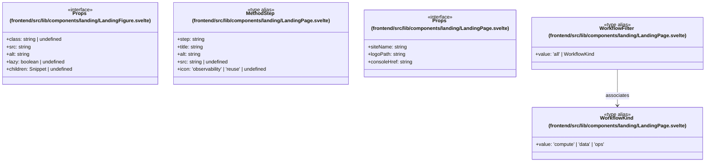

# `frontend/src/lib/components/landing` 클래스 다이어그램

**대상 경로:** `frontend/src/lib/components/landing`

## 책임
`frontend/src/lib/components/landing`의 책임은 <<interface>>, <<type alias>>으로 표현되는 운영 타입 계약을 정의하는 것이다.
이 문서는 5개 source type과 1개 정적 관계를 1개 Mermaid class diagram으로 나누어 보여준다.

## 포함 파일
- `frontend/src/lib/components/landing/LandingFigure.svelte`
- `frontend/src/lib/components/landing/LandingPage.svelte`

## 다이어그램 1 — `frontend/src/lib/components/landing/LandingFigure.svelte::Props` … `frontend/src/lib/components/landing/LandingPage.svelte::WorkflowKind`

### 관계 설명
- `frontend/src/lib/components/landing/LandingPage.svelte::WorkflowFilter --> frontend/src/lib/components/landing/LandingPage.svelte::WorkflowKind` — 근거: `frontend/src/lib/components/landing/LandingPage.svelte::WorkflowFilter.value`; 관계: `associates`.
