# `frontend/src/lib/components/topology` 클래스 다이어그램

**대상 경로:** `frontend/src/lib/components/topology`

## 책임
`frontend/src/lib/components/topology`의 책임은 <<interface>>, <<type alias>>으로 표현되는 운영 타입 계약을 정의하는 것이다.
이 문서는 24개 source type과 16개 정적 관계를 1개 Mermaid class diagram으로 나누어 보여준다.

## 포함 파일
- `frontend/src/lib/components/topology/ConnectionOverlay.svelte`
- `frontend/src/lib/components/topology/NetworkLane.svelte`
- `frontend/src/lib/components/topology/ResourceCard.svelte`
- `frontend/src/lib/components/topology/topologyDerivedController.svelte.ts`
- `frontend/src/lib/components/topology/types.ts`

## 다이어그램 1 — `frontend/src/lib/components/topology/ConnectionOverlay.svelte::AnchorPos` … `frontend/src/lib/types/networks.ts::FloatingIpInfo`

```mermaid
classDiagram
%% source-type: frontend/src/lib/components/topology/ConnectionOverlay.svelte::AnchorPos
class T_frontend_src_lib_components_topology_ConnectionOverlay_svelte_AnchorPos_4a325c11d144["AnchorPos (frontend/src/lib/components/topology/ConnectionOverlay.svelte)"] {
  <<interface>>
  +x: number
  +y: number
}
%% source-type: frontend/src/lib/components/topology/ConnectionOverlay.svelte::ConnectionSpec
class T_frontend_src_lib_components_topology_ConnectionOverlay_svelte_ConnectionSpec_0a2084628e66["ConnectionSpec (frontend/src/lib/components/topology/ConnectionOverlay.svelte)"] {
  <<interface>>
  +key: string
  +netId: string
  +color: string
  +opacity: number
  +width: number
}
%% source-type: frontend/src/lib/components/topology/ConnectionOverlay.svelte::LBCurve
class T_frontend_src_lib_components_topology_ConnectionOverlay_svelte_LBCurve_dca23acf43b2["LBCurve (frontend/src/lib/components/topology/ConnectionOverlay.svelte)"] {
  <<interface>>
  +key: string
  +x1: number
  +y1: number
  +x2: number
  +y2: number
}
%% source-type: frontend/src/lib/components/topology/ConnectionOverlay.svelte::Line
class T_frontend_src_lib_components_topology_ConnectionOverlay_svelte_Line_bbfae294d2a5["Line (frontend/src/lib/components/topology/ConnectionOverlay.svelte)"] {
  <<interface>>
  +x1: number
  +y1: number
  +x2: number
  +y2: number
  +color: string
  +opacity: number
  +width: number
  +key: string
}
%% source-type: frontend/src/lib/components/topology/ConnectionOverlay.svelte::Props
class T_frontend_src_lib_components_topology_ConnectionOverlay_svelte_Props_5b0c78b5d5e3["Props (frontend/src/lib/components/topology/ConnectionOverlay.svelte)"] {
  <<interface>>
  +width: number
  +height: number
  +connections: Array~ConnectionSpec~
  +laneXMap: Map~string; number~
  +anchors: Map~string; AnchorPos~
  +lbCurves: Array~LBCurve~
  +selectedKey: string | null
  +hoveredKey: string | null
}
%% source-type: frontend/src/lib/components/topology/NetworkLane.svelte::Props
class T_frontend_src_lib_components_topology_NetworkLane_svelte_Props_756a414b8d7a["Props (frontend/src/lib/components/topology/NetworkLane.svelte)"] {
  <<interface>>
  +net: TopologyNetwork
  +color: string
  +traffic: TopologyTraffic | null | undefined
  +highlighted: boolean
  +dimmed: boolean
  +laneHeight: number
  +mode: 'card' | 'rail' | 'full' | undefined
  +onSelect: Callable~; returns void~ | undefined
}
%% source-type: frontend/src/lib/components/topology/ResourceCard.svelte::Props
class T_frontend_src_lib_components_topology_ResourceCard_svelte_Props_f8b6c1b9cb88["Props (frontend/src/lib/components/topology/ResourceCard.svelte)"] {
  <<interface>>
  +row: ItemRow | null | undefined
  +lbItem: LBItem | null | undefined
  +netColors: Map~string; string~
  +instNetBps: Map~string; object~
  +selected: boolean
  +onSelect: Callable~; returns void~
}
%% source-type: frontend/src/lib/components/topology/topologyDerivedController.svelte.ts::ConnectionSpec
class T_frontend_src_lib_components_topology_topologyDerivedController_svelte_ts_ConnectionSpec_702edc84ed11["ConnectionSpec (frontend/src/lib/components/topology/topologyDerivedController.svelte.ts)"] {
  <<interface>>
  +key: string
  +netId: string
  +color: string
  +opacity: number
  +width: number
}
%% source-type: frontend/src/lib/components/topology/topologyDerivedController.svelte.ts::LBCurve
class T_frontend_src_lib_components_topology_topologyDerivedController_svelte_ts_LBCurve_2a868249ff3d["LBCurve (frontend/src/lib/components/topology/topologyDerivedController.svelte.ts)"] {
  <<interface>>
  +key: string
  +x1: number
  +y1: number
  +x2: number
  +y2: number
}
%% source-type: frontend/src/lib/components/topology/topologyDerivedController.svelte.ts::TopologyDerivedController
class T_frontend_src_lib_components_topology_topologyDerivedController_svelte_ts_TopologyDerivedController_086195a4edda["TopologyDerivedController (frontend/src/lib/components/topology/topologyDerivedController.svelte.ts)"] {
  <<type alias>>
  +value: ReturnType~typeof createTopologyDerivedController~
}
%% source-type: frontend/src/lib/components/topology/topologyDerivedController.svelte.ts::TopologyDerivedControllerOpts
class T_frontend_src_lib_components_topology_topologyDerivedController_svelte_ts_TopologyDerivedControllerOpts_d48eb3a5b0e6["TopologyDerivedControllerOpts (frontend/src/lib/components/topology/topologyDerivedController.svelte.ts)"] {
  <<interface>>
  +data: Callable~; returns TopologyData~
  +projectId: Callable~; returns string | null | undefined~
  +showAll: Callable~; returns boolean~
  +traffic: Callable~; returns TopologyTraffic | null~
  +selectedId: Callable~; returns string | null~
  +hoveredId: Callable~; returns string | null~
  +anchors: Callable~; returns Map~string; Anchor~~
  +sidebarHeight: Callable~; returns number~
  +searchTerm: Callable~; returns string~
}
%% source-type: frontend/src/lib/components/topology/types.ts::Anchor
class T_frontend_src_lib_components_topology_types_ts_Anchor_2557394470ce["Anchor (frontend/src/lib/components/topology/types.ts)"] {
  <<interface>>
  +x: number
  +y: number
}
%% source-type: frontend/src/lib/components/topology/types.ts::ItemRow
class T_frontend_src_lib_components_topology_types_ts_ItemRow_2868403d14d9["ItemRow (frontend/src/lib/components/topology/types.ts)"] {
  <<interface>>
  +type: 'router' | 'instance'
  +id: string
  +name: string
  +status: string
  +connectedNetIds: Array~string~
  +netIps: Map~string; Array~string~~
  +floatingNetIps: Map~string; Array~string~~
  +leftIdx: number
  +rightIdx: number
}
%% source-type: frontend/src/lib/components/topology/types.ts::LBItem
class T_frontend_src_lib_components_topology_types_ts_LBItem_0c7dd47954a8["LBItem (frontend/src/lib/components/topology/types.ts)"] {
  <<interface>>
  +lb: TopologyLoadBalancer
  +vipNetId: string | null
}
%% source-type: frontend/src/lib/components/topology/types.ts::SubnetDetail
class T_frontend_src_lib_components_topology_types_ts_SubnetDetail_1bed91a4fc9f["SubnetDetail (frontend/src/lib/components/topology/types.ts)"] {
  <<interface>>
  +id: string
  +name: string
  +cidr: string
  +gateway_ip: string | null
  +dhcp_enabled: boolean
}
%% source-type: frontend/src/lib/components/topology/types.ts::TopologyData
class T_frontend_src_lib_components_topology_types_ts_TopologyData_eb0e89047d14["TopologyData (frontend/src/lib/components/topology/types.ts)"] {
  <<interface>>
  +networks: Array~TopologyNetwork~
  +routers: Array~TopologyRouter~
  +instances: Array~TopologyInstance~
  +floating_ips: Array~FloatingIpInfo~
  +load_balancers: Array~TopologyLoadBalancer~ | undefined
}
%% source-type: frontend/src/lib/components/topology/types.ts::TopologyInstance
class T_frontend_src_lib_components_topology_types_ts_TopologyInstance_5a8183010647["TopologyInstance (frontend/src/lib/components/topology/types.ts)"] {
  <<interface>>
  +id: string
  +name: string
  +status: string
  +project_id: string | null | undefined
  +network_names: Array~string~
  +ip_addresses: Array~object~
}
%% source-type: frontend/src/lib/components/topology/types.ts::TopologyLBListener
class T_frontend_src_lib_components_topology_types_ts_TopologyLBListener_1726bc67752b["TopologyLBListener (frontend/src/lib/components/topology/types.ts)"] {
  <<interface>>
  +id: string
  +name: string
  +protocol: string
  +protocol_port: number
  +default_pool_id: string | null
}
%% source-type: frontend/src/lib/components/topology/types.ts::TopologyLBMember
class T_frontend_src_lib_components_topology_types_ts_TopologyLBMember_105e1b9c0e21["TopologyLBMember (frontend/src/lib/components/topology/types.ts)"] {
  <<interface>>
  +id: string
  +address: string
  +protocol_port: number
  +status: string
  +subnet_id: string | null
  +pool_id: string
  +server_id: string | null
}
%% source-type: frontend/src/lib/components/topology/types.ts::TopologyLoadBalancer
class T_frontend_src_lib_components_topology_types_ts_TopologyLoadBalancer_ec5e60e51b46["TopologyLoadBalancer (frontend/src/lib/components/topology/types.ts)"] {
  <<interface>>
  +id: string
  +name: string
  +vip_address: string | null
  +vip_port_id: string | null
  +vip_subnet_id: string | null
  +vip_network_id: string | null
  +provisioning_status: string
  +operating_status: string
  +project_id: string | null
  +listeners: Array~TopologyLBListener~
  +members: Array~TopologyLBMember~
}
%% source-type: frontend/src/lib/components/topology/types.ts::TopologyNetwork
class T_frontend_src_lib_components_topology_types_ts_TopologyNetwork_aad57832849d["TopologyNetwork (frontend/src/lib/components/topology/types.ts)"] {
  <<interface>>
  +id: string
  +name: string
  +status: string
  +is_external: boolean
  +is_shared: boolean
  +project_id: string | null
  +subnet_details: Array~SubnetDetail~
}
%% source-type: frontend/src/lib/components/topology/types.ts::TopologyRouter
class T_frontend_src_lib_components_topology_types_ts_TopologyRouter_cef9da86bacd["TopologyRouter (frontend/src/lib/components/topology/types.ts)"] {
  <<interface>>
  +id: string
  +name: string
  +status: string
  +external_gateway_network_id: string | null
  +external_gateway_ips: Array~string~
  +interface_ips: Array~object~
  +is_distributed: boolean
  +is_ha: boolean
  +connected_subnet_ids: Array~string~
  +dvr_subnet_ids: Array~string~
  +project_id: string | null
}
%% source-type: frontend/src/lib/components/topology/types.ts::TopologyTraffic
class T_frontend_src_lib_components_topology_types_ts_TopologyTraffic_086ef64896ea["TopologyTraffic (frontend/src/lib/components/topology/types.ts)"] {
  <<interface>>
  +ts: number
  +instances: Record~string; TrafficRate~
  +networks: Record~string; TrafficRate~
  +routers: Record~string; TrafficRate~
  +load_balancers: Record~string; TrafficRate~
  +interfaces: Record~string; object~ | undefined
  +_meta: object | undefined
}
%% source-type: frontend/src/lib/components/topology/types.ts::TrafficRate
class T_frontend_src_lib_components_topology_types_ts_TrafficRate_54908fba0ad6["TrafficRate (frontend/src/lib/components/topology/types.ts)"] {
  <<interface>>
  +rx_bps: number
  +tx_bps: number
}
%% external-type: frontend/src/lib/types/networks.ts::FloatingIpInfo
class T_frontend_src_lib_types_networks_ts_FloatingIpInfo_4774747a8dd3["FloatingIpInfo (../../types/networks.ts)"] {
  <<external>>
}
T_frontend_src_lib_components_topology_ConnectionOverlay_svelte_Props_5b0c78b5d5e3 --> T_frontend_src_lib_components_topology_ConnectionOverlay_svelte_AnchorPos_4a325c11d144 : associates
T_frontend_src_lib_components_topology_ConnectionOverlay_svelte_Props_5b0c78b5d5e3 --> T_frontend_src_lib_components_topology_ConnectionOverlay_svelte_ConnectionSpec_0a2084628e66 : associates
T_frontend_src_lib_components_topology_ConnectionOverlay_svelte_Props_5b0c78b5d5e3 --> T_frontend_src_lib_components_topology_ConnectionOverlay_svelte_LBCurve_dca23acf43b2 : associates
T_frontend_src_lib_components_topology_ResourceCard_svelte_Props_f8b6c1b9cb88 --> T_frontend_src_lib_components_topology_types_ts_ItemRow_2868403d14d9 : associates
T_frontend_src_lib_components_topology_ResourceCard_svelte_Props_f8b6c1b9cb88 --> T_frontend_src_lib_components_topology_types_ts_LBItem_0c7dd47954a8 : associates
T_frontend_src_lib_components_topology_topologyDerivedController_svelte_ts_TopologyDerivedControllerOpts_d48eb3a5b0e6 --> T_frontend_src_lib_components_topology_types_ts_Anchor_2557394470ce : associates
T_frontend_src_lib_components_topology_types_ts_LBItem_0c7dd47954a8 --> T_frontend_src_lib_components_topology_types_ts_TopologyLoadBalancer_ec5e60e51b46 : associates
T_frontend_src_lib_components_topology_types_ts_TopologyNetwork_aad57832849d --> T_frontend_src_lib_components_topology_types_ts_SubnetDetail_1bed91a4fc9f : associates
T_frontend_src_lib_components_topology_types_ts_TopologyData_eb0e89047d14 --> T_frontend_src_lib_components_topology_types_ts_TopologyInstance_5a8183010647 : associates
T_frontend_src_lib_components_topology_types_ts_TopologyData_eb0e89047d14 --> T_frontend_src_lib_components_topology_types_ts_TopologyLoadBalancer_ec5e60e51b46 : associates
T_frontend_src_lib_components_topology_types_ts_TopologyData_eb0e89047d14 --> T_frontend_src_lib_components_topology_types_ts_TopologyNetwork_aad57832849d : associates
T_frontend_src_lib_components_topology_types_ts_TopologyData_eb0e89047d14 --> T_frontend_src_lib_components_topology_types_ts_TopologyRouter_cef9da86bacd : associates
T_frontend_src_lib_components_topology_types_ts_TopologyData_eb0e89047d14 --> T_frontend_src_lib_types_networks_ts_FloatingIpInfo_4774747a8dd3 : associates
T_frontend_src_lib_components_topology_types_ts_TopologyLoadBalancer_ec5e60e51b46 --> T_frontend_src_lib_components_topology_types_ts_TopologyLBListener_1726bc67752b : associates
T_frontend_src_lib_components_topology_types_ts_TopologyLoadBalancer_ec5e60e51b46 --> T_frontend_src_lib_components_topology_types_ts_TopologyLBMember_105e1b9c0e21 : associates
T_frontend_src_lib_components_topology_types_ts_TopologyTraffic_086ef64896ea --> T_frontend_src_lib_components_topology_types_ts_TrafficRate_54908fba0ad6 : associates
```

### 관계 설명
- `frontend/src/lib/components/topology/ConnectionOverlay.svelte::Props --> frontend/src/lib/components/topology/ConnectionOverlay.svelte::AnchorPos` — 근거: `frontend/src/lib/components/topology/ConnectionOverlay.svelte::Props.anchors`; 관계: `associates`.
- `frontend/src/lib/components/topology/ConnectionOverlay.svelte::Props --> frontend/src/lib/components/topology/ConnectionOverlay.svelte::ConnectionSpec` — 근거: `frontend/src/lib/components/topology/ConnectionOverlay.svelte::Props.connections`; 관계: `associates`.
- `frontend/src/lib/components/topology/ConnectionOverlay.svelte::Props --> frontend/src/lib/components/topology/ConnectionOverlay.svelte::LBCurve` — 근거: `frontend/src/lib/components/topology/ConnectionOverlay.svelte::Props.lbCurves`; 관계: `associates`.
- `frontend/src/lib/components/topology/ResourceCard.svelte::Props --> frontend/src/lib/components/topology/types.ts::ItemRow` — 근거: `frontend/src/lib/components/topology/ResourceCard.svelte::Props.row`; 관계: `associates`.
- `frontend/src/lib/components/topology/ResourceCard.svelte::Props --> frontend/src/lib/components/topology/types.ts::LBItem` — 근거: `frontend/src/lib/components/topology/ResourceCard.svelte::Props.lbItem`; 관계: `associates`.
- `frontend/src/lib/components/topology/topologyDerivedController.svelte.ts::TopologyDerivedControllerOpts --> frontend/src/lib/components/topology/types.ts::Anchor` — 근거: `frontend/src/lib/components/topology/topologyDerivedController.svelte.ts::TopologyDerivedControllerOpts.anchors`; 관계: `associates`.
- `frontend/src/lib/components/topology/types.ts::LBItem --> frontend/src/lib/components/topology/types.ts::TopologyLoadBalancer` — 근거: `frontend/src/lib/components/topology/types.ts::LBItem.lb`; 관계: `associates`.
- `frontend/src/lib/components/topology/types.ts::TopologyNetwork --> frontend/src/lib/components/topology/types.ts::SubnetDetail` — 근거: `frontend/src/lib/components/topology/types.ts::TopologyNetwork.subnet_details`; 관계: `associates`.
- `frontend/src/lib/components/topology/types.ts::TopologyData --> frontend/src/lib/components/topology/types.ts::TopologyInstance` — 근거: `frontend/src/lib/components/topology/types.ts::TopologyData.instances`; 관계: `associates`.
- `frontend/src/lib/components/topology/types.ts::TopologyData --> frontend/src/lib/components/topology/types.ts::TopologyLoadBalancer` — 근거: `frontend/src/lib/components/topology/types.ts::TopologyData.load_balancers`; 관계: `associates`.
- `frontend/src/lib/components/topology/types.ts::TopologyData --> frontend/src/lib/components/topology/types.ts::TopologyNetwork` — 근거: `frontend/src/lib/components/topology/types.ts::TopologyData.networks`; 관계: `associates`.
- `frontend/src/lib/components/topology/types.ts::TopologyData --> frontend/src/lib/components/topology/types.ts::TopologyRouter` — 근거: `frontend/src/lib/components/topology/types.ts::TopologyData.routers`; 관계: `associates`.
- `frontend/src/lib/components/topology/types.ts::TopologyData --> frontend/src/lib/types/networks.ts::FloatingIpInfo` — 근거: `frontend/src/lib/components/topology/types.ts::TopologyData.floating_ips`; 관계: `associates`.
- `frontend/src/lib/components/topology/types.ts::TopologyLoadBalancer --> frontend/src/lib/components/topology/types.ts::TopologyLBListener` — 근거: `frontend/src/lib/components/topology/types.ts::TopologyLoadBalancer.listeners`; 관계: `associates`.
- `frontend/src/lib/components/topology/types.ts::TopologyLoadBalancer --> frontend/src/lib/components/topology/types.ts::TopologyLBMember` — 근거: `frontend/src/lib/components/topology/types.ts::TopologyLoadBalancer.members`; 관계: `associates`.
- `frontend/src/lib/components/topology/types.ts::TopologyTraffic --> frontend/src/lib/components/topology/types.ts::TrafficRate` — 근거: `frontend/src/lib/components/topology/types.ts::TopologyTraffic.instances`, `frontend/src/lib/components/topology/types.ts::TopologyTraffic.load_balancers`, `frontend/src/lib/components/topology/types.ts::TopologyTraffic.networks`, `frontend/src/lib/components/topology/types.ts::TopologyTraffic.routers`; 관계: `associates`.

### 타입 표기 정규화
| Mermaid 표기 | 소스 표기 |
|---|---|
| `Array~ConnectionSpec~` | `ConnectionSpec[]` |
| `Map~string; number~` | `Map<string, number>` |
| `Map~string; AnchorPos~` | `Map<string, AnchorPos>` |
| `Array~LBCurve~` | `LBCurve[]` |
| `Callable~; returns void~` | `() => void` |
| `Map~string; string~` | `Map<string, string>` |
| `Map~string; object~` | `Map<string, { rx_bps: number; tx_bps: number }>` |
| `ReturnType~typeof createTopologyDerivedController~` | `ReturnType<typeof createTopologyDerivedController>` |
| `Callable~; returns TopologyData~` | `() => TopologyData` |
| `Callable~; returns string | null | undefined~` | `() => string | null | undefined` |
| `Callable~; returns boolean~` | `() => boolean` |
| `Callable~; returns TopologyTraffic | null~` | `() => TopologyTraffic | null` |
| `Callable~; returns string | null~` | `() => string | null` |
| `Callable~; returns Map~string; Anchor~~` | `() => Map<string, Anchor>` |
| `Callable~; returns number~` | `() => number` |
| `Callable~; returns string~` | `() => string` |
| `Array~string~` | `string[]` |
| `Map~string; Array~string~~` | `Map<string, string[]>` |
| `Array~TopologyNetwork~` | `TopologyNetwork[]` |
| `Array~TopologyRouter~` | `TopologyRouter[]` |
| `Array~TopologyInstance~` | `TopologyInstance[]` |
| `Array~FloatingIpInfo~` | `FloatingIpInfo[]` |
| `Array~TopologyLoadBalancer~` | `TopologyLoadBalancer[]` |
| `Array~object~` | `{ addr: string; type: string; network_name: string; network_id?: string | null }[]` |
| `Array~TopologyLBListener~` | `TopologyLBListener[]` |
| `Array~TopologyLBMember~` | `TopologyLBMember[]` |
| `Array~SubnetDetail~` | `SubnetDetail[]` |
| `Array~object~` | `{ ip_address: string; subnet_id: string }[]` |
| `Record~string; TrafficRate~` | `Record<string, TrafficRate>` |
| `Record~string; object~` | `Record<string, { instance_id: string; network_id: string; mac_address: string; rx_bps: number; tx_bps: number; }>` |
| `object` | `{ router_traffic?: string }` |
