# `frontend/src/lib/components/ui` 클래스 다이어그램

**대상 경로:** `frontend/src/lib/components/ui`

## 책임
`frontend/src/lib/components/ui`의 책임은 <<interface>>, <<type alias>>으로 표현되는 운영 타입 계약을 정의하는 것이다.
이 문서는 44개 source type과 13개 정적 관계를 2개 Mermaid class diagram으로 나누어 보여준다.

## 포함 파일
- `frontend/src/lib/components/ui/ActionMenu.svelte`
- `frontend/src/lib/components/ui/Alert.svelte`
- `frontend/src/lib/components/ui/BetaFeatureGate.svelte`
- `frontend/src/lib/components/ui/BulkSelectionOverlay.svelte`
- `frontend/src/lib/components/ui/Button.svelte`
- `frontend/src/lib/components/ui/CapacityBar.svelte`
- `frontend/src/lib/components/ui/Card.svelte`
- `frontend/src/lib/components/ui/DetailHeader.svelte`
- `frontend/src/lib/components/ui/Donut.svelte`
- `frontend/src/lib/components/ui/EmptyState.svelte`
- `frontend/src/lib/components/ui/Field.svelte`
- `frontend/src/lib/components/ui/FileIcon.svelte`
- `frontend/src/lib/components/ui/FormModal.svelte`
- `frontend/src/lib/components/ui/GradientText.svelte`
- `frontend/src/lib/components/ui/Modal.svelte`
- `frontend/src/lib/components/ui/PageHeader.svelte`
- `frontend/src/lib/components/ui/PageShell.svelte`
- `frontend/src/lib/components/ui/Pill.svelte`
- `frontend/src/lib/components/ui/QuotaBar.svelte`
- `frontend/src/lib/components/ui/SectionHeader.svelte`
- `frontend/src/lib/components/ui/SectionLabel.svelte`
- `frontend/src/lib/components/ui/SelectInput.svelte`
- `frontend/src/lib/components/ui/SelectionCheckbox.svelte`
- `frontend/src/lib/components/ui/Spark.svelte`
- `frontend/src/lib/components/ui/StatTile.svelte`
- `frontend/src/lib/components/ui/StatusChip.svelte`
- `frontend/src/lib/components/ui/TableShell.svelte`
- `frontend/src/lib/components/ui/TextInput.svelte`
- `frontend/src/lib/components/ui/TextareaInput.svelte`
- `frontend/src/lib/components/ui/ToggleGroup.svelte`
- `frontend/src/lib/components/ui/UsageBar.svelte`

## 다이어그램 1 — `frontend/src/lib/components/ui/ActionMenu.svelte::Props` … `frontend/src/lib/components/ui/PageShell.svelte::Props`

```mermaid
classDiagram
%% source-type: frontend/src/lib/components/ui/ActionMenu.svelte::Props
class T_frontend_src_lib_components_ui_ActionMenu_svelte_Props_77e71cb05833["Props (frontend/src/lib/components/ui/ActionMenu.svelte)"] {
  <<interface>>
  +open: boolean
  +onopen: Callable~; returns void~
  +onclose: Callable~; returns void~
  +children: Snippet
  +buttonClass: string | undefined
}
%% source-type: frontend/src/lib/components/ui/Alert.svelte::AlertTone
class T_frontend_src_lib_components_ui_Alert_svelte_AlertTone_a89b0d8ee515["AlertTone (frontend/src/lib/components/ui/Alert.svelte)"] {
  <<type alias>>
  +value: 'success' | 'warning' | 'danger' | 'info' | 'neutral'
}
%% source-type: frontend/src/lib/components/ui/Alert.svelte::Props
class T_frontend_src_lib_components_ui_Alert_svelte_Props_17dbd045ad6f["Props (frontend/src/lib/components/ui/Alert.svelte)"] {
  <<interface>>
  +tone: AlertTone | undefined
  +title: string | undefined
  +class: string | undefined
  +children: Snippet
  +actions: Snippet | undefined
}
%% source-type: frontend/src/lib/components/ui/BetaFeatureGate.svelte::Props
class T_frontend_src_lib_components_ui_BetaFeatureGate_svelte_Props_2fed0ef0c08a["Props (frontend/src/lib/components/ui/BetaFeatureGate.svelte)"] {
  <<interface>>
  +title: string
  +description: string | undefined
  +accountHref: string | undefined
}
%% source-type: frontend/src/lib/components/ui/BulkSelectionOverlay.svelte::Props
class T_frontend_src_lib_components_ui_BulkSelectionOverlay_svelte_Props_95114212ef6b["Props (frontend/src/lib/components/ui/BulkSelectionOverlay.svelte)"] {
  <<interface>>
  +count: number
  +busy: boolean | undefined
  +onStart: Callable~; returns void~
  +onStop: Callable~; returns void~
  +onDelete: Callable~; returns void~
  +onClear: Callable~; returns void~
}
%% source-type: frontend/src/lib/components/ui/Button.svelte::ButtonSize
class T_frontend_src_lib_components_ui_Button_svelte_ButtonSize_b26c89f942f0["ButtonSize (frontend/src/lib/components/ui/Button.svelte)"] {
  <<type alias>>
  +value: 'xs' | 'sm' | 'md' | 'lg' | 'icon'
}
%% source-type: frontend/src/lib/components/ui/Button.svelte::ButtonVariant
class T_frontend_src_lib_components_ui_Button_svelte_ButtonVariant_d108ef962592["ButtonVariant (frontend/src/lib/components/ui/Button.svelte)"] {
  <<type alias>>
  +value: 'primary' | 'accent' | 'secondary' | 'subtle' | 'ghost' | 'outline' | 'danger' | 'danger-outline' | 'link'
}
%% source-type: frontend/src/lib/components/ui/Button.svelte::Props
class T_frontend_src_lib_components_ui_Button_svelte_Props_369ef99fa9cd["Props (frontend/src/lib/components/ui/Button.svelte)"] {
  <<interface>>
  +variant: ButtonVariant | undefined
  +size: ButtonSize | undefined
  +type: 'button' | 'submit' | 'reset' | undefined
  +disabled: boolean | undefined
  +onclick: Callable~e: MouseEvent; returns void~ | undefined
  +href: string | undefined
  +ariaLabel: string | undefined
  +title: string | undefined
  +class: string | undefined
  +children: Snippet
}
%% source-type: frontend/src/lib/components/ui/CapacityBar.svelte::Props
class T_frontend_src_lib_components_ui_CapacityBar_svelte_Props_8f8e18c0c08d["Props (frontend/src/lib/components/ui/CapacityBar.svelte)"] {
  <<interface>>
  +label: string
  +used: number
  +total: number
  +unit: string | undefined
  +size: 'xs' | 'sm' | 'md' | undefined
  +class: string | undefined
}
%% source-type: frontend/src/lib/components/ui/Card.svelte::CardDecoration
class T_frontend_src_lib_components_ui_Card_svelte_CardDecoration_9377e06c5eed["CardDecoration (frontend/src/lib/components/ui/Card.svelte)"] {
  <<type alias>>
  +value: 'none' | 'warm-glow'
}
%% source-type: frontend/src/lib/components/ui/Card.svelte::CardPadding
class T_frontend_src_lib_components_ui_Card_svelte_CardPadding_47f8cac77d77["CardPadding (frontend/src/lib/components/ui/Card.svelte)"] {
  <<type alias>>
  +value: 'none' | 'sm' | 'md' | 'lg'
}
%% source-type: frontend/src/lib/components/ui/Card.svelte::CardSurface
class T_frontend_src_lib_components_ui_Card_svelte_CardSurface_ffbdd284eae8["CardSurface (frontend/src/lib/components/ui/Card.svelte)"] {
  <<type alias>>
  +value: 'raised' | 'base' | 'sunken' | 'subtle' | 'modal'
}
%% source-type: frontend/src/lib/components/ui/Card.svelte::Props
class T_frontend_src_lib_components_ui_Card_svelte_Props_b1bbd19106fb["Props (frontend/src/lib/components/ui/Card.svelte)"] {
  <<interface>>
  +surface: CardSurface | undefined
  +padding: CardPadding | undefined
  +decorated: CardDecoration | undefined
  +class: string | undefined
  +children: Snippet
}
%% source-type: frontend/src/lib/components/ui/DetailHeader.svelte::Props
class T_frontend_src_lib_components_ui_DetailHeader_svelte_Props_c9845ea3ca74["Props (frontend/src/lib/components/ui/DetailHeader.svelte)"] {
  <<interface>>
  +title: string
  +subtitle: string | undefined
  +status: string | null | undefined
  +secondaryStatus: string | null | undefined
  +meta: Snippet | undefined
  +actions: Snippet | undefined
  +size: 'lg' | 'md' | 'sm' | undefined
  +class: string | undefined
}
%% source-type: frontend/src/lib/components/ui/Donut.svelte::Props
class T_frontend_src_lib_components_ui_Donut_svelte_Props_3023d10619c2["Props (frontend/src/lib/components/ui/Donut.svelte)"] {
  <<interface>>
  +value: number
  +max: number | undefined
  +size: number | undefined
  +stroke: number | undefined
  +color: string | undefined
  +track: string | undefined
  +center: Snippet | undefined
  +class: string | undefined
}
%% source-type: frontend/src/lib/components/ui/EmptyState.svelte::Props
class T_frontend_src_lib_components_ui_EmptyState_svelte_Props_824e784a4634["Props (frontend/src/lib/components/ui/EmptyState.svelte)"] {
  <<interface>>
  +icon: string | undefined
  +headline: string
  +description: string | undefined
  +cta: Snippet | undefined
  +class: string | undefined
}
%% source-type: frontend/src/lib/components/ui/Field.svelte::Props
class T_frontend_src_lib_components_ui_Field_svelte_Props_724c00504824["Props (frontend/src/lib/components/ui/Field.svelte)"] {
  <<interface>>
  +label: string
  +for: string | undefined
  +help: string | undefined
  +error: string | undefined
  +required: boolean | undefined
  +class: string | undefined
  +children: Snippet
}
%% source-type: frontend/src/lib/components/ui/FileIcon.svelte::IconType
class T_frontend_src_lib_components_ui_FileIcon_svelte_IconType_dcb27d7528a9["IconType (frontend/src/lib/components/ui/FileIcon.svelte)"] {
  <<type alias>>
  +value: 'folder' | 'pdf' | 'spreadsheet' | 'config' | 'code' | 'text' | 'archive' | 'image' | 'file'
}
%% source-type: frontend/src/lib/components/ui/FileIcon.svelte::Props
class T_frontend_src_lib_components_ui_FileIcon_svelte_Props_65d736675a80["Props (frontend/src/lib/components/ui/FileIcon.svelte)"] {
  <<interface>>
  +name: string
  +contentType: string | undefined
  +isDir: boolean | undefined
  +class: string | undefined
}
%% source-type: frontend/src/lib/components/ui/FormModal.svelte::Props
class T_frontend_src_lib_components_ui_FormModal_svelte_Props_d5184a86f9d6["Props (frontend/src/lib/components/ui/FormModal.svelte)"] {
  <<interface>>
  +open: boolean
  +title: string
  +onClose: Callable~; returns void~ | undefined
  +onSubmit: Callable~; returns void~ | undefined
  +submitLabel: string | undefined
  +cancelLabel: string | undefined
  +submitting: boolean | undefined
  +children: Snippet
  +actions: Snippet | undefined
}
%% source-type: frontend/src/lib/components/ui/GradientText.svelte::Props
class T_frontend_src_lib_components_ui_GradientText_svelte_Props_8000a563bcde["Props (frontend/src/lib/components/ui/GradientText.svelte)"] {
  <<interface>>
  +children: Snippet
  +class: string | undefined
}
%% source-type: frontend/src/lib/components/ui/Modal.svelte::Props
class T_frontend_src_lib_components_ui_Modal_svelte_Props_802d4bf0c840["Props (frontend/src/lib/components/ui/Modal.svelte)"] {
  <<interface>>
  +open: boolean
  +onClose: Callable~; returns void~ | undefined
  +children: Snippet
}
%% source-type: frontend/src/lib/components/ui/PageHeader.svelte::Props
class T_frontend_src_lib_components_ui_PageHeader_svelte_Props_7f402adfe00e["Props (frontend/src/lib/components/ui/PageHeader.svelte)"] {
  <<interface>>
  +breadcrumb: string
  +title: string
  +subtitle: string | undefined
  +actions: Snippet | undefined
  +class: string | undefined
}
%% source-type: frontend/src/lib/components/ui/PageShell.svelte::PageShellMax
class T_frontend_src_lib_components_ui_PageShell_svelte_PageShellMax_1e4ef3f9d49e["PageShellMax (frontend/src/lib/components/ui/PageShell.svelte)"] {
  <<type alias>>
  +value: 'none' | '5xl' | '7xl'
}
%% reference-type: frontend/src/lib/components/ui/PageShell.svelte::Props
class T_frontend_src_lib_components_ui_PageShell_svelte_Props_b2ca275d7a59["Props (frontend/src/lib/components/ui/PageShell.svelte)"] {
  <<reference>>
}
T_frontend_src_lib_components_ui_Alert_svelte_Props_17dbd045ad6f --> T_frontend_src_lib_components_ui_Alert_svelte_AlertTone_a89b0d8ee515 : associates
T_frontend_src_lib_components_ui_Button_svelte_Props_369ef99fa9cd --> T_frontend_src_lib_components_ui_Button_svelte_ButtonSize_b26c89f942f0 : associates
T_frontend_src_lib_components_ui_Button_svelte_Props_369ef99fa9cd --> T_frontend_src_lib_components_ui_Button_svelte_ButtonVariant_d108ef962592 : associates
T_frontend_src_lib_components_ui_Card_svelte_Props_b1bbd19106fb --> T_frontend_src_lib_components_ui_Card_svelte_CardDecoration_9377e06c5eed : associates
T_frontend_src_lib_components_ui_Card_svelte_Props_b1bbd19106fb --> T_frontend_src_lib_components_ui_Card_svelte_CardPadding_47f8cac77d77 : associates
T_frontend_src_lib_components_ui_Card_svelte_Props_b1bbd19106fb --> T_frontend_src_lib_components_ui_Card_svelte_CardSurface_ffbdd284eae8 : associates
T_frontend_src_lib_components_ui_PageShell_svelte_Props_b2ca275d7a59 --> T_frontend_src_lib_components_ui_PageShell_svelte_PageShellMax_1e4ef3f9d49e : associates
```

### 관계 설명
- `frontend/src/lib/components/ui/Alert.svelte::Props --> frontend/src/lib/components/ui/Alert.svelte::AlertTone` — 근거: `frontend/src/lib/components/ui/Alert.svelte::Props.tone`; 관계: `associates`.
- `frontend/src/lib/components/ui/Button.svelte::Props --> frontend/src/lib/components/ui/Button.svelte::ButtonSize` — 근거: `frontend/src/lib/components/ui/Button.svelte::Props.size`; 관계: `associates`.
- `frontend/src/lib/components/ui/Button.svelte::Props --> frontend/src/lib/components/ui/Button.svelte::ButtonVariant` — 근거: `frontend/src/lib/components/ui/Button.svelte::Props.variant`; 관계: `associates`.
- `frontend/src/lib/components/ui/Card.svelte::Props --> frontend/src/lib/components/ui/Card.svelte::CardDecoration` — 근거: `frontend/src/lib/components/ui/Card.svelte::Props.decorated`; 관계: `associates`.
- `frontend/src/lib/components/ui/Card.svelte::Props --> frontend/src/lib/components/ui/Card.svelte::CardPadding` — 근거: `frontend/src/lib/components/ui/Card.svelte::Props.padding`; 관계: `associates`.
- `frontend/src/lib/components/ui/Card.svelte::Props --> frontend/src/lib/components/ui/Card.svelte::CardSurface` — 근거: `frontend/src/lib/components/ui/Card.svelte::Props.surface`; 관계: `associates`.
- `frontend/src/lib/components/ui/PageShell.svelte::Props --> frontend/src/lib/components/ui/PageShell.svelte::PageShellMax` — 근거: `frontend/src/lib/components/ui/PageShell.svelte::Props.max`; 관계: `associates`.

### 타입 표기 정규화
| Mermaid 표기 | 소스 표기 |
|---|---|
| `Callable~; returns void~` | `() => void` |
| `'primary' | 'accent' | 'secondary' | 'subtle' | 'ghost' | 'outline' | 'danger' | 'danger-outline' | 'link'` | `| 'primary' | 'accent' | 'secondary' | 'subtle' | 'ghost' | 'outline' | 'danger' | 'danger-outline' | 'link'` |
| `Callable~e: MouseEvent; returns void~` | `(e: MouseEvent) => void` |

## 다이어그램 2 — `frontend/src/lib/components/ui/PageShell.svelte::PageShellPadding` … `frontend/src/lib/design/tokens.ts::DesignTone`

```mermaid
classDiagram
%% source-type: frontend/src/lib/components/ui/PageShell.svelte::PageShellPadding
class T_frontend_src_lib_components_ui_PageShell_svelte_PageShellPadding_96b3da3ff5d0["PageShellPadding (frontend/src/lib/components/ui/PageShell.svelte)"] {
  <<type alias>>
  +value: 'route' | 'dense' | 'none'
}
%% source-type: frontend/src/lib/components/ui/PageShell.svelte::Props
class T_frontend_src_lib_components_ui_PageShell_svelte_Props_b2ca275d7a59["Props (frontend/src/lib/components/ui/PageShell.svelte)"] {
  <<interface>>
  +max: PageShellMax | undefined
  +padding: PageShellPadding | undefined
  +class: string | undefined
  +children: Snippet
}
%% source-type: frontend/src/lib/components/ui/Pill.svelte::Props
class T_frontend_src_lib_components_ui_Pill_svelte_Props_1d56914c050a["Props (frontend/src/lib/components/ui/Pill.svelte)"] {
  <<interface>>
  +tone: DesignTone | undefined
  +size: 'xs' | 'sm' | undefined
  +dot: boolean | undefined
  +class: string | undefined
  +children: Snippet
}
%% source-type: frontend/src/lib/components/ui/QuotaBar.svelte::Props
class T_frontend_src_lib_components_ui_QuotaBar_svelte_Props_535449dd97d1["Props (frontend/src/lib/components/ui/QuotaBar.svelte)"] {
  <<interface>>
  +label: string
  +used: number
  +limit: number
  +color: string | undefined
  +size: 'xs' | 'sm' | 'md' | undefined
  +showValue: boolean | undefined
  +class: string | undefined
}
%% source-type: frontend/src/lib/components/ui/SectionHeader.svelte::Props
class T_frontend_src_lib_components_ui_SectionHeader_svelte_Props_abd0f4b18c1b["Props (frontend/src/lib/components/ui/SectionHeader.svelte)"] {
  <<interface>>
  +title: string
  +meta: string | undefined
  +right: Snippet | undefined
  +class: string | undefined
}
%% source-type: frontend/src/lib/components/ui/SectionLabel.svelte::Props
class T_frontend_src_lib_components_ui_SectionLabel_svelte_Props_65768b8a4287["Props (frontend/src/lib/components/ui/SectionLabel.svelte)"] {
  <<interface>>
  +class: string | undefined
  +children: Snippet
}
%% source-type: frontend/src/lib/components/ui/SelectInput.svelte::Props
class T_frontend_src_lib_components_ui_SelectInput_svelte_Props_0c6f09df70f4["Props (frontend/src/lib/components/ui/SelectInput.svelte)"] {
  <<interface>>
  +value: string | undefined
  +id: string | undefined
  +disabled: boolean | undefined
  +required: boolean | undefined
  +class: string | undefined
  +children: Snippet
  +onchange: Callable~event: Event; returns void~ | undefined
}
%% source-type: frontend/src/lib/components/ui/SelectionCheckbox.svelte::Props
class T_frontend_src_lib_components_ui_SelectionCheckbox_svelte_Props_a9f7564d875c["Props (frontend/src/lib/components/ui/SelectionCheckbox.svelte)"] {
  <<interface>>
  +checked: boolean | undefined
  +indeterminate: boolean | undefined
  +ariaLabel: string
  +onclick: Callable~event: MouseEvent; returns void~ | undefined
  +class: string | undefined
}
%% source-type: frontend/src/lib/components/ui/Spark.svelte::Mode
class T_frontend_src_lib_components_ui_Spark_svelte_Mode_da4ba3eb1b70["Mode (frontend/src/lib/components/ui/Spark.svelte)"] {
  <<type alias>>
  +value: 'fixedWidth' | 'stretch'
}
%% source-type: frontend/src/lib/components/ui/Spark.svelte::Props
class T_frontend_src_lib_components_ui_Spark_svelte_Props_17a36d16d09d["Props (frontend/src/lib/components/ui/Spark.svelte)"] {
  <<interface>>
  +data: Array~number~
  +mode: Mode | undefined
  +width: number | undefined
  +height: number | undefined
  +color: string | undefined
  +area: boolean | undefined
  +class: string | undefined
}
%% source-type: frontend/src/lib/components/ui/StatTile.svelte::Accent
class T_frontend_src_lib_components_ui_StatTile_svelte_Accent_c8ed64f32d62["Accent (frontend/src/lib/components/ui/StatTile.svelte)"] {
  <<type alias>>
  +value: 'blue' | 'cyan' | 'violet' | 'emerald' | 'amber' | 'teal' | 'rose' | 'indigo' | 'admin-tone'
}
%% source-type: frontend/src/lib/components/ui/StatTile.svelte::Props
class T_frontend_src_lib_components_ui_StatTile_svelte_Props_2f49e06fd3ad["Props (frontend/src/lib/components/ui/StatTile.svelte)"] {
  <<interface>>
  +label: string
  +value: string | number
  +unit: string | undefined
  +delta: string | undefined
  +icon: Snippet | undefined
  +accent: Accent | undefined
  +suffix: string | undefined
  +iconBgClass: string | undefined
  +progress: object | undefined
  +footer: Snippet | undefined
  +children: Snippet | undefined
  +class: string | undefined
}
%% source-type: frontend/src/lib/components/ui/StatusChip.svelte::Props
class T_frontend_src_lib_components_ui_StatusChip_svelte_Props_277a2904f682["Props (frontend/src/lib/components/ui/StatusChip.svelte)"] {
  <<interface>>
  +status: string | null | undefined
  +class: string | undefined
}
%% source-type: frontend/src/lib/components/ui/TableShell.svelte::Props
class T_frontend_src_lib_components_ui_TableShell_svelte_Props_80cd33e03b9d["Props (frontend/src/lib/components/ui/TableShell.svelte)"] {
  <<interface>>
  +density: TableDensity | undefined
  +stickyHeader: boolean | undefined
  +class: string | undefined
  +children: Snippet
}
%% source-type: frontend/src/lib/components/ui/TableShell.svelte::TableDensity
class T_frontend_src_lib_components_ui_TableShell_svelte_TableDensity_e279d50f999f["TableDensity (frontend/src/lib/components/ui/TableShell.svelte)"] {
  <<type alias>>
  +value: 'compact' | 'normal'
}
%% source-type: frontend/src/lib/components/ui/TextInput.svelte::Props
class T_frontend_src_lib_components_ui_TextInput_svelte_Props_075cdee5592c["Props (frontend/src/lib/components/ui/TextInput.svelte)"] {
  <<interface>>
  +value: string | undefined
  +id: string | undefined
  +type: 'text' | 'password' | 'number' | 'email' | 'search' | 'url' | undefined
  +placeholder: string | undefined
  +disabled: boolean | undefined
  +required: boolean | undefined
  +class: string | undefined
  +oninput: Callable~event: Event; returns void~ | undefined
  +onkeydown: Callable~event: KeyboardEvent; returns void~ | undefined
}
%% source-type: frontend/src/lib/components/ui/TextareaInput.svelte::Props
class T_frontend_src_lib_components_ui_TextareaInput_svelte_Props_9c71beeedf51["Props (frontend/src/lib/components/ui/TextareaInput.svelte)"] {
  <<interface>>
  +value: string | undefined
  +id: string | undefined
  +rows: number | undefined
  +placeholder: string | undefined
  +disabled: boolean | undefined
  +required: boolean | undefined
  +class: string | undefined
}
%% source-type: frontend/src/lib/components/ui/ToggleGroup.svelte::Props
class T_frontend_src_lib_components_ui_ToggleGroup_svelte_Props_89959912c0ea["Props (frontend/src/lib/components/ui/ToggleGroup.svelte)"] {
  <<interface>>
  +value: string
  +options: Array~ToggleOption~
  +onchange: Callable~value: string; returns void~
  +size: 'xs' | 'sm' | undefined
  +class: string | undefined
  +ariaLabel: string | undefined
}
%% source-type: frontend/src/lib/components/ui/ToggleGroup.svelte::ToggleOption
class T_frontend_src_lib_components_ui_ToggleGroup_svelte_ToggleOption_b70a3fb4c985["ToggleOption (frontend/src/lib/components/ui/ToggleGroup.svelte)"] {
  <<interface>>
  +value: string
  +label: string
  +disabled: boolean | undefined
}
%% source-type: frontend/src/lib/components/ui/UsageBar.svelte::Props
class T_frontend_src_lib_components_ui_UsageBar_svelte_Props_e9c0357e35fd["Props (frontend/src/lib/components/ui/UsageBar.svelte)"] {
  <<interface>>
  +value: number | undefined
  +max: number | undefined
  +percent: number | undefined
  +thresholds: object | undefined
  +size: 'xs' | 'sm' | 'md' | undefined
  +label: string | undefined
  +unit: string | undefined
  +showValue: boolean | undefined
  +class: string | undefined
}
%% external-type: frontend/src/lib/design/tokens.ts::DesignTone
class T_frontend_src_lib_design_tokens_ts_DesignTone_2b7705423338["DesignTone (../../design/tokens.ts)"] {
  <<external>>
}
T_frontend_src_lib_components_ui_PageShell_svelte_Props_b2ca275d7a59 --> T_frontend_src_lib_components_ui_PageShell_svelte_PageShellPadding_96b3da3ff5d0 : associates
T_frontend_src_lib_components_ui_Pill_svelte_Props_1d56914c050a --> T_frontend_src_lib_design_tokens_ts_DesignTone_2b7705423338 : associates
T_frontend_src_lib_components_ui_Spark_svelte_Props_17a36d16d09d --> T_frontend_src_lib_components_ui_Spark_svelte_Mode_da4ba3eb1b70 : associates
T_frontend_src_lib_components_ui_StatTile_svelte_Props_2f49e06fd3ad --> T_frontend_src_lib_components_ui_StatTile_svelte_Accent_c8ed64f32d62 : associates
T_frontend_src_lib_components_ui_TableShell_svelte_Props_80cd33e03b9d --> T_frontend_src_lib_components_ui_TableShell_svelte_TableDensity_e279d50f999f : associates
T_frontend_src_lib_components_ui_ToggleGroup_svelte_Props_89959912c0ea --> T_frontend_src_lib_components_ui_ToggleGroup_svelte_ToggleOption_b70a3fb4c985 : associates
```

### 관계 설명
- `frontend/src/lib/components/ui/PageShell.svelte::Props --> frontend/src/lib/components/ui/PageShell.svelte::PageShellPadding` — 근거: `frontend/src/lib/components/ui/PageShell.svelte::Props.padding`; 관계: `associates`.
- `frontend/src/lib/components/ui/Pill.svelte::Props --> frontend/src/lib/design/tokens.ts::DesignTone` — 근거: `frontend/src/lib/components/ui/Pill.svelte::Props.tone`; 관계: `associates`.
- `frontend/src/lib/components/ui/Spark.svelte::Props --> frontend/src/lib/components/ui/Spark.svelte::Mode` — 근거: `frontend/src/lib/components/ui/Spark.svelte::Props.mode`; 관계: `associates`.
- `frontend/src/lib/components/ui/StatTile.svelte::Props --> frontend/src/lib/components/ui/StatTile.svelte::Accent` — 근거: `frontend/src/lib/components/ui/StatTile.svelte::Props.accent`; 관계: `associates`.
- `frontend/src/lib/components/ui/TableShell.svelte::Props --> frontend/src/lib/components/ui/TableShell.svelte::TableDensity` — 근거: `frontend/src/lib/components/ui/TableShell.svelte::Props.density`; 관계: `associates`.
- `frontend/src/lib/components/ui/ToggleGroup.svelte::Props --> frontend/src/lib/components/ui/ToggleGroup.svelte::ToggleOption` — 근거: `frontend/src/lib/components/ui/ToggleGroup.svelte::Props.options`; 관계: `associates`.

### 타입 표기 정규화
| Mermaid 표기 | 소스 표기 |
|---|---|
| `Callable~event: Event; returns void~` | `(event: Event) => void` |
| `Callable~event: MouseEvent; returns void~` | `(event: MouseEvent) => void` |
| `Array~number~` | `number[]` |
| `object` | `{ value: number; max: number }` |
| `Callable~event: KeyboardEvent; returns void~` | `(event: KeyboardEvent) => void` |
| `Array~ToggleOption~` | `ToggleOption[]` |
| `Callable~value: string; returns void~` | `(value: string) => void` |
| `object` | `{ warning: number; danger: number }` |
