# `frontend/src/lib/components/volume` 클래스 다이어그램

**대상 경로:** `frontend/src/lib/components/volume`

## 책임
`frontend/src/lib/components/volume`의 책임은 <<interface>>, <<type alias>>으로 표현되는 운영 타입 계약을 정의하는 것이다.
이 문서는 7개 source type과 1개 정적 관계를 1개 Mermaid class diagram으로 나누어 보여준다.

## 포함 파일
- `frontend/src/lib/components/volume/SnapshotListTable.svelte`
- `frontend/src/lib/components/volume/VolumeDetailHeader.svelte`
- `frontend/src/lib/components/volume/VolumeSummaryCards.svelte`
- `frontend/src/lib/components/volume/VolumeTransferModal.svelte`

## 다이어그램 1 — `frontend/src/lib/components/volume/SnapshotListTable.svelte::Snapshot` … `frontend/src/lib/components/volume/VolumeTransferModal.svelte::Transfer`

```mermaid
classDiagram
%% source-type: frontend/src/lib/components/volume/SnapshotListTable.svelte::Snapshot
class T_frontend_src_lib_components_volume_SnapshotListTable_svelte_Snapshot_06585713ee02["Snapshot (frontend/src/lib/components/volume/SnapshotListTable.svelte)"] {
  <<interface>>
  +id: string
  +name: string
  +status: string
  +volume_id: string
  +size: number
  +description: string
  +created_at: string | null
}
%% source-type: frontend/src/lib/components/volume/VolumeDetailHeader.svelte::Props
class T_frontend_src_lib_components_volume_VolumeDetailHeader_svelte_Props_995e61560361["Props (frontend/src/lib/components/volume/VolumeDetailHeader.svelte)"] {
  <<interface>>
  +ar: object
  +onClose: Callable~; returns void~ | undefined
}
%% source-type: frontend/src/lib/components/volume/VolumeSummaryCards.svelte::QuotaItem
class T_frontend_src_lib_components_volume_VolumeSummaryCards_svelte_QuotaItem_f0edddaa5ba3["QuotaItem (frontend/src/lib/components/volume/VolumeSummaryCards.svelte)"] {
  <<interface>>
  +limit: number
  +in_use: number
}
%% source-type: frontend/src/lib/components/volume/VolumeSummaryCards.svelte::VolumeQuotas
class T_frontend_src_lib_components_volume_VolumeSummaryCards_svelte_VolumeQuotas_343869ef7cd1["VolumeQuotas (frontend/src/lib/components/volume/VolumeSummaryCards.svelte)"] {
  <<interface>>
  +storage: object
}
%% source-type: frontend/src/lib/components/volume/VolumeTransferModal.svelte::CreateTransferResult
class T_frontend_src_lib_components_volume_VolumeTransferModal_svelte_CreateTransferResult_e9b78b49a213["CreateTransferResult (frontend/src/lib/components/volume/VolumeTransferModal.svelte)"] {
  <<interface>>
  +id: string
  +name: string
  +volume_id: string
  +auth_key: string
  +created_at: string | null
}
%% source-type: frontend/src/lib/components/volume/VolumeTransferModal.svelte::Mode
class T_frontend_src_lib_components_volume_VolumeTransferModal_svelte_Mode_207c7eca794f["Mode (frontend/src/lib/components/volume/VolumeTransferModal.svelte)"] {
  <<type alias>>
  +value: 'menu' | 'create' | 'create_done' | 'accept' | 'list'
}
%% source-type: frontend/src/lib/components/volume/VolumeTransferModal.svelte::Transfer
class T_frontend_src_lib_components_volume_VolumeTransferModal_svelte_Transfer_938af7479adc["Transfer (frontend/src/lib/components/volume/VolumeTransferModal.svelte)"] {
  <<interface>>
  +id: string
  +name: string
  +volume_id: string
  +created_at: string | null
}
T_frontend_src_lib_components_volume_VolumeSummaryCards_svelte_VolumeQuotas_343869ef7cd1 --> T_frontend_src_lib_components_volume_VolumeSummaryCards_svelte_QuotaItem_f0edddaa5ba3 : associates
```

### 관계 설명
- `frontend/src/lib/components/volume/VolumeSummaryCards.svelte::VolumeQuotas --> frontend/src/lib/components/volume/VolumeSummaryCards.svelte::QuotaItem` — 근거: `frontend/src/lib/components/volume/VolumeSummaryCards.svelte::VolumeQuotas.storage`; 관계: `associates`.

### 타입 표기 정규화
| Mermaid 표기 | 소스 표기 |
|---|---|
| `object` | `{ active: boolean; intervalSeconds: number; intervalOptions: number[] }` |
| `Callable~; returns void~` | `() => void` |
| `object` | `{ volumes: QuotaItem; gigabytes: QuotaItem; }` |
