# `frontend/src/lib/components/wizard` 클래스 다이어그램

**대상 경로:** `frontend/src/lib/components/wizard`

## 책임
`frontend/src/lib/components/wizard`의 책임은 <<interface>>, <<type alias>>으로 표현되는 운영 타입 계약을 정의하는 것이다.
이 문서는 7개 source type과 2개 정적 관계를 1개 Mermaid class diagram으로 나누어 보여준다.

## 포함 파일
- `frontend/src/lib/components/wizard/SelectFlavor.svelte`
- `frontend/src/lib/components/wizard/SelectLibraries.svelte`
- `frontend/src/lib/components/wizard/SelectTemplate.svelte`

## 다이어그램 1 — `frontend/src/lib/components/wizard/SelectFlavor.svelte::FlavorCategory` … `frontend/src/lib/components/wizard/SelectTemplate.svelte::TemplateInfo`

```mermaid
classDiagram
%% source-type: frontend/src/lib/components/wizard/SelectFlavor.svelte::FlavorCategory
class T_frontend_src_lib_components_wizard_SelectFlavor_svelte_FlavorCategory_2cd9b719b2e0["FlavorCategory (frontend/src/lib/components/wizard/SelectFlavor.svelte)"] {
  <<type alias>>
  +value: 'all' | 'general' | 'cpu' | 'memory' | 'gpu'
}
%% source-type: frontend/src/lib/components/wizard/SelectFlavor.svelte::FlavorQuotaSummary
class T_frontend_src_lib_components_wizard_SelectFlavor_svelte_FlavorQuotaSummary_9273f1ed8abd["FlavorQuotaSummary (frontend/src/lib/components/wizard/SelectFlavor.svelte)"] {
  <<interface>>
  +instances: QuotaPair | undefined
  +cores: QuotaPair | undefined
  +ram: QuotaPair | undefined
  +gigabytes: QuotaPair | undefined
}
%% source-type: frontend/src/lib/components/wizard/SelectFlavor.svelte::GpuTypeAvailability
class T_frontend_src_lib_components_wizard_SelectFlavor_svelte_GpuTypeAvailability_9e32eba4e5a6["GpuTypeAvailability (frontend/src/lib/components/wizard/SelectFlavor.svelte)"] {
  <<interface>>
  +device_name: string
  +vendor: string
  +total: number
  +used: number
  +available: number
}
%% source-type: frontend/src/lib/components/wizard/SelectFlavor.svelte::QuotaPair
class T_frontend_src_lib_components_wizard_SelectFlavor_svelte_QuotaPair_8c8856382ac3["QuotaPair (frontend/src/lib/components/wizard/SelectFlavor.svelte)"] {
  <<interface>>
  +limit: number
  +in_use: number
}
%% source-type: frontend/src/lib/components/wizard/SelectLibraries.svelte::LibraryConfig
class T_frontend_src_lib_components_wizard_SelectLibraries_svelte_LibraryConfig_3495757461db["LibraryConfig (frontend/src/lib/components/wizard/SelectLibraries.svelte)"] {
  <<interface>>
  +id: string
  +name: string
  +version: string
  +depends_on: Array~string~
  +available_prebuilt: boolean
  +share_proto: string
  +size_bytes: number | undefined
}
%% source-type: frontend/src/lib/components/wizard/SelectTemplate.svelte::LayerInfo
class T_frontend_src_lib_components_wizard_SelectTemplate_svelte_LayerInfo_120fbe2726e8["LayerInfo (frontend/src/lib/components/wizard/SelectTemplate.svelte)"] {
  <<interface>>
  +id: string
  +name: string
  +version: string
  +sealed: boolean
}
%% source-type: frontend/src/lib/components/wizard/SelectTemplate.svelte::TemplateInfo
class T_frontend_src_lib_components_wizard_SelectTemplate_svelte_TemplateInfo_0c466a06ac45["TemplateInfo (frontend/src/lib/components/wizard/SelectTemplate.svelte)"] {
  <<interface>>
  +name: string
  +version: number
  +created_at: string
  +ubuntu_base: string
  +leaf_layer_id: string
  +note: string | null
  +resolved_stack: Array~LayerInfo~ | null
}
T_frontend_src_lib_components_wizard_SelectFlavor_svelte_FlavorQuotaSummary_9273f1ed8abd --> T_frontend_src_lib_components_wizard_SelectFlavor_svelte_QuotaPair_8c8856382ac3 : associates
T_frontend_src_lib_components_wizard_SelectTemplate_svelte_TemplateInfo_0c466a06ac45 --> T_frontend_src_lib_components_wizard_SelectTemplate_svelte_LayerInfo_120fbe2726e8 : associates
```

### 관계 설명
- `frontend/src/lib/components/wizard/SelectFlavor.svelte::FlavorQuotaSummary --> frontend/src/lib/components/wizard/SelectFlavor.svelte::QuotaPair` — 근거: `frontend/src/lib/components/wizard/SelectFlavor.svelte::FlavorQuotaSummary.cores`, `frontend/src/lib/components/wizard/SelectFlavor.svelte::FlavorQuotaSummary.gigabytes`, `frontend/src/lib/components/wizard/SelectFlavor.svelte::FlavorQuotaSummary.instances`, `frontend/src/lib/components/wizard/SelectFlavor.svelte::FlavorQuotaSummary.ram`; 관계: `associates`.
- `frontend/src/lib/components/wizard/SelectTemplate.svelte::TemplateInfo --> frontend/src/lib/components/wizard/SelectTemplate.svelte::LayerInfo` — 근거: `frontend/src/lib/components/wizard/SelectTemplate.svelte::TemplateInfo.resolved_stack`; 관계: `associates`.

### 타입 표기 정규화
| Mermaid 표기 | 소스 표기 |
|---|---|
| `Array~string~` | `string[]` |
| `Array~LayerInfo~ | null` | `LayerInfo[] | null` |
