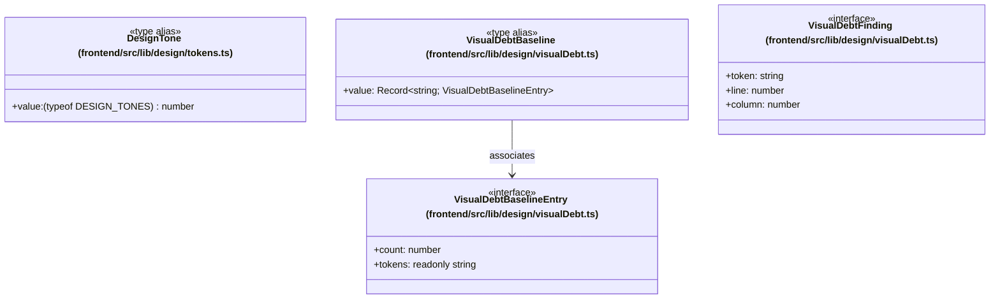

# `frontend/src/lib/design` 클래스 다이어그램

**대상 경로:** `frontend/src/lib/design`

## 책임
`frontend/src/lib/design`의 책임은 <<interface>>, <<type alias>>으로 표현되는 운영 타입 계약을 정의하는 것이다.
이 문서는 4개 source type과 1개 정적 관계를 1개 Mermaid class diagram으로 나누어 보여준다.

## 포함 파일
- `frontend/src/lib/design/tokens.ts`
- `frontend/src/lib/design/visualDebt.ts`

## 다이어그램 1 — `frontend/src/lib/design/tokens.ts::DesignTone` … `frontend/src/lib/design/visualDebt.ts::VisualDebtFinding`

### 관계 설명
- `frontend/src/lib/design/visualDebt.ts::VisualDebtBaseline --> frontend/src/lib/design/visualDebt.ts::VisualDebtBaselineEntry` — 근거: `frontend/src/lib/design/visualDebt.ts::VisualDebtBaseline.value`; 관계: `associates`.

### 타입 표기 정규화
| Mermaid 표기 | 소스 표기 |
|---|---|
| `(typeof DESIGN_TONES) number` | `(typeof DESIGN_TONES)[number]` |
| `Record~string; VisualDebtBaselineEntry~` | `Record<string, VisualDebtBaselineEntry>` |
| `readonly string` | `readonly string[]` |
