# `frontend/src/lib/mockup` 클래스 다이어그램

**대상 경로:** `frontend/src/lib/mockup`

## 책임
`frontend/src/lib/mockup`의 책임은 <<interface>>, <<type alias>>으로 표현되는 운영 타입 계약을 정의하는 것이다.
이 문서는 3개 source type과 11개 정적 관계를 1개 Mermaid class diagram으로 나누어 보여준다.

## 포함 파일
- `frontend/src/lib/mockup/contracts.ts`
- `frontend/src/lib/mockup/state.ts`

## 다이어그램 1 — `frontend/src/lib/mockup/contracts.ts::MockupProfileId` … `frontend/src/lib/types/topology.ts::TopologyTraffic`

```mermaid
classDiagram
%% source-type: frontend/src/lib/mockup/contracts.ts::MockupProfileId
class T_frontend_src_lib_mockup_contracts_ts_MockupProfileId_38627cd457a0["MockupProfileId (frontend/src/lib/mockup/contracts.ts)"] {
  <<type alias>>
  +value: 'tutorial' | 'admin'
}
%% source-type: frontend/src/lib/mockup/contracts.ts::MockupSession
class T_frontend_src_lib_mockup_contracts_ts_MockupSession_2bd773b649c6["MockupSession (frontend/src/lib/mockup/contracts.ts)"] {
  <<interface>>
  +active: boolean
  +profile: MockupProfileId | null
  +homePath: '/' | '/dashboard' | '/admin'
  +allowedPaths: Array~string~
  +bannerLabel: string
}
%% source-type: frontend/src/lib/mockup/state.ts::MockupState
class T_frontend_src_lib_mockup_state_ts_MockupState_8a74f985f831["MockupState (frontend/src/lib/mockup/state.ts)"] {
  <<interface>>
  +projects: Array~Project~
  +selectedProjectId: string
  +instances: Array~Instance~
  +k3sClusters: Array~K3sCluster~
  +topology: TopologyData
  +traffic: TopologyTraffic
  +quotas: DashboardQuotas
  +admin: object
}
%% external-type: frontend/src/lib/stores/auth.ts::MockupQueryProfile
class T_frontend_src_lib_stores_auth_ts_MockupQueryProfile_eded6379bf8a["MockupQueryProfile (../stores/auth.ts)"] {
  <<external>>
}
%% external-type: frontend/src/lib/stores/auth.ts::Project
class T_frontend_src_lib_stores_auth_ts_Project_8d65e3d1e3e6["Project (../stores/auth.ts)"] {
  <<external>>
}
%% external-type: frontend/src/lib/types/adminOverview.ts::Overview
class T_frontend_src_lib_types_adminOverview_ts_Overview_8b676fbe1ac9["Overview (../types/adminOverview.ts)"] {
  <<external>>
}
%% external-type: frontend/src/lib/types/adminOverview.ts::ProjectUsage
class T_frontend_src_lib_types_adminOverview_ts_ProjectUsage_c0832c1ff040["ProjectUsage (../types/adminOverview.ts)"] {
  <<external>>
}
%% external-type: frontend/src/lib/types/adminOverview.ts::VersionInfo
class T_frontend_src_lib_types_adminOverview_ts_VersionInfo_8c0f864cc965["VersionInfo (../types/adminOverview.ts)"] {
  <<external>>
}
%% external-type: frontend/src/lib/types/compute.ts::Instance
class T_frontend_src_lib_types_compute_ts_Instance_98dae3c99b50["Instance (../types/compute.ts)"] {
  <<external>>
}
%% external-type: frontend/src/lib/types/k3s.ts::K3sCluster
class T_frontend_src_lib_types_k3s_ts_K3sCluster_3dbb28f00f71["K3sCluster (../types/k3s.ts)"] {
  <<external>>
}
%% external-type: frontend/src/lib/types/quotas.ts::DashboardQuotas
class T_frontend_src_lib_types_quotas_ts_DashboardQuotas_895c0f818acd["DashboardQuotas (../types/quotas.ts)"] {
  <<external>>
}
%% external-type: frontend/src/lib/types/topology.ts::TopologyData
class T_frontend_src_lib_types_topology_ts_TopologyData_da4ee907f519["TopologyData (../types/topology.ts)"] {
  <<external>>
}
%% external-type: frontend/src/lib/types/topology.ts::TopologyTraffic
class T_frontend_src_lib_types_topology_ts_TopologyTraffic_cc276f7b167d["TopologyTraffic (../types/topology.ts)"] {
  <<external>>
}
T_frontend_src_lib_mockup_contracts_ts_MockupSession_2bd773b649c6 --> T_frontend_src_lib_mockup_contracts_ts_MockupProfileId_38627cd457a0 : associates
T_frontend_src_lib_stores_auth_ts_MockupQueryProfile_eded6379bf8a --> T_frontend_src_lib_mockup_contracts_ts_MockupProfileId_38627cd457a0 : associates
T_frontend_src_lib_mockup_state_ts_MockupState_8a74f985f831 --> T_frontend_src_lib_stores_auth_ts_Project_8d65e3d1e3e6 : associates
T_frontend_src_lib_mockup_state_ts_MockupState_8a74f985f831 --> T_frontend_src_lib_types_adminOverview_ts_Overview_8b676fbe1ac9 : associates
T_frontend_src_lib_mockup_state_ts_MockupState_8a74f985f831 --> T_frontend_src_lib_types_adminOverview_ts_ProjectUsage_c0832c1ff040 : associates
T_frontend_src_lib_mockup_state_ts_MockupState_8a74f985f831 --> T_frontend_src_lib_types_adminOverview_ts_VersionInfo_8c0f864cc965 : associates
T_frontend_src_lib_mockup_state_ts_MockupState_8a74f985f831 --> T_frontend_src_lib_types_compute_ts_Instance_98dae3c99b50 : associates
T_frontend_src_lib_mockup_state_ts_MockupState_8a74f985f831 --> T_frontend_src_lib_types_k3s_ts_K3sCluster_3dbb28f00f71 : associates
T_frontend_src_lib_mockup_state_ts_MockupState_8a74f985f831 --> T_frontend_src_lib_types_quotas_ts_DashboardQuotas_895c0f818acd : associates
T_frontend_src_lib_mockup_state_ts_MockupState_8a74f985f831 --> T_frontend_src_lib_types_topology_ts_TopologyData_da4ee907f519 : associates
T_frontend_src_lib_mockup_state_ts_MockupState_8a74f985f831 --> T_frontend_src_lib_types_topology_ts_TopologyTraffic_cc276f7b167d : associates
```

### 관계 설명
- `frontend/src/lib/mockup/contracts.ts::MockupSession --> frontend/src/lib/mockup/contracts.ts::MockupProfileId` — 근거: `frontend/src/lib/mockup/contracts.ts::MockupSession.profile`; 관계: `associates`.
- `frontend/src/lib/stores/auth.ts::MockupQueryProfile --> frontend/src/lib/mockup/contracts.ts::MockupProfileId` — 근거: `frontend/src/lib/stores/auth.ts::MockupQueryProfile.value`; 관계: `associates`.
- `frontend/src/lib/mockup/state.ts::MockupState --> frontend/src/lib/stores/auth.ts::Project` — 근거: `frontend/src/lib/mockup/state.ts::MockupState.projects`; 관계: `associates`.
- `frontend/src/lib/mockup/state.ts::MockupState --> frontend/src/lib/types/adminOverview.ts::Overview` — 근거: `frontend/src/lib/mockup/state.ts::MockupState.admin`; 관계: `associates`.
- `frontend/src/lib/mockup/state.ts::MockupState --> frontend/src/lib/types/adminOverview.ts::ProjectUsage` — 근거: `frontend/src/lib/mockup/state.ts::MockupState.admin`; 관계: `associates`.
- `frontend/src/lib/mockup/state.ts::MockupState --> frontend/src/lib/types/adminOverview.ts::VersionInfo` — 근거: `frontend/src/lib/mockup/state.ts::MockupState.admin`; 관계: `associates`.
- `frontend/src/lib/mockup/state.ts::MockupState --> frontend/src/lib/types/compute.ts::Instance` — 근거: `frontend/src/lib/mockup/state.ts::MockupState.instances`; 관계: `associates`.
- `frontend/src/lib/mockup/state.ts::MockupState --> frontend/src/lib/types/k3s.ts::K3sCluster` — 근거: `frontend/src/lib/mockup/state.ts::MockupState.k3sClusters`; 관계: `associates`.
- `frontend/src/lib/mockup/state.ts::MockupState --> frontend/src/lib/types/quotas.ts::DashboardQuotas` — 근거: `frontend/src/lib/mockup/state.ts::MockupState.quotas`; 관계: `associates`.
- `frontend/src/lib/mockup/state.ts::MockupState --> frontend/src/lib/types/topology.ts::TopologyData` — 근거: `frontend/src/lib/mockup/state.ts::MockupState.topology`; 관계: `associates`.
- `frontend/src/lib/mockup/state.ts::MockupState --> frontend/src/lib/types/topology.ts::TopologyTraffic` — 근거: `frontend/src/lib/mockup/state.ts::MockupState.traffic`; 관계: `associates`.

### 타입 표기 정규화
| Mermaid 표기 | 소스 표기 |
|---|---|
| `Array~string~` | `string[]` |
| `Array~Project~` | `Project[]` |
| `Array~Instance~` | `Instance[]` |
| `Array~K3sCluster~` | `K3sCluster[]` |
| `object` | `{ overview: Overview; projects: ProjectUsage[]; version: VersionInfo; notifications: { severity: string; message: string; target: string; href: string }[]; identitySummary: { user_count: number; project_count: number; role_count: number; group_count: number; recent_users: { id: string; name: string }[]; recent_projects: { id: string; name: string }[]; }; }` |
