# `frontend/src/lib/stores` 클래스 다이어그램

**대상 경로:** `frontend/src/lib/stores`

## 책임
`frontend/src/lib/stores`의 책임은 <<interface>>, <<type alias>>으로 표현되는 운영 타입 계약을 정의하는 것이다.
이 문서는 90개 source type과 14개 정적 관계를 4개 Mermaid class diagram으로 나누어 보여준다.

## 포함 파일
- `frontend/src/lib/stores/adminDatabaseInstanceDetailController.svelte.ts`
- `frontend/src/lib/stores/adminGroupsController.svelte.ts`
- `frontend/src/lib/stores/adminQuotasController.svelte.ts`
- `frontend/src/lib/stores/adminTopologyController.svelte.ts`
- `frontend/src/lib/stores/adminVolumeDetailController.svelte.ts`
- `frontend/src/lib/stores/auth.ts`
- `frontend/src/lib/stores/betaFeatures.ts`
- `frontend/src/lib/stores/containerDetailController.svelte.ts`
- `frontend/src/lib/stores/dbCreateStore.svelte.ts`
- `frontend/src/lib/stores/dbInstanceDetailController.svelte.ts`
- `frontend/src/lib/stores/fileStorageDetailController.svelte.ts`
- `frontend/src/lib/stores/fileStorageWizardStore.svelte.ts`
- `frontend/src/lib/stores/grafana.ts`
- `frontend/src/lib/stores/imageDetailController.svelte.ts`
- `frontend/src/lib/stores/imagesController.svelte.ts`
- `frontend/src/lib/stores/instanceDetailController.svelte.ts`
- `frontend/src/lib/stores/k3sClusterDetailController.svelte.ts`
- `frontend/src/lib/stores/k3sClusterListController.svelte.ts`
- `frontend/src/lib/stores/k3sProgress.svelte.ts`
- `frontend/src/lib/stores/loadbalancerDetailController.svelte.ts`
- `frontend/src/lib/stores/networkDetailController.svelte.ts`
- `frontend/src/lib/stores/networkLoadbalancerDetailController.svelte.ts`
- `frontend/src/lib/stores/objectBrowser.svelte.ts`
- `frontend/src/lib/stores/routerDetailController.svelte.ts`
- `frontend/src/lib/stores/theme.ts`
- `frontend/src/lib/stores/toast.ts`
- `frontend/src/lib/stores/uploadQueue.ts`
- `frontend/src/lib/stores/vmCreateStore.svelte.ts`
- `frontend/src/lib/stores/volumeDetailController.svelte.ts`
- `frontend/src/lib/stores/volumesController.svelte.ts`
- `frontend/src/lib/stores/wizard.ts`

## 다이어그램 1 — `frontend/src/lib/stores/adminDatabaseInstanceDetailController.svelte.ts::AdminDbInstanceDetailOpts` … `frontend/src/lib/stores/fileStorageDetailController.svelte.ts::Options`

```mermaid
classDiagram
%% source-type: frontend/src/lib/stores/adminDatabaseInstanceDetailController.svelte.ts::AdminDbInstanceDetailOpts
class T_frontend_src_lib_stores_adminDatabaseInstanceDetailController_svelte_ts_AdminDbInstanceDetailOpts_8d7ce7a12297["AdminDbInstanceDetailOpts (frontend/src/lib/stores/adminDatabaseInstanceDetailController.svelte.ts)"] {
  <<interface>>
  +instanceId: Callable~; returns string~
  +token: Callable~; returns string | undefined~
  +projectId: Callable~; returns string | undefined~
  +databaseBackupsEnabled: Callable~; returns boolean~ | undefined
}
%% source-type: frontend/src/lib/stores/adminGroupsController.svelte.ts::AdminGroupsControllerOpts
class T_frontend_src_lib_stores_adminGroupsController_svelte_ts_AdminGroupsControllerOpts_75c87bff2f2f["AdminGroupsControllerOpts (frontend/src/lib/stores/adminGroupsController.svelte.ts)"] {
  <<interface>>
  +token: Callable~; returns string | undefined~
  +projectId: Callable~; returns string | undefined~
}
%% source-type: frontend/src/lib/stores/adminQuotasController.svelte.ts::AdminQuotasControllerOpts
class T_frontend_src_lib_stores_adminQuotasController_svelte_ts_AdminQuotasControllerOpts_b1961fd7c34f["AdminQuotasControllerOpts (frontend/src/lib/stores/adminQuotasController.svelte.ts)"] {
  <<interface>>
  +token: Callable~; returns string | undefined~
  +projectId: Callable~; returns string | undefined~
}
%% source-type: frontend/src/lib/stores/adminTopologyController.svelte.ts::AdminTopologyControllerOpts
class T_frontend_src_lib_stores_adminTopologyController_svelte_ts_AdminTopologyControllerOpts_076aeaa6f28c["AdminTopologyControllerOpts (frontend/src/lib/stores/adminTopologyController.svelte.ts)"] {
  <<interface>>
  +token: Callable~; returns string | undefined~
  +projectId: Callable~; returns string | undefined~
}
%% source-type: frontend/src/lib/stores/adminVolumeDetailController.svelte.ts::AdminVolumeDetailController
class T_frontend_src_lib_stores_adminVolumeDetailController_svelte_ts_AdminVolumeDetailController_5150a00268ea["AdminVolumeDetailController (frontend/src/lib/stores/adminVolumeDetailController.svelte.ts)"] {
  <<type alias>>
  +value: ReturnType~typeof createAdminVolumeDetailController~
}
%% source-type: frontend/src/lib/stores/adminVolumeDetailController.svelte.ts::Options
class T_frontend_src_lib_stores_adminVolumeDetailController_svelte_ts_Options_baefda56f2b3["Options (frontend/src/lib/stores/adminVolumeDetailController.svelte.ts)"] {
  <<interface>>
  +volumeId: Callable~; returns string~
  +token: Callable~; returns string | undefined~
  +projectId: Callable~; returns string | undefined~
  +onClose: Callable~; returns void~ | undefined
  +onRefresh: Callable~; returns void~ | undefined
}
%% source-type: frontend/src/lib/stores/auth.ts::AuthPersistenceMode
class T_frontend_src_lib_stores_auth_ts_AuthPersistenceMode_c4012134c0b5["AuthPersistenceMode (frontend/src/lib/stores/auth.ts)"] {
  <<type alias>>
  +value: 'real' | 'mock'
}
%% source-type: frontend/src/lib/stores/auth.ts::AuthState
class T_frontend_src_lib_stores_auth_ts_AuthState_46e01cd11f29["AuthState (frontend/src/lib/stores/auth.ts)"] {
  <<interface>>
  +token: string | null
  +refreshToken: string | null
  +accessExpiresAt: number | null
  +userId: string | null
  +username: string | null
  +projectId: string | null
  +projectName: string | null
  +availableProjects: Array~Project~
  +roles: Array~string~
  +isSystemAdmin: boolean
  +federated: boolean
}
%% source-type: frontend/src/lib/stores/auth.ts::MockupQueryProfile
class T_frontend_src_lib_stores_auth_ts_MockupQueryProfile_eded6379bf8a["MockupQueryProfile (frontend/src/lib/stores/auth.ts)"] {
  <<type alias>>
  +value: MockupProfileId | 'off' | 'invalid' | null
}
%% source-type: frontend/src/lib/stores/auth.ts::Project
class T_frontend_src_lib_stores_auth_ts_Project_8d65e3d1e3e6["Project (frontend/src/lib/stores/auth.ts)"] {
  <<interface>>
  +id: string
  +name: string
  +description: string | undefined
  +domain_name: string | null | undefined
  +last_accessed_at: string | null | undefined
}
%% source-type: frontend/src/lib/stores/betaFeatures.ts::BetaFeatures
class T_frontend_src_lib_stores_betaFeatures_ts_BetaFeatures_c71436438d77["BetaFeatures (frontend/src/lib/stores/betaFeatures.ts)"] {
  <<interface>>
  +libraryConsume: boolean
  +haDeploy: boolean
  +keyManager: boolean
  +volumeBackups: boolean
  +volumeSnapshots: boolean
  +fileStorageSnapshots: boolean
  +fileStorageShareNetworks: boolean
  +fileStorageSecurityServices: boolean
  +databaseBackups: boolean
}
%% source-type: frontend/src/lib/stores/containerDetailController.svelte.ts::ContainerDetailController
class T_frontend_src_lib_stores_containerDetailController_svelte_ts_ContainerDetailController_53439625c3fb["ContainerDetailController (frontend/src/lib/stores/containerDetailController.svelte.ts)"] {
  <<type alias>>
  +value: ReturnType~typeof createContainerDetailController~
}
%% source-type: frontend/src/lib/stores/containerDetailController.svelte.ts::Options
class T_frontend_src_lib_stores_containerDetailController_svelte_ts_Options_906bdf01163d["Options (frontend/src/lib/stores/containerDetailController.svelte.ts)"] {
  <<interface>>
  +containerId: Callable~; returns string~
  +adminMode: Callable~; returns boolean~
  +token: Callable~; returns string | undefined~
  +projectId: Callable~; returns string | undefined~
  +onClose: Callable~; returns void~ | undefined
  +onRefresh: Callable~; returns void~ | undefined
}
%% source-type: frontend/src/lib/stores/dbCreateStore.svelte.ts::DbAZ
class T_frontend_src_lib_stores_dbCreateStore_svelte_ts_DbAZ_67836c5b0b7a["DbAZ (frontend/src/lib/stores/dbCreateStore.svelte.ts)"] {
  <<interface>>
  +name: string
}
%% source-type: frontend/src/lib/stores/dbCreateStore.svelte.ts::DbConfiguration
class T_frontend_src_lib_stores_dbCreateStore_svelte_ts_DbConfiguration_7139990e154e["DbConfiguration (frontend/src/lib/stores/dbCreateStore.svelte.ts)"] {
  <<interface>>
  +id: string
  +name: string
  +datastore_name: string
}
%% source-type: frontend/src/lib/stores/dbCreateStore.svelte.ts::DbCreateOpts
class T_frontend_src_lib_stores_dbCreateStore_svelte_ts_DbCreateOpts_adb535e7727a["DbCreateOpts (frontend/src/lib/stores/dbCreateStore.svelte.ts)"] {
  <<interface>>
  +open: Callable~; returns boolean~
  +setOpen: Callable~v: boolean; returns void~
  +onCreated: Callable~; returns void~
  +databaseBackupsEnabled: Callable~; returns boolean~ | undefined
}
%% source-type: frontend/src/lib/stores/dbCreateStore.svelte.ts::DbCreateStore
class T_frontend_src_lib_stores_dbCreateStore_svelte_ts_DbCreateStore_51fdba32d0fb["DbCreateStore (frontend/src/lib/stores/dbCreateStore.svelte.ts)"] {
  <<type alias>>
  +value: ReturnType~typeof createDbCreateStore~
}
%% source-type: frontend/src/lib/stores/dbCreateStore.svelte.ts::DbDatastore
class T_frontend_src_lib_stores_dbCreateStore_svelte_ts_DbDatastore_fe8774156738["DbDatastore (frontend/src/lib/stores/dbCreateStore.svelte.ts)"] {
  <<interface>>
  +id: string
  +name: string
  +versions: Array~object~
}
%% source-type: frontend/src/lib/stores/dbCreateStore.svelte.ts::DbNetwork
class T_frontend_src_lib_stores_dbCreateStore_svelte_ts_DbNetwork_dbf115888ba1["DbNetwork (frontend/src/lib/stores/dbCreateStore.svelte.ts)"] {
  <<interface>>
  +id: string
  +name: string
  +is_external: boolean
  +is_shared: boolean
}
%% source-type: frontend/src/lib/stores/dbCreateStore.svelte.ts::DbVolumeType
class T_frontend_src_lib_stores_dbCreateStore_svelte_ts_DbVolumeType_17452f331cd5["DbVolumeType (frontend/src/lib/stores/dbCreateStore.svelte.ts)"] {
  <<interface>>
  +id: string
  +name: string
}
%% source-type: frontend/src/lib/stores/dbCreateStore.svelte.ts::UserDraft
class T_frontend_src_lib_stores_dbCreateStore_svelte_ts_UserDraft_11a7f6c908e4["UserDraft (frontend/src/lib/stores/dbCreateStore.svelte.ts)"] {
  <<interface>>
  +name: string
  +password: string
  +host: string
}
%% source-type: frontend/src/lib/stores/dbInstanceDetailController.svelte.ts::DbInstanceDetailController
class T_frontend_src_lib_stores_dbInstanceDetailController_svelte_ts_DbInstanceDetailController_69b847377e7a["DbInstanceDetailController (frontend/src/lib/stores/dbInstanceDetailController.svelte.ts)"] {
  <<type alias>>
  +value: ReturnType~typeof createDbInstanceDetailController~
}
%% source-type: frontend/src/lib/stores/dbInstanceDetailController.svelte.ts::DbInstanceDetailControllerOpts
class T_frontend_src_lib_stores_dbInstanceDetailController_svelte_ts_DbInstanceDetailControllerOpts_11170ced33f0["DbInstanceDetailControllerOpts (frontend/src/lib/stores/dbInstanceDetailController.svelte.ts)"] {
  <<interface>>
  +instanceId: Callable~; returns string~
  +token: Callable~; returns string | undefined~
  +projectId: Callable~; returns string | undefined~
  +onDeleted: Callable~; returns void~ | undefined
  +databaseBackupsEnabled: Callable~; returns boolean~ | undefined
}
%% source-type: frontend/src/lib/stores/fileStorageDetailController.svelte.ts::FileStorageDetailController
class T_frontend_src_lib_stores_fileStorageDetailController_svelte_ts_FileStorageDetailController_7202165cc98d["FileStorageDetailController (frontend/src/lib/stores/fileStorageDetailController.svelte.ts)"] {
  <<type alias>>
  +value: ReturnType~typeof createFileStorageDetailController~
}
%% source-type: frontend/src/lib/stores/fileStorageDetailController.svelte.ts::Options
class T_frontend_src_lib_stores_fileStorageDetailController_svelte_ts_Options_5724210f6165["Options (frontend/src/lib/stores/fileStorageDetailController.svelte.ts)"] {
  <<interface>>
  +fileStorageId: Callable~; returns string~
  +token: Callable~; returns string | undefined~
  +projectId: Callable~; returns string | undefined~
  +onDeleted: Callable~; returns void~ | undefined
  +onClose: Callable~; returns void~ | undefined
}
T_frontend_src_lib_stores_auth_ts_AuthState_46e01cd11f29 --> T_frontend_src_lib_stores_auth_ts_Project_8d65e3d1e3e6 : associates
```

### 관계 설명
- `frontend/src/lib/stores/auth.ts::AuthState --> frontend/src/lib/stores/auth.ts::Project` — 근거: `frontend/src/lib/stores/auth.ts::AuthState.availableProjects`; 관계: `associates`.

### 타입 표기 정규화
| Mermaid 표기 | 소스 표기 |
|---|---|
| `Callable~; returns string~` | `() => string` |
| `Callable~; returns string | undefined~` | `() => string | undefined` |
| `Callable~; returns boolean~` | `() => boolean` |
| `ReturnType~typeof createAdminVolumeDetailController~` | `ReturnType<typeof createAdminVolumeDetailController>` |
| `Callable~; returns void~` | `() => void` |
| `Array~Project~` | `Project[]` |
| `Array~string~` | `string[]` |
| `ReturnType~typeof createContainerDetailController~` | `ReturnType<typeof createContainerDetailController>` |
| `Callable~v: boolean; returns void~` | `(v: boolean) => void` |
| `ReturnType~typeof createDbCreateStore~` | `ReturnType<typeof createDbCreateStore>` |
| `Array~object~` | `{ id: string; name: string }[]` |
| `ReturnType~typeof createDbInstanceDetailController~` | `ReturnType<typeof createDbInstanceDetailController>` |
| `ReturnType~typeof createFileStorageDetailController~` | `ReturnType<typeof createFileStorageDetailController>` |

## 다이어그램 2 — `frontend/src/lib/stores/fileStorageWizardStore.svelte.ts::AccessRule` … `frontend/src/lib/stores/k3sProgress.svelte.ts::K3sProgressMode`

```mermaid
classDiagram
%% source-type: frontend/src/lib/stores/fileStorageWizardStore.svelte.ts::AccessRule
class T_frontend_src_lib_stores_fileStorageWizardStore_svelte_ts_AccessRule_9951a107d5fb["AccessRule (frontend/src/lib/stores/fileStorageWizardStore.svelte.ts)"] {
  <<interface>>
  +id: string
  +access_type: string
  +access_to: string
  +access_level: string
  +access_key: string | null
  +state: string
}
%% source-type: frontend/src/lib/stores/fileStorageWizardStore.svelte.ts::FileStorageWizardStore
class T_frontend_src_lib_stores_fileStorageWizardStore_svelte_ts_FileStorageWizardStore_0c3e19638709["FileStorageWizardStore (frontend/src/lib/stores/fileStorageWizardStore.svelte.ts)"] {
  <<type alias>>
  +value: ReturnType~typeof createFileStorageWizardStore~
}
%% source-type: frontend/src/lib/stores/fileStorageWizardStore.svelte.ts::FsWizardOptions
class T_frontend_src_lib_stores_fileStorageWizardStore_svelte_ts_FsWizardOptions_bf32b08f045d["FsWizardOptions (frontend/src/lib/stores/fileStorageWizardStore.svelte.ts)"] {
  <<interface>>
  +open: Callable~; returns boolean~
  +setOpen: Callable~v: boolean; returns void~
  +onCreated: Callable~; returns void~
  +fileStorageShareNetworksEnabled: Callable~; returns boolean~ | undefined
}
%% source-type: frontend/src/lib/stores/fileStorageWizardStore.svelte.ts::MetaEntry
class T_frontend_src_lib_stores_fileStorageWizardStore_svelte_ts_MetaEntry_21f2a00ac1ff["MetaEntry (frontend/src/lib/stores/fileStorageWizardStore.svelte.ts)"] {
  <<interface>>
  +key: string
  +value: string
}
%% source-type: frontend/src/lib/stores/fileStorageWizardStore.svelte.ts::NeutronNetwork
class T_frontend_src_lib_stores_fileStorageWizardStore_svelte_ts_NeutronNetwork_93a4dc689c03["NeutronNetwork (frontend/src/lib/stores/fileStorageWizardStore.svelte.ts)"] {
  <<interface>>
  +id: string
  +name: string
  +status: string
  +subnets: Array~string~
}
%% source-type: frontend/src/lib/stores/fileStorageWizardStore.svelte.ts::ShareNetwork
class T_frontend_src_lib_stores_fileStorageWizardStore_svelte_ts_ShareNetwork_42601fd668e0["ShareNetwork (frontend/src/lib/stores/fileStorageWizardStore.svelte.ts)"] {
  <<interface>>
  +id: string
  +name: string
  +neutron_net_id: string | null
  +status: string
}
%% source-type: frontend/src/lib/stores/fileStorageWizardStore.svelte.ts::ShareTypeMeta
class T_frontend_src_lib_stores_fileStorageWizardStore_svelte_ts_ShareTypeMeta_aa5afc615ecb["ShareTypeMeta (frontend/src/lib/stores/fileStorageWizardStore.svelte.ts)"] {
  <<interface>>
  +id: string
  +name: string
  +is_default: boolean
  +extra_specs: Record~string; string~ | undefined
  +supported_protocols: Array~string~ | undefined
}
%% source-type: frontend/src/lib/stores/fileStorageWizardStore.svelte.ts::Subnet
class T_frontend_src_lib_stores_fileStorageWizardStore_svelte_ts_Subnet_dae2ae45e301["Subnet (frontend/src/lib/stores/fileStorageWizardStore.svelte.ts)"] {
  <<interface>>
  +id: string
  +name: string
  +cidr: string
}
%% source-type: frontend/src/lib/stores/fileStorageWizardStore.svelte.ts::WizardStep
class T_frontend_src_lib_stores_fileStorageWizardStore_svelte_ts_WizardStep_4c614acc7f4c["WizardStep (frontend/src/lib/stores/fileStorageWizardStore.svelte.ts)"] {
  <<type alias>>
  +value: '1' | '2' | '3'
}
%% source-type: frontend/src/lib/stores/grafana.ts::GrafanaContext
class T_frontend_src_lib_stores_grafana_ts_GrafanaContext_9d8f83a21a95["GrafanaContext (frontend/src/lib/stores/grafana.ts)"] {
  <<interface>>
  +grafanaUrl: string
  +dashboards: Record~GrafanaDashboardKey; string~
}
%% source-type: frontend/src/lib/stores/grafana.ts::GrafanaContextStore
class T_frontend_src_lib_stores_grafana_ts_GrafanaContextStore_d5824ceb8a2b["GrafanaContextStore (frontend/src/lib/stores/grafana.ts)"] {
  <<interface>>
  +ctx: GrafanaContext | null
  +loading: boolean
  +error: boolean
}
%% source-type: frontend/src/lib/stores/grafana.ts::GrafanaDashboardKey
class T_frontend_src_lib_stores_grafana_ts_GrafanaDashboardKey_ab257e82431d["GrafanaDashboardKey (frontend/src/lib/stores/grafana.ts)"] {
  <<type alias>>
  +value: 'node' | 'rabbitmq' | 'mysqld' | 'memcached' | 'etcd' | 'haproxy' | 'libvirt' | 'openstack' | 'ceph' | 'instance-cpu' | 'instance-gpu'
}
%% source-type: frontend/src/lib/stores/imageDetailController.svelte.ts::ImageDetailController
class T_frontend_src_lib_stores_imageDetailController_svelte_ts_ImageDetailController_a0bfbb4a633a["ImageDetailController (frontend/src/lib/stores/imageDetailController.svelte.ts)"] {
  <<type alias>>
  +value: ReturnType~typeof createImageDetailController~
}
%% source-type: frontend/src/lib/stores/imageDetailController.svelte.ts::ImageDetailControllerOpts
class T_frontend_src_lib_stores_imageDetailController_svelte_ts_ImageDetailControllerOpts_0bb13a45f05c["ImageDetailControllerOpts (frontend/src/lib/stores/imageDetailController.svelte.ts)"] {
  <<interface>>
  +imageId: Callable~; returns string~
  +token: Callable~; returns string | undefined~
  +projectId: Callable~; returns string | undefined~
  +isAdmin: Callable~; returns boolean~
  +onDelete: Callable~id: string; returns void~ | undefined
  +onClose: Callable~; returns void~ | undefined
}
%% source-type: frontend/src/lib/stores/imagesController.svelte.ts::ImagesControllerOpts
class T_frontend_src_lib_stores_imagesController_svelte_ts_ImagesControllerOpts_22d5686544f2["ImagesControllerOpts (frontend/src/lib/stores/imagesController.svelte.ts)"] {
  <<interface>>
  +token: Callable~; returns string | undefined~
  +projectId: Callable~; returns string | undefined~
}
%% source-type: frontend/src/lib/stores/instanceDetailController.svelte.ts::Flavor
class T_frontend_src_lib_stores_instanceDetailController_svelte_ts_Flavor_484cd8f34929["Flavor (frontend/src/lib/stores/instanceDetailController.svelte.ts)"] {
  <<interface>>
  +id: string
  +name: string
  +vcpus: number
  +ram: number
  +disk: number
}
%% source-type: frontend/src/lib/stores/instanceDetailController.svelte.ts::InstanceDetailController
class T_frontend_src_lib_stores_instanceDetailController_svelte_ts_InstanceDetailController_5860a3af79c1["InstanceDetailController (frontend/src/lib/stores/instanceDetailController.svelte.ts)"] {
  <<type alias>>
  +value: ReturnType~typeof createInstanceDetailController~
}
%% source-type: frontend/src/lib/stores/instanceDetailController.svelte.ts::InstanceDetailControllerOpts
class T_frontend_src_lib_stores_instanceDetailController_svelte_ts_InstanceDetailControllerOpts_b9b51da9065c["InstanceDetailControllerOpts (frontend/src/lib/stores/instanceDetailController.svelte.ts)"] {
  <<interface>>
  +instanceId: Callable~; returns string~
  +effectiveProjectId: Callable~; returns string | undefined~
  +adminMode: Callable~; returns boolean~
  +onDelete: Callable~; returns void~
}
%% source-type: frontend/src/lib/stores/instanceDetailController.svelte.ts::PasswordPrecheck
class T_frontend_src_lib_stores_instanceDetailController_svelte_ts_PasswordPrecheck_698ef1667521["PasswordPrecheck (frontend/src/lib/stores/instanceDetailController.svelte.ts)"] {
  <<interface>>
  +supported: boolean
  +reason: string | null
  +os_admin_user: string | null
  +server_status: string
}
%% source-type: frontend/src/lib/stores/k3sClusterDetailController.svelte.ts::ActiveTab
class T_frontend_src_lib_stores_k3sClusterDetailController_svelte_ts_ActiveTab_e68bead0b985["ActiveTab (frontend/src/lib/stores/k3sClusterDetailController.svelte.ts)"] {
  <<type alias>>
  +value: 'main' | 'configmaps' | 'secrets' | 'services' | 'workloads' | 'pods' | 'stampede'
}
%% source-type: frontend/src/lib/stores/k3sClusterDetailController.svelte.ts::K3sClusterDetailController
class T_frontend_src_lib_stores_k3sClusterDetailController_svelte_ts_K3sClusterDetailController_d8ad51d4b38f["K3sClusterDetailController (frontend/src/lib/stores/k3sClusterDetailController.svelte.ts)"] {
  <<type alias>>
  +value: ReturnType~typeof createK3sClusterDetailController~
}
%% source-type: frontend/src/lib/stores/k3sClusterDetailController.svelte.ts::K3sClusterDetailControllerOpts
class T_frontend_src_lib_stores_k3sClusterDetailController_svelte_ts_K3sClusterDetailControllerOpts_b077392ae599["K3sClusterDetailControllerOpts (frontend/src/lib/stores/k3sClusterDetailController.svelte.ts)"] {
  <<interface>>
  +clusterId: Callable~; returns string~
  +token: Callable~; returns string | undefined~
  +projectId: Callable~; returns string | undefined~
  +adminMode: Callable~; returns boolean~
  +onClose: Callable~; returns void~ | undefined
}
%% source-type: frontend/src/lib/stores/k3sClusterListController.svelte.ts::K3sClusterListOpts
class T_frontend_src_lib_stores_k3sClusterListController_svelte_ts_K3sClusterListOpts_0bcfc6cefdf8["K3sClusterListOpts (frontend/src/lib/stores/k3sClusterListController.svelte.ts)"] {
  <<interface>>
  +token: Callable~; returns string | undefined~
  +projectId: Callable~; returns string | undefined~
  +progress: K3sProgressController
}
%% source-type: frontend/src/lib/stores/k3sProgress.svelte.ts::K3sProgressController
class T_frontend_src_lib_stores_k3sProgress_svelte_ts_K3sProgressController_6b19e2769dda["K3sProgressController (frontend/src/lib/stores/k3sProgress.svelte.ts)"] {
  <<type alias>>
  +value: ReturnType~typeof createK3sProgress~
}
%% source-type: frontend/src/lib/stores/k3sProgress.svelte.ts::K3sProgressMode
class T_frontend_src_lib_stores_k3sProgress_svelte_ts_K3sProgressMode_974fddfaef73["K3sProgressMode (frontend/src/lib/stores/k3sProgress.svelte.ts)"] {
  <<type alias>>
  +value: 'create' | 'delete'
}
T_frontend_src_lib_stores_grafana_ts_GrafanaContext_9d8f83a21a95 --> T_frontend_src_lib_stores_grafana_ts_GrafanaDashboardKey_ab257e82431d : associates
T_frontend_src_lib_stores_grafana_ts_GrafanaContextStore_d5824ceb8a2b --> T_frontend_src_lib_stores_grafana_ts_GrafanaContext_9d8f83a21a95 : associates
T_frontend_src_lib_stores_k3sClusterListController_svelte_ts_K3sClusterListOpts_0bcfc6cefdf8 --> T_frontend_src_lib_stores_k3sProgress_svelte_ts_K3sProgressController_6b19e2769dda : associates
```

### 관계 설명
- `frontend/src/lib/stores/grafana.ts::GrafanaContext --> frontend/src/lib/stores/grafana.ts::GrafanaDashboardKey` — 근거: `frontend/src/lib/stores/grafana.ts::GrafanaContext.dashboards`; 관계: `associates`.
- `frontend/src/lib/stores/grafana.ts::GrafanaContextStore --> frontend/src/lib/stores/grafana.ts::GrafanaContext` — 근거: `frontend/src/lib/stores/grafana.ts::GrafanaContextStore.ctx`; 관계: `associates`.
- `frontend/src/lib/stores/k3sClusterListController.svelte.ts::K3sClusterListOpts --> frontend/src/lib/stores/k3sProgress.svelte.ts::K3sProgressController` — 근거: `frontend/src/lib/stores/k3sClusterListController.svelte.ts::K3sClusterListOpts.progress`; 관계: `associates`.

### 타입 표기 정규화
| Mermaid 표기 | 소스 표기 |
|---|---|
| `ReturnType~typeof createFileStorageWizardStore~` | `ReturnType<typeof createFileStorageWizardStore>` |
| `Callable~; returns boolean~` | `() => boolean` |
| `Callable~v: boolean; returns void~` | `(v: boolean) => void` |
| `Callable~; returns void~` | `() => void` |
| `Array~string~` | `string[]` |
| `Record~string; string~` | `Record<string, string>` |
| `'1' | '2' | '3'` | `1 | 2 | 3` |
| `Record~GrafanaDashboardKey; string~` | `Record<GrafanaDashboardKey, string>` |
| `ReturnType~typeof createImageDetailController~` | `ReturnType<typeof createImageDetailController>` |
| `Callable~; returns string~` | `() => string` |
| `Callable~; returns string | undefined~` | `() => string | undefined` |
| `Callable~id: string; returns void~` | `(id: string) => void` |
| `ReturnType~typeof createInstanceDetailController~` | `ReturnType<typeof createInstanceDetailController>` |
| `ReturnType~typeof createK3sClusterDetailController~` | `ReturnType<typeof createK3sClusterDetailController>` |
| `ReturnType~typeof createK3sProgress~` | `ReturnType<typeof createK3sProgress>` |

## 다이어그램 3 — `frontend/src/lib/stores/loadbalancerDetailController.svelte.ts::LoadbalancerDetailController` … `frontend/src/lib/stores/vmCreateStore.svelte.ts::QuotaResponse`

```mermaid
classDiagram
%% source-type: frontend/src/lib/stores/loadbalancerDetailController.svelte.ts::LoadbalancerDetailController
class T_frontend_src_lib_stores_loadbalancerDetailController_svelte_ts_LoadbalancerDetailController_a78ce1f31e9f["LoadbalancerDetailController (frontend/src/lib/stores/loadbalancerDetailController.svelte.ts)"] {
  <<type alias>>
  +value: ReturnType~typeof createLoadbalancerDetailController~
}
%% source-type: frontend/src/lib/stores/loadbalancerDetailController.svelte.ts::LoadbalancerDetailControllerOpts
class T_frontend_src_lib_stores_loadbalancerDetailController_svelte_ts_LoadbalancerDetailControllerOpts_935c6f26083f["LoadbalancerDetailControllerOpts (frontend/src/lib/stores/loadbalancerDetailController.svelte.ts)"] {
  <<interface>>
  +lbId: Callable~; returns string~
  +token: Callable~; returns string | undefined~
  +projectId: Callable~; returns string | undefined~
  +onDeleted: Callable~; returns void~ | undefined
  +onClose: Callable~; returns void~ | undefined
}
%% source-type: frontend/src/lib/stores/networkDetailController.svelte.ts::NetworkDetailController
class T_frontend_src_lib_stores_networkDetailController_svelte_ts_NetworkDetailController_6bd417d1a639["NetworkDetailController (frontend/src/lib/stores/networkDetailController.svelte.ts)"] {
  <<type alias>>
  +value: ReturnType~typeof createNetworkDetailController~
}
%% source-type: frontend/src/lib/stores/networkDetailController.svelte.ts::Options
class T_frontend_src_lib_stores_networkDetailController_svelte_ts_Options_4ae30e451f0d["Options (frontend/src/lib/stores/networkDetailController.svelte.ts)"] {
  <<interface>>
  +networkId: Callable~; returns string~
  +apiBase: Callable~; returns string~
  +token: Callable~; returns string | undefined~
  +projectId: Callable~; returns string | undefined~
  +onClose: Callable~; returns void~ | undefined
}
%% source-type: frontend/src/lib/stores/networkLoadbalancerDetailController.svelte.ts::NetworkLbDetailOpts
class T_frontend_src_lib_stores_networkLoadbalancerDetailController_svelte_ts_NetworkLbDetailOpts_e7537c883591["NetworkLbDetailOpts (frontend/src/lib/stores/networkLoadbalancerDetailController.svelte.ts)"] {
  <<interface>>
  +lbId: Callable~; returns string~
  +token: Callable~; returns string | undefined~
  +projectId: Callable~; returns string | undefined~
}
%% source-type: frontend/src/lib/stores/objectBrowser.svelte.ts::ObjectBrowserOpts
class T_frontend_src_lib_stores_objectBrowser_svelte_ts_ObjectBrowserOpts_60217c300762["ObjectBrowserOpts (frontend/src/lib/stores/objectBrowser.svelte.ts)"] {
  <<interface>>
  +mode: Callable~; returns 'user' | 'admin'~
  +containerName: Callable~; returns string~
  +token: Callable~; returns string | undefined~
  +projectId: Callable~; returns string | undefined~
}
%% source-type: frontend/src/lib/stores/objectBrowser.svelte.ts::ObjectBrowserStore
class T_frontend_src_lib_stores_objectBrowser_svelte_ts_ObjectBrowserStore_e3746ebac247["ObjectBrowserStore (frontend/src/lib/stores/objectBrowser.svelte.ts)"] {
  <<type alias>>
  +value: ReturnType~typeof createObjectBrowserStore~
}
%% source-type: frontend/src/lib/stores/objectBrowser.svelte.ts::TreeRow
class T_frontend_src_lib_stores_objectBrowser_svelte_ts_TreeRow_be8152b75c20["TreeRow (frontend/src/lib/stores/objectBrowser.svelte.ts)"] {
  <<type alias>>
  +obj: SwiftObject
  +depth: number
  +isDir: boolean
  +isExpanded: boolean
  +isLoading: boolean
  +fullPath: boolean
}
%% source-type: frontend/src/lib/stores/routerDetailController.svelte.ts::Options
class T_frontend_src_lib_stores_routerDetailController_svelte_ts_Options_883bd4751921["Options (frontend/src/lib/stores/routerDetailController.svelte.ts)"] {
  <<interface>>
  +routerId: Callable~; returns string~
  +token: Callable~; returns string | undefined~
  +projectId: Callable~; returns string | undefined~
  +onDeleted: Callable~; returns void~ | undefined
  +onClose: Callable~; returns void~ | undefined
}
%% source-type: frontend/src/lib/stores/routerDetailController.svelte.ts::RouterDetailController
class T_frontend_src_lib_stores_routerDetailController_svelte_ts_RouterDetailController_7959c6acc2a4["RouterDetailController (frontend/src/lib/stores/routerDetailController.svelte.ts)"] {
  <<type alias>>
  +value: ReturnType~typeof createRouterDetailController~
}
%% source-type: frontend/src/lib/stores/theme.ts::ThemePreference
class T_frontend_src_lib_stores_theme_ts_ThemePreference_b48945586e0c["ThemePreference (frontend/src/lib/stores/theme.ts)"] {
  <<type alias>>
  +value: 'dark' | 'light' | 'system'
}
%% source-type: frontend/src/lib/stores/toast.ts::Toast
class T_frontend_src_lib_stores_toast_ts_Toast_b139233b16ac["Toast (frontend/src/lib/stores/toast.ts)"] {
  <<interface>>
  +id: string
  +type: ToastType
  +message: string
  +duration: number
  +action: ToastAction | undefined
}
%% source-type: frontend/src/lib/stores/toast.ts::ToastAction
class T_frontend_src_lib_stores_toast_ts_ToastAction_0d0e317b4633["ToastAction (frontend/src/lib/stores/toast.ts)"] {
  <<interface>>
  +label: string
  +onClick: Callable~; returns void~
}
%% source-type: frontend/src/lib/stores/toast.ts::ToastType
class T_frontend_src_lib_stores_toast_ts_ToastType_e9de5a5ac338["ToastType (frontend/src/lib/stores/toast.ts)"] {
  <<type alias>>
  +value: 'success' | 'error' | 'warning' | 'info'
}
%% source-type: frontend/src/lib/stores/uploadQueue.ts::UploadJob
class T_frontend_src_lib_stores_uploadQueue_ts_UploadJob_47d137369e15["UploadJob (frontend/src/lib/stores/uploadQueue.ts)"] {
  <<interface>>
  +id: string
  +name: string
  +kind: UploadKind
  +containerName: string
  +prefix: string
  +status: 'uploading' | 'success' | 'error' | 'canceled'
  +loaded: number
  +total: number
  +startTime: number
  +error: string | undefined
  +abort: Callable~; returns void~ | undefined
  +onComplete: Callable~job: UploadJob; returns void~ | undefined
}
%% source-type: frontend/src/lib/stores/uploadQueue.ts::UploadKind
class T_frontend_src_lib_stores_uploadQueue_ts_UploadKind_3e759ea997be["UploadKind (frontend/src/lib/stores/uploadQueue.ts)"] {
  <<type alias>>
  +value: 'object' | 'image'
}
%% source-type: frontend/src/lib/stores/uploadQueue.ts::UploadResponse
class T_frontend_src_lib_stores_uploadQueue_ts_UploadResponse_a822e0a7d434["UploadResponse (frontend/src/lib/stores/uploadQueue.ts)"] {
  <<interface>>
  +success: boolean
  +name: string
  +bytes: number
  +etag: string
  +content_type: string | undefined
}
%% source-type: frontend/src/lib/stores/vmCreateStore.svelte.ts::FlavorQuotaSummary
class T_frontend_src_lib_stores_vmCreateStore_svelte_ts_FlavorQuotaSummary_7718769888a2["FlavorQuotaSummary (frontend/src/lib/stores/vmCreateStore.svelte.ts)"] {
  <<interface>>
  +instances: object | undefined
  +cores: object | undefined
  +ram: object | undefined
  +gigabytes: object | undefined
}
%% source-type: frontend/src/lib/stores/vmCreateStore.svelte.ts::LibraryItem
class T_frontend_src_lib_stores_vmCreateStore_svelte_ts_LibraryItem_18d3d6e017ef["LibraryItem (frontend/src/lib/stores/vmCreateStore.svelte.ts)"] {
  <<interface>>
  +id: string
  +name: string
  +version: string
  +depends_on: Array~string~
  +available_prebuilt: boolean
  +share_proto: string
  +size_bytes: number | undefined
}
%% source-type: frontend/src/lib/stores/vmCreateStore.svelte.ts::ProgressMessage
class T_frontend_src_lib_stores_vmCreateStore_svelte_ts_ProgressMessage_f468bf7c7f38["ProgressMessage (frontend/src/lib/stores/vmCreateStore.svelte.ts)"] {
  <<interface>>
  +step: string
  +progress: number
  +message: string
  +instance_id: string | undefined
  +error: string | undefined
  +elapsed_seconds: number | null | undefined
}
%% source-type: frontend/src/lib/stores/vmCreateStore.svelte.ts::ProjectInfo
class T_frontend_src_lib_stores_vmCreateStore_svelte_ts_ProjectInfo_2beb3f90a86c["ProjectInfo (frontend/src/lib/stores/vmCreateStore.svelte.ts)"] {
  <<interface>>
  +id: string
  +name: string
}
%% source-type: frontend/src/lib/stores/vmCreateStore.svelte.ts::ProjectQuota
class T_frontend_src_lib_stores_vmCreateStore_svelte_ts_ProjectQuota_792c2a208914["ProjectQuota (frontend/src/lib/stores/vmCreateStore.svelte.ts)"] {
  <<interface>>
  +project_id: string
  +project_name: string
  +cpu: QuotaPair
  +ram_mb: QuotaPair
  +instances: QuotaPair
  +disk_gb: QuotaPair
  +gpu_instances: number | undefined
}
%% source-type: frontend/src/lib/stores/vmCreateStore.svelte.ts::QuotaBlock
class T_frontend_src_lib_stores_vmCreateStore_svelte_ts_QuotaBlock_d330f42ff786["QuotaBlock (frontend/src/lib/stores/vmCreateStore.svelte.ts)"] {
  <<interface>>
  +instances: object | undefined
  +cores: object | undefined
  +ram: object | undefined
  +gigabytes: object | undefined
}
%% source-type: frontend/src/lib/stores/vmCreateStore.svelte.ts::QuotaPair
class T_frontend_src_lib_stores_vmCreateStore_svelte_ts_QuotaPair_0c2ccdf41cf6["QuotaPair (frontend/src/lib/stores/vmCreateStore.svelte.ts)"] {
  <<interface>>
  +used: number
  +quota: number
}
%% source-type: frontend/src/lib/stores/vmCreateStore.svelte.ts::QuotaResponse
class T_frontend_src_lib_stores_vmCreateStore_svelte_ts_QuotaResponse_3a79ba278472["QuotaResponse (frontend/src/lib/stores/vmCreateStore.svelte.ts)"] {
  <<interface>>
  +compute: QuotaBlock | undefined
  +storage: QuotaBlock | undefined
  +volume: QuotaBlock | undefined
}
T_frontend_src_lib_stores_toast_ts_Toast_b139233b16ac --> T_frontend_src_lib_stores_toast_ts_ToastAction_0d0e317b4633 : associates
T_frontend_src_lib_stores_toast_ts_Toast_b139233b16ac --> T_frontend_src_lib_stores_toast_ts_ToastType_e9de5a5ac338 : associates
T_frontend_src_lib_stores_uploadQueue_ts_UploadJob_47d137369e15 --> T_frontend_src_lib_stores_uploadQueue_ts_UploadKind_3e759ea997be : associates
T_frontend_src_lib_stores_vmCreateStore_svelte_ts_ProjectQuota_792c2a208914 --> T_frontend_src_lib_stores_vmCreateStore_svelte_ts_QuotaPair_0c2ccdf41cf6 : associates
T_frontend_src_lib_stores_vmCreateStore_svelte_ts_QuotaResponse_3a79ba278472 --> T_frontend_src_lib_stores_vmCreateStore_svelte_ts_QuotaBlock_d330f42ff786 : associates
```

### 관계 설명
- `frontend/src/lib/stores/toast.ts::Toast --> frontend/src/lib/stores/toast.ts::ToastAction` — 근거: `frontend/src/lib/stores/toast.ts::Toast.action`; 관계: `associates`.
- `frontend/src/lib/stores/toast.ts::Toast --> frontend/src/lib/stores/toast.ts::ToastType` — 근거: `frontend/src/lib/stores/toast.ts::Toast.type`; 관계: `associates`.
- `frontend/src/lib/stores/uploadQueue.ts::UploadJob --> frontend/src/lib/stores/uploadQueue.ts::UploadKind` — 근거: `frontend/src/lib/stores/uploadQueue.ts::UploadJob.kind`; 관계: `associates`.
- `frontend/src/lib/stores/vmCreateStore.svelte.ts::ProjectQuota --> frontend/src/lib/stores/vmCreateStore.svelte.ts::QuotaPair` — 근거: `frontend/src/lib/stores/vmCreateStore.svelte.ts::ProjectQuota.cpu`, `frontend/src/lib/stores/vmCreateStore.svelte.ts::ProjectQuota.disk_gb`, `frontend/src/lib/stores/vmCreateStore.svelte.ts::ProjectQuota.instances`, `frontend/src/lib/stores/vmCreateStore.svelte.ts::ProjectQuota.ram_mb`; 관계: `associates`.
- `frontend/src/lib/stores/vmCreateStore.svelte.ts::QuotaResponse --> frontend/src/lib/stores/vmCreateStore.svelte.ts::QuotaBlock` — 근거: `frontend/src/lib/stores/vmCreateStore.svelte.ts::QuotaResponse.compute`, `frontend/src/lib/stores/vmCreateStore.svelte.ts::QuotaResponse.storage`, `frontend/src/lib/stores/vmCreateStore.svelte.ts::QuotaResponse.volume`; 관계: `associates`.

### 타입 표기 정규화
| Mermaid 표기 | 소스 표기 |
|---|---|
| `ReturnType~typeof createLoadbalancerDetailController~` | `ReturnType<typeof createLoadbalancerDetailController>` |
| `Callable~; returns string~` | `() => string` |
| `Callable~; returns string | undefined~` | `() => string | undefined` |
| `Callable~; returns void~` | `() => void` |
| `ReturnType~typeof createNetworkDetailController~` | `ReturnType<typeof createNetworkDetailController>` |
| `Callable~; returns 'user' | 'admin'~` | `() => 'user' | 'admin'` |
| `ReturnType~typeof createObjectBrowserStore~` | `ReturnType<typeof createObjectBrowserStore>` |
| `ReturnType~typeof createRouterDetailController~` | `ReturnType<typeof createRouterDetailController>` |
| `Callable~job: UploadJob; returns void~` | `(job: UploadJob) => void` |
| `object` | `{ limit: number; in_use: number }` |
| `Array~string~` | `string[]` |

## 다이어그램 4 — `frontend/src/lib/stores/vmCreateStore.svelte.ts::SquashfsArtifact` … `frontend/src/lib/types/quotas.ts::QuotaItem`

```mermaid
classDiagram
%% source-type: frontend/src/lib/stores/vmCreateStore.svelte.ts::SquashfsArtifact
class T_frontend_src_lib_stores_vmCreateStore_svelte_ts_SquashfsArtifact_ce62056ef141["SquashfsArtifact (frontend/src/lib/stores/vmCreateStore.svelte.ts)"] {
  <<interface>>
  +id: number
  +name: string
  +parent_id: number | null
  +ubuntu_base: string | null | undefined
  +base_image_id: string | null | undefined
  +base_image_name: string | null | undefined
}
%% source-type: frontend/src/lib/stores/vmCreateStore.svelte.ts::SquashfsProfile
class T_frontend_src_lib_stores_vmCreateStore_svelte_ts_SquashfsProfile_99c1d566852b["SquashfsProfile (frontend/src/lib/stores/vmCreateStore.svelte.ts)"] {
  <<interface>>
  +id: number
  +name: string
  +layers: Array~string~
  +artifacts: Array~SquashfsArtifact~ | undefined
  +base_image: object | undefined
}
%% source-type: frontend/src/lib/stores/vmCreateStore.svelte.ts::VmCreateOpts
class T_frontend_src_lib_stores_vmCreateStore_svelte_ts_VmCreateOpts_a4d3bcd10ba5["VmCreateOpts (frontend/src/lib/stores/vmCreateStore.svelte.ts)"] {
  <<interface>>
  +adminMode: Callable~; returns boolean~
}
%% source-type: frontend/src/lib/stores/vmCreateStore.svelte.ts::VmCreateStore
class T_frontend_src_lib_stores_vmCreateStore_svelte_ts_VmCreateStore_7f2b5bb7496b["VmCreateStore (frontend/src/lib/stores/vmCreateStore.svelte.ts)"] {
  <<type alias>>
  +value: ReturnType~typeof createVmCreateStore~
}
%% source-type: frontend/src/lib/stores/vmCreateStore.svelte.ts::VmFlavor
class T_frontend_src_lib_stores_vmCreateStore_svelte_ts_VmFlavor_2aac2a89c72c["VmFlavor (frontend/src/lib/stores/vmCreateStore.svelte.ts)"] {
  <<interface>>
  +id: string
  +name: string | undefined
  +vcpus: number
  +ram: number
  +disk: number
  +extra_specs: Record~string; string~ | undefined
}
%% source-type: frontend/src/lib/stores/vmCreateStore.svelte.ts::VmImage
class T_frontend_src_lib_stores_vmCreateStore_svelte_ts_VmImage_70ac5f5ddcb1["VmImage (frontend/src/lib/stores/vmCreateStore.svelte.ts)"] {
  <<interface>>
  +id: string
  +name: string | undefined
  +os_distro: string | null | undefined
  +os_version: string | null | undefined
  +properties: Record~string; unknown~ | null | undefined
}
%% source-type: frontend/src/lib/stores/vmCreateStore.svelte.ts::WizardStepId
class T_frontend_src_lib_stores_vmCreateStore_svelte_ts_WizardStepId_97e17d9eb116["WizardStepId (frontend/src/lib/stores/vmCreateStore.svelte.ts)"] {
  <<type alias>>
  +value: '1' | '2' | '3' | '4' | '5' | '6'
}
%% source-type: frontend/src/lib/stores/volumeDetailController.svelte.ts::VolumeDetailController
class T_frontend_src_lib_stores_volumeDetailController_svelte_ts_VolumeDetailController_e20a98d94d5c["VolumeDetailController (frontend/src/lib/stores/volumeDetailController.svelte.ts)"] {
  <<type alias>>
  +value: ReturnType~typeof createVolumeDetailController~
}
%% source-type: frontend/src/lib/stores/volumeDetailController.svelte.ts::VolumeDetailOpts
class T_frontend_src_lib_stores_volumeDetailController_svelte_ts_VolumeDetailOpts_fcc37c55cac4["VolumeDetailOpts (frontend/src/lib/stores/volumeDetailController.svelte.ts)"] {
  <<interface>>
  +volumeId: Callable~; returns string~
  +token: Callable~; returns string | undefined~
  +projectId: Callable~; returns string | undefined~
  +onDeleted: Callable~; returns void~ | undefined
  +onClose: Callable~; returns void~ | undefined
  +volumeSnapshotsEnabled: Callable~; returns boolean~ | undefined
}
%% source-type: frontend/src/lib/stores/volumesController.svelte.ts::VolumeQuotas
class T_frontend_src_lib_stores_volumesController_svelte_ts_VolumeQuotas_4734af1d51d1["VolumeQuotas (frontend/src/lib/stores/volumesController.svelte.ts)"] {
  <<interface>>
  +storage: object
}
%% source-type: frontend/src/lib/stores/volumesController.svelte.ts::VolumesControllerOpts
class T_frontend_src_lib_stores_volumesController_svelte_ts_VolumesControllerOpts_f8ccd8b71fbc["VolumesControllerOpts (frontend/src/lib/stores/volumesController.svelte.ts)"] {
  <<interface>>
  +token: Callable~; returns string | undefined~
  +projectId: Callable~; returns string | undefined~
  +volumeBackupsEnabled: Callable~; returns boolean~ | undefined
  +volumeSnapshotsEnabled: Callable~; returns boolean~ | undefined
}
%% source-type: frontend/src/lib/stores/wizard.ts::DataMountSpec
class T_frontend_src_lib_stores_wizard_ts_DataMountSpec_a56334a3f1f9["DataMountSpec (frontend/src/lib/stores/wizard.ts)"] {
  <<interface>>
  +fileStorageId: string
  +mountPoint: string
  +readOnly: boolean
}
%% source-type: frontend/src/lib/stores/wizard.ts::NewVolumeSpec
class T_frontend_src_lib_stores_wizard_ts_NewVolumeSpec_6e21f531dc43["NewVolumeSpec (frontend/src/lib/stores/wizard.ts)"] {
  <<interface>>
  +name: string
  +size_gb: number
}
%% source-type: frontend/src/lib/stores/wizard.ts::WizardOpenOptions
class T_frontend_src_lib_stores_wizard_ts_WizardOpenOptions_d24b0ec70e2f["WizardOpenOptions (frontend/src/lib/stores/wizard.ts)"] {
  <<interface>>
  +targetProjectId: string | undefined
  +prefill: Partial~WizardState~ | undefined
}
%% source-type: frontend/src/lib/stores/wizard.ts::WizardState
class T_frontend_src_lib_stores_wizard_ts_WizardState_94c94889d9f1["WizardState (frontend/src/lib/stores/wizard.ts)"] {
  <<interface>>
  +step: number
  +bootSource: 'image' | 'volume'
  +imageId: string | null
  +imageName: string | null
  +bootVolumeId: string | null
  +bootVolumeName: string | null
  +flavorId: string | null
  +flavorName: string | null
  +libraries: Array~string~
  +mountProtocol: 'CEPHFS' | 'NFS'
  +newVolumes: Array~NewVolumeSpec~
  +dataMounts: Array~DataMountSpec~
}
%% external-type: frontend/src/lib/types/quotas.ts::QuotaItem
class T_frontend_src_lib_types_quotas_ts_QuotaItem_771b83db6583["QuotaItem (../types/quotas.ts)"] {
  <<external>>
}
T_frontend_src_lib_stores_vmCreateStore_svelte_ts_SquashfsProfile_99c1d566852b --> T_frontend_src_lib_stores_vmCreateStore_svelte_ts_SquashfsArtifact_ce62056ef141 : associates
T_frontend_src_lib_stores_volumesController_svelte_ts_VolumeQuotas_4734af1d51d1 --> T_frontend_src_lib_types_quotas_ts_QuotaItem_771b83db6583 : associates
T_frontend_src_lib_stores_wizard_ts_WizardState_94c94889d9f1 --> T_frontend_src_lib_stores_wizard_ts_DataMountSpec_a56334a3f1f9 : associates
T_frontend_src_lib_stores_wizard_ts_WizardState_94c94889d9f1 --> T_frontend_src_lib_stores_wizard_ts_NewVolumeSpec_6e21f531dc43 : associates
T_frontend_src_lib_stores_wizard_ts_WizardOpenOptions_d24b0ec70e2f --> T_frontend_src_lib_stores_wizard_ts_WizardState_94c94889d9f1 : associates
```

### 관계 설명
- `frontend/src/lib/stores/vmCreateStore.svelte.ts::SquashfsProfile --> frontend/src/lib/stores/vmCreateStore.svelte.ts::SquashfsArtifact` — 근거: `frontend/src/lib/stores/vmCreateStore.svelte.ts::SquashfsProfile.artifacts`; 관계: `associates`.
- `frontend/src/lib/stores/volumesController.svelte.ts::VolumeQuotas --> frontend/src/lib/types/quotas.ts::QuotaItem` — 근거: `frontend/src/lib/stores/volumesController.svelte.ts::VolumeQuotas.storage`; 관계: `associates`.
- `frontend/src/lib/stores/wizard.ts::WizardState --> frontend/src/lib/stores/wizard.ts::DataMountSpec` — 근거: `frontend/src/lib/stores/wizard.ts::WizardState.dataMounts`; 관계: `associates`.
- `frontend/src/lib/stores/wizard.ts::WizardState --> frontend/src/lib/stores/wizard.ts::NewVolumeSpec` — 근거: `frontend/src/lib/stores/wizard.ts::WizardState.newVolumes`; 관계: `associates`.
- `frontend/src/lib/stores/wizard.ts::WizardOpenOptions --> frontend/src/lib/stores/wizard.ts::WizardState` — 근거: `frontend/src/lib/stores/wizard.ts::WizardOpenOptions.prefill`; 관계: `associates`.

### 타입 표기 정규화
| Mermaid 표기 | 소스 표기 |
|---|---|
| `Array~string~` | `string[]` |
| `Array~SquashfsArtifact~` | `SquashfsArtifact[]` |
| `object` | `{ ubuntu_base?: string | null; base_image_id?: string | null; base_image_name?: string | null; }` |
| `Callable~; returns boolean~` | `() => boolean` |
| `ReturnType~typeof createVmCreateStore~` | `ReturnType<typeof createVmCreateStore>` |
| `Record~string; string~` | `Record<string, string>` |
| `Record~string; unknown~ | null` | `Record<string, unknown> | null` |
| `'1' | '2' | '3' | '4' | '5' | '6'` | `1 | 2 | 3 | 4 | 5 | 6` |
| `ReturnType~typeof createVolumeDetailController~` | `ReturnType<typeof createVolumeDetailController>` |
| `Callable~; returns string~` | `() => string` |
| `Callable~; returns string | undefined~` | `() => string | undefined` |
| `Callable~; returns void~` | `() => void` |
| `object` | `{ volumes: QuotaItem; gigabytes: QuotaItem; }` |
| `Partial~WizardState~` | `Partial<WizardState>` |
| `Array~number~` | `number[]` |
| `Array~NewVolumeSpec~` | `NewVolumeSpec[]` |
| `Array~DataMountSpec~` | `DataMountSpec[]` |
