# `frontend/src/lib/utils` 클래스 다이어그램

**대상 경로:** `frontend/src/lib/utils`

## 책임
`frontend/src/lib/utils`의 책임은 <<interface>>, <<type alias>>으로 표현되는 운영 타입 계약을 정의하는 것이다.
이 문서는 6개 source type과 1개 정적 관계를 1개 Mermaid class diagram으로 나누어 보여준다.

## 포함 파일
- `frontend/src/lib/utils/authFlow.ts`
- `frontend/src/lib/utils/autoRefresh.svelte.ts`
- `frontend/src/lib/utils/k8sYaml.ts`

## 다이어그램 1 — `frontend/src/lib/utils/authFlow.ts::PostLoginProjectInput` … `frontend/src/lib/utils/k8sYaml.ts::RawParsed`

```mermaid
classDiagram
%% source-type: frontend/src/lib/utils/authFlow.ts::PostLoginProjectInput
class T_frontend_src_lib_utils_authFlow_ts_PostLoginProjectInput_84d79c9f9a66["PostLoginProjectInput (frontend/src/lib/utils/authFlow.ts)"] {
  <<interface>>
  +project_id: string | null | undefined
  +default_project_id: string | null | undefined
}
%% source-type: frontend/src/lib/utils/authFlow.ts::PostLoginProjectResolution
class T_frontend_src_lib_utils_authFlow_ts_PostLoginProjectResolution_c4c8837fc874["PostLoginProjectResolution (frontend/src/lib/utils/authFlow.ts)"] {
  <<interface>>
  +projectId: string | null
  +target: PostLoginTarget
}
%% source-type: frontend/src/lib/utils/authFlow.ts::PostLoginTarget
class T_frontend_src_lib_utils_authFlow_ts_PostLoginTarget_dff87ac250da["PostLoginTarget (frontend/src/lib/utils/authFlow.ts)"] {
  <<type alias>>
  +value: '/dashboard' | '/select-project'
}
%% source-type: frontend/src/lib/utils/autoRefresh.svelte.ts::AutoRefreshOptions
class T_frontend_src_lib_utils_autoRefresh_svelte_ts_AutoRefreshOptions_f20dad9576d6["AutoRefreshOptions (frontend/src/lib/utils/autoRefresh.svelte.ts)"] {
  <<interface>>
  +storageKey: string
  +defaultActive: boolean | undefined
  +defaultInterval: number | undefined
  +intervalOptions: Array~number~ | undefined
  +invokeOnMount: boolean | undefined
}
%% source-type: frontend/src/lib/utils/k8sYaml.ts::MaskedKey
class T_frontend_src_lib_utils_k8sYaml_ts_MaskedKey_406f47bb54c1["MaskedKey (frontend/src/lib/utils/k8sYaml.ts)"] {
  <<interface>>
  +key: string
  +value: string
}
%% source-type: frontend/src/lib/utils/k8sYaml.ts::RawParsed
class T_frontend_src_lib_utils_k8sYaml_ts_RawParsed_f92e87081de4["RawParsed (frontend/src/lib/utils/k8sYaml.ts)"] {
  <<interface>>
  +kind: string | undefined
  +data: Record~string; string~ | undefined
  +stringData: Record~string; string~ | undefined
}
T_frontend_src_lib_utils_authFlow_ts_PostLoginProjectResolution_c4c8837fc874 --> T_frontend_src_lib_utils_authFlow_ts_PostLoginTarget_dff87ac250da : associates
```

### 관계 설명
- `frontend/src/lib/utils/authFlow.ts::PostLoginProjectResolution --> frontend/src/lib/utils/authFlow.ts::PostLoginTarget` — 근거: `frontend/src/lib/utils/authFlow.ts::PostLoginProjectResolution.target`; 관계: `associates`.

### 타입 표기 정규화
| Mermaid 표기 | 소스 표기 |
|---|---|
| `Array~number~` | `number[]` |
| `Record~string; string~` | `Record<string, string>` |
